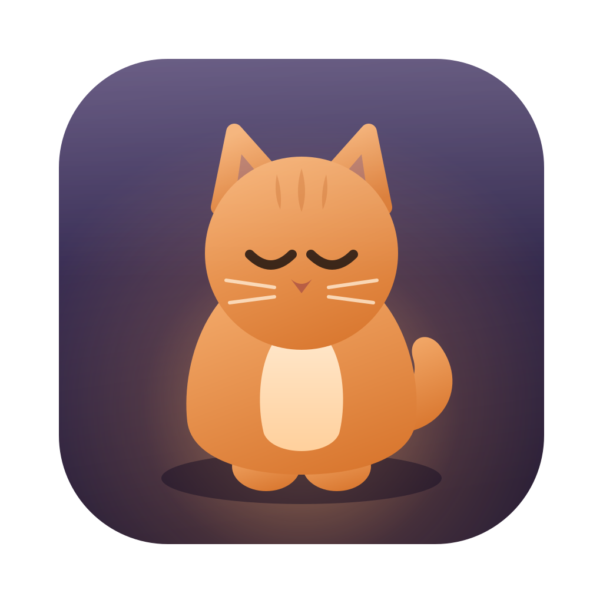
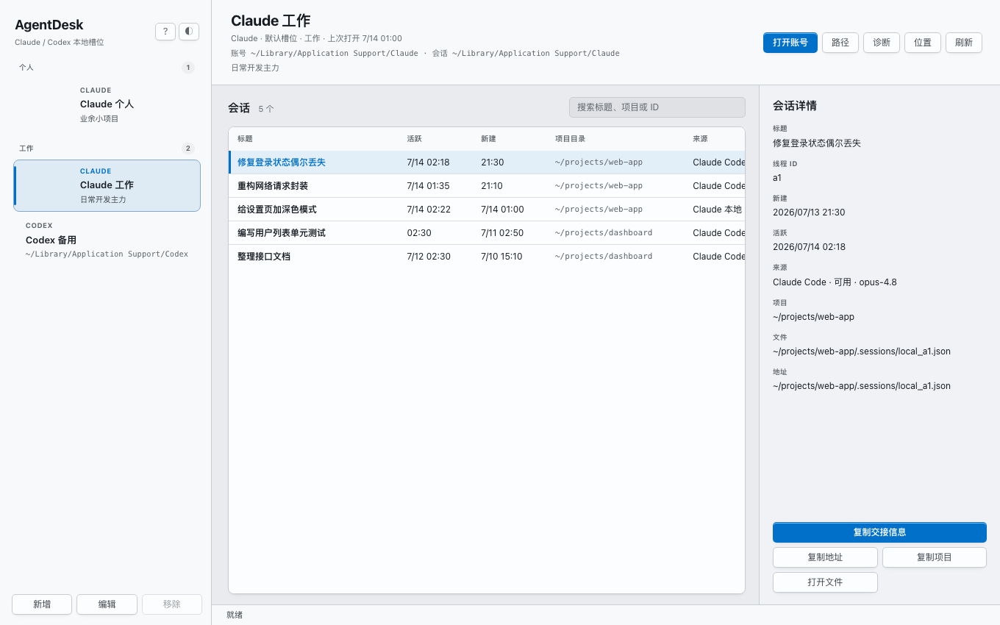
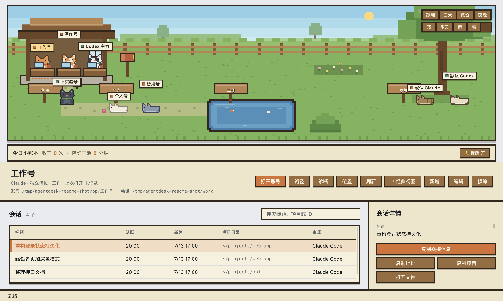
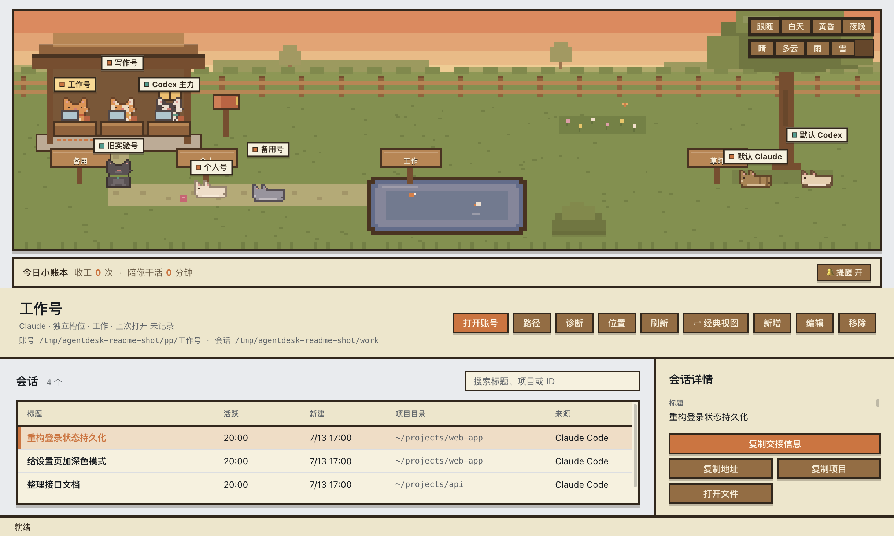

<p align="center">
  
</p>

<h1 align="center">AgentDesk</h1>

<p align="center"><strong>One local control room for every Agent.</strong><br />Run Codex, Claude Code, ACP agents and terminal tools side by side, combine each instance with the identity and workspace it needs, and hand indexed local sessions between them.</p>

<p align="center">
  <a href="LICENSE"></a>
  
</p>

> 中文说明见 [下方](#agentdesk-中文说明).



<sub>Session titles and paths above are illustrative. A dark theme ships too — see [`assets/screenshots/app-dark.png`](assets/screenshots/app-dark.png).</sub>

---

## The problem it solves

Using several coding Agents usually means several terminals, desktop apps and incompatible histories. The Agent process, login identity, project directory and old session get treated as one tangled object, so switching context is slow and supervising parallel work is harder than it should be.

Multiple Claude or Codex accounts add a second set of problems because the official desktop apps assume **one identity per machine**:

- **Accounts collide.** Log into account B and it kicks account A offline. You can't keep a work login and a personal login open at the same time — you end up logging out and back in all day.
- **Old sessions get lost.** Every account quietly piles up local sessions (Claude Code, Codex), scattered across different data folders and file formats. *"I did that a week ago — but in which account? which session?"* There's no single place to look.
- **Handing off context is all manual.** When you want a new chat to pick up where an old one left off, you retype or copy-paste the context by hand. Slow and easy to get wrong.
- **Every OS hides things somewhere else.** The official apps and their data live in different places on macOS vs. Windows, so finding anything by hand is painful.

## What AgentDesk does

Each pain above maps to one thing AgentDesk gives you:

- **A real multi-Agent Fleet.** Agent type, login identity, workspace and running instance are separate. Start several instances of the same Agent or mix different Agents; switching the visible instance never stops the others.
- **Broad terminal-Agent support.** Built-in direct adapters cover Codex and Claude Code. Long-lived [Agent Client Protocol](https://agentclientprotocol.com/) sessions cover Gemini CLI, OpenCode, Cursor Agent, GitHub Copilot CLI, goose, Kimi and Qwen Code when installed. Any local ACP stdio Agent can be added through a native file picker, while independent Shell instances remain the fallback for other CLIs.
- **Isolated account slots.** Each slot is its own local data directory. AgentDesk launches the official Claude / Codex app pointed at that directory, so **multiple accounts coexist — no collisions, no constant re-login.**
- **Notes & groups.** Give any slot a free-text note and drop it into a group (Work / Personal / Spare…). The sidebar organizes accounts by group — manage them like a contact list.
- **Automatic session index.** It scans each account's session files and lists them in one table — title, last active, created, project directory, source — with search across title / project / thread ID. **Find any old session in seconds.**
- **One-click context handoff.** Select a session, hit *Copy handoff*, and paste into a new chat. It copies **metadata only, never the full transcript** — so nothing private leaks by accident.
- **Diagnostics.** A panel that explains *why* a session won't show up or an app won't launch: executable/Store candidates, MSIX-vs-legacy data paths, permissions, scanned locations, session count, and config location.
- **Per-account quota (Beta).** Codex slots read their own official rate-limit windows through the local Codex app-server and show remaining percentage, reset time, and plan. Claude / Cursor clearly show unsupported instead of scraping browser cookies or tokens.
- **Path control.** Set each slot's data directory, session root, and optional app executable. On Windows, old AppData-based slots can be copied to a stable non-virtualized location in one click.
- **GitHub updates.** The always-visible **↻ Update** button in the account toolbar checks the latest published Release. Windows portable builds download, verify GitHub's SHA-256 digest, replace themselves, and restart; other environments open the exact Release page.
- **One workspace instead of a window pile.** Every runtime has its own output, status, protocol, optional identity and authorized working directory. A selected historical session can suggest a project and queue a handoff, but no client account is required to start an Agent.
- **macOS + Windows** from the same tool.
- **Light & dark**, following your system theme — toggle any time with the ◐ button.

## What it deliberately does *not* do

AgentDesk touches your accounts, so its boundaries matter:

- It **stores no passwords and no tokens.**
- It **does not read browser passwords** or any saved credentials.
- Quota checks **never read browser cookies or expose account e-mail / tokens**; only the sanitized result of Codex's official local RPC reaches the UI.
- It **does not bypass official login** — authentication still happens inside the official Claude / Codex app.
- The handoff copy **excludes the full conversation by default.**
- The runtime surface is **off until you approve a native warning**. The renderer cannot submit an executable, environment or raw working directory. Custom ACP executables and arbitrary folders require native-picker grants; ACP tool permissions appear in native cancel-by-default dialogs. Shell commands still execute locally, so only run text you understand and trust.
- In the account and session lists, your home directory is shortened to `~`. (The diagnostics panel shows full paths on purpose — it's a troubleshooting tool.)

Account and session discovery remain local and read-only. The optional embedded runtime is the one explicit execution surface, visibly separated and guarded as described above.

## The cat yard 🐈

By default AgentDesk greets you with a **pixel cat yard** — the same accounts and sessions, in a place you'll actually want to leave open. Every pixel is drawn from real local data; nothing is faked.



- **Every account is a cat.** The name plate *is* the account name — no separate pet name to keep in sync. Its coat, collar and accessory are yours to customize (Edit → dress it up), and groups become fenced-off areas of the yard.
- **Cats live your accounts' rhythm.** A cat's behavior comes from that account's real state: it sits at a desk typing while the account is *actually working* — its session was active in the last minute — waits at its own spot when the app is open but the session's gone quiet, plays in the grass if the account was active earlier today, curls up to nap after a few quiet days, or hibernates in a box after a week. (Detecting "working" reads the last-activity timestamp inside the account's own session record — not just whether the app is open — so a busy account and an idle-but-open one look different.) A broken session path shows a **?** over the cat — click it to open diagnostics.
- **Quota becomes energy, not activity.** Fresh / steady / tired / exhausted is a separate axis based on the tightest current Codex limit. It changes a tiny energy pip, sweat/spark/battery cue, and typing pace without ever pretending that a tired cat stopped working. Old or failed data never drives fatigue.
- **The yard is an actual workspace.** Workshop, mailbox, task path, pond, lookout and meadow map to launch, handoff, Agent queue, session detail, terminal and saved-position actions. Drop targets appear only while dragging, and unsafe actions still require confirmation.
- **Sessions stay in sight.** The right information rail scrolls independently and keeps account, quota, alerts, sessions and details together. At minimum window height, account controls compact so the session list remains visible.
- **Supervise a Fleet without another window pile.** The lower-left control room runs multiple local Shell, Codex, Claude Code and ACP Agent instances at once. Each keeps separate output and workspace; queued handoffs stay in memory only.
- **A gentle work/life balance.** A *today* ledger tallies how many work sessions wrapped up and how long the cats kept you company. After 90 minutes of unbroken work, a cat stretches and nudges you to do the same — a quiet status-bar note, never a popup, and switchable off entirely.
- **Time & weather.** *Follow* uses the system clock; *auto weather* changes on a deterministic 20–45 minute local rhythm. Manual day / dusk / night and clear / cloudy / rain / snow remain available. It is atmosphere, not a claim about real weather.
- **Prefer the plain table?** One click on **⇄** switches back to the classic three-pane view below. It's the same data underneath, so nothing is lost either way.

## Interface

The yard is the default: roughly three quarters for the scene and multi-Agent Fleet, one quarter for a vertically scrollable information rail. The **⇄** button flips to a classic three-pane workbench (and back):

- **Left** — your account slots (Claude / Codex). Add, rename, remove, launch.
- **Middle** — the session table for the selected account, with search and sort by last active.
- **Right** — the selected session's details, plus copy actions (handoff / stable ID / project path) and *reveal location*.

---

## Install

### Download a prebuilt package

Grab the latest from **[Releases](https://github.com/shuqianglin1997/agent-desk/releases)**:

- **macOS** — `AgentDesk-<version>-universal.dmg` (runs on both Apple Silicon and Intel)
- **Windows** — `AgentDesk-<version>-portable-x64.exe` (portable — no install, just run)

> **Heads-up: the packages are not code-signed** (this is a free, open tool). Your OS will warn you the first time. That's expected — here's how to get past it:
>
> - **macOS** — move **AgentDesk.app** into `/Applications`, then clear the quarantine flag once (needed on recent macOS, where right-click → Open no longer bypasses Gatekeeper for unsigned apps):
>   ```bash
>   xattr -dr com.apple.quarantine "/Applications/AgentDesk.app"
>   ```
>   Or, after the first blocked launch, open **System Settings → Privacy & Security** and click **Open Anyway**.
> - **Windows** — SmartScreen shows *"Windows protected your PC"* → click **More info** → **Run anyway**.

On Windows, AgentDesk supports both traditional Win32 installs and current Store/MSIX installs. New isolated slots live under `%USERPROFILE%\.agentdesk\profiles` instead of AppData, avoiding MSIX path virtualization; see [`docs/WINDOWS.md`](docs/WINDOWS.md).

### Or run / build from source

Requires [Node.js](https://nodejs.org/) 20+.

```bash
npm install
npm start              # run in dev mode
npm test               # run the session-scanner test suite

npm run build:mac      # → universal .dmg in release/
npm run build:win      # → portable .exe in release/
```

> Behind a slow mirror (e.g. in mainland China), prefix installs and builds with:
> ```bash
> ELECTRON_MIRROR=https://npmmirror.com/mirrors/electron/ npm install
> ```

Cross-compiling Windows on macOS is fragile — prefer building each platform on its own OS, or just let CI do it (below).

## Releasing (maintainers)

CI ([`.github/workflows/release.yml`](.github/workflows/release.yml)) builds both platforms natively, generates `SHA256SUMS.txt`, and publishes the GitHub Release after both builds pass. Set `version` in `package.json` to match your tag first — electron-builder names the artifacts from `package.json`, not the git tag — then:

```bash
git tag v0.2.2
git push origin v0.2.2
```

## How it works

AgentDesk is a small [Electron](https://www.electronjs.org/) app:

- **Main process** (`src/main.js`) — all filesystem access, app launching, session scanning, and diagnostics.
- **Preload** (`src/preload.js`) — a narrow, `contextIsolation`-safe IPC bridge.
- **Renderer** (`src/renderer.js`, `src/index.html`, `src/styles.css`) — the UI. It never touches the filesystem directly.
- **Cat yard** (`src/yard/`) — the default pixel-yard view: a canvas scene engine plus pure-function modules for cat state, the companion ledger, and palettes. See [`docs/YARD.md`](docs/YARD.md).

More detail (in Chinese) lives in [`docs/`](docs/): the [Agent Fleet architecture](docs/AGENT_FLEET.md), product notes, Windows specifics, internals, and the [cat yard](docs/YARD.md).

## License

[MIT](LICENSE) © hupo

---
---

# AgentDesk（中文说明）

**把本机所有 Agent 放进同一个真正的多 Agent 工作空间。** Codex、Claude Code、ACP Agent 和终端工具可并行运行；Agent、登录身份、项目目录和运行实例彼此独立；本地旧会话可以直接交给另一个 Agent 继续。

## 它解决什么痛点

只要你同时用多个编码 Agent，桌面上就会堆满终端和客户端，而 Agent、身份、项目与历史上下文往往绑成一团。再加上多个 Claude / Codex 账号（工作号、个人号、备用号或团队席位），官方桌面 App 默认**一台机器一个身份**：

- **串号 —— 登录态互相覆盖。** 登进 B 号就把 A 号挤下线，工作号和个人号没法同时开着，只能一整天反复登出登入。
- **旧会话找不回。** 每个账号本地悄悄攒下一堆会话（Claude Code、Codex），散在不同数据目录、不同文件格式里。「那个活儿上周做过——在哪个号？哪个会话？」没有统一入口。
- **上下文交接全靠手打。** 想让新对话接着旧会话干，只能手动复述、复制，费劲又容易漏。
- **每个系统藏东西的地方都不一样。** macOS 和 Windows 上官方 App 和数据目录位置各不相同，手动找很痛。

## AgentDesk 怎么解决

上面每一个痛点，都对应它给你的一样东西：

- **真正的多 Agent Fleet。** Agent 类型、登录身份、工作区和运行实例是四个独立维度。同一种 Agent 可开多个实例，不同 Agent 也能并行；切换当前输出不会停止后台任务。
- **覆盖终端 Agent。** Codex / Claude Code 有本机直连适配器；Gemini CLI、OpenCode、Cursor Agent、GitHub Copilot CLI、goose、Kimi、Qwen Code 通过长驻 ACP 会话接入。任何支持 ACP stdio 的本机或团队 Agent 都能由系统文件选择器添加；其他 CLI 仍可在多个独立 Shell 实例中运行。
- **独立账号槽位。** 每个槽位是一份独立的本地数据目录，AgentDesk 用该目录启动官方 App —— **多号并存、不串号、不用反复登录。**
- **备注与分组。** 给任意槽位加自由备注、丢进分组（工作 / 个人 / 备用……），侧栏按分组归拢账号，像通讯录一样管理。
- **自动会话索引。** 扫描每个账号的会话文件，汇成一张表：标题 / 最后活跃 / 新建 / 项目目录 / 来源，可按标题、项目、线程 ID 搜索。**几秒钟找到任何旧会话。**
- **一键交接上下文。** 选中会话点「复制交接信息」，粘到新对话即可。**只复制元信息，不含完整对话** —— 隐私不会被误传。
- **诊断面板。** 解释「为什么读不到会话 / 打不开 App」：传统安装与 Store/MSIX 启动候选、真实数据目录、权限、扫描位置、会话数量和配置文件。
- **每账号额度（Beta）。** Codex 槽位通过本机 Codex 官方 app-server 读取各自真实额度周期，展示剩余百分比、重置时间和套餐；Claude / Cursor 明确显示暂不支持，不抓浏览器 Cookie 或 token。
- **路径可配。** 手动设置数据目录、会话根目录和可选的官方 App 可执行文件；Windows 旧 AppData 槽位可一键复制迁移到稳定目录。
- **GitHub 一键更新。** 账号操作栏中常驻的「↻ 更新」检查正式 Release；Windows portable 会下载、核对 GitHub SHA-256、替换自身并重启，其他环境打开对应 Release 页面。
- **不再铺一桌面窗口。** 每个实例都有独立输出、状态、协议、可选身份和授权工作目录。历史会话可以提供项目建议和交接任务，但没有任何客户端账号也能直接新建 Agent。
- **macOS + Windows** 同一套能力。
- **深色 / 浅色** 跟随系统，随时用 ◐ 按钮切换。

## 猫猫庭院 🐈

默认打开时，AgentDesk 迎接你的是一片**像素猫庭院** —— 还是那些账号和会话，只是换到一个你愿意一直开着的地方。每一个像素都由真实本地数据驱动，没有一处是假的。



- **每个账号是一只猫。** 名牌就是账号名，不用另记一个宠物名；毛色、项圈、配饰随你定制（编辑账号即可换装），分组变成庭院里一块块围起来的区域。
- **猫跟着账号的节奏过日子。** 猫的行为由该账号的真实状态决定：账号*真在干活*时（会话记录一分钟内还在动）它伏案打字，App 开着但会话已安静下来时在自己的地盘待命，今天早些时候活跃过就在草地玩耍，几天没动静就蜷着打盹，超过一周没碰就钻进纸箱冬眠。（判「干活」看的是账号自己会话记录里的最后活跃时间戳，而不只是「App 开着」—— 所以忙碌的账号和开着发呆的账号长相不同。）会话路径失效的猫头顶挂个 **?**，点它直达诊断。
- **额度是能量，不是活动状态。** 元气 / 稳定 / 疲劳 / 快没电由当前最紧的 Codex 额度周期决定，只改变名牌能量格、汗滴/闪光/低电量提示和打字节奏；「正在干活」仍由真实会话活动决定。旧数据或失败数据不会继续驱动疲劳。
- **场景真的会办事。** 工作亭、邮筒、任务道、池塘、瞭望点、草坪分别对应打开账号、复制交接、Agent 排队、会话详情、内嵌终端和保存位置；拖拽时才出现命中提示，危险动作仍需确认。
- **会话始终看得见。** 右侧信息轨独立滚动，把账号、额度、提醒、会话和详情串在一起；最小窗口高度下会自动压缩账号操作，给会话列表保留可见空间。
- **不用再开一排客户端与终端。** 左下 Fleet 可以同时运行多个 Shell、Codex、Claude Code 与 ACP Agent；每个实例保留独立输出和工作区，排队交接只放在内存里，不会重启后偷偷执行。
- **不打扰的劳逸平衡。** 「今日小账本」记下今天有多少次收工、猫陪你干了多久。连续工作 90 分钟，猫会伸个懒腰提醒你也起来动动 —— 只在状态栏轻声提示，绝不弹窗，也能整个关掉。
- **时间与天气。** 「跟随」按系统时钟自动变换昼夜，「自动天气」每 20–45 分钟按本地可复现节奏变化；也能手动锁定白天 / 黄昏 / 夜晚和晴 / 多云 / 雨 / 雪。它只是氛围，不冒充真实天气。
- **想要朴素的表格？** 点一下 **⇄** 切回下方的经典三栏视图，底层是同一份数据，两边都不丢东西。

## 它刻意不做的事

它碰的是你的账号，所以边界很重要：

- **不保存任何密码、任何 token。**
- **不读取浏览器密码**或任何已存凭据。
- 额度查询**不读取浏览器 Cookie，也不向界面暴露账号邮箱 / token**；界面只收到 Codex 官方本机 RPC 的脱敏结果。
- **不绕过官方登录** —— 鉴权始终发生在官方 Claude / Codex App 里。
- 交接复制**默认不含完整对话**。
- 运行环境在你确认原生警告前不会开启；renderer 不能直接提交程序、环境或原始目录。自定义 ACP Agent 和任意工作区都必须经系统选择器授权，ACP 工具权限通过默认取消的原生对话框决定。Shell 命令确实会在本机运行，所以只执行你理解并信任的内容。
- 账号列表和会话列表里，你的用户主目录会被简写成 `~`。（诊断面板故意显示完整路径——它是排查工具。）

账号与会话发现仍然完全本地、只读。内嵌终端是唯一明确的执行入口，并与索引功能分开显示和授权。

## 下载安装

到 **[Releases](https://github.com/shuqianglin1997/agent-desk/releases)** 下载最新版：

- **macOS** —— `AgentDesk-<版本>-universal.dmg`（Apple Silicon 和 Intel 都能跑）
- **Windows** —— `AgentDesk-<版本>-portable-x64.exe`（便携版，免安装，双击即用）

> **注意：安装包未做代码签名**（这是免费开源工具）。首次打开系统会拦一下，属正常，绕过方法：
>
> - **macOS** —— 把 **AgentDesk.app** 拖进 `/Applications`，再执行一次去掉隔离标记（较新的 macOS 上，未签名 App 已不能靠右键「打开」绕过）：
>   ```bash
>   xattr -dr com.apple.quarantine "/Applications/AgentDesk.app"
>   ```
>   或者首次被拦后，打开**系统设置 → 隐私与安全性**，点**仍要打开**。
> - **Windows** —— SmartScreen 弹「Windows 已保护你的电脑」→ 点**更多信息**→**仍要运行**。

Windows 同时支持传统 Win32 与 Store/MSIX 安装。新独立槽位放在 `%USERPROFILE%\.agentdesk\profiles`，避开 MSIX 的 AppData 路径虚拟化；完整说明见 [`docs/WINDOWS.md`](docs/WINDOWS.md)。

### 或从源码运行 / 构建

需要 [Node.js](https://nodejs.org/) 20+。

```bash
npm install
npm start              # 开发模式运行
npm test               # 跑会话扫描测试

npm run build:mac      # → release/ 下生成 universal .dmg
npm run build:win      # → release/ 下生成便携版 .exe
```

> 国内网络较慢时，给安装和构建加镜像前缀：
> ```bash
> ELECTRON_MIRROR=https://npmmirror.com/mirrors/electron/ npm install
> ```

在 macOS 上交叉编译 Windows 很脆弱 —— 尽量各平台在各自系统上构建，或直接交给 CI。

## 发布（维护者）

CI（[`.github/workflows/release.yml`](.github/workflows/release.yml)）会在各自系统上原生构建两个平台，生成 `SHA256SUMS.txt`，并在两个构建都通过后自动发布 GitHub Release。先把 `package.json` 的 `version` 改成和 tag 一致（构建产物按 `package.json` 命名，不看 tag），再：

```bash
git tag v0.2.2
git push origin v0.2.2
```

## 安全边界

AgentDesk 不保存账号密码，不读取浏览器明文密码，不绕过官方登录，默认不复制完整聊天内容。它只管理本地数据槽位和会话索引。

## 许可证

[MIT](LICENSE) © hupo
