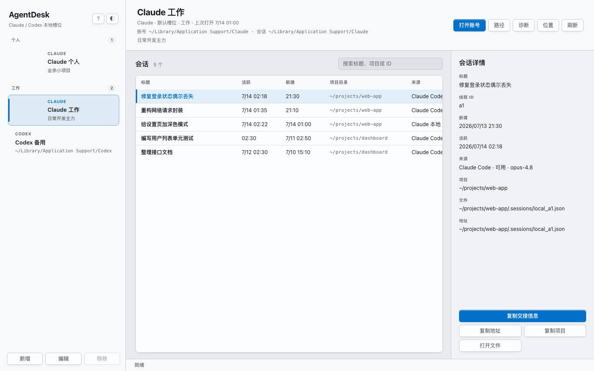

<p align="center">
  
</p>

<h1 align="center">AgentDesk</h1>

<p align="center"><strong>A local-first personal control plane for AI coding accounts, sessions, diagnostics, and trusted devices.</strong></p>

<p align="center">
  Keep separate account slots, find local sessions quickly, and open the official client you already use.<br />
  No embedded chat, agent process runner, task queue, or cross-session orchestration.
</p>

<p align="center">
  <a href="LICENSE"></a>
  
  
</p>



> **Development status:** the `0.10.1-preview.1` source implements versioned first use, the guided device journey, same-Mesh TaskPackage delivery, and bounded Profile-runtime protection as attended Preview code paths. The full Node suite has 526 tests: 525 pass, one Windows-only test is skipped, and none fail; TaskPackage security is 25/25, release-security tests are 14/14, and real Electron UI acceptance is 21/21. The current macOS unpacked app also passes the independent Electron fuse/ASAR verifier. These results prove source and local-package invariants, not a distributable release. The two isolated endpoint E2E runs passed over direct LAN and local signaling, while a separate physical two-Mac LAN run verified an authenticated host/UDP channel and a 562,009-byte inventory (9 slots, 638 session replicas, revisions 7 → 8 → 9) over five stable minutes. The endpoint runner still does not send a TaskPackage. Public NAT/CGNAT, forced coturn UDP/TCP/TLS relay, disconnect/sleep recovery, physical TaskPackage delivery, and the macOS/Windows screen/input/permission matrix remain open. The Draft/native-redownload/public-anonymous-redownload release transaction is implemented but has not been executed with real signing credentials, the protected environment, and a real tag, so there is currently **no public Preview matching this source**.

## What AgentDesk does

AgentDesk keeps a small, local index around the official AI coding clients already installed on your computer:

- **Account slots.** Store separate local profile and session-root paths, launch supported desktop apps with the selected slot, and keep work/personal identities from colliding.
- **Session browser.** Scan Claude Desktop, Claude CLI, Codex, Cursor, Kimi Code, and Kimi Work history into one searchable, sortable table. View the current Agent or all Agents under the active device lens.
- **Stable conversation identity.** Codex compaction checkpoints stay inside one user conversation; guardian/subagent rollouts remain hidden instead of appearing as new sessions or projects.
- **Session location actions.** Select one or several sessions and copy one minimal location format containing only path and coordinate; reveal the active source file or export one supported transcript as Markdown.
- **Identity grouping.** Merge multiple client forms of the same login into one account card and one yard cat while preserving the underlying slots.
- **Bounded Profile runtime.** Prevent duplicate launches of the same `user-data-dir`, supervise official clients started by AgentDesk, close owned clients on normal AgentDesk exit by default, and cap each Profile's `Crashpad/pending` at 100 files or 200 MiB. Five same-sized dumps within one minute fuse that Profile; this emergency path also stops an exact-path orphan left by an older or forcibly terminated AgentDesk, while ordinary close actions remain ownership-bound. Safe cleanup deletes only direct `.dmp` and `_sidecar.json` files; sessions, archives, configuration, SQLite, `codex-home`, and saved diagnostic samples remain untouched.
- **Versioned first use and guided device mesh.** Create the first Agent and local device identity in one recoverable transaction without opening a listener, publishing a lease, or contacting another device. Existing Profiles receive a migration preview. Adding a device then separates both-side identity confirmation, member trust, authenticated connection, catalog storage, and inventory storage instead of treating pairing as “ready.”
- **Persistent Agent library and on-demand readiness.** Keep an Agent even with zero accounts or slots, show the complete library in every device environment, and use a recoverable local preparation job before committing a new profile, slot, and deployment. Official installation, login, verification, and system permissions remain on the target computer.
- **Cross-device sessions and files.** Exchange source-owned session inventories, send encrypted SessionPointers without changing the minimal copy format, map projects locally on the target, and transfer explicitly selected files with confirmation, hashing, chunking, and resume.
- **Explicit task handoff.** Freeze one local conversation, a human-authored checkpoint, Git baseline/tracked changes, and explicit attachments into one encrypted `.agentdesk-task` snapshot. Save it as a portable file with a separately delivered unlock code, or send the same ciphertext to an authenticated same-Mesh device that supports `task.package.transfer.v1` and has `task.package.receive` enabled. The receiver must explicitly accept and verify it before import; unsupported or failed direct delivery can save the same snapshot as a portable file. Transport authenticates the source device ID/name; the source Agent and handoff-person labels remain integrity-protected package declarations. Source data is retained.
- **Independent global dialogs.** Open Devices, Tools, Activity, and Settings in four bounded dialogs without replacing the current session detail or mutating the device lens, Agent/slot, or session selection.
- **Attended remote control.** Open an isolated Remote Surface inside the fixed right-detail panel while the Header, Agent panel, session list, and Footer stay in place; require target-side consent for screen view and input, switch displays, and monitor up to four devices while keeping exactly one input target.
- **P2P rendezvous and diagnostics.** Prefer temporary LAN endpoints, fall back to signed HTTPS signaling, use STUN or short-lived TURN credentials, and show only sanitized LAN/direct/relay state.
- **Diagnostics and paths.** Inspect launch candidates, data locations, permissions, scan roots, and Windows Store/MSIX versus traditional installs.
- **Quota overview (Beta).** Show Codex rate-limit windows through the local official app-server. Unsupported clients are labeled honestly.
- **Tool center.** Discover supported desktop apps and CLIs, show versions and install sources, open them, and explicitly update eligible CLIs through their existing npm, Homebrew, uv, or self-update mechanism.
- **Two views.** Use the pixel cat yard or the compact card roster through one current-mode segment; both render the same Agent, slot, and session state.

Supported tool discovery currently covers Claude Code, Codex CLI, Gemini CLI, OpenCode, Cursor Agent, GitHub Copilot CLI, goose, Kimi Code, and Qwen Code. Discovery only resolves installed launchers; it does not attach agent-mode arguments or create sessions.

## Product boundary

AgentDesk is an account and history manager, not an execution or orchestration layer.

- It does not embed a terminal or chat surface.
- It does not start or supervise agent conversations. Process supervision is limited to the lifecycle and disk-safety boundary of official desktop clients that AgentDesk itself launched.
- It does not maintain task queues, multi-session handoff plans, or planning-document indexes. TaskPackage is an explicit immutable checkpoint, not orchestration or ongoing sync.
- It does not register arbitrary commands or custom protocol agents.
- It does not store passwords, tokens, or browser credentials.
- Personal Mesh connections are restricted to authenticated devices, explicit capabilities, and fixed semantic actions; generic remote shell and arbitrary command execution remain out of scope.
- Session discovery is local and read-only. Tool updates happen only after an explicit user action and come from a fixed main-process catalog; the renderer cannot submit commands, executables, or download URLs.

Authentication stays inside the official applications. The renderer runs with context isolation, no Node integration, and Chromium sandboxing; filesystem and process access remain in the Electron main process.

Personal Mesh is attended only. It does not control the login screen or Windows UAC secure desktop, does not run after the application exits, and does not provide an unattended service.

## Cat yard

The optional yard view turns each Agent/account group into a pixel cat driven by local state:

- recent session activity controls working, resting, sleeping, and attention states;
- quota is shown as a separate energy signal and never overrides activity;
- day, dusk, night, and weather are visual atmosphere only;
- one Scene button opens time and weather in a native top-layer popover, while persistent path/quota attention stays in the Activity dialog;
- dragging a cat can open its account, focus its current session, or save its yard position.

Use the **Yard / Cards** segment to change the presenter without changing any data or selection. See [docs/YARD.md](docs/YARD.md).

## Install

There is currently no public `v0.10.1-preview.1` build to install. Do not treat an older GitHub Release as this source version. When a matching Preview passes the release gate, [GitHub Releases](https://github.com/shuqianglin1997/agent-desk/releases) will contain exactly:

- macOS: `AgentDesk-<version>-universal.dmg`
- Windows: `AgentDesk-<version>-portable-x64.exe`
- checksums: `SHA256SUMS.txt`

> Security note: do not install the old v0.9.0 macOS image; Apple reports that unsigned package as revoked. Use a current signed and notarized release.

The current source version is `0.10.1-preview.1`. It is only a Preview candidate, not a stable or published release, and does not retroactively turn the `0.10.0` development baseline into one. Private signing credentials, repository/organization Actions variables `APPLE_TEAM_ID` and `WIN_SIGNER_THUMBPRINT`, the protected `preview-release` environment, a real Preview tag, anonymous public-download verification, and physical clean-machine install checks are still required.

On macOS, move AgentDesk.app into `/Applications` and open it normally. Do not bypass Gatekeeper for an unsigned or revoked package. On Windows, see [docs/WINDOWS.md](docs/WINDOWS.md) for Store/MSIX path handling.

### Run from source

Requires Node.js 22.12 or newer.

```bash
npm ci
npm run check:docs
npm start
npm test
npm run check
npm run accept:ui # temporary userData; requires a desktop session

npm run signaling:start # optional self-hosted rendezvous for development

npm run build:mac:dir  # local ad-hoc test build
npm run build:mac      # signed + notarized release; credentials required
npm run build:win
```

Release signing and notarization are documented in [docs/RELEASING.md](docs/RELEASING.md).

## Architecture

- `src/main.js`: trusted filesystem, app launch, diagnostics, quota, updates, and tool maintenance.
- `src/preload.js`: narrow IPC bridge.
- `src/renderer.js`, `src/index.html`: UI structure and interaction.
- `src/workspace.css`: canonical layered fixed-workspace, component, feature, and theme styles; `src/styles.css` remains the low-priority legacy compatibility layer.
- `src/ui-context.js`: independent Device Lens, Agent, Slot, conversation, replica, remote-session, and transfer-draft state transitions.
- `src/onboarding-state.js`, `src/main/profile-store-policy.js`, `src/main/ipc/first-agent-onboarding.js`: versioned first use, authoritative empty Profile storage, and local-only first-Agent initialization.
- `src/profile-runtime.js`: exact Profile-process ownership, duplicate-launch checks, normal-exit cleanup, bounded Crashpad retention, persistent fuse state, and narrow safe cleanup.
- `src/device-journey.js`, `src/main/ipc/pairing-approvals.js`: guided add-device state and both-side identity confirmation before certificate issuance.
- `scripts/ui-acceptance.js`: real 1040 × 840 Electron task-path acceptance using temporary user data.
- `src/apps.js`: supported client catalog and session scanners.
- `src/cli-discovery.js`: read-only CLI launcher discovery.
- `src/tool-maintenance.js`: fixed tool catalog, version/source detection, and safe update plans.
- `src/mesh/domain/session-identity.js`: pure Codex physical-record and logical-conversation classification.
- `src/mesh/domain/agent-catalog.js`, `device.js`, `identity-link.js`: local global-Agent catalog and device invariants.
- `src/agent-workspace.js`, `src/mesh/domain/agent-deployment.js`, `src/mesh/main/provisioning-service.js`: full-library device projection and recoverable readiness jobs.
- `src/mesh/protocol/`: membership, pairing, exact feature negotiation, signed catalog/envelopes, device inventory, encrypted payload, and signaling authentication.
- `src/mesh/network/`: temporary LAN endpoints, signed rendezvous client, and ICE configuration.
- `src/mesh/storage/`, `src/mesh/main/`: independent SQLite store, OS-protected keys, peer policy, transfers, and remote-control orchestration.
- `src/mesh/peer/`, `src/remote/`: sandboxed WebRTC endpoint, Remote Console, and target consent/indicator windows.
- `native/`: fixed-protocol macOS and Windows input helpers.
- `services/signaling/`: optional self-hosted short-lived rendezvous and TURN REST credential service.
- `src/mesh/probe/`, `src/mesh/main/webrtc-probe.js`: sandboxed WebRTC placement and local DataChannel acceptance probe.
- `src/task-package/`: encrypted TaskPackage format, Git/checkpoint capture, and the versioned Codex native adapter.
- `src/mesh/domain/task-package-transfer.js`, `src/mesh/main/transfer-service.js`: target-device-only TaskPackage envelopes, explicit receive decisions, ciphertext transfer, cleanup, and portable fallback.
- `src/yard/`: cat state, scene, atmosphere, and the three core drag intents.

Start with the [documentation map and evidence ledger](docs/README.md), then see [docs/INTERNAL.md](docs/INTERNAL.md), [docs/PRODUCT.md](docs/PRODUCT.md), and the [full function audit](docs/FUNCTION_AUDIT.md).

## License

[MIT](LICENSE) © hupo

---

# AgentDesk 中文说明

AgentDesk 是一个本地的 AI 编码账号与会话管理器：把不同客户端、不同账号槽位和本地历史收进同一个窗口，同时保留官方 App / CLI 原本的使用方式。

> **开发状态：** `0.10.1-preview.1` 源码已经接通版本化首次使用、设备任务向导、同 Mesh TaskPackage 直送和有界 Profile 运行保护的有人值守 Preview 路径。全量 Node 526 项中 525 通过、1 项仅 Windows 跳过、0 失败；TaskPackage 安全定向 25/25，发布安全定向 14/14，真实 Electron UI 21/21。当前 macOS unpacked 成品也已通过独立的 Electron fuse/ASAR verifier；这些证据证明源码与本机成品边界，不等于可分发版本已经产生。隔离双 endpoint 的局域网直连与本机 signaling E2E 已完成既有数据面，物理双 Mac 局域网则完成认证 host/UDP 通道和 562,009 字节库存（9 个 Slot、638 条 SessionReplica、revision 7 → 8 → 9），连续 5 分钟稳定；runner 仍未发送 TaskPackage。Draft、原生双端重下载、公开后匿名重下载和失败回 Draft 的发布事务已经进入代码，但尚未用真实签名凭据、受保护环境与真实 Tag 执行，因此当前没有与该源码匹配的公开 Preview。真实公网 NAT/CGNAT、coturn 强制中继、断网/睡眠恢复、TaskPackage 物理直送，以及 macOS/Windows 权限矩阵也继续开放。

## 核心能力

- **账号槽位隔离。** 每个槽位保存独立的数据目录和会话根目录，打开受支持的官方桌面 App 时使用所选槽位，减少工作号、个人号互相覆盖。
- **统一会话浏览。** 索引 Claude Desktop、Claude CLI、Codex、Cursor、Kimi Code、Kimi Work 的本地会话，可在当前设备 Lens 下查看当前 Agent 或全部 Agent，并按属性搜索、排序。
- **稳定会话身份。** Codex 上下文压缩继续属于同一条用户会话，guardian/subagent 内部 rollout 不再冒充新会话或新项目。
- **会话定位操作。** 单选或勾选多条会话后统一复制“路径 + 坐标”；当前会话可在系统中定位来源文件，支持的来源可导出 Markdown。
- **同账号归组。** 桌面端与 CLI 等多个形态可以合并为一个账号、一张卡、一只猫，底层槽位仍各自保留。
- **Profile 运行保护。** 同一 `user-data-dir` 不重复启动；AgentDesk 默认在正常退出时只关闭自己启动的官方客户端，并把每个 Profile 的 `Crashpad/pending` 限制为 100 个文件或 200 MiB。一分钟内出现 5 个同尺寸 dump 会熔断该 Profile；该事故路径也会按精确路径停掉旧版或强制退出后遗留的孤儿进程，普通关闭仍受所有权约束。安全清理只删除直属 `.dmp` 与 `_sidecar.json`，不会触碰会话、归档、配置、SQLite、`codex-home` 或留存诊断样本。
- **版本化首次使用与设备任务向导。** “创建第一个 Agent”在一个可恢复事务中建立本机 Agent 与设备身份，不开放监听、不发布租约、不连接远端；既有 Profile 先进入无损迁移预览。添加设备再把双方身份确认、成员信任、认证连接、目录落库与库存落库分别呈现，不把配对成功写成已经可用。
- **长期员工库与按需就绪。** Agent 即使没有账号或运行位置也继续存在，每个工作环境都显示完整员工库；首次打开通过可恢复准备任务提交 Profile/Slot/Deployment，官方安装、登录、验证码和系统权限仍在目标电脑完成。
- **跨设备会话与文件。** 同步来源设备只读库存，发送加密 SessionPointer，目标端确认项目映射；显式选取的文件经接收确认、分块、哈希和断点续传。
- **显式任务交接。** 把一条本机会话、人工填写的阶段检查点、Git 基线/已跟踪差异和明确附件固定为同一种加密 `.agentdesk-task` 快照。它既可保存为便携文件并另行发送解锁码，也可在目标设备已认证、协商 `task.package.transfer.v1` 且开启 `task.package.receive` 时直接发送同一密文；接收方仍须逐次接受和完整验证，失败或旧端可把同一快照保存为便携文件。传输层认证来源设备 ID/名称，来源 Agent 与交接人标签仍是受完整性保护的包内声明；来源始终保留。
- **有人值守远控。** 在固定右下详情面板的隔离 Remote Surface 查看或控制目标设备，Header、顶部 Agent、左下会话和 Footer 保持原位；屏幕与输入分别需要目标端本次同意，最多同时显示四台设备，但始终只有一个输入目标。
- **P2P 会合与诊断。** 临时 LAN 优先，失败后回退签名 HTTPS 信令，使用 STUN/短期 TURN；界面只显示 LAN、直连或中继等脱敏状态。
- **路径与诊断。** 展示启动候选、真实数据目录、权限、扫描位置，以及 Windows Store/MSIX 和传统安装差异。
- **额度总览（Beta）。** 通过本机 Codex 官方 app-server 读取额度周期；不支持的客户端明确标注，不抓 Cookie 或 token。
- **独立全局弹窗。** 设备、工具、活动、设置从 Header 各自打开有界弹窗，不替换右下会话详情，也不改变 Device Lens、Agent/Slot 或会话选择。
- **工具维护台。** 在独立工具弹窗发现桌面 App 与常用 CLI，显示版本和安装来源；用户明确点击后，符合条件的 CLI 才会沿用 npm、Homebrew、uv 或自身更新器维护。
- **猫猫庭院 / 卡片名册。** 顶部“庭院 / 卡片”分段只切呈现，不改变 Agent、运行位置或会话选择；时间/天气进入一个 Top Layer 场景浮层，持久待处理事项归“活动”弹窗。

工具发现覆盖 Claude Code、Codex CLI、Gemini CLI、OpenCode、Cursor Agent、GitHub Copilot CLI、goose、Kimi Code 和 Qwen Code。发现模块只定位本机启动器，不附加运行参数，也不创建会话。

## 明确不做

AgentDesk 已收敛为账号与历史管理工具，不承担会话执行和编排：

- 不内嵌终端或聊天界面；
- 不启动、托管或续接 Agent 会话；
- 不提供任务队列、多会话交接清单或规划资料索引；TaskPackage 是用户显式生成的不可变检查点，不是自动编排或持续同步；
- 不登记任意命令或自定义协议 Agent；
- 不保存密码、token 或浏览器凭据；
- Personal Mesh 只允许认证设备、明确能力和固定语义动作，不提供通用远程 Shell 或任意命令；
- 不在后台静默更新第三方工具。

会话扫描保持本地、只读。工具更新必须由用户明确触发，命令和官方 URL 由主进程固定目录生成，界面不能提交任意命令。

Personal Mesh 当前只做有人值守：应用退出后不在线，不控制登录界面或 Windows UAC 安全桌面，也不安装无人值守系统服务。

## 安装与开发

当前没有可供下载的 `v0.10.1-preview.1` 公开 Preview，不要把 [Releases](https://github.com/shuqianglin1997/agent-desk/releases) 中的旧版本当成本源码。首个候选只有在真实签名/公证、仓库或组织 Actions variables `APPLE_TEAM_ID` / `WIN_SIGNER_THUMBPRINT`、受保护 `preview-release` 环境、真实 Tag、Draft 与公开匿名重下载以及物理干净机检查完成后才可供他人安装；届时 Release 只应包含 DMG、portable 和 `SHA256SUMS.txt`。当前源码仍只是 Preview 候选，不是稳定版，也不会把 `0.10.0` 开发基线补发成稳定版。Windows 的 Store/MSIX 与 portable 说明见 [docs/WINDOWS.md](docs/WINDOWS.md)。

```bash
npm ci
npm run check:docs
npm start
npm test
npm run check
npm run accept:ui # 使用临时 userData，需要可用桌面会话
```

先看[文档导航与证据台账](docs/README.md)；产品边界见 [docs/PRODUCT.md](docs/PRODUCT.md)，完整功能梳理见 [docs/FUNCTION_AUDIT.md](docs/FUNCTION_AUDIT.md)，内部结构见 [docs/INTERNAL.md](docs/INTERNAL.md)，庭院语义见 [docs/YARD.md](docs/YARD.md)。
