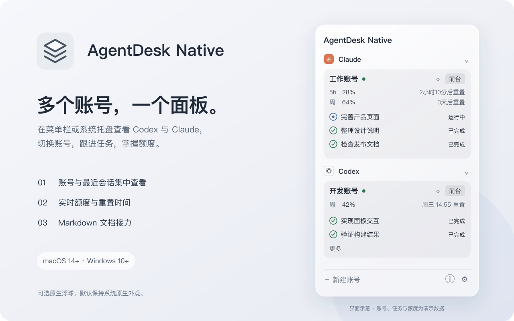
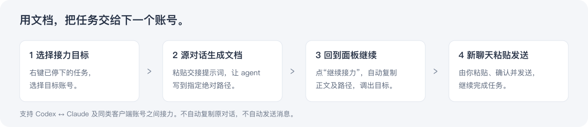

# AgentDesk Native

**在 macOS 菜单栏或 Windows 系统托盘里，管理本机多个 Codex / Claude 桌面客户端账号：查看任务和额度，额度用完时用 Markdown 文档把任务接力到另一个账号。**

此分支是独立的原生实现（macOS：Swift / AppKit / SwiftUI；Windows：.NET 10 / WPF），不是现有 Electron 客户端的增量修改，也不会覆盖它的安装或配置。没有角色素材、品牌配色、动画或媒体监控，只有可选的静态原生浮球。

<p align="center">
  
</p>

上图为 macOS 界面示意，数据均为演示数据。Windows 版使用原生面板，跟随系统浅色／深色。

| 平台 | 系统要求 |
| --- | --- |
| macOS | macOS 14 及以上，Apple Silicon / Intel |
| Windows | Windows 10（19041）及以上，x64 |

## 能做什么

- **多账号集中管理**：按 Codex / Claude 分组，一键启动或调出对应账号的客户端，每个账号的登录和数据互不干扰。macOS 首次启动会导入旧 agent-desk 的 Codex / Claude 账号槽。
- **任务与会话**：查看正在运行的任务和最近的会话；分组、账号和会话都能拖动排序，顺序只保存在本应用里。
- **额度与重置时间**：显示 5 小时和每周额度的已用比例与重置时间，可手动刷新或每 5 分钟同步；查不到时显示上次的数据并注明时间。
- **桌面浮球（可选）**：默认关闭。在设置里开启后，桌面上出现一个静态原生浮球；单击打开面板，双击调出忙碌账号，拖动换位置，右键打开菜单。

## 换账号，继续同一个任务



1. 右键一个已停下的会话，选择“接力到…”和目标账号。
2. 应用复制一段提示词并调出原来的客户端；在原对话里粘贴发送，AI 会把交接文档写到指定位置。
3. 文档写好后，回到面板点“继续接力”，应用复制文档内容并调出目标客户端。
4. 在目标账号里新建对话，粘贴发送，任务就接着做下去。

也可以直接用已有的 Markdown 文档接力。未完成的接力在重启后还在；面板会保留最近的接力记录。**应用不会替你发送任何消息。**

## 从源码构建

### macOS

需要 Xcode 的 Swift 工具链，不需要 Node.js 或 API key。

```bash
swift test --package-path macos
./macos/script/build_and_run.sh --build     # 生成 macos/dist.noindex/AgentDeskNative.app
./macos/script/build_and_run.sh --install   # 安装到 ~/Applications/AgentDeskNative.app 并启动
./macos/script/package-release.sh          # 生成通用架构 DMG、ZIP 和 SHA256SUMS
```

### Windows

需要 .NET 10 SDK。

```powershell
./windows/script/build.ps1 -Action Test
./windows/script/build.ps1 -Action Run
./windows/script/build.ps1 -Action Publish  # dist.noindex/windows/AgentDeskNative/AgentDeskNative.exe
./windows/script/build.ps1 -Action Package  # dist.noindex/windows/releases/ 下生成 ZIP 与 SHA256SUMS
```

运行时保留整个发布目录，不能只拿出 exe。程序未签名，首次运行若出现 SmartScreen 提示，点“更多信息”→“仍要运行”。打开面板：点托盘图标或按 `Ctrl+Alt+P`。

## 数据与隐私

| 内容 | macOS | Windows |
| --- | --- | --- |
| 设置、账号槽与接力文档 | `~/Library/Application Support/AgentDeskNative/` | `%LOCALAPPDATA%\AgentDeskNative\` |
| 在应用里新建的客户端数据 | 上述目录下 | `%USERPROFILE%\.agentdesk-native\profiles\` |

- macOS Bundle ID 为 `com.agentdesk.native`，与现有 Electron 客户端独立。读取旧的 `~/Library/Application Support/AgentDesk/profiles.json` 只用于导入账号，不修改旧配置，也不移动旧客户端数据。
- 已有的客户端数据原地使用，不会被移动或删除。
- 平时只读取会话的标题、状态和工作目录，不读取聊天内容。接力只处理你指定的那份 Markdown 文档。
- 查询额度时会读取对应账号在客户端里的登录授权，只在内存中用于向官方服务查询额度，不保存到文件或日志，也不改变客户端的登录状态。
- 不自动发送任何聊天消息，不上传你的数据，没有跨设备同步。

## 文档

[架构](docs/architecture.md) · [验证范围](docs/acceptance.md) · [构建与分发](docs/releasing.md) · [功能对齐](shared/parity.md) · [上游分支关系](docs/upstream-branches.md) · [更新记录](CHANGELOG.md)

## 许可证

代码以 [MIT 许可证](LICENSE) 发布。Codex、ChatGPT、Claude 的名称和图标归各自所有者，详见 [NOTICE](NOTICE)。
