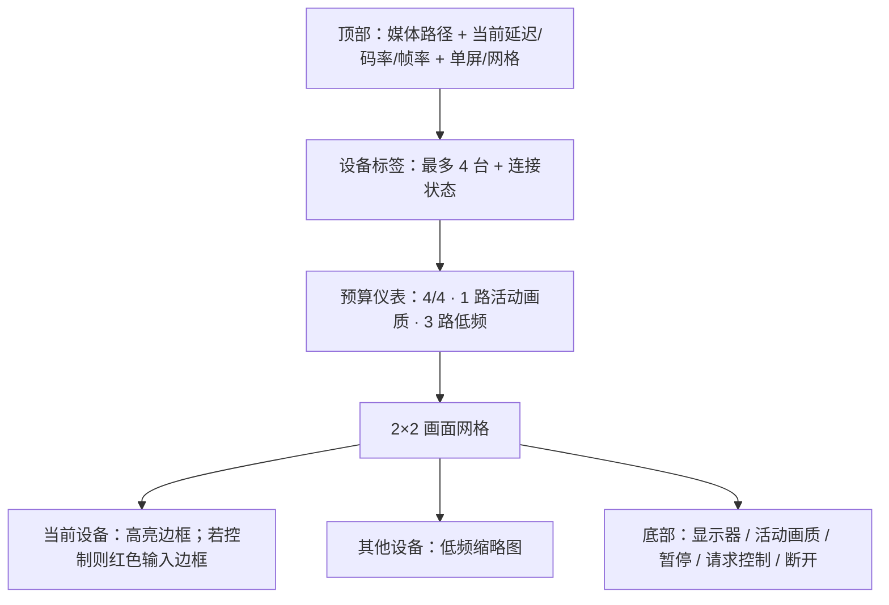

# ADR：Personal Mesh 多设备控制台与媒体预算

状态：Accepted

日期：2026-08-10

对应阶段：Phase 8

## 决策

主窗口右下统一详情面板的 Remote Surface 最多同时保存四个远程查看会话，并提供两种属于同一详情状态的布局：

1. 单屏模式聚焦当前设备，适合持续操作；
2. 网格模式同时显示最多四台设备的 2×2 画面，点击设备标签或画面标题即可切换当前设备；
3. 只有当前设备使用用户选择的 `high`、`balanced` 或 `thumbnail` 画质，所有后台设备自动降为 `thumbnail`；
4. 用户为每台设备选择的活动画质单独记忆，重新切回时恢复，不把后台降级覆盖成永久偏好；
5. 画质命令按设备串行收敛到最新目标，快速连续切换不会让迟到命令把当前设备错误降级；
6. 切换当前设备前先取消上一设备正在等待的控制请求或释放已有输入权；控制台始终只有一个明确的当前输入目标；
7. 布局与媒体诊断只存在于右下详情的隔离 Remote Surface，不改变 Header、顶部 Agent、左下会话、Footer 或普通 Main Renderer 的安全边界。

## 完成态界面

设备标签和每个网格画面都显示安全设备名与明确状态。网格中活动设备使用金色边框；获得输入权后改用更高警示等级的红色边框，并同时显示“当前输入目标”，不只依赖颜色。双击仅查看画面可聚焦单屏；处于控制模式时不会用双击布局动作抢走远端输入。

Remote Surface 固定落在 1040 × 840 主窗口的右下详情面板；Main 每次按该面板的实时边界约束 WebContentsView。紧凑宽度仍保留四格、当前设备、显示器、画质、暂停、控制、断开和仅查看/控制状态；显示器名称按可用宽度缩短，完整名称与尺寸保留在选项提示中。

## 媒体预算

预算由纯函数 `planStreamBudget` 决定，不由页面上临时隐藏与否猜测：

- 最多四个会话；第五个在 Main 建立前被拒绝；
- 当前会话为 `active`，采用它自己的 `preferredQuality`；
- 其余会话为 `background`，目标画质固定为 640×360、2fps 的 `thumbnail`；
- 暂停会话保留暂停语义，切换显示器或画质不会意外恢复被禁用的视频轨；
- 切回活动目标后恢复其偏好画质；
- 输入消息仍优先于画质、库存和文件传输，后台画面不获得键盘事件。

当前预算限制同一窗口的远控媒体。设备认证、库存和传输继续走各自通道，不因切到网格而建立新的 Agent、账号或会话身份。

## 连接诊断与隐私

Remote Console 每两秒从本地 `RTCPeerConnection.getStats()` 读取一次媒体统计，只保留并展示：

- 接收码率；
- 往返延迟；
- 视频帧率；
- 聚合丢包比例；
- 候选类型构成的 `direct` / `relay` 路径；
- UDP/TCP 协议枚举。

IP 地址、端口、SDP、ICE 原文、TURN 用户名和凭据不会写入 session 状态、Main Renderer、日志或 UI。统计不可用时画面继续工作，界面显示“等待媒体统计”，不把缺失值伪装成 0 延迟或 0 带宽。

## 输入切换规则

- 点击另一设备先对上一目标执行 `releaseAll`，再通过 Main 释放其控制授权；
- 上一目标仍在等待本机同意时也会显式取消，不留下第二个待接受提示；
- 新目标只有在两条输入 DataChannel 都已打开时才允许请求控制；
- 任一输入 DataChannel 关闭后立即切回仅查看并通知目标端释放；
- 如果控制同意响应到达时输入通道已经失效，控制台立即撤销，不显示虚假的控制状态；
- 标签、画面标题、布局按钮、显示器和画质控件本身不会被当成远端鼠标点击。

## 验证证据

- 单元测试覆盖四路上限、唯一活动流、后台低频预算、媒体聚合统计、直连/中继路径和地址脱敏；
- 静态契约测试覆盖单屏/网格控件、活动与控制边框、`getStats` 聚合和固定输入切换规则；
- 双端 Electron 自检在控制台重构后仍完成设备认证、库存、SessionPointer、文件传输和真实 WebRTC 视频到 `viewing`；
- 既有四台模拟设备曾对 Remote Console 页面完成 1180×760 与 780×520 布局验收；1.10 又在真实 1040×840 AgentDesk 窗口中验证右下详情内嵌边界和固定三面板不移动，未读取真实桌面、未请求系统权限、未发送系统输入。

## 尚未替代的真机门禁

本阶段完成多会话控制台代码和本机窗口验收，不等于四台物理设备公网压测。仍需在真实 macOS/Windows 组合中验证四路编码负载、TURN 中继带宽、自适应码率、窗口长时间运行、网络切换、睡眠恢复和输入目标快速切换。
