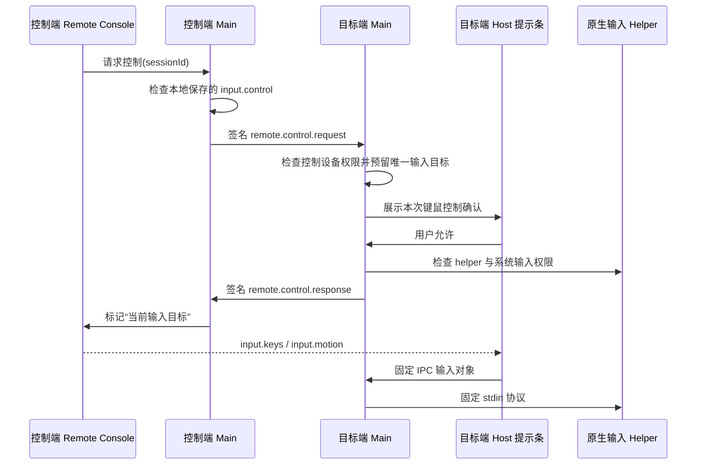

# ADR：Personal Mesh 远程输入的授权与系统边界

状态：Accepted

日期：2026-08-10

对应阶段：Phase 7

## 决策

远程键鼠不复用通用命令，也不把系统输入能力交给 Renderer：

1. 控制请求、同意、拒绝和释放继续走已认证、签名的 `control.reliable` 语义信封；
2. 高频输入只走当前屏幕媒体连接上的两条固定 WebRTC DataChannel：`input.keys` 与 `input.motion`；
3. `input.keys` 可靠有序，承载按键、鼠标按钮、文本和全部释放；`input.motion` 无序且不重传，承载可丢弃的移动与滚轮；
4. 两端保存的 `input.control` 权限、目标端对本次会话的第二次明确同意、目标操作系统权限三者缺一不可；
5. 当前设备始终只有一个已授权或正在等待同意的输入目标；切换目标前先释放上一目标全部按键与按钮；
6. Host Renderer 只能把有界输入对象交给 Main；Main 再次规范化、限速、检查会话所有权与持久权限，最后才写入平台 helper；
7. helper 只读标准输入上的固定行协议，不接收路径、参数、命令、URL、脚本或网络数据。

## 授权链

屏幕查看同意不自动包含控制同意。持久权限开关也不能跳过本次目标端确认；本阶段没有 `unattended`，测试代码也没有自动同意控制的生产开关。

## 输入协议

允许的远端对象只有：

- `pointer`：归一化坐标、移动或左/中/右按钮按下/释放；
- `scroll`：有界水平与垂直增量；
- `key`：固定 DOM `code` 白名单、按下/释放、修饰键和 repeat；
- `text`：最多 2048 个 UTF-16 单元的显式文本，用于 IME composition 完成结果；
- `releaseAll`：只对当前已授权输入会话生效。

单条消息最大 16 KiB。控制端按动画帧合并鼠标移动并检查 DataChannel 背压；Host Renderer 和 Main 分别限速。未知类型、未知键码、非有限坐标、越界坐标、NUL 文本和超限消息均被拒绝。

不允许 `command`、`argv`、`shell`、任意快捷动作、文件路径、剪贴板持续同步或系统安全序列。远控控制台自己的按钮和下拉框不会被转发；只有画面获得当前输入焦点后才捕获键盘。

## 唯一输入目标与释放

- `pendingInputSessionId` 预留正在等待目标端同意的会话，防止两台控制端同时弹出可接受的控制请求；
- `currentInputSessionId` 只指向已获准会话；过期响应和过期本机确认均拒绝；
- 切换设备、切回仅查看、暂停控制、权限撤销、DataChannel 关闭、窗口失焦、指针取消、设备断开、应用退出和紧急停止都会发送或执行 `releaseAll`；
- 未获控制权的查看会话无权触发全局释放，因此不能干扰另一个合法输入目标；
- helper 每秒接收一次 Main 心跳，3.5 秒无心跳自动释放所有按键和按钮；EOF 和进程退出也释放。

## 平台实现

### macOS

- 通用 arm64/x86_64 Swift helper 使用 `CGEvent` 注入固定白名单键鼠与 Unicode 文本；
- Main 通过 `isTrustedAccessibilityClient` 检查 Accessibility 权限，系统拒绝时不能进入控制模式；
- 显示器坐标取 Electron Display bounds，交给系统事件坐标；
- Screen Recording 与 Accessibility 是两项独立权限。

### Windows

- C++ helper 使用 `SendInput`，支持虚拟桌面绝对鼠标坐标、滚轮、固定虚拟键和 Unicode 文本；
- Main 在可用时用 `screen.dipToScreenPoint` 把 Electron DIP 转为物理屏幕坐标，降低混合 DPI 偏差；
- 普通权限进程仍受 UIPI 限制，不能控制更高完整性窗口；UAC 安全桌面、登录界面和系统安全序列不在范围内；
- Windows helper 必须在 Windows/MSVC 构建环境编译，当前 macOS 环境只校验了源代码和打包规则。

## 打包边界

`electron-builder` 在打包前运行 `scripts/build-native-helpers.js`：macOS 分别编译 arm64 与 x86_64 后用 `lipo` 合成通用 helper；Windows 使用 MSVC x64。仓库只提交源代码和构建脚本，`native/bin` 是可再生、被忽略的构建产物；安装包只携带固定名称的 helper。

## 验证证据

- 单元测试覆盖输入 schema、大小与速率限制、固定 helper 协议、显示坐标、持久权限、本次同意、唯一输入目标和未授权释放隔离；
- 静态契约测试确认只有两条固定 DataChannel，Preload 没有通用 IPC，三语词表 key 保持一致；
- macOS helper 已实际编译为 arm64/x86_64 通用 Mach-O，并完成 `PING`/`RELEASE` 空载协议运行；
- 双端 Electron 自检在真实 WebRTC 媒体连接上成功建立屏幕视频和新增 DataChannel，远程查看仍到达 `viewing`；自动化没有读取真实桌面，也没有自动同意或注入真实系统输入。

## 尚未替代的真机门禁

代码纵向链路完成不等于跨平台公开版本已经验收。仍需 macOS/Windows 双向真机覆盖：Accessibility 首次授权与撤销、不同键盘布局与 IME、多显示器、Retina/非 Retina、Windows 混合 DPI、UIPI、睡眠/锁屏、网络断开和 helper 签名公证。任何失败都必须保持仅查看可用并安全释放输入。
