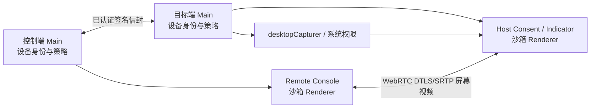

# ADR：Personal Mesh 远程查看的工作区与媒体边界

状态：Accepted  
日期：2026-08-10  
对应阶段：Phase 6

## 决策

远程查看使用两条职责不同的 WebRTC 连接：

1. 现有隐藏沙箱 Peer Renderer 继续承载设备认证、签名语义消息、库存与传输；
2. 主窗口第 6 行内的独立沙箱 Remote Surface 与目标端独立 Host Renderer 建立只含屏幕视频轨的媒体连接；
3. 媒体 SDP 只通过已经完成设备认证的 `control.reliable` 通道交换；信令服务不能单独发起屏幕查看；
4. `screen.view` 在两台设备保存的权限都必须开启，目标端仍要对每次有人值守连接明确同意；
5. `unattended` 不在本阶段实现，也不能借持久 `screen.view` 跳过本机确认；
6. 控制端画面只进入固定 1040 × 840 主窗口第 6 行的隔离 Remote Surface，不覆盖其他六行，也不进入普通 Main Renderer；
7. 被控端使用独立无 Node 沙箱窗口完成显示器选择和同意，连接后缩成 always-on-top 停止条；
8. 控制端和被控端都只把固定 ID、枚举、有限 SDP 与状态交给 Main，不暴露通用 IPC、路径、命令或 URL。

## 进程关系

Remote Console 可以同时保存最多四个目标会话，但一个目标在一个控制台中只建立一条活动查看会话。当前标签使用高画质，非当前标签可降为低频画面；这个连接预算由 Phase 8 完成 UI 闭环。

## 授权顺序

1. 控制端用户在设备中心选择“远程查看”；
2. Main 确认目标是未撤销设备，并检查本地保存的 `screen.view` 权限；
3. 若设备数据通道未连接，先完成设备证书和挑战证明；
4. 控制端 Remote Console 生成媒体 offer；
5. 目标端再次检查它为控制设备保存的 `screen.view` 权限；
6. 目标端显示常驻本机的确认窗，由本机用户选择屏幕并允许或拒绝；
7. 允许后才调用屏幕捕获并返回 answer；
8. 查看期间目标端停止条始终可见；任一端断开、Peer 失效、设备撤销、应用退出或紧急停止都会关闭媒体连接。

权限开关和本次同意缺一不可。当前实现不会自动修改另一台设备上的权限记录；同一个人需要在相应设备上明确给可信设备授权，这避免控制端单方面扩大目标端屏幕权限。

## 显示器与画质

- 目标端 Main 使用 `desktopCapturer.getSources({ types: ['screen'] })` 枚举本机显示器；
- Chromium 采集 source ID 只进入目标端专用 Host Renderer，不发送给另一台设备，也不进入主窗口状态；
- 控制端只收到显示器安全名称、稳定显示 ID、尺寸和缩放信息；
- 切换显示器由目标端重新采集并通过 `RTCRtpSender.replaceTrack` 完成，不重新创建用户会话；
- 画质只有 `high`、`balanced`、`thumbnail` 三个枚举；暂停只禁用视频轨，不提升任何权限；
- 当前基线为 1080p/30fps、720p/15fps 和 360p/2fps，实际编码仍受系统、网络和浏览器自适应影响。

## 安全边界

- Remote Console、Host 与原 Peer Renderer 均为 `sandbox: true`、`contextIsolation: true`、`nodeIntegration: false`；
- 两套 Preload 按随机 token 和精确 `webContents.id` 绑定，只有固定 IPC；
- SDP 最大 256 KiB；显示器最多 16 个；远控会话最多 4 个；
- 普通主 Renderer 获取的公开会话状态不含 SDP、采集 source ID、屏幕内容或 TURN 凭据；
- 媒体 Renderer 可以获得建立本次 ICE 所需的短期服务器配置，但不能访问设备私钥；
- 远端只能发送暂停、恢复、三档画质和已枚举显示器选择，不能提交媒体路径、任意约束、脚本或命令；
- 全局 `CommandOrControl+Shift+Escape` 关闭本机全部远控会话；目标端停止条提供鼠标可见的等价入口；
- 屏幕查看不自动获得键盘、鼠标、剪贴板或文件权限。

## 平台现状

- macOS：通过系统屏幕录制权限保护；Host 窗口显示 `getMediaAccessStatus('screen')` 的规范化结果，首次捕获仍由系统决定是否弹出授权；
- Windows：使用 Chromium/Electron 桌面捕获；UAC 安全桌面和登录界面不在范围内；
- 本阶段没有实现无人值守、开机服务或锁屏查看。

## 验证证据

- 领域测试覆盖 SDP 大小、固定命令枚举、公开状态脱敏、沙箱 Surface/Host 和主窗口骨架；
- 双端 Electron 自检使用两套独立 Mesh 身份、真实设备认证 DataChannel 与第二条真实 WebRTC 视频连接；
- 自检的目标端使用合成视频轨以避免自动化测试读取真实桌面，最终双方状态均为 `viewing`，显示器为 `Synthetic display`；
- 合成媒体自检证明进程、SDP、SRTP 视频轨、授权状态和清理链路，不替代两台物理电脑的 macOS/Windows 屏幕权限与公网网络矩阵。

## 后续

- Phase 7 在独立能力和二次本机同意下增加固定语义输入通道；
- Phase 8 完成多目标缩略网格、活动流预算与唯一输入目标；
- 公网阶段补齐信令服务、STUN/TURN 短期凭据和直连/中继诊断；
- Phase 9 若要无人值守，必须重新评审服务、安装、锁屏、恢复和撤销，不能修改本 ADR 直接开启。
