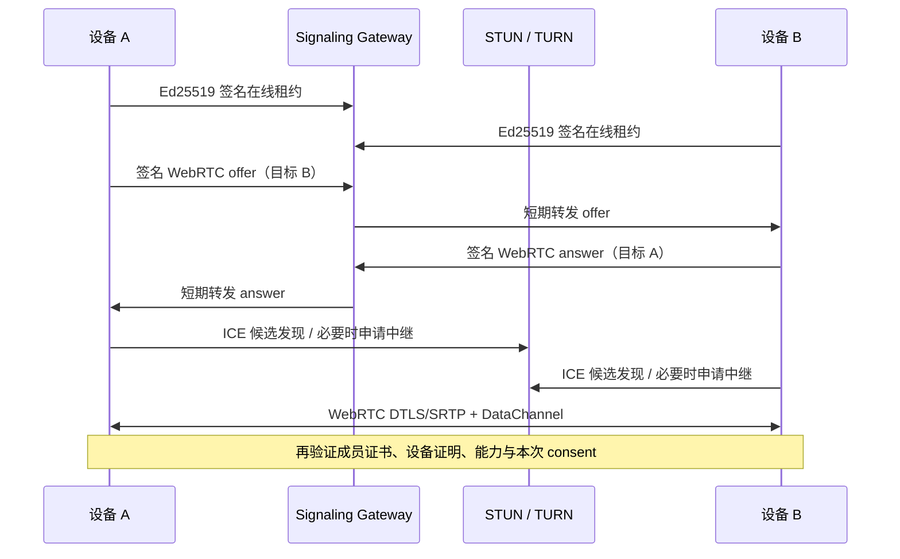

# ADR: Personal Mesh 公网会合、STUN 与 TURN

- 状态：Accepted for implementation
- 日期：2026-08-10
- 对应规划：`PERSONAL_AGENT_MESH_PLAN.md` 1.5

## 结论

AgentDesk 采用一套最小、可自托管的 Signaling Gateway 帮助个人设备在公网相遇；真正的设备身份、权限、库存、文件、屏幕和输入继续由设备端认证并通过 WebRTC 端到端传输。

连接顺序固定为：

1. 有可用局域网端点时先尝试 LAN；
2. LAN 不可达时，通过 Signaling Gateway 交换签名 WebRTC offer/answer；
3. ICE 先选择局域网或公网直连候选；
4. 直连不成立时，使用短期 TURN 凭据回退到中继；
5. 已建立 WebRTC 连接不依赖 Signaling Gateway 继续存在。

## 为什么需要这层服务

P2P 不等于完全没有服务。两台电脑不在同一局域网时，至少需要：

- 知道目标设备是否在线；
- 把 WebRTC offer/answer 交给正确目标；
- 使用 STUN 发现公网候选；
- 在对称 NAT、CGNAT 或 UDP 受限时使用 TURN。

这层服务只解决“去哪里找到那台设备”，不回答“那台设备是否可信、允许做什么”。后两个问题仍由 Mesh 成员证书、设备证明、签名信封和目标端本次同意决定。

## 服务端允许保存的状态

内存实现只保留：

- `deviceId -> devicePublicKey` 路由绑定；
- 最长 60 秒的在线租约；
- 每设备最多 64 条、最长 45 秒的固定信令消息；
- 正在等待答复的一次性配对请求；
- 短期请求重放表和限速窗口。

服务端不保存：

- Agent、账号、会话标题或项目路径；
- SessionPointer、文件、剪贴板或 transcript；
- 屏幕、键盘、鼠标或控制命令；
- 设备私钥、Mesh 关联密钥、邀请 secret；
- TURN 长期凭据到桌面配置。

当前服务不是离线业务邮箱。目标设备没有有效租约时，配对和连接会明确失败；SessionPointer 仍只在发送端本机密文队列等待。

## 固定 HTTP 接口

| 接口 | 调用者 | 作用 |
|---|---|---|
| `GET /v1/health` | 运维 / 客户端 | 协议和 TURN 能力健康检查 |
| `POST /v1/lease` | 已有设备 | 登记或续期在线租约 |
| `POST /v1/poll` | 已有设备 | 最长 20 秒读取短期信令消息 |
| `POST /v1/signal/send` | 已有设备 | 只发送 `peer.offer` / `peer.answer` |
| `POST /v1/pair/claim` | 新设备 | 把一次性配对请求转给邀请设备 |
| `POST /v1/pair/respond` | 邀请设备 | 返回端到端加密的配对响应 |
| `POST /v1/turn-credentials` | 有租约设备 | 签发 coturn REST 短期凭据 |

不存在通用 message type、任意 mailbox、命令、路径、URL 或文件上传接口。

## 请求认证

除健康检查外，每个请求都包含：

- `schemaVersion`；
- 固定 `operation`；
- `requestId`、`nonce`；
- `issuedAt`、`expiresAt`；
- `deviceId` 和需要时的设备公钥；
- 对规范编码完整请求的 Ed25519 签名。

网关验证短 TTL、签名、设备路由绑定和重放。配对加入端尚无成员证书，但已经生成设备密钥，所以外层 `pair.claim` 也由新设备密钥签名；内层仍必须通过邀请码的高熵 secret proof。

`peer.offer` 与 `peer.answer` 只允许已经在同一网关持有有效租约的双方交换。接收端的 answer 固定返回当前收到 offer 的网关，不采纳消息中临时附带的回复 URL；客户端也只连接双方设备目录中共同登记、且本机已经配置的会合服务。这样信令消息不能被用来诱导设备向任意地址发请求。

网关签名验证只阻止路由被随意篡改，不替代 Mesh 身份验证。目标设备收到 offer 后仍使用本地设备目录中的成员证书公钥验证 WebRTC 信封；建立 DataChannel 后还要完成双方 DeviceProof。

## 配对保密性

邀请码携带经过邀请设备签名的可选 `signalUrls`。公网配对保持现有密码学链路：

- 邀请 secret：32 字节随机值，十分钟、单次消费；
- 加入请求：HMAC-SHA-256 secret proof；
- 双方交换：X25519；
- 派生：HKDF-SHA-256；
- 响应加密：AES-256-GCM；
- 成员身份：device.admin 委托成员证书。

因此网关能看到目标设备 ID、时间、大小和必要的技术路由信息，但不能解密配对响应中的 Mesh 密钥、目录或成员数据。

## ICE 和 TURN 凭据

桌面端支持两类来源：

1. 设备中心“网络设置”保存 HTTPS Signaling URL 和 STUN URL；
2. 部署环境可注入 `AGENTDESK_STUN_URLS`、`AGENTDESK_TURN_URLS`、`AGENTDESK_TURN_USERNAME`、`AGENTDESK_TURN_CREDENTIAL`。

推荐生产配置使用信令服务签发 TURN REST 凭据：服务端持有 `AGENTDESK_TURN_SECRET`，客户端拿到带 Unix 到期时间的 username 和 HMAC-SHA1 credential。凭据只存在 Main 和专用沙箱 Peer/Remote Renderer 的内存中，不进入 Main Renderer、设置文件、Mesh 数据库、诊断或日志。

设备中心不会让用户填写 TURN 长期 secret。公开 Signaling URL 必须使用 HTTPS；只有 loopback 可以直接使用 HTTP，其他不安全 HTTP 仅供显式部署环境开关。

## 客户端生命周期

- 未初始化 Personal Mesh：不建立网络连接；
- Mesh 已初始化且 AgentDesk 运行：自动登记并续期在线租约；
- 应用退出、Mesh 重置或网络设置变更：立即中止长轮询并清理短期凭据；
- 临时“开放局域网直连 30 分钟”只控制本机 LAN HTTP 端点，不关闭公网租约；
- 信令不可用：局域网仍可连接，现有 WebRTC 连接继续；
- LAN 与信令都失败：返回具体错误，不伪造在线。

## 用户可见诊断

每台设备的“连接诊断”显示：

- 信令未配置 / 连接中 / 在线 / 部分在线 / 离线；
- STUN、TURN 是否配置和短期凭据到期时间；
- 会合路径：LAN 或公网信令；
- WebRTC 路径：LAN、P2P 直连或 TURN 中继；
- 候选类型、UDP/TCP 和 selected pair 状态；
- 屏幕、输入、文件与 SessionPointer 权限。

诊断不显示 IP、端口、SDP、完整设备 ID、公钥、密钥、token 或 TURN credential。

## 已验证证据

自动化已经证明：

- 签名请求拒绝篡改、错误 operation、过期和重放；
- 路由绑定拒绝不同设备公钥占用同一活动设备 ID；
- 两个隔离 Mesh 可只通过信令地址完成一次性端到端加密配对；
- 两个 SignalingClient 可交换签名 offer/answer 并取得短期 TURN 凭据；
- 真实 Electron 沙箱 RTCPeerConnection 经 Signaling Gateway 建立认证 DataChannel；
- 同一条真实 WebRTC 通道继续完成双向库存、SessionPointer 和 184,333 字节文件传输；
- 第二条真实 WebRTC 媒体连接到达合成屏幕 `viewing`；
- 公开状态和诊断不包含 TURN 凭据、SDP 或候选地址。

## 尚未被上述证据证明

- 两台物理电脑跨真实家庭 NAT；
- 对称 NAT、CGNAT、IPv6、UDP 禁用和 TCP/TLS TURN；
- 部署在公网域名后的 TLS、区域延迟与容量；
- 强制 `relay` 的真实 coturn 流量；
- macOS / Windows 四向真机屏幕、输入、DPI 和 IME 矩阵。

这些仍是公开 Beta 前的物理验收门禁，不能用本机双端点结果替代。
