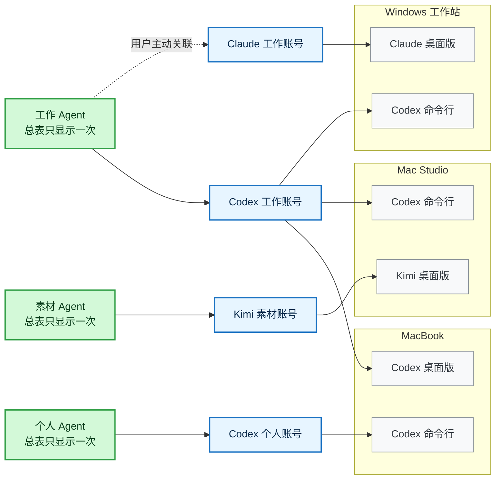
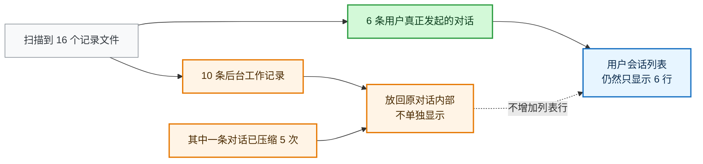
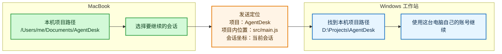

# 多 AI 账号、多会话和多台电脑怎么统一管理

## 摘要

工作号正在运行，临时要用个人号时，很多客户端只能退出当前账号再登录另一个。第二次打开应用也常常回到原窗口，两个账号无法并行。登录状态、会话目录和正在进行的工作会随切号反复中断。

AgentDesk 给每个账号单独保存登录数据和会话目录，并从对应入口启动受支持的客户端。账号能够并行使用后，跨设备场景又带来重复问题：同一账号出现在多台电脑上，一台电脑放着多个账号，会话也散落在不同机器。完整的解决顺序从本机账号隔离开始，再延伸到跨设备归并和会话定位。

---

## 1. 登录、切号和多开

工作号正在跑一个项目，临时需要用个人号查另一件事。很多官方客户端只认一套登录状态，再点一次图标也会回到原来的窗口。用户只能退出工作号、登录个人号，用完以后再切回来。账号越多，重复登录越频繁。

每次换号都会打断当前工作。登录状态可能互相覆盖，会话记录也更难确认归属。平台网页、桌面客户端和命令行工具还可能各用一套登录状态，需要分别处理。

AgentDesk 为工作号、个人号和备用号分别保存独立的数据目录与会话目录；用户点击哪个账号，就用对应数据打开受支持的官方客户端。各账号可以保留自己的登录状态，受支持的客户端也能各开一个独立实例。[1][2]

个别客户端禁止独立实例时，AgentDesk 应直接显示限制。账号数据仍然分开保存，换号不会把内容混入同一个目录。

账号数据分开后，统一浏览会话、查看额度和管理多台电脑才有可靠基础。

## 2. 同一账号会出现在多台电脑上

账号扩展到多台电脑后，新的混乱来自重复和交叉。假设 MacBook 随身带着，Mac Studio 长期开机，Windows 工作站负责需要显卡的任务，登录情况可能是这样：

| 设备 | 这台设备上的账号 |
|---|---|
| MacBook | Codex 工作号（桌面版）；Codex 个人号（命令行） |
| Mac Studio | Codex 工作号（命令行）；Kimi 素材号（桌面版） |
| Windows 工作站 | Claude 工作号（桌面版）；Codex 工作号（命令行） |

Codex 工作号登录在三台电脑上，MacBook 和 Mac Studio 又各自放着不止一个账号。如果每发现一次登录就生成一张账号卡，Codex 工作号会出现三遍。电脑标签只能指出三张重复卡片的位置，账号仍被重复计算。

AgentDesk 把“工作”“个人”“素材”这类长期使用的 AI 工作身份称为 Agent。一个 Agent 可以使用一个或多个平台账号；跨平台账号只有经过用户主动关联，才归入同一个 Agent。



图里有三个 Agent、四个实际账号和六个可用位置。工作 Agent 并不会因为出现在三台电脑上就变成三个；MacBook 上的工作号和个人号也不会因为共用一台电脑而被合并。

## 3. 界面按 Agent 展示，操作落到具体电脑

界面先显示“工作 Agent”，让用户知道当前管理的是哪个长期工作身份。展开后可以看到它实际使用的 Codex 工作号和 Claude 工作号。点击打开、诊断、定位或继续会话时，界面再要求选择“Mac Studio / Codex 命令行”这样的确切位置。

Agent 名称不带电脑名，总表也不会按电脑复制 Agent。内容压缩继续归在原会话中，不同电脑上的文件夹路径继续指向同一项目。

## 4. AgentDesk 现在能做什么

登录与对话仍由 Codex、Claude、Cursor 或 Kimi 的官方客户端完成。AgentDesk 为每个本地账号提供独立入口，再把历史会话整理到一起。[1][2]

| 能力 | 现在的状态 |
|---|---|
| 工作号、个人号保留各自登录和数据 | 已可使用；受支持的桌面客户端按所选账号独立打开 |
| 同一登录的桌面版和命令行不重复显示 | 已可使用 |
| 统一查找本机不同客户端的会话 | 已可使用 |
| 单选或多选后复制会话信息 | 已可使用，只复制路径和坐标 |
| 所有账号都能删除到零 | 已可使用；删除后允许出现空列表 |
| 在一台电脑上查看其他电脑的账号和会话 | 开发版已实现；来源设备发布只读库存，强标识去重，离线显示快照 |
| 把会话定位和文件发到另一台电脑 | 开发版已实现；SessionPointer 与文件分别加密、确认和重试 |
| 查看和控制自己的另一台电脑 | 开发版已实现有人值守链路；目标端逐次同意，始终只有一个输入目标 |
| 跨公网连接 | 开发版已实现签名信令、STUN 和短期 TURN 配置；真实 NAT/coturn 仍待物理验收 |

空的 Claude、Kimi 或其他平台卡片没有保留价值。删除最后一个账号以后，界面应该显示真实的空状态，系统不得补回默认账号。连接多台电脑后，同一个账号仍只显示一次，下面列出可用电脑。

## 5. 一条对话在列表里就应该是一行

长对话会压缩较早的内容，后台工作也会生成额外记录。对用户而言，对话仍在原线程中继续。一次本机检查发现，Codex 一共留下了 16 个记录文件，其中 6 个对应用户发起的对话，另外 10 个是后台工作记录。有一条对话已经压缩了 5 次，但它的会话编号和主文件都没有改变。[3]

程序若把“一个文件”当成“一条会话”，列表就会从 6 行膨胀到 16 行。当前列表在内容压缩后冒出新会话、甚至新项目，根因就在这里。



后台记录保留在所属对话内部。会话列表只展示用户发起的对话；后台记录和压缩历史需要诊断时可以查看，平时不单独占行。

项目也不能只靠文件夹名称判断。Mac 上的 `/Users/me/Documents/AgentDesk` 和 Windows 上的 `D:\Projects\AgentDesk` 可以是同一个项目，只是在两台电脑上的存放位置不同。

## 6. “复制会话信息”只负责准确定位

“复制会话信息”是会话区最重要的操作。无论单选还是多选，都只需要同一种格式：

```text
路径: <项目路径；没有时使用会话文件路径>
坐标: <会话文件路径>#<会话编号>
```

路径告诉接收者去哪个项目，坐标告诉接收者打开哪条会话。这两项已经足够完成定位。

多选只增加顺序编号，复制格式不变。剪贴板不生成摘要、进度说明或接手话术。定位信息由工具负责，后面的话由人自己说。

同一条会话在多台电脑上都有记录时，复制动作采用用户当前选中的电脑。选择为空时先弹出位置选择，禁止随机取值。

## 7. 换一台电脑继续时，系统只传定位

从 MacBook 把一条会话发到 Windows 工作站时，不能直接把 Mac 上的绝对路径交给 Windows 打开，因为两台电脑的目录结构不同。

传递内容只需说明项目、文件在项目里的相对位置，以及要继续的会话。目标电脑收到后，用自己的项目路径和登录状态重新定位。



这套定位方式让目录结构不同的电脑准确回到同一个项目和会话。当前开发版先尝试临时局域网端点，失败后通过签名信令交换 WebRTC 信息；ICE 再选择直连或短期 TURN 中继。账号密码和完整的客户端数据仍留在各自电脑上，不需要集中上传。远程查看、键盘鼠标控制和文件接收分别授权。连接多台电脑时，键盘鼠标只能指向其中一台。

这条代码链路已经在一台 Mac 上用两个隔离设备身份和真实 Electron WebRTC 验证过配对、库存、会话信息、184,333 字节文件和合成屏幕视频；它证明协议纵向贯通，但不替代两台物理电脑、真实家庭 NAT、coturn 和 Windows 权限测试。

## 8. 用户实际怎么用

用户先在 MacBook 上分别建立工作号和个人号。需要哪个账号就从 AgentDesk 打开哪个，临时换号无需退出当前登录；客户端允许独立实例时，两个账号可以并行运行。

接入其他电脑后，用户选择“全部设备”，就能看到自己的工作、个人和素材 Agent。工作 Agent 只显示一次，旁边告诉他目前可在三台电脑上使用。

他进入工作 Agent，搜索 AgentDesk 项目，找到一条保存在 Mac Studio 上的 Codex 会话。即使这条会话已经压缩过多次，列表中仍然只有一行。他可以直接复制路径和坐标，也可以把定位发送到 MacBook，在 MacBook 上用本机的项目路径继续。

如果接下来的工作需要 Windows 工作站的显卡，他可以单独打开远程查看窗口，确认当前控制目标后再操作。整个过程中，主界面始终围绕账号和会话，不会变成一套复杂的远程桌面软件。

## 9. 几条不能破坏的底线

| 容易出错的做法 | 应该怎么做 |
|---|---|
| 所有账号共用一个客户端目录，换号就退出重登 | 每个账号保留独立登录和会话目录；支持时分别打开 |
| 同一账号每台电脑显示一张卡 | 总表只显示一次，需要操作时再选电脑 |
| 因为名称相同就自动合并账号或会话 | 只有平台提供可靠编号，或者用户亲自确认时才合并 |
| 扫到一个文件就新增一条会话 | 只把用户真正发起的对话显示成一行 |
| 强制保留空的默认账号 | 所有账号都能删除到零，空状态就显示空状态 |
| 给复制内容附加摘要和交接模板 | 只复制路径和坐标 |
| 为了跨设备而集中保存登录信息 | 登录信息继续留在原电脑 |
| 把远程控制做成任意命令入口 | 只开放明确、经过授权的操作 |

设备增加后，目录仍保持清楚，本机已有的重复和混乱也不会扩散到其他电脑。

## 10. 多开、会话和设备落在同一套管理里

多账号管理从登录状态分离开始。每个账号保留自己的数据，受支持的客户端可以并行打开，反复退出重登随之减少。

账号能够独立使用后，管理需要继续回答三个问题：这是哪个长期使用的 Agent，它实际用了哪些平台账号，这次操作应该在哪台电脑上发生。

AgentDesk 的当前开发版已经把这套关系带到个人的其他电脑：同一账号换电脑后仍只出现一次；内容压缩留在原会话中；不同的本地路径指向同一个项目。公开发布前剩下的是物理设备、真实网络和跨平台权限验收，不是再增加一套账号或会话概念。

---

## 参考文献

[1] AgentDesk. (2026). *[产品定义](./PRODUCT.md)*. https://github.com/shuqianglin1997/Skills/blob/main/AgentDesk/docs/PRODUCT.md

[2] AgentDesk. (2026). *[全功能梳理](./FUNCTION_AUDIT.md)*. https://github.com/shuqianglin1997/Skills/blob/main/AgentDesk/docs/FUNCTION_AUDIT.md

[3] AgentDesk. (2026). *[个人多设备功能规划](./PERSONAL_AGENT_MESH_PLAN.md)*. https://github.com/shuqianglin1997/Skills/blob/codex/agentdesk-personal-mesh-plan/AgentDesk/docs/PERSONAL_AGENT_MESH_PLAN.md
