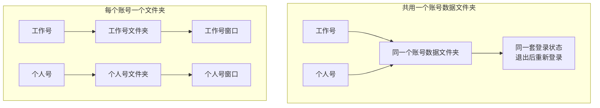
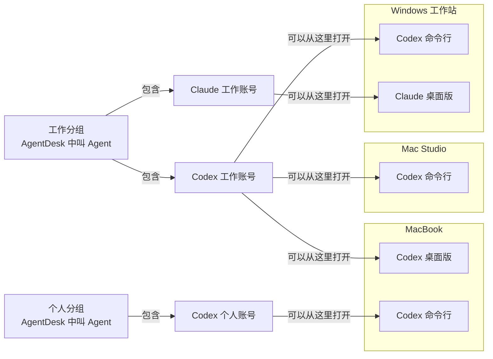
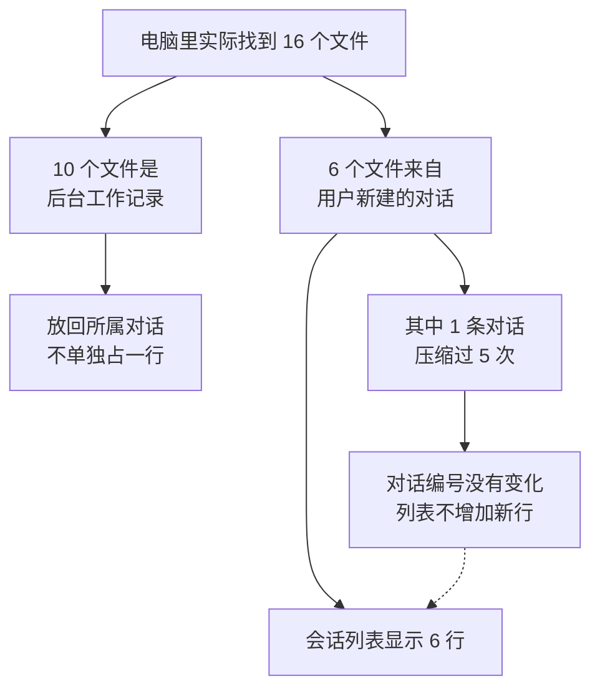
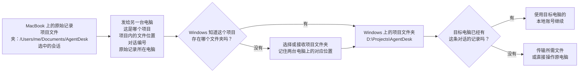

# 一个人怎么管理多个 AI 账号、对话和电脑

## 摘要

多个 AI 账号放在一台电脑上时，最直接的麻烦是切号需要退出重登，第二次打开应用也可能回到原窗口，两个账号无法并行。AgentDesk 为每个账号分开保存登录状态和对话记录。电脑增加以后，同一个账号仍然只显示一次，它所在的电脑列在下面；用户新建的一段对话也只显示一次，应用在后台增加文件或把较早消息整理成摘要都不会多出一行。工作需要换到另一台电脑时，系统先确定项目和对话，再找到这个项目在目标电脑上的存放位置。

---

## 1. 麻烦先出现在切号和同时打开两个账号

工作号正在跑一个项目，临时又要用个人号。官方桌面应用如果只读取同一组账号文件，用户通常只能退出工作号，登录个人号，用完以后再切回来。重新打开一次应用，也可能只是把原窗口拉到前台。在电脑的命令窗口里输入命令启动的版本也会遇到类似问题，例如分别运行 Codex 或 Claude 的命令行版本。

应用会从电脑里的一个文件夹读取“当前登录的是谁”、用户设置和历史对话，这就是账号数据文件夹。工作号和个人号共用它时，两个窗口读到的仍是同一个账号；切号会改写文件夹里的登录状态，第二个窗口也无法保持另一套登录。



AgentDesk 给每个账号建立一个入口，并记住它各自的账号数据文件夹和对话记录文件夹。用户点击工作号时，应用从工作号文件夹启动；点击个人号时，应用从个人号文件夹启动。应用允许指定不同文件夹并打开两个窗口时，两套登录就能同时保留。[1][2]

各个官方应用允许的启动方式不同。Codex、Claude 或 Cursor 的某些版本可以读取用户指定的文件夹，另一些应用只读取自己的默认文件夹。AgentDesk 可以整理它们的账号入口和历史对话；能否真正同时打开两个账号，仍由对应应用的启动方式决定。

## 2. 同一个账号出现在三台电脑上，仍然只算一个

假设 Codex 工作号同时登录在 MacBook、Mac Studio 和 Windows 工作站，MacBook 上又登录了一个 Codex 个人号。如果每发现一次登录就在列表里增加一份，工作号会出现三遍；如果只按电脑分组，用户又很难看出自己到底有几个账号。

管理时先确认是不是同一个实际登录。三台电脑上登录的都是同一个 Codex 工作号，总表就只保留一个账号，再在它下面列出三处可以打开的位置。这里的“位置”很具体，指一台电脑加一种打开方式，例如“Mac Studio 上的 Codex 命令行版本”。

有些长期工作会同时使用不同的 AI 服务。例如做同一个项目时，代码主要交给 Codex 工作号，长文整理交给 Claude 工作号。用户可以把这两个账号放进一个名为“工作”的分组。在 AgentDesk 里，这种由用户命名、可以包含多个账号的工作分组就是 Agent。它表达的是“这些账号都服务于我的工作”，并不改变 Codex 和 Claude 各自的登录。



图中只有一个 Codex 工作账号，它可以从三处打开；MacBook 上同时有工作号和个人号，两者仍然分开。即使用户不建立任何工作分组，同一个 Codex 工作号也只显示一次。建立“工作”分组以后，Codex 工作号和 Claude 工作号才会在总览里放到一起。

把不同服务的账号放进同一分组，需要用户确认。名称相同、装在同一台电脑上或碰巧使用同一个项目，都无法证明它们属于同一份长期工作。电脑名称只用来回答“这次去哪里打开”，不会参与判断账号是谁、属于哪个工作分组。

多电脑界面会先展示工作分组和账号。用户点击打开、检查路径或继续对话时，再选择具体电脑和打开方式。这样既不会重复计算账号，也不会把操作发到错误的电脑。

## 3. 电脑里多了文件，不等于用户新建了一条对话

AgentDesk 把用户在官方应用里主动新建、以后还能继续打开的那段对话显示为一条会话。例如，用户在 Codex 里新建对话处理 AgentDesk，第二天从历史列表打开它继续工作，这仍是同一条会话。

应用为了完成这条对话，可能在后台写出更多文件。对话很长时，应用还会把较早的消息整理成一份更短的摘要，再接着保存后面的内容，这种保存方式叫作内容压缩。用户没有点击“新建对话”，原来的对话也没有结束；变化的只是应用在电脑里保存内容的方式。

2026 年 8 月 8 日检查这台电脑时，Codex 保存对话的文件夹里共有 16 个文件。6 个文件来自用户主动新建的对话，另外 10 个是 Codex 在后台检查或处理子任务时留下的记录。6 条用户对话中，有一条已经压缩过 5 次，它仍然使用原来的对话编号，也仍然保存在原来的文件中。[3]



16、6 和 10 只描述这次检查。AgentDesk 判断列表该显示几行时，会看每个文件属于哪条用户对话，而不是简单数文件。Codex 会给每条用户对话写入一个固定编号，例如 `thread-123`；内容压缩和后台记录都继续指向这个编号，所以列表仍然只有一行。当前代码和测试已经按这个规则处理。[4][5]

项目也不会跟着文件数量变化。一份项目可以有许多对话，一条对话也可能被压缩、关闭后再打开。文件增加、对话标题变化或文件夹改名，都不足以说明用户新建了一个项目。

## 4. 复制一条对话时，为什么需要两行信息

用户点击“复制会话信息”时，接收者需要知道两件事。第一行告诉他相关工作放在哪个文件夹，AgentDesk 把这一行标为“路径”；第二行准确指出要打开哪条对话，AgentDesk 把这一行标为“坐标”。

路径通常是项目文件夹，例如 `/Users/me/Documents/AgentDesk`。有些对话没有记录项目文件夹，这时路径会改用保存该对话的文件。它先把人带到正确的工作范围。

坐标不是屏幕上的横纵位置。它是 AgentDesk 对“这条对话在原始记录中的准确位置”的叫法，由保存对话的文件路径和对话编号组成。`#` 左边是文件，右边是应用为这条对话记录的编号。

这个区别在同一项目有多条对话时很实际。例如，用户先后开了两条都叫“修复登录问题”的 Codex 对话，它们的项目路径完全相同，标题也相同；一条编号是 `thread-123`，另一条是 `thread-456`。只复制项目路径会让接收者停在两条对话面前，坐标才能指出其中一条。

复制结果采用下面的格式：

```text
路径: /Users/me/Documents/AgentDesk
坐标: <保存这条对话的文件路径>#thread-123
```

单选复制一组，多选按顺序复制多组。这里的文件夹和文件都来自当前电脑。另一台电脑很可能把同一个项目放在别处，因此不能原样使用这条本机路径。

## 5. 换电脑后，同一个项目会放在另一个文件夹

同一个 AgentDesk 项目在 MacBook 上可能位于 `/Users/me/Documents/AgentDesk`，在 Windows 工作站上可能位于 `D:\Projects\AgentDesk`。把 Mac 上这条完整路径原样发给 Windows，目标电脑找不到这个文件夹。

AgentDesk 规划了一套个人多电脑功能：用户先确认几台电脑都属于自己，并让它们互相认识；之后可以在 MacBook 上查看 Mac Studio 的对话，或者把工作发到 Windows 工作站。这组互相配对的个人电脑在产品中叫作 Personal Mesh。[3]

电脑上的完整路径会变化，项目内部的位置通常不会变。例如 Mac 和 Windows 的项目文件夹不同，但要找的文件在两边都可以是 `src/main.js`。因此，跨电脑发送时需要说明：这是哪个项目、项目里的哪个文件、哪条对话，以及原始记录还在哪台电脑上。目标电脑再把这些信息接到自己的项目文件夹上。



图中的分支对应三种情况：

- 目标电脑已经有项目和对话记录时，只发送项目与对话的位置，由目标电脑换成自己的文件夹。
- 目标电脑缺少项目文件或对话记录时，先传输缺少的文件。
- 工作依赖原电脑上已经登录的账号或那台电脑的显卡时，文件留在原处，用户直接查看那台电脑的屏幕，并把键盘鼠标操作发过去。

### 设备之间怎样连接

两台电脑能直接建立网络连接时，数据从一台直接传到另一台，中间不经过转发服务器，这种连接通常叫 P2P。例如 MacBook 能直接联系 Mac Studio 时，选中的文件就从这两台电脑之间传输。网络环境不允许直连时，中转服务只负责转发加密后的数据，只有已经配对的电脑能够还原内容。两种情况下传递的都是对话列表、项目和对话的位置、用户选中的文件或屏幕画面；账号密码和已经登录的账号状态留在原电脑。[3]

查看屏幕、接收文件和发送键盘鼠标操作会改变电脑的程度不同，因此分别取得用户允许。用户同时查看多台电脑时，界面持续显示键盘鼠标当前控制哪一台，避免输入发错机器。

## 6. 哪些现在能用，哪些还在开发

截至 2026 年 8 月 10 日，AgentDesk 现在公开使用的版本主要管理一台电脑上的账号和对话。个人多电脑功能正在分阶段开发。[1][2][3]

| 当前可用 | 分阶段开发中 |
|---|---|
| 在 AgentDesk 中添加、打开和删除多个账号 | 添加并移除多台已经配对的个人电脑 |
| 受支持的应用为不同账号使用不同文件夹 | 在所有电脑中把同一个账号只显示一次，并列出它所在的电脑 |
| 集中浏览这台电脑上不同账号的历史对话 | 在一台电脑上搜索其他电脑保存的对话 |
| 选中一条或多条对话后复制路径和坐标 | 把项目位置、对话位置和需要的文件发到另一台电脑 |
| Codex 压缩早期内容或生成后台文件时，列表不增加新对话 | 查看另一台电脑的屏幕，并在用户允许后发送键盘鼠标操作 |
| 所有账号都可以删除，删完后显示空列表 | 记住同一个项目在不同电脑上分别存在哪个文件夹 |

支持指定账号数据文件夹的应用，已经可以把工作号和个人号分开使用。只读取默认文件夹的应用，仍按它本身允许的方式启动。个人多电脑功能完成后，用户坐在哪台电脑前，就能从那台电脑查看其余电脑上的账号、对话和文件，需要显卡或特定登录环境时再选择对应电脑。

## 7. 总表回答“是谁”，操作时回答“去哪里”

账号和电脑增加以后，界面始终需要回答四个具体问题：现在用的是哪个实际账号；用户把它放进了哪个工作分组；它能从哪些电脑、哪些官方应用中打开；当前要找的是哪个项目里的哪条对话。

同一个账号只显示一次，同一条用户对话也只显示一次。电脑名称、打开方式和文件夹路径放在它们下面，用来说明“去哪里操作”。这样增加电脑或后台文件时，列表不会跟着复制出更多账号和对话。

---

## 参考文献

[1] AgentDesk. (2026). *[产品定义](./PRODUCT.md)*. https://github.com/shuqianglin1997/Skills/blob/main/AgentDesk/docs/PRODUCT.md

[2] AgentDesk. (2026). *[全功能梳理](./FUNCTION_AUDIT.md)*. https://github.com/shuqianglin1997/Skills/blob/main/AgentDesk/docs/FUNCTION_AUDIT.md

[3] AgentDesk. (2026). *[Personal Agent Mesh 系统规划基准](./PERSONAL_AGENT_MESH_PLAN.md)*. https://github.com/shuqianglin1997/Skills/blob/codex/agentdesk-personal-mesh-plan/AgentDesk/docs/PERSONAL_AGENT_MESH_PLAN.md

[4] AgentDesk. (2026). *[Codex 会话扫描实现](../src/sessions.js)*. https://github.com/shuqianglin1997/Skills/blob/codex/agentdesk-personal-mesh-plan/AgentDesk/src/sessions.js

[5] AgentDesk. (2026). *[会话身份回归测试](../test/mesh-session-identity.test.js)*. https://github.com/shuqianglin1997/Skills/blob/codex/agentdesk-personal-mesh-plan/AgentDesk/test/mesh-session-identity.test.js
