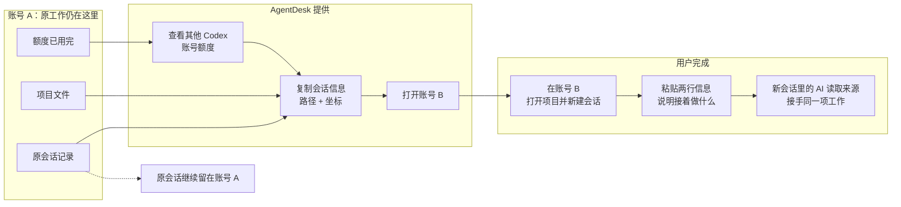
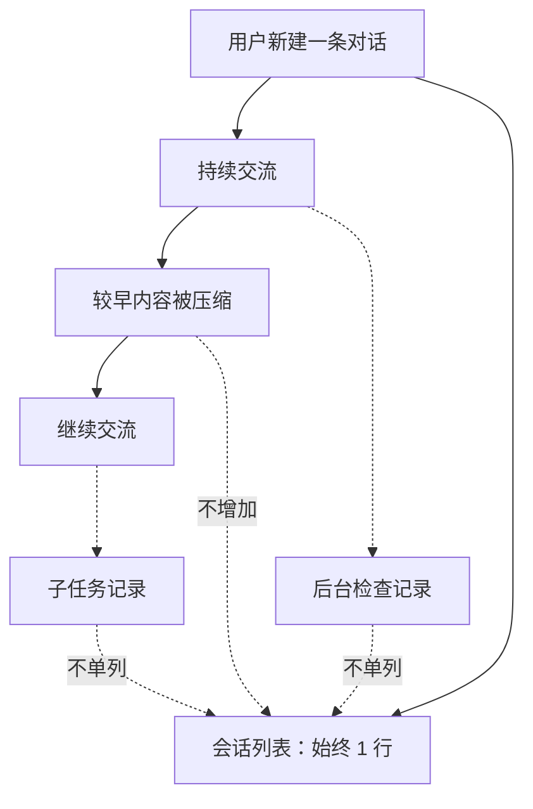
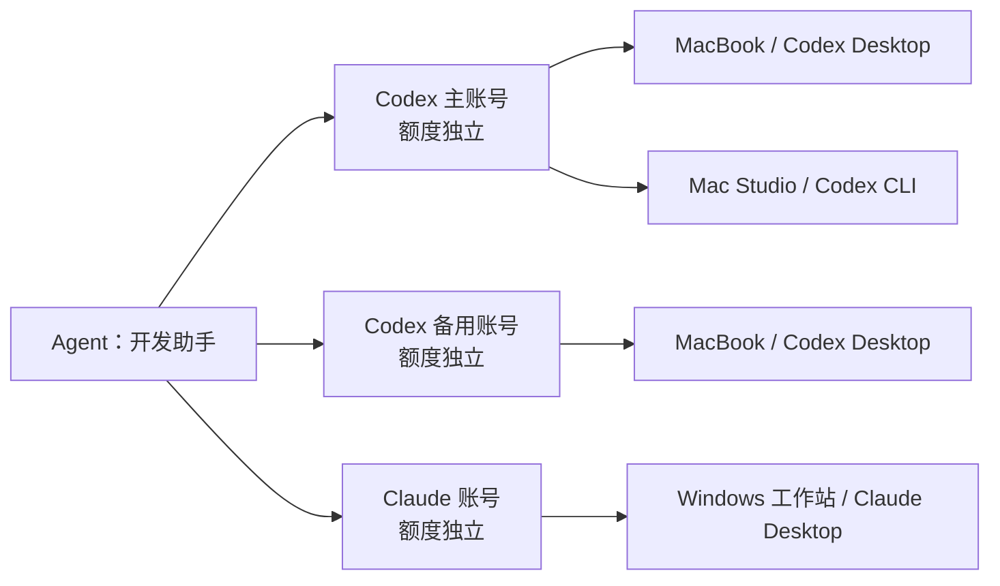

# 多个 AI 账号怎么管理，额度用完后怎么继续

## 摘要

多个 AI 账号一多，麻烦很直接：有些客户端不能同时打开不同登录，切换账号又要反复退出和登录；当前账号额度用完时，事情还停在原项目和原会话里。AgentDesk 把本机的账号入口、能够可靠读取的额度和历史会话放在一起。用户可以选择另一个账号，再用“路径 + 坐标”让新会话找到原来的工作。这个过程由人决定并完成接手，账号 A 的原会话不会自动迁移到账号 B。多设备版本继续沿用这套关系：实际账号只算一次，电脑只表示这个账号可以在哪里使用。

---

## 1. 账号不能多开，切换后还要找回原工作

很多 AI 客户端默认只使用一套本地登录。应用已经登录账号 A 时，再点一次图标往往还是账号 A；要用账号 B，只能退出、重新登录，用完以后再切回来。账号数量一多，登录和切换本身就会占掉不少时间。

还有一种更麻烦的情况：任务没有结束，额度先用完了。账号 A 里的代码、文档和讨论都做到一半，另一个账号 B 虽然还有额度，打开后却是一条空白对话。登录已经切换，工作没有跟着过去。

因此，多账号切换有两种不同目的：

| 当时发生的事 | 切换后必须保住什么 |
|---|---|
| 另一件事需要使用另一个账号 | 两套登录都能保留，两个窗口可以分别工作 |
| 当前事情没做完，但账号额度耗尽 | 除了换到有额度的账号，还要找回原项目和原会话 |

额度耗尽的情况多出一个要求：新账号要能找到旧工作。一项 AI 工作同时依赖四样东西：

| 要回答的问题 | 对应的信息 |
|---|---|
| 现在用哪个登录身份 | 账号入口 |
| 哪个账号还有可用额度 | 账号额度 |
| 文件和代码在哪里 | 项目路径 |
| 前面讨论了什么、做到哪里 | 会话位置 |

这些信息都在同一个窗口里时，用户不必刻意区分。换账号以后，它们第一次分开：新的登录身份有额度，原来的项目和会话却还留在原处。多账号管理要做的，就是让用户能同时找到这四样东西。

## 2. 本机上的每个账号需要独立入口

AI 客户端通常会在本机目录中保存当前登录、设置和历史记录。两个窗口读取同一目录时，看到的仍然是同一个账号。对于允许指定独立数据目录的客户端，AgentDesk 会让每条账号记录指向自己的目录：

```text
Codex · 主账号  →  主账号使用的本地目录
Codex · 备用账号  →  备用账号使用的本地目录
```

这里的“账号记录”是 AgentDesk 保存的本机入口，实际登录仍由官方客户端完成。用户第一次从某个入口打开客户端并完成登录，以后再从同一入口打开，客户端就继续读取那套本地状态。密码和登录凭据继续由官方客户端保存，每个入口只使用自己对应的本地状态。[1][2]

客户端是否支持独立打开，仍由客户端自己的启动方式决定。支持指定数据目录的客户端可以保留多个登录并分别打开；只认固定目录的客户端无法被强行多开，这类客户端只能按其现有方式打开。AgentDesk 仍可集中展示它能够读取的本地会话和入口。[1]

账号入口归用户管理。主账号、备用账号、Claude、Kimi 或其他平台使用同一套删除规则；任意入口都可以删除，最后一个删除后就是空列表，不会自动留下或补回一个默认账号。删除 AgentDesk 中的入口，只移除这条本机登记，不会注销第三方账号。[1][2]

### 额度决定换到哪里

每个实际账号都有自己的额度。AgentDesk 可以读取 Codex 本机官方服务提供的额度，并把多个 Codex 账号放在同一处比较。读取成功时显示最新结果；暂时读取失败时区分旧缓存和错误；客户端没有可靠来源时显示不支持。不同平台的额度不会被猜测或相加。[1][2]

额度总览提供判断依据，最后由用户选择并打开目标账号。任务不会因为某个账号剩余额度更多就被自动转移。同一个 Codex 账号即使出现在两台电脑上，使用的仍是同一份账号额度，不能因为设备增加而重复计算。[3]

## 3. 额度用完以后，怎样让另一个账号接着做

假设 Codex 账号 A 正在修改 AgentDesk，任务还没完成，额度已经用完；账号 B 还有可用额度。当前版本的完整操作过程如下：

1. 在额度总览中查看其他 Codex 账号的可用情况，选择账号 B。
2. 在会话列表中搜索 AgentDesk，选中刚才使用的那条会话。
3. 点击“复制会话信息”。
4. 从 AgentDesk 打开账号 B。
5. 在账号 B 中打开同一个项目，并新建一条会话。
6. 粘贴复制出的两行信息，再用自己的话说明要继续处理什么。
7. 新会话里的 AI 能访问原项目和会话记录时，沿着这些位置读取前面的工作，然后继续。



*图 1：账号发生了变化，项目文件和原会话仍留在来源位置。AgentDesk 负责找到并复制位置，用户在账号 B 中新建会话并完成接手。*

“复制会话信息”只有一种格式：

```text
路径: /Users/me/Documents/AgentDesk
坐标: /Users/me/.codex/sessions/example.jsonl#thread-123
```

“路径”优先使用这条会话关联的项目目录；无法取得项目目录时，退回会话记录文件的位置。“坐标”由会话记录文件和稳定的会话编号组成：文件指出去哪里读取，编号指出读取其中哪一条对话。同一个项目可以有多条标题相近的会话，只给项目路径无法区分，坐标负责消除这个歧义。[2]

单选和多选使用同一种格式。多选只在每组“路径 + 坐标”前增加序号，不附加账号、标题、状态、摘要、进度、下一步或交接话术。人要继续什么，由人复制以后自己说明。[2]

复制结果承担的是定位。账号 B 中会新建一条对话，账号 A 的原对话继续留在原账号；两条对话处理的是同一项工作，但在官方客户端里仍是两条不同的对话。新会话里的 AI 还必须能够读取上述本地文件。来源记录已经删除、路径没有访问权限，或者客户端不允许读取时，仅有这两行信息不足以恢复前面的内容。

## 4. 会话列表必须跟着人的对话走

换账号接手之前，AgentDesk 先要正确识别“刚才那条会话”。客户端在后台保存了多少文件，不能直接等于用户有多少条对话。

以 Codex 为例，一条对话很长时，客户端会把较早内容整理成较短的记录，为后续消息腾出空间。这个过程叫上下文压缩，它只改变同一条对话内部的保存状态。客户端还可能生成检查记录或子任务记录，这些文件服务于原对话，也不代表用户新建了对话。[1][3]



*图 2：Codex 可以在后台增加压缩记录和内部文件，但只要用户没有新建对话，会话列表就保持一行。*

项目和会话也要分开看。一个项目可以包含很多条会话；同一条会话经历压缩、归档或继续交流，仍然属于原项目。目录变化和后台文件增加只能更新来源位置，不能据此制造一个新项目。这样搜索结果、会话数量和“复制会话信息”才会一直指向用户真正理解的那条对话。[1][3]

## 5. 电脑增加后，Agent、账号和位置要分开管理

只有一台电脑时，每个账号各放一个入口已经够用。电脑增加以后，同一个账号可能同时登录在 MacBook 和 Mac Studio 上，MacBook 上也可能同时有主账号和备用账号。继续按“每台电脑一张账号卡”排列，会把同一个账号重复计算多次，额度和会话也可能跟着重复。

AgentDesk 用“Agent”表示用户长期管理的一个 AI 工作角色。例如用户可以建立一个“开发助手”，明确把 Codex 主账号、Codex 备用账号和 Claude 账号放在里面。“开发助手”可以先后处理多个项目，每次运行仍发生在某台电脑的某个客户端里。三个账号各自登录、各自计算额度，只是在总览中属于同一个长期角色。

默认情况下，每个识别出的实际账号各自形成一个 Agent。两个 Codex 账号长期服务同一个工作角色时，用户可以明确把它们归到一起；Codex 和 Claude 等跨平台账号也只能由用户明确关联。相同名称、共同打开过一个项目或相似目录都不足以证明它们是同一个登录，因此不作为自动合并依据。[3]

某个账号在某台电脑、某个客户端中的可用入口，称为“运行位置”。这个词只回答“从哪里打开”。账号回答“使用哪个登录和哪份额度”，Agent 回答“用户把哪些账号当作一个长期工作角色”。



*图 3：一个 Agent 可以明确关联多个实际账号；同一个实际账号又可以有多个运行位置。图中 MacBook 承载两个 Codex 账号，Codex 主账号同时出现在两台电脑上。*

因此，在“全部设备”里只需要显示一个“开发助手”。展开以后可以看到三个实际账号，以及每个账号所在的电脑和客户端。执行“打开”“诊断”“查看路径”等动作时，再选择一个明确的运行位置。[3]

判断两台电脑上是否登录了同一实际账号，需要可靠的账号标识。客户端能提供稳定标识时，AgentDesk 可以自动关联；取不到时，由用户选择这是“同一个登录的新位置”“现有 Agent 的另一个账号”还是“全新的 Agent”。显示名称、文件夹名称和项目名称只用来帮助人判断，不作为自动合并依据。[3]

删除时也有三个清楚的范围：移除一个运行位置，只去掉某台电脑上的入口；移除一个实际账号，会去掉它在各设备上的目录关系；删除 Agent，会去掉整个长期角色。三种操作都不会默认注销第三方账号或删除官方客户端数据，并且都允许删到零，不会因为平台是 Claude、Kimi 或 Codex 而强留一个默认项。[1][3]

## 6. 跨电脑继续工作，还要解决路径和环境

“复制会话信息”中的路径是来源电脑的绝对路径。MacBook 上的项目可能位于 `/Users/me/Documents/AgentDesk`，Windows 工作站上的同一项目可能位于 `D:\Projects\AgentDesk`。把 MacBook 路径原样发到 Windows，并不能让 Windows 自动找到项目。

多设备版本需要先确认两台电脑上的目录属于同一个项目，再记住各自的项目根目录。以后发送会话信息时，来源路径继续作为记录保存，目标电脑使用自己的路径打开。能通过仓库信息可靠匹配时可以给出建议；存在多个候选目录、项目没有仓库信息或两个工作区版本不同，就需要用户确认。[3]

跨设备接手通常有三种处理方式：

| 目标电脑上的情况 | 合适的处理方式 |
|---|---|
| 已经有同一个项目，而且文件版本一致 | 映射目标电脑的项目路径，再发送会话位置 |
| 项目存在，但缺少这次工作需要的文件 | 由用户明确选择并发送相关文件 |
| 工作依赖来源电脑的登录状态、未提交修改或运行环境 | 查看并操作来源电脑，在原环境里继续 |

设备之间发送的内部会话引用会包含来源设备、实际账号、会话和项目的识别信息，用来在目标电脑重新解析位置。用户看到和复制的文本仍然只有“路径 + 坐标”，不会增加另一套复制格式，也不会生成交接模板。[3]

账号密码、浏览器保存的登录信息和已经登录的状态继续留在各自电脑上。跨设备传递的是用于查找账号和会话的目录信息、会话位置、用户选择的文件，以及单独授权后的屏幕和键盘鼠标操作。屏幕和文件能直接在两台设备间传输时优先直连；网络条件不允许时再使用只负责转发加密数据的中继。[3]

## 7. 当前已经完成什么

截至 2026 年 8 月 10 日，功能状态需要分成三层看：[1][2][3]

| 状态 | 能力 |
|---|---|
| 已可使用 | 本机账号的添加、打开和删除；允许删到零；客户端支持时保留多个独立登录；Codex 当前账号和跨账号额度；本机会话的跨账号浏览、搜索、单选和多选复制；Codex 压缩与后台记录不增加会话行 |
| 已进入开发验证 | 本机设备身份、全局 Agent 目录、加密设备配对，以及两端账号和会话目录同步的基础流程；目前完成了两个相互独立测试环境之间的验证，仍需两台实体电脑上的连接、断网恢复和大量会话验收 |
| 尚未作为完整功能交付 | 跨设备发送会话信息、项目路径映射、文件传输、远程查看和键盘鼠标控制 |

本机换账号续作现在已经有一条清楚的人工路径：看额度，找到原会话，复制路径和坐标，打开目标账号，再由用户建立新会话并说明接着做什么。多设备版本增加的主要步骤，是确定这项工作落在哪台电脑，以及目标电脑能否访问同一个项目和会话来源。

对用户来说，判断顺序可以保持简单：先看哪个账号还能继续，再确认原工作在哪里；电脑增加以后，最后再选择在哪台电脑执行。账号负责登录和额度，项目与会话负责保存工作的连续性，设备只负责提供具体位置。

---

## 参考文献

[1] AgentDesk. (2026). *[产品定义](./PRODUCT.md)*. https://github.com/shuqianglin1997/Skills/blob/main/AgentDesk/docs/PRODUCT.md

[2] AgentDesk. (2026). *[全功能梳理](./FUNCTION_AUDIT.md)*. https://github.com/shuqianglin1997/Skills/blob/main/AgentDesk/docs/FUNCTION_AUDIT.md

[3] AgentDesk. (2026). *[Personal Agent Mesh 系统规划基准](./PERSONAL_AGENT_MESH_PLAN.md)*. https://github.com/shuqianglin1997/Skills/blob/codex/agentdesk-personal-mesh-plan/AgentDesk/docs/PERSONAL_AGENT_MESH_PLAN.md
