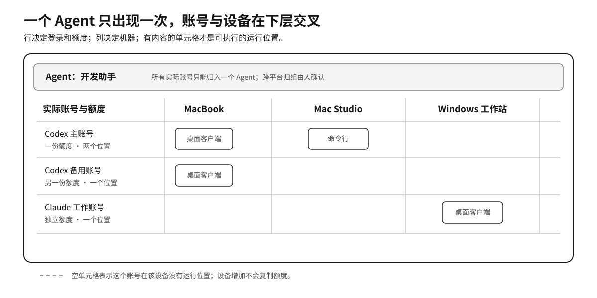
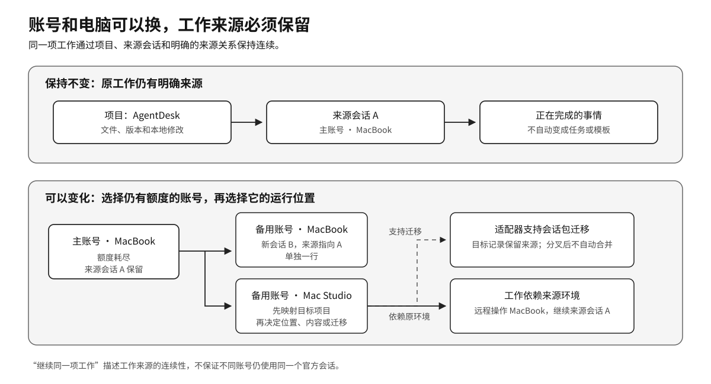
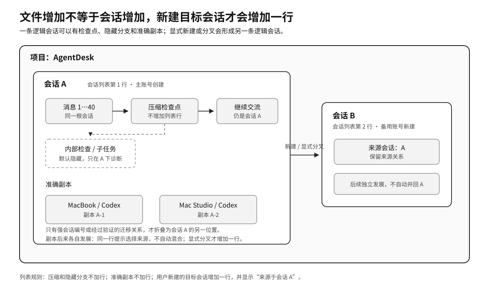
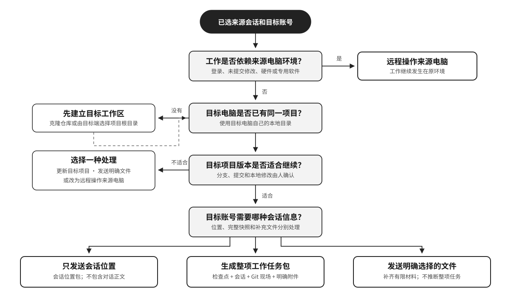
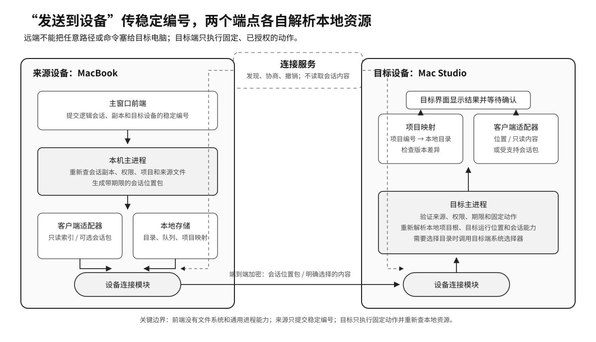
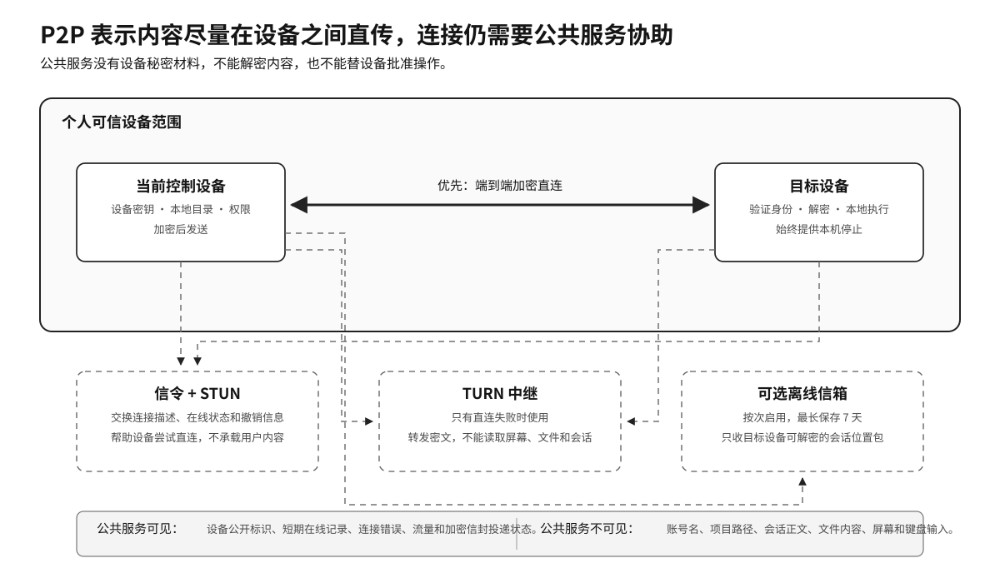

# 跨账号、跨设备的 AI 工作接续

## 摘要

一个人同时使用多个 AI 账号，最直接的麻烦来自登录、切换和不能多开。当前账号额度耗尽时，事情还停在原项目和原会话里；备用账号虽然还有额度，打开后却不知道前面的工作在哪里。电脑增加以后，同一个账号可能登录在几台设备上，一台设备也可能登录多个账号，账号、额度、项目、会话和运行位置随之分散。

AgentDesk 把这些信息重新连在一起。实际账号决定登录和额度，Agent 负责组织长期共同工作的账号，运行位置决定从哪台电脑的哪个客户端打开，项目和会话保存工作的来源。换账号或换电脑时，系统先固定原工作，再选择仍有额度的账号和它的运行位置。会话位置、会话正文、准确副本和新建会话分别处理，任何一种都不会冒充另一种。

本文是仓库中面向使用者的多 Agent / 多账号 / 多设备管理说明，采用 AgentDesk 全部规划功能完成后的目标形态。内容分为工作方式、操作说明和技术方案三部分，也供后续产品与开发验收使用。它不是当前实现真值或阶段放行依据：当前功能状态看 `PRODUCT.md` 与 `FUNCTION_AUDIT.md`，获批实现基准、阶段门禁和未完成的物理双机/公网验收看 `PERSONAL_AGENT_MESH_PLAN.md`。

## 目录

- 第一部分：多个账号和多台电脑怎样接续同一项工作
  - 一、登录和额度为什么会把工作拆开
  - 二、Agent、实际账号和运行位置分别管什么
  - 三、额度耗尽后，保持的是工作来源
  - 四、会话位置、会话内容和会话迁移必须分开
  - 五、压缩、副本和新会话怎样显示
  - 六、跨设备接续怎样选择合适方式
  - 七、AgentDesk 以工作连续性约束所有设计
- 第二部分：操作说明
  - 八、首次建立个人设备网络
  - 九、在主窗口管理全部 Agent 和设备
  - 十、在同一台电脑换账号继续
  - 十一、把工作接到另一台电脑
  - 十二、远程查看和控制自己的电脑
  - 十三、删除账号、Agent 和设备
- 第三部分：AgentDesk 的技术方案
  - 十四、系统必须一直守住的关系
  - 十五、一次“发送到设备”怎样真正执行
  - 十六、账号、项目和会话怎样可靠识别
  - 十七、设备怎样直连，服务端负责什么
  - 十八、权限、离线、冲突和删除怎样处理

## 第一部分：多个账号和多台电脑怎样接续同一项工作

### 一、登录和额度为什么会把工作拆开

AI 客户端通常会在电脑上保存当前登录、设置和历史记录。第二次启动客户端时，它继续读取同一份本地数据，因此两个窗口往往仍是同一个账号。要使用另一个账号，只能退出当前登录，再完成一次登录。切回原账号时，这套过程还要重来。

部分客户端允许启动时指定独立的数据目录。AgentDesk 可以让每个账号入口读取自己的目录：

```text
Codex · 主账号    → /AgentDesk/profiles/codex-main
Codex · 备用账号  → /AgentDesk/profiles/codex-backup
```

从“主账号”入口打开的客户端始终读取第一套本地状态，从“备用账号”入口打开的客户端读取第二套。登录仍在官方客户端内完成，密码和已经登录的本地状态继续由官方客户端保存在本机。客户端只接受固定数据目录时，AgentDesk 按客户端现有方式打开，不替换登录文件。[1][2]

多账号还承担额度接续。假设 Codex 主账号正在修改 AgentDesk，文件改到一半，讨论也进行了很久，此时主账号额度耗尽。备用账号仍有额度，但切换登录只解决了“接下来使用哪个账号”。原项目、原会话、尚未提交的修改和本地运行环境仍留在来源位置。

因此，一次完整接续需要同时找到四样东西：

| 需要确定的内容 | 它解决的问题 |
|---|---|
| 仍可使用的实际账号 | 接下来由哪个登录消耗额度 |
| 原项目 | 文件和代码在哪里 |
| 原会话 | 前面讨论了什么，来源是哪一条对话 |
| 目标运行位置 | 从哪台电脑、哪个客户端入口继续 |

多账号、多设备管理的中心，就是在登录和运行位置变化以后，仍能准确找到原工作。只把账号排列成卡片，或者只给账号加上机器标签，都无法保存这条关系。

### 二、Agent、实际账号和运行位置分别管什么

AgentDesk 把一个人的 AI 工作拆成五类对象。每一类只回答一种问题。

| 名称 | 回答的问题 | 例子 |
|---|---|---|
| Agent | 哪些账号长期作为同一个工作角色管理 | 开发助手 |
| 实际账号 | 使用哪个真实登录，额度属于谁 | Codex 主账号 |
| 运行位置 | 这个账号能从哪台电脑的哪个入口打开 | Mac Studio / Codex 命令行 |
| 项目 | 文件和代码属于哪项工作 | AgentDesk 仓库 |
| 会话 | 围绕一项工作持续进行的对话 | 修复会话列表重复问题 |

Agent 与平台没有绑定关系。“开发助手”可以明确包含 Codex 主账号、Codex 备用账号和 Claude 工作账号。三个账号仍然分别登录、分别计算额度，只是在 AgentDesk 中属于同一个长期工作角色。

一个已经确认归属的实际账号只能属于一个 Agent。需要改变归属时，可以把整个实际账号移动到另一个 Agent，或者把误合并的账号拆开。项目和会话负责表达这个账号做过哪些工作，不通过把同一个实际账号重复挂到几个 Agent 下面表达用途。[3]

同一个实际账号可以有多个运行位置。Codex 主账号同时登录在 MacBook 和 Mac Studio 上，会形成两个运行位置，但仍然只有一份账号额度。一台 MacBook 也可以同时承载主账号和备用账号。



*图 1：行表示实际账号及各自额度，列表示设备，单元格表示可执行的运行位置。这种画法同时显示“一个账号在多台设备”和“一台设备有多个账号”。*

这层关系直接决定界面的汇总方式：

- Agent 在全局总览中只出现一次，设备增加不会复制 Agent 卡片。
- 额度按实际账号去重。同一登录出现在三台设备上，仍显示一份额度。
- 活动按运行位置记录。同一账号在两台设备都有近期活动，两处都可以显示。
- 跨平台账号只接受用户明确归组，不根据名称、项目或目录自动合并。
- 任意账号和 Agent 都可以删除，整个目录允许为空，不保留 Claude、Kimi 或其他平台的默认项。

### 三、额度耗尽后，保持的是工作来源

继续同一项工作，不保证继续使用同一个官方会话。账号 B 新建的对话仍是账号 B 的新对话；它与账号 A 的关系来自项目、来源会话和明确记录的来源编号。



*图 2：原项目、来源会话和正在完成的事情保持可追溯；实际账号和运行位置可以换到本机、另一台设备，也可以留在来源设备远程操作。*

完整判断顺序是：

1. 先选中正在进行的来源会话。
2. 再选择仍有额度、适合接手的实际账号。
3. 系统只列出这个实际账号可以使用的运行位置。
4. 最后选择本机入口或另一台设备。

额度多只说明账号还能使用。另一台电脑可能没有最新代码、必要登录、未提交修改或专用环境，所以设备选择放在账号和工作来源之后。

同一台电脑换账号时，目标新会话通常可以直接读取本机项目和原会话文件。跨设备时，来源电脑上的绝对路径无法在目标电脑直接使用，系统还要处理项目映射、会话内容和本地环境。后面几节分别说明这些差异。

### 四、会话位置、会话内容和会话迁移必须分开

“复制会话信息”只负责定位。它是会话区最醒目的主按钮，并且只有一种格式：

```text
路径: <项目路径；没有项目路径时使用会话文件路径>
坐标: <会话文件路径>#<稳定会话编号>
```

例如：

```text
路径: /Users/me/Documents/AgentDesk
坐标: /Users/me/.codex/sessions/2026/08/10/rollout.jsonl#thread-123
```

“路径”负责找到项目。“坐标”同时给出会话记录文件和稳定会话编号，负责从同一项目的多条对话中找到准确来源。

单选和多选共用同一个按钮、同一种字段。多选只在每组信息前增加序号，不附加账号、设备、标题、模型、摘要、进度、下一步或交接话术。接下来准备做什么，由人复制以后自己说明。[2]

不同客户端保存会话的格式并不相同。AgentDesk 为每种客户端单独实现一个兼容模块，用来读取会话索引、导出内容和验证可迁移的数据。本文把这种兼容模块称为“客户端适配器”。

跨设备能力分成四层，不能用一个“同步”概括：

| 能力 | 实际传输的内容 | 目标端得到什么 |
|---|---|---|
| 会话索引 | 标题、时间、来源设备等只读目录 | 可以在全部设备中搜索和选择 |
| 会话位置 | 加密的会话位置包，技术记录名为 `SessionPointer` | 知道来源项目、来源会话和目标项目映射；不含对话正文 |
| 明确发送的内容 | 用户选择的文件或导出的只读会话内容 | 目标新会话可以读取这些内容，新会话单独成行 |
| 受支持的会话包 | 经客户端适配器验证的会话数据 | 目标客户端得到可验证、可回滚的记录 |

“发送到设备”是“复制会话信息”之后的次级动作。默认只发送会话位置，不生成第二套剪贴板文案，也不会宣称已经发送了完整对话。

目标账号确实需要阅读原对话时，由人明确选择“发送只读会话内容”。AgentDesk 从受支持来源导出只读内容，经设备之间的加密连接传输，保存到目标端明确选择的位置。目标账号据此建立新会话；这份内容不会自动写入官方客户端数据库。

客户端适配器明确支持会话包迁移时，系统还可以发送受支持的会话包。迁移前检查客户端版本、数据格式、附件和冲突；导入失败可以完整回滚。来源格式没有得到明确支持时，AgentDesk 只读取它，不修改客户端的数据库文件。[3]

### 五、压缩、副本和新会话怎样显示

用户在客户端里创建的一条持续对话，本文称为“逻辑会话”。会话列表的一行对应一条逻辑会话，不能按文件数量生成。

上下文压缩会把较早内容整理成检查点，让同一条对话继续。客户端还可能产生守护任务、子任务和内部支线等执行记录。这些记录属于原会话，默认只在诊断时展开。

准确副本表示同一条逻辑会话存在于另一个明确运行位置。只有客户端提供相同的稳定根会话编号，也就是这条持续对话最初的固定编号，或者经过验证的迁移保留了可靠来源，系统才把它折叠到同一行并提供位置选择。

两份准确副本后来都增加了消息，并且系统无法证明两边仍是同一顺序时，这一行标记“副本已分叉”。打开、复制和发送都要求明确选择来源副本，两边内容不自动混合。使用者显式把其中一份转成分叉会话时，它才成为新的会话行，并保留来源关系。

账号 B 显式新建的对话属于另一条逻辑会话。它可以记录“来源于会话 A”，但会在列表中单独占一行。来源会话和目标会话后续各自发展时，系统不会把两边的消息自动混合。



*图 3：压缩检查点、隐藏分支和准确副本不增加会话行；用户新建或显式分叉的目标会话增加一行，并保留来源关系。*

项目身份与会话身份也分别保存。一个项目可以有很多条会话，一条会话可以经历多次压缩，也可以在不同设备上留下准确副本。新增会话文件只能更新来源记录，不能自动创建新项目。

标题相同、项目相同、时间接近都不足以证明两条记录属于同一会话。无法可靠确认时，AgentDesk 保留两条，避免错误折叠后把不同讨论交给错误账号。

### 六、跨设备接续怎样选择合适方式

会话中的绝对路径只在来源电脑上有效：

```text
MacBook:  /Users/me/Documents/AgentDesk
Windows:  D:\Projects\AgentDesk
```

AgentDesk 为同一个项目保存每台设备自己的本地目录。目标电脑收到会话位置后，使用自己的目录打开项目，不执行来源电脑的绝对路径。



*图 4：跨设备接续先判断是否依赖来源环境，再确认目标项目，最后明确选择只发位置、发送只读内容或迁移受支持的会话包。*

目标项目不存在时，可以通过原有仓库方式建立工作区，也可以由目标电脑通过系统目录选择器确认已有目录。项目版本不同时，系统显示分支、提交和本地修改差异，由人决定更新目标项目、发送明确选择的文件或返回来源电脑。

AgentDesk 不会读取对话并猜测“这次需要哪些文件”。文件、素材和临时输出都由人明确选择。完整项目通常继续使用原有版本管理或同步方式，文件传输只处理有限、可核对的内容。

工作依赖来源电脑的登录状态、未提交修改、硬件或专用软件时，远程操作来源电脑更可靠。此时工作继续发生在原项目和原会话中，不需要把环境伪装成能够迁移。

### 七、AgentDesk 以工作连续性约束所有设计

前面的账号归属、会话折叠、目标设备确认和删除规则看起来分属不同功能，其实都在回答同一个问题：换账号、换设备以后，怎样继续原工作，又不把不同身份、不同数据和不同权限混在一起。设计原则只有能够决定具体产品行为时才有意义。

#### 工作来源是主线

一项工作首先由项目、来源会话和未完成的事情确定，不由当前登录或当前电脑确定。实际账号提供登录身份和额度，运行位置提供可以执行工作的本地环境。账号或电脑可以变化，工作来源仍要保持可追溯。

这直接决定了接续顺序：先选来源会话，再选接手账号，最后选该账号的运行位置。如果从设备卡片出发组织全部内容，同一个 Agent 会被机器数量重复，同一件工作也会被拆成几个设备视角。

#### 组织和执行分开

Agent 负责组织长期共同工作的账号，实际账号负责真实登录和额度，运行位置负责在某台设备执行。三者分开以后，同一账号登录三台电脑仍只计算一份额度，一个 Agent 也只显示一次；设备名称只说明“在哪里运行”，不承担账号或 Agent 身份。

这条原则也解释了删除范围为什么要分开。移除一台电脑上的运行位置，不应删除整个实际账号；移除实际账号，不应注销第三方账号；删除 Agent，也不应远程擦除官方客户端的数据目录。

#### 身份合并看证据，远程动作看授权

账号和会话只有在存在稳定编号、经过验证的来源关系或使用者明确确认时才合并。名称、标题、路径和时间只能提供候选。临时保留两条记录会增加一次确认，错误合并却可能把不同账号的额度、不同会话的内容和不同设备的位置长期混在一起。

远程动作遵守另一条同样严格的线：能够看见目录，不等于能够读取正文；能够查看屏幕，不等于能够控制输入；能够接收会话位置，不等于能够接收文件。系统可以在已有证据和授权范围内减少重复操作，但不能用“自动化”替代身份判断和动作许可。

#### 本地事实由本地设备确认

来源电脑最清楚自己的登录、会话文件和项目版本，目标电脑最清楚自己的项目目录、客户端入口和系统权限。因此，来源只发送稳定编号和人明确选择的内容，目标端再查找本地对象并决定能否执行。公共服务帮助设备连接，不能成为账号、项目和会话的权威来源。

界面也要如实表达当前状态：无法取得额度时显示“不支持”或旧缓存，项目无法匹配时要求确认，设备离线时禁用控制，目录删空时显示空状态。系统不补造默认 Agent，不把未确认当成功，也不为了界面整齐隐藏冲突。

这些原则适用于一个人管理自己的可信设备。以后如果增加团队共享、代管账号或集中任务安排，账号归属、数据所有权和授权关系都要重新设计，不能只在现有界面上增加一个成员列表。

## 第二部分：操作说明

### 八、首次建立个人设备网络

个人设备网络只连接同一个人的可信电脑。任何已授权设备都可以成为当前控制台，没有一台设备长期充当总控主机。

#### 建立第一台设备

1. 在 AgentDesk 顶栏打开“设备”。
2. 点击“建立个人设备网络”。
3. 为当前电脑设置容易辨认的名称，例如“随身 MacBook”。
4. 确认本机生成的设备身份。用于证明设备身份的秘密材料由系统安全存储保护，不会显示在普通界面中。
5. 等待 AgentDesk 整理本机已有账号入口。

建立设备网络不会上传官方客户端的登录状态，也不会移动账号、项目和会话文件。

#### 添加账号入口并完成登录

1. 在 Agent 区点击“新增”。
2. 选择 Codex、Claude、Cursor、Kimi 等客户端类型。
3. 设置本地入口名称和数据目录。
4. 点击“打开”，在官方客户端中完成登录。
5. 返回 AgentDesk，重扫账号和会话。

客户端支持独立数据目录时，多套登录可以同时保留。客户端不支持时，界面会明确显示它只能使用客户端现有登录方式。

新识别出的实际账号默认形成独立 Agent。需要把主账号、备用账号和其他平台账号作为一个工作角色管理时，在 Agent 的“管理”中选择“添加已有账号”。这个操作只改变 AgentDesk 的目录关系，不合并登录、额度和官方会话。

#### 添加另一台电脑

1. 在已有设备上打开“设备”，点击“添加设备”。
2. 生成一次性二维码或短码。
3. 在新电脑上选择“加入已有设备网络”。
4. 扫描二维码或输入短码。
5. 两台电脑核对设备名称、系统和身份短码。
6. 在两端确认配对，并分别设置目录、会话、文件、屏幕和输入权限。

系统取得可靠账号标识时，同一个实际账号只增加新的运行位置。无法确认时，每条记录都要求选择：

1. 同一个实际账号在新设备上的位置；
2. 现有 Agent 下的另一个实际账号；
3. 全新的 Agent。

名称、目录、项目和使用时间只帮助判断，不直接触发自动合并。

### 九、在主窗口管理全部 Agent 和设备

主窗口固定为一个 Header、一个 Footer 和三个主面板：顶部 Agent 面板、左下会话列表、右下统一详情。设备、工具、活动和设置从 Header 打开各自的有界弹窗；远程画面只替换右下详情中的隔离 Remote Surface，不新增独立产品主窗口，也不改变顶部 Agent 和左下会话状态。

顶栏设备范围有“全部设备”和具体设备。会话区范围有“当前 Agent”和“全部 Agent”。两组范围互不绑定：

| 设备范围 | 会话范围 | 适合查看什么 |
|---|---|---|
| 全部设备 | 当前 Agent | 一个 Agent 在所有电脑上的账号和会话 |
| 一台设备 | 当前 Agent | 这个 Agent 在指定电脑上的位置和会话 |
| 全部设备 | 全部 Agent | 个人所有设备上的会话搜索 |
| 一台设备 | 全部 Agent | 一台电脑承载的全部账号 |

Agent 卡片只显示一份全局信息，并用“3 个位置 · 2 在线”说明分布。选中 Agent 后，“运行位置”按实际账号分组，显示类似下面的完整选项：

```text
Codex 主账号    — MacBook / 桌面客户端
Codex 主账号    — Mac Studio / 命令行
Codex 备用账号  — MacBook / 桌面客户端
```

打开、诊断、查看路径等动作都使用当前明确选择的运行位置。选择某条逻辑会话时，如果它有多个准确副本，详情区还会要求选择具体来源副本。没有明确副本时，“复制会话信息”和“发送到设备”不会静默选择一个位置。

“复制会话信息”始终是会话区主按钮。“发送到设备”是它旁边的次级按钮。单选和多选都沿用唯一的路径、坐标格式。

#### 整理 Agent 和账号

打开 Agent 卡片的“管理”，可以完成四类整理：修改 Agent 名称、把已有实际账号加入当前 Agent、把一个实际账号整体移动到另一个 Agent、把一个实际账号拆成新的 Agent。

移动或拆分时，实际账号的全部运行位置和同一份额度归属一起移动，不会在两个 Agent 下复制一份。只想移除某台电脑上的入口时，应当移除运行位置，而不是移动整个实际账号。

如果同一个本地入口后来换成另一个登录，运行位置会显示“账号身份已变化”。确认页让使用者把新登录认定为已有实际账号的新位置、当前 Agent 下的另一个实际账号，或者全新 Agent。旧会话继续留在旧账号名下，不会因为入口目录没变而改归新账号。

### 十、在同一台电脑换账号继续

假设 Codex 主账号在 MacBook 上额度耗尽，备用账号也在这台 MacBook 上。

1. 在会话列表中选中正在进行的来源会话 A。
2. 在额度区确认备用账号仍可使用；额度来源不可靠时，界面显示“不支持”或旧缓存，不猜测余额。
3. 点击“复制会话信息”。
4. 在运行位置中选择“Codex 备用账号 — MacBook / 桌面客户端”。
5. 点击“打开”。
6. 在备用账号中打开同一个项目。
7. 新建会话 B，粘贴路径和坐标。
8. 用自己的话说明准备继续处理什么。

会话 B 是一条新会话，并记录来源会话 A。来源文件可读时，目标 Agent 可以按坐标读取前面的讨论；文件已经删除、目录没有权限或来源格式不受支持时，AgentDesk 会明确显示原因。

来源会话 A 继续保留在主账号中。会话 B 后续独立发展，不会自动把新消息写回 A。

### 十一、把工作接到另一台电脑

跨设备操作先选账号，再选这个账号的运行位置，设备不会排在账号前面。

1. 在会话列表中选中来源会话 A，并确认具体来源副本。
2. 点击“发送到设备”。
3. 选择准备接手的实际账号，例如 Codex 备用账号。
4. 从这个账号的可用位置中选择“Mac Studio / 桌面客户端”。
5. 查看目标电脑匹配到的项目目录。
6. 存在多个候选目录时，由目标电脑通过系统目录选择器确认。
7. 查看分支、提交和本地修改差异。
8. 选择会话传输方式，然后点击“发送并打开”。

目标电脑收到后显示一张接收卡，列出来源设备、来源账号、来源会话、目标账号、目标运行位置和本次传输内容。有人值守时，目标电脑确认后再打开；无人值守时，只执行预先允许的动作。点击“打开”后，AgentDesk 打开已经登记的目标账号入口，并准备好路径、坐标或只读内容文件的位置。接下来要做什么，由人直接说明，不生成交接话术。

#### 只发送会话位置

默认方式只发送会话位置包。目标电脑得到来源设备、来源会话、稳定坐标、项目对应关系和版本提示，不得到完整对话正文。

这个方式适合目标电脑已经能够访问同一会话记录，或者只需要准确知道来源位置的情况。目标端会明确显示“仅收到会话位置”，不会出现“会话迁移完成”的文案。

#### 明确发送只读会话内容

目标新会话需要阅读原对话时，选择“同时发送只读会话内容”。确认页显示内容来源、大小和目标保存位置。导出文件保留原消息顺序和来源坐标；附件只有经过明确选择才会一同发送。传输完成后，接收卡给出本地只读文件的位置，目标账号据此建立会话 B。会话 B 单独成行，显示“来源于会话 A”。

会话内容不会进入离线信箱，也不会自动写入官方客户端数据库。

#### 迁移受支持的会话包

只有目标客户端适配器明确支持时，界面才显示“迁移会话包”。导入前会检查客户端版本、格式、附件、目标冲突和回滚条件。

目标记录保留来源设备和来源会话编号。适配器能证明它仍使用同一个稳定根会话编号时，目标记录可以作为会话 A 的另一个准确副本；目标客户端建立了新的根会话编号时，它成为新会话 B，并显示来源关系。两端后来发生分叉时不会自动合并。

#### 发送明确选择的文件

目标项目缺少未提交文件、素材或临时输出时，点击“发送文件”，从来源电脑选择需要的文件。受支持的文件传输不发送整个文件夹；目标端由用户明确选择保存目录。

同名文件绝不覆盖，系统会使用安全改名保留两份。文件按块校验，断线后从已经确认的位置继续；目录、危险符号链接、路径穿越和目标磁盘空间不足都会在写入前停止。

#### 目标设备离线

默认情况下，发送任务进入来源设备的本地加密队列，来源设备下次与目标同时在线时继续。

只发送会话位置时，还可以按次勾选“允许短期离线投递”。系统把目标设备才能解开的会话位置包密文保存到服务端信箱，最长七天，送达或过期后删除。文件、只读会话内容、会话包、剪贴板和屏幕数据不进入信箱。

### 十二、远程查看和控制自己的电脑

工作依赖来源电脑的登录状态、未提交修改、硬件或专用软件时，直接操作来源电脑最稳妥。

1. 打开顶栏“设备”。
2. 选择一台或多台在线设备。
3. 点击“远程查看”，关闭设备弹窗并在右下详情进入隔离 Remote Surface。
4. 首次使用时，在目标电脑完成系统要求的屏幕录制权限。
5. 需要操作时，点击目标画面并请求“控制”。
6. 目标电脑确认后，完成系统要求的输入控制权限。

多台设备可以同时显示，只有带明显边框的当前设备接收键盘和鼠标。切换目标时，系统先向上一台设备发送“释放全部按键”，再允许新设备接收输入。其他画面保持低频更新，用于观察状态。

右下 Remote Surface 始终提供“返回工作台”“暂停输入”“断开控制”和“全部停止”。返回工作台会先释放输入，可保留仅查看连接和 Header 活动提示；断开才结束媒体连接。目标电脑持续显示来源设备名称、当前是查看还是控制，并提供本机停止按钮。

#### 有人值守和无人值守

| 模式 | 连接条件 | 适用情况 |
|---|---|---|
| 有人值守 | 每次由目标电脑确认查看或控制 | 第一次连接、临时协助、高风险设备 |
| 无人值守 | 预先指定允许的来源设备、权限和有效时间 | 自己长期放置的工作站或算力设备 |

无人值守需要单独开启，不能从“允许查看目录”自动升级。目标设备仍然显示连接状态，并可以随时关闭无人值守或撤销来源设备。

设备只有在可接收连接时才显示在线：

| 目标状态 | 行为 |
|---|---|
| AgentDesk 正在桌面会话中运行 | 可以按已授权能力连接 |
| 安装并开启无人值守端点 | 可以按预先授权连接，仍受系统安全边界限制 |
| 锁屏或切换用户 | 查看或控制暂停，不能绕过登录界面 |
| 睡眠 | 状态变为“睡眠”，连接结束或暂停 |
| 关机 | 离线；AgentDesk 不承诺跨硬件远程唤醒 |
| AgentDesk 退出且未开启无人值守 | 离线 |

macOS 的屏幕录制和辅助功能权限，以及 Windows 对普通程序与管理员程序之间的输入限制、管理员授权提示（UAC）和登录界面，继续由操作系统决定。AgentDesk 不绕过这些限制。

### 十三、删除账号、Agent 和设备

删除操作按影响范围分开，所有范围都允许删到零。

| 操作 | AgentDesk 中发生什么 | 本地和第三方数据 |
|---|---|---|
| 移除运行位置 | 删除一个明确的设备与客户端入口关系 | 其他设备位置保留；官方数据默认保留 |
| 移除实际账号 | 从目录中删除一个实际账号及其全部运行位置 | 同一 Agent 的其他账号保留；本地入口数据保留；第三方账号不注销 |
| 删除 Agent | 删除 Agent、所含实际账号、运行位置关系和远端缓存索引 | 本地账号入口的数据目录保留，但默认不再识别成新 Agent；官方数据不删除 |
| 撤销设备 | 删除设备信任、远端缓存、未完成传输和密钥关系 | 目标电脑本地客户端与项目保留 |

“本地入口数据保留”表示 AgentDesk 不再展示这个对象，也不会在下一次扫描时立即把它重新创建出来；以后主动重新添加时，才重新启用原本机入口。

移除 Agent 的最后一个实际账号时，确认页明确显示“该 Agent 将从 AgentDesk 消失”。删除最后一个 Agent 后，主界面显示真实空状态和“新增 Agent”，不会补回 Claude、Kimi、Codex 或其他默认项。

删除和撤销会产生签名删除记录。长期离线设备重新上线后先应用删除记录，不能用旧目录把对象恢复出来。目标电脑上的本地账号入口数据不会被远端静默删除，而是保持不展示的状态。

以后主动重新添加同一账号时，系统仍要求明确选择“已有登录的新位置”“现有 Agent 的另一账号”或“全新 Agent”。旧删除记录不会自动恢复原关系。

当前控制设备也可以离开个人设备网络并回到纯本地 AgentDesk。即使它是最后一台在线管理设备，系统也只说明恢复影响，不以“必须保留一台”为由阻止。

## 第三部分：AgentDesk 的技术方案

### 十四、系统必须一直守住的关系

界面使用 Agent、实际账号、运行位置、项目和会话这些名称。技术实现为它们分别保存稳定记录：

下面保留两个代码中的名称。`Profile` 表示某个客户端的一套独立本地数据目录；`Slot` 表示一个实际账号在某台设备上的运行位置。它们只在技术方案中使用。

| 界面对象 | 内部记录 | 主要责任 |
|---|---|---|
| Agent | `AgentIdentity` | 全局展示和长期组织 |
| 实际账号 | `AccountBinding` | 平台登录身份、额度归属和识别状态 |
| 设备 | `Device` | 设备身份、在线状态、权限和撤销状态 |
| 运行位置 | `AgentSlot` | 实际账号、具体设备、Profile 和客户端入口 |
| 项目 | `ProjectIdentity` + 本地映射 | 同一项目及每台设备自己的项目根目录 |
| 逻辑会话 | `ConversationIdentity` | 会话列表中的一行 |
| 会话副本 | `SessionReplica` | 某台设备、某个 Slot 上的可操作来源 |
| 原始记录 | `PhysicalSessionRecord` | 文件或数据库中的物理载体，只用于解析和诊断 |

整个系统有几条不能被界面便利破坏的关系：

1. 一个 Agent 可以有多个实际账号；一个已归属的实际账号只能属于一个 Agent。
2. 一个实际账号可以有多个运行位置；一个运行位置只属于一台设备和一个本地 Profile。
3. 额度属于实际账号，活动属于运行位置。
4. 一条逻辑会话可以有多个准确副本；每次打开、复制和发送都必须落到一个明确副本。
5. 上下文压缩只增加检查点，内部执行只增加隐藏分支。
6. 用户新建或显式分叉会产生新的逻辑会话，并保留来源关系。
7. `SessionPointer` 默认只包含位置和稳定编号，不包含对话正文。
8. 任何远程动作最终都由目标设备重新查找本地对象，远端不能指定任意程序、参数或绝对路径。

个人设备网络的目录、传输队列和远端缓存保存在独立本地数据库中。原有账号 Profile、官方客户端数据和会话文件继续留在各自位置。密码、浏览器登录状态和访问凭据不进入这份数据库。

会话位置包至少记录协议版本、传输编号、来源设备、来源逻辑会话、明确副本、项目、来源坐标、目标实际账号、目标运行位置、创建时间和过期时间。这里保存的都是稳定编号和定位信息，不包含对话正文。生成位置包以后，来源设备再为它签名并按目标设备加密。

### 十五、一次“发送到设备”怎样真正执行



*图 6：前端只提交稳定编号；来源主进程重新解析会话并生成加密位置包；目标主进程重新解析本地项目和客户端入口，再把结果交给界面确认。*

一次发送经过以下过程：

1. 主窗口前端提交逻辑会话编号（`conversationId`）、明确副本编号（`replicaId`）和目标运行位置编号。
2. 来源设备主进程重新查找会话副本、实际账号、项目映射、权限和来源文件。
3. 主进程生成带创建时间和过期时间的 `SessionPointer`。
4. 设备连接模块验证目标设备身份和当前权限，并建立加密通道。
5. 目标连接模块验证来源设备、消息版本、期限和动作类型。
6. 目标主进程重新查找本地项目根、目标 Slot 和客户端能力。
7. 需要确认项目目录时，目标主进程打开目标电脑自己的系统目录选择器。
8. 目标界面显示收到的是位置、只读内容还是受支持会话包，并等待最终打开或导入确认。

主窗口前端没有文件系统和通用进程能力。它不能直接发送目标程序路径、启动参数、环境变量、网址或任意文件路径。目标端只接受固定动作，例如打开已登记入口、接收会话位置、接收文件、查看屏幕和输入控制。

技术组件各自承担明确责任：

| 组件 | 责任 |
|---|---|
| 主窗口前端 | 选择 Agent、来源会话、目标账号和运行位置；提交稳定编号 |
| 主进程 | 权限判断、本地对象重新解析、系统选择器、客户端启动 |
| 客户端适配器 | 读取只读索引、生成稳定会话编号、导出内容、验证会话包 |
| 设备连接模块 | 设备认证、协议协商、队列、重试、加密通道和状态 |
| 操作系统适配器 | 屏幕采集、输入控制、显示器坐标和权限状态 |
| 右下详情内的隔离 Remote Surface | 由专用沙箱 WebContentsView 承载画面和输入，不把高风险能力交给普通主窗口前端 |

### 十六、账号、项目和会话怎样可靠识别

#### 实际账号

客户端能提供稳定账号标识时，每台设备使用个人设备网络中的共同密钥，把原始标识转换成只在这个设备网络中有效的固定结果。这种带密钥转换称为 HMAC。

同一官方账号在 MacBook 和 Mac Studio 上会得到相同结果，因此自动归入同一个实际账号。另一个人的设备网络使用不同密钥，无法用这个结果跨网络比较，也不能从结果还原原始账号标识。[3]

客户端无法提供稳定标识时，账号保持待确认状态。显示名称、电子邮件文字、目录名和项目名只出现在确认界面中，不参与自动认定。

同一本地入口换成另一个登录时，运行位置标记为“账号身份已变化”。旧会话继续属于旧账号，新扫描到的会话等待确认后归入新账号，不根据目录没变而静默改归。

额度快照按实际账号保存。多个运行位置同时提供数据时，系统优先使用最新、成功且适配器版本可信的来源。数值冲突时显示“来源不一致”，不会取最大值。没有可靠来源的平台显示“不支持”。

#### 项目

项目身份表示同一份工作内容，本地映射表示它在某台设备的具体目录。系统可以使用整理后的仓库远程地址、仓库识别信息和已有工作区记录提出候选映射。

项目没有仓库信息、存在多个候选目录或版本明显不同时，候选不会直接生效。目标电脑通过自己的系统目录选择器确认项目根目录。客户端报告的当前工作目录（技术字段名 `cwd`）、目录名和绝对路径只能提供候选，不能单独创建或合并项目。

#### 会话

客户端稳定根会话编号是最强会话标识。受支持迁移产生的新记录还会保存来源设备和来源会话编号。只有这些强关系成立时，多设备记录才可能作为同一逻辑会话的准确副本。

标题、项目、时间和路径相似只提供搜索提示。证据不足时保留独立会话。新建目标会话会得到新的 `ConversationIdentity`，并通过来源会话字段（`originConversationId`）指向原会话，不与原会话的后续消息自动合并。

每台设备只写自己拥有的运行位置、活动、额度来源和会话副本事实，其他设备缓存。Agent 归组、账号归属、合并、拆分和删除通过签名目录事件同步，不依赖一台永久主机。

### 十七、设备怎样直连，服务端负责什么

P2P 表示屏幕、输入、文件和会话数据优先在设备之间直接传输。两台设备位于不同家庭网络、公司网络或运营商网络时，建立连接仍需要公共服务协助。



*图 7：可信设备优先端到端加密直连；信令和 STUN 帮助连接；TURN 只在直连失败时转发密文；可选离线信箱只保存目标设备可解开的短期会话位置。*

这里的“端到端加密”表示内容在来源设备上加密，到目标设备上才解密。直连和 TURN 中继传输的是同一份密文，经过哪条网络路径都不会把内容交给公共服务读取。

三个网络服务分别解决不同问题：

- **信令服务**交换邀请、连接描述、在线状态、重连和撤销信息。
- **STUN 服务**帮助设备了解公网一侧的网络地址，从而尝试直接连接。
- **TURN 服务**在直连失败时转发已经加密的数据。

每台设备配对时生成一对身份材料：一份可以公开，用于识别设备；另一份只留在本机，用于证明设备身份。设备使用本机秘密材料为连接请求生成数字签名。对方验证签名、成员状态和权限以后，才接受连接。

连接服务和中继没有设备秘密材料，不能伪装成受信任设备，也不能解密传输内容。服务端只保存设备公开标识、短期在线记录、一次性邀请校验、签名撤销状态、连接错误和中继用量。

账号名称、项目路径、会话正文、文件内容、屏幕和键盘输入不进入普通服务端记录。按次启用离线信箱时，服务端只额外保存目标设备可解密的 `SessionPointer` 密文和投递状态。

已经建立的直连在信令服务短暂不可用时可以继续。TURN 不可用时仍尝试直连；直连失败后明确显示没有可用回退路径，不伪造在线或发送成功。

### 十八、权限、离线、冲突和删除怎样处理

权限按实际能力逐项分开：

| 权限 | 允许的动作 |
|---|---|
| 查看目录 | 查看设备、Agent 和会话索引 |
| 接收会话 | 接收会话位置；接收只读内容另行授权 |
| 接收文件 | 接收明确选择的文件或剪贴板内容 |
| 查看屏幕 | 接收目标电脑的画面 |
| 控制输入 | 向当前目标发送键盘和鼠标输入 |
| 打开入口 | 在目标电脑打开已经登记的客户端入口 |
| 管理 | 修改账号归属、项目映射、设备信任和无人值守设置 |

每项能力仍然独立授权。查看目录不会自动获得屏幕，查看屏幕不会自动获得输入，输入控制不会自动获得无人值守或设备管理。操作系统权限继续构成第二层限制。

连接中断时，输入立即冻结，目标端释放全部按键。网络恢复后重新认证，并沿用原权限，不会因为重连获得更高权限。文件按已经验证的分块继续，会话位置按传输编号去重。

设备事实和目录事实分开处理：

- 某台设备只写自己的 Slot、活动、额度来源和会话副本。
- 目录管理设备提交 Agent 创建、归组、拆分和删除事件。
- 不同字段的并发普通编辑可以稳定合并。
- 同一归属关系同时被修改时，保留候选结果并要求确认。
- 删除记录优先于更旧的重命名、库存和归属事件。

删除记录又称 tombstone。它保存对象编号、删除时间和签名，不保存账号密码和会话正文。所有已配对设备确认删除前，记录不会过早清理。离线设备上线后必须先应用 tombstone，不能让已删除 Agent 复活。

常见故障都有明确结果：

| 故障 | 系统行为 |
|---|---|
| 目标设备离线 | 显示最后快照；控制禁用；发送进入允许的等待方式 |
| 项目映射失效 | 要求目标端重新选择，不猜测路径 |
| 会话来源消失 | 标记来源失效，不打开旧位置 |
| Profile 换号 | 标记身份变化，暂停旧账号聚合，等待确认 |
| 文件校验失败 | 删除临时文件，保留可重试任务 |
| 磁盘空间不足 | 写入前停止并报告所需空间 |
| 同一设备被两处请求控制 | 只保留一个输入控制者，其他连接降为查看 |
| 同一会话的两个副本各自发展 | 同一会话行标记“副本已分叉”；保留两份记录；每次操作要求选择来源副本 |
| 设备被撤销 | 立即断开、清除远端缓存并拒绝重连 |
| 设备丢失或被盗 | 从另一台可信设备撤销；以后拒绝连接；离线设备上的本地数据仍依赖操作系统磁盘加密保护 |
| 协议版本不兼容 | 显示需要更新；关闭不受支持的动作；不会通过降低权限检查强行连接 |

最终验收以五个可观察结果为准：同一实际账号出现在多台设备时额度只计算一次；额度耗尽后可以换账号继续，原项目和来源会话仍可追溯；压缩不会增加会话行，新建目标会话一定单独成行；所有远程动作都落到明确设备和运行位置，公共服务只能接触必要记录和密文；账号、Agent 与设备都可以删到零，离线旧记录不能把它们恢复出来。

## 参考文献

[1] AgentDesk. (2026). *[产品定义](./PRODUCT.md)*. https://github.com/shuqianglin1997/agent-desk/blob/main/docs/PRODUCT.md

[2] AgentDesk. (2026). *[全功能梳理](./FUNCTION_AUDIT.md)*. https://github.com/shuqianglin1997/agent-desk/blob/main/docs/FUNCTION_AUDIT.md

[3] AgentDesk. (2026). *[Personal Agent Mesh 系统规划基准](./PERSONAL_AGENT_MESH_PLAN.md)*. https://github.com/shuqianglin1997/agent-desk/blob/main/docs/PERSONAL_AGENT_MESH_PLAN.md
