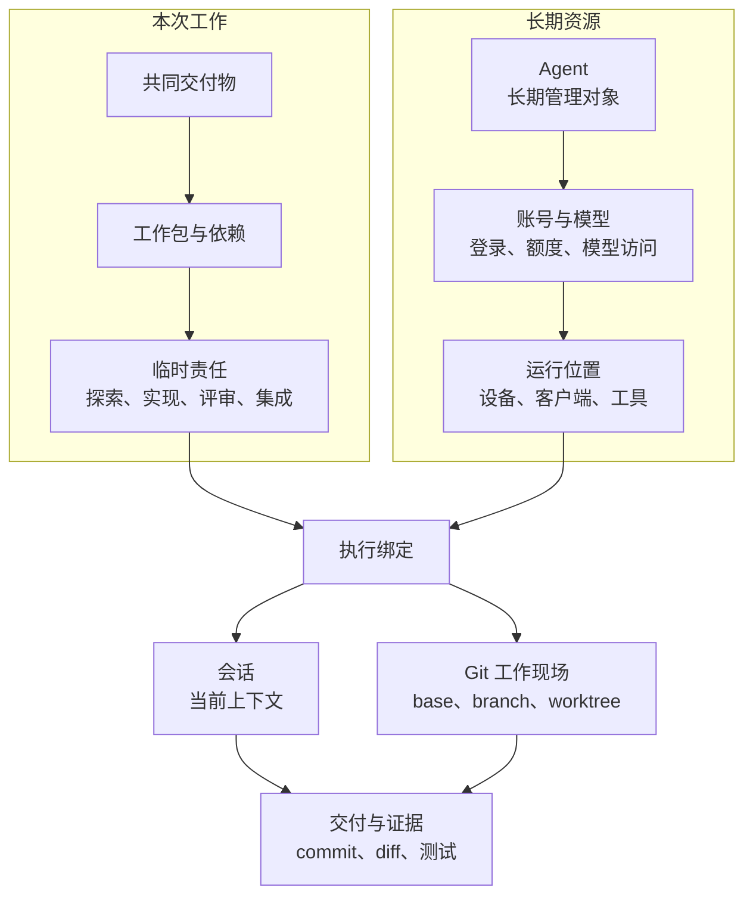
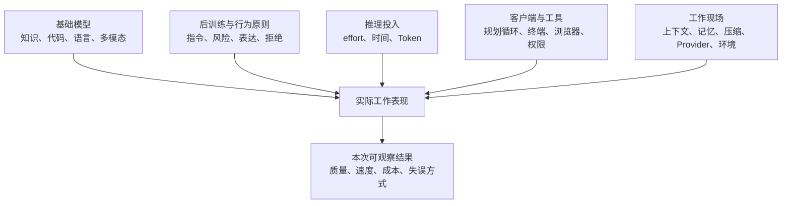
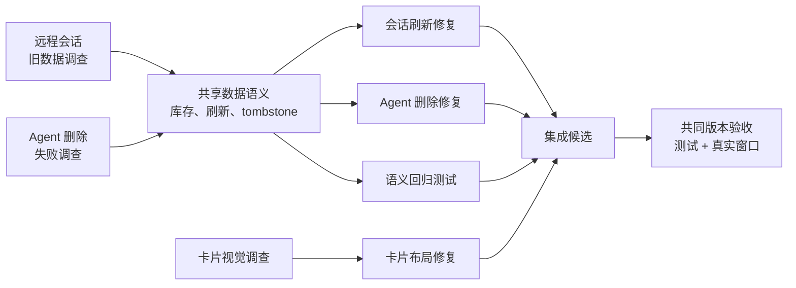
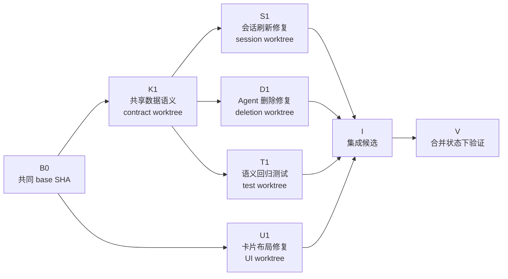
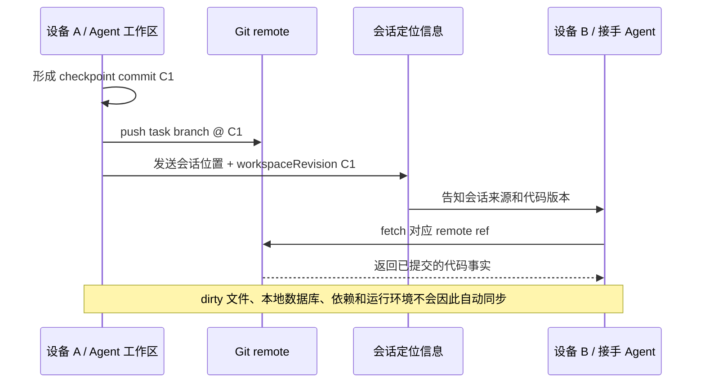
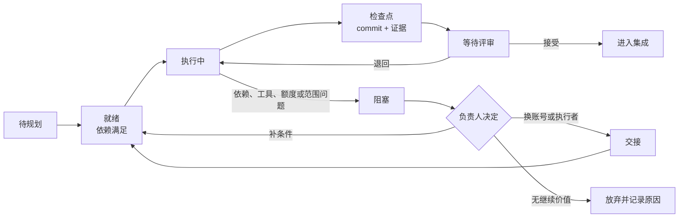

# 把多个 Agent 组织成一支队伍：多账号、多模型与 Git 协作的实践框架

> 状态：DRAFT FOR OWNER REVIEW
>
> 版本：0.5
>
> 日期：2026-08-13
>
> 文档性质：多 Agent 管理与编排的研究性经验文章，不是 AgentDesk 当前功能说明，也不是产品实施授权。

## 摘要

一个人同时使用多个 Agent 和账号时，需要管理三类不同事物：手里有哪些可用资源，这次工作由哪些相互依赖的责任组成，以及每项工作目前留下了什么可接续、可验证的事实。模型、推理投入和工具条件决定候选者，账号提供模型访问与额度，设备和客户端提供运行位置，会话保存当前上下文，Git 保存代码工作的基线与变化；这些对象只有被绑定到同一项任务，才形成一次完整派工。

本文沿用一个具体例子：使用多个账号同时处理“远程会话仍显示旧数据”“不需要的 Agent 无法删除”和“Agent 卡片视觉异常”。共同交付物是一个可以继续测试的集成版本：远端库存能够刷新，删除结果不会被旧库存复活，卡片在少量和大量 Agent 下都能稳定显示，相应回归与真实界面检查通过。

全文依次处理七个问题：

1. 当前有哪些 Agent、账号、模型、额度和运行位置；
2. 共同交付物需要拆成哪些工作包；
3. 工作包之间怎样依赖，哪些可以并行；
4. 每项责任由哪个 Agent、账号和执行现场承担；
5. Git 怎样保存基线、分支、交接和集成关系；
6. 运行中怎样处理阻塞、换账号、换设备和重新分配；
7. 怎样验证、采纳，并用结果更新下一次安排。

这些问题涉及三个层次，不能相互代替：



*图 1：上半部分是长期拥有的资源，下半部分是本次工作的责任。执行绑定选择其中一个 Agent 的具体账号和运行位置，并为它建立会话与 Git 工作现场。账号不是岗位，会话也不是代码状态。*

## 文档边界

本文与仓库中其他文档的职责不同：

- [`PERSONAL_AGENT_MESH_PLAN.md`](./PERSONAL_AGENT_MESH_PLAN.md) 是 Personal Agent Mesh 的产品、领域、安全和实施权威；
- [`PRODUCT.md`](./PRODUCT.md) 记录 AgentDesk 当前产品事实和拒绝清单；
- [`AGENTDESK_MULTI_ACCOUNT_MANAGEMENT_ARTICLE_V4.md`](./AGENTDESK_MULTI_ACCOUNT_MANAGEMENT_ARTICLE_V4.md) 说明一个人怎样管理多账号、多设备和工作连续性；
- 本文讨论人在外部工具和工程环境中怎样管理多个 Agent 的工作关系。

AgentDesk 当前不承担 worktree、任务队列或自动 Agent 流程编排。本文提到的 Git 和协作方式不改变这一边界。如果以后希望把其中一部分做成产品能力，应另行完成产品立项、交互、安全和实施审阅。

## 一、先盘点可以使用的 Agent 与账号

派工以前，先要确认当前有哪些可用资源。这里有六个容易混淆的对象：

| 对象 | 生命周期 | 回答的问题 |
|---|---|---|
| Agent | 长期 | 哪个可持续识别的工作单元关联了哪些账号与运行位置，并积累了怎样的合作记录 |
| 账号 | 长期，但额度会变化 | 使用哪个真实登录，可以访问哪些模型和订阅额度 |
| 运行位置 | 设备和客户端存在期间 | 这个账号可以在哪台设备、哪个客户端和哪些工具中运行 |
| 任务责任 | 只属于本次工作 | 当前由谁负责探索、实现、评审或集成 |
| 会话 | 本次执行期间 | 当前 Agent 已经掌握哪些讨论和上下文 |
| Git 工作现场 | 本次工程任务期间 | 代码基于哪个版本，实际修改发生在哪条分支和哪个 worktree |

任务责任是临时的，Agent 和账号不是。一个 Agent 可以在不同任务中承担不同责任，也可以关联多个平台账号；账号额度耗尽后，责任可以交给另一个账号继续，但任务、branch 和已经形成的证据不应因此重新定义。

### 1.1 资源账记录当前可用条件

资源账不评价谁“总体最强”，只记录本次可能影响派工的事实：

| Agent | 账号/订阅 | 可用模型型号与 effort | 额度状态 | 运行位置 | 工具与权限 | 相关上下文 | 当前状态 |
|---|---|---|---|---|---|---|---|
| Agent A | Codex 主账号 | 按实际账号填写 | 保留给集成 | Mac Studio / Codex | 仓库、终端、测试 | 掌握整体设计 | 可用 |
| Agent B | Claude 工作账号 | 按实际账号填写 | 可执行长任务 | MacBook / Claude Code | 仓库、终端 | 熟悉 Mesh 代码 | 可用 |
| Agent C | 多模态账号 | 按实际账号填写 | 可用 | MacBook / 对应客户端 | 截图、浏览器 | 尚无代码上下文 | 可用 |

表中的 A、B、C 只是长期身份，不是固定岗位，也不代表模型推荐。真正派工时填写实际账号、模型 ID、effort、剩余额度和运行位置。资源账的作用是暴露约束：某个账号可能能力合适但额度不足，某个模型可能很强但所在客户端没有终端权限，某个 Agent 可能已经掌握大量上下文但正在承担另一项工作。

### 1.2 Agent 画像描述工作表现，而不只是品牌

“这是 GPT”或者“这是 Claude”不足以说明它会怎样完成工作。真实表现由多个条件共同形成：



*图 2：模型品牌只是输入之一。改变 effort、客户端、工具权限或上下文策略，都可能改变同一模型的工作表现。*

这也是为什么模型经验必须绑定版本和运行条件。网页里的同一模型、编码 CLI 里的同一模型，以及拥有浏览器或计算机控制工具的同一模型，不能直接当成一个稳定不变的成员。

### 1.3 画像需要保留哪些维度

一个综合跑分很难支持派工。更有用的是观察六种相互独立的工作性质：

| 维度 | 观察重点 | 常见误判 |
|---|---|---|
| 问题判断 | 能否区分事实、假设和约束，能否找到真正瓶颈 | 把表达完整当成判断正确 |
| 执行纪律 | 能否遵守范围、可靠操作工具、避免无关修改 | 把生成代码速度当成执行稳定 |
| 状态保持 | 长任务中能否维持目标、接口和已知决定 | 把上下文窗口长度当成可靠记忆 |
| 失败恢复 | 工具失败、测试失败或证据不足时怎样调整 | 只统计最终成功，不看恢复代价 |
| 交接质量 | 能否留下事实、改动、验证和未决问题 | 把长篇解释当成完整交接 |
| 经济性 | 达到可交付结果所需的时间、Token 和人工返工 | 只比较每百万 Token 单价 |

[Artificial Analysis](https://artificialanalysis.ai/methodology/intelligence-benchmarking)、[METR Time Horizons](https://metr.org/time-horizons/) 和 [Terminal-Bench](https://www.tbench.ai/leaderboard/terminal-bench/2.1) 分别测量综合能力、可独立完成的任务时长和终端执行。它们能提供初始信号，却不能互相替代，也不能直接代表某个 Agent 在本地客户端和仓库里的完整表现。

### 1.4 企业取向主要改变行为边界

预训练更直接地影响知识、语言、代码和多模态表征；后训练、系统规则和产品默认值则明显影响指令遵循、风险处理、表达方式、工具行为与拒绝边界。

OpenAI 的 [Model Spec](https://openai.com/index/our-approach-to-the-model-spec/) 强调指令层级、真实性、人的自主权、可控性和副作用；Anthropic 的 [Claude Constitution](https://www.anthropic.com/constitution) 讨论安全、伦理、合规和“真正有帮助”的行为目标。它们有助于理解模型行为倾向，但描述的是设计原则，不是每次运行的能力保证。

因此，公司价值观可以进入 Agent 画像，却不适合直接换算成“智力分”。从几次回答的语气判断底层能力同样不可靠，因为我们看到的性格还混合了系统提示、检索工具、权限和当前上下文。

### 1.5 型号、推理和账号档位是三个不同轴

日常所说的“高档”和“低档”可能指三件不同的事：

| 轴 | 主要改变什么 | 不能直接推出什么 |
|---|---|---|
| 模型型号或尺寸档位 | 基础能力、速度、价格、模态和上下文等产品规格 | 同一家族的大型号在每类任务上都更经济 |
| reasoning effort / thinking level | 同一模型在本次请求中投入的推理、工具调用和检查 | 已经换成另一款基础模型 |
| 账号或订阅档位 | 可访问模型、用量、并发、速率和产品功能 | 同一模型 checkpoint 的回答能力必然改变 |

low、medium、high、xhigh、max 属于第二类，更接近本次任务投入多少推理时计算资源，而不是从初级到高级的永久职级。更高 effort 可能增加推理、工具调用和检查，也会增加延迟、Token 和过度分析的可能。模型型号适合按任务难度选择，账号档位则首先是容量和访问约束；三者需要分别记录。

不同厂商同名档位并不等价。Anthropic 明确说明 effort 会影响思考、正文和工具行为；OpenAI 将 reasoning effort 与部分运行模式分开；DeepSeek 某些 API 档位会映射到同一实际级别；xAI 的部分多 Agent 模式会用 effort 改变参与 Agent 数量。[Anthropic effort](https://platform.claude.com/docs/en/build-with-claude/effort)、[OpenAI model selection](https://developers.openai.com/api/docs/guides/latest-model)、[DeepSeek thinking mode](https://api-docs.deepseek.com/guides/thinking_mode/)、[xAI multi-agent](https://docs.x.ai/developers/model-capabilities/text/multi-agent)

推理档位因此需要和模型 ID 一起进入合作记录。它适合按照判断杠杆、错误代价和验证难度调整，而不是默认所有 Agent 都使用最高档。

### 1.6 模型家族只提供初始假设

截至 2026-08-13，公开资料可以提供一些值得优先验证的岗位倾向，但还不能代替自己的任务数据。

| 模型家族 | 值得优先验证的倾向 | 最容易产生的误判 |
|---|---|---|
| GPT | 通用协调、工具执行、代码和跨领域整合；型号与 effort 形成能力—成本梯度 | 把 Codex 等 harness 的收益全部归给基础模型 |
| Claude | 长代码库理解、长周期实现、研究写作和独立审查 | 把审慎、解释充分等同于一定正确；忽略高 effort 的过度思考 |
| Gemini | 原生多模态、长文档、图像与高吞吐子任务 | 把能理解截图等同于具有稳定 UI 审美和产品判断 |
| Grok | 实时 Web/X 搜索、时效性研究和大范围线索发现 | 把检索到最新内容等同于基础知识可靠；忽略来源噪音 |
| Kimi | 中文知识工作、开放权重、长上下文、原生多模态和自主部署 | 把开放权重等同于低部署成本或无许可证约束 |
| DeepSeek | 低成本文本推理、批量执行、测试生成和私有部署 | 用旧检查点评测代表新版本；忽略与原生多模态模型的岗位差异 |

对应的官方资料包括 [OpenAI models](https://developers.openai.com/api/docs/models)、[Claude models](https://platform.claude.com/docs/en/about-claude/models/overview)、[Gemini models](https://ai.google.dev/gemini-api/docs/latest-model)、[Grok 4.6](https://docs.x.ai/developers/grok-4-6)、[Kimi K3](https://github.com/MoonshotAI/Kimi-K3) 和 [DeepSeek current models](https://api-docs.deepseek.com/quick_start/pricing/)。这些资料确认规格和厂商定位；横向岗位判断仍应由独立评测和内部任务补足。

### 1.7 合作记录比第一次印象更重要

公开资料形成的是先验画像。真正合作以后，需要把“这个模型很强”逐渐改写成更具体的认识，例如：它在什么任务和配置下稳定、常怎样偏离边界、失败是否容易发现、需要多少提示与返工、与哪种评审方式配合更好。

画像的基本记录单位不是品牌，而是：

```text
模型 checkpoint
+ effort
+ 客户端/harness
+ 工具与权限
+ 上下文策略
+ Provider 与日期
+ 任务类型和验证结果
```

只要其中重要条件发生变化，过去的结论就应降低置信度，而不是继续当作稳定性格。

## 二、先定义共同交付物，再拆工作包

资源账说明“可以使用谁”，但还不能直接产生派工。下一步先定义共同交付物和验收边界，再把它拆成能够单独交付证据的工作包。

贯穿示例的共同交付物不是三份分析，而是同一个可测试版本：

| 结果范围 | 可观察结果 | 验收证据 |
|---|---|---|
| 远程会话 | 连接、重连或显式刷新后读取最新库存，不继续展示旧快照 | revision/内容推进测试和真实双端路径 |
| Agent 删除 | 移除运行位置、账号或整个 Agent 后状态持久，旧库存不会使其复活 | 关闭重开、tombstone 和库存回放测试 |
| 卡片视觉 | 少量卡不拉伸，大量卡可滚动，内容不重叠且选中项可见 | 固定窗口尺寸下的几何断言与截图检查 |
| 最终集成 | 三类变化在同一个 commit 上同时成立 | 完整相关测试和真实产品路径 |

### 2.1 工作状态决定临时责任

同一个问题在不同阶段需要不同责任。任务责任属于本次工作，不是某个 Agent 的永久头衔。

| 工作所处状态 | 当前责任 | 更重要的 Agent 性质 | 主要风险 |
|---|---|---|---|
| 事实不足、问题模糊 | 探索证据，提出可证伪假设 | 问题分解、来源意识、愿意承认未知 | 过早锁定一个听起来合理的解释 |
| 方向未定、选择影响大 | 比较方案，说明取舍和副作用 | 约束保持、全局判断、校准 | 用实现细节代替尚未作出的决定 |
| 方向明确、工作可验证 | 按边界实现或批量执行 | 范围纪律、工具可靠、成本与速度 | 顺手扩大范围或重做既定架构 |
| 结果重要、错误隐蔽 | 独立审查和寻找反证 | 不同视角、证据敏感、失败路径意识 | 复述实现者而没有检查交付物 |
| 多项工作准备汇合 | 处理依赖、冲突和最终验收 | 全局状态、决策能力、集成责任 | 把分支分别通过当成组合后正确 |

高成本推理适合放在会改变方向、错误代价高的判断上；边界清楚且容易验证的执行可以使用速度更快、成本更低的配置。这个原则只决定候选者，最终是否并行还要看工作包之间的依赖。

### 2.2 工作包先定义交付，再选择执行者

| 工作包 | 交付物 | 单包完成条件 | 尚待确认的依赖 |
|---|---|---|---|
| 远程会话调查 | 数据来源、缓存与刷新链；可复现根因 | 证据能解释旧数据何时产生和何时消失 | 是否与删除共享库存语义 |
| Agent 删除调查 | 删除状态流、失败位置和防复活条件 | 三种删除范围和旧库存回放均有结论 | 是否需要修改共享目录契约 |
| 卡片视觉调查 | 几何问题、截图证据和验收尺寸 | 少量、大量、选中与滚动状态均已检查 | 是否仅影响 Presenter/CSS |
| 回归测试准备 | 可重复的失败用例和验收框架 | 修改前能失败，能覆盖共同语义 | 等待调查结果补充最终断言 |
| 最终集成 | 集成 commit、测试和真实窗口结果 | 共同交付物的四项验收同时成立 | 等待所有被采纳工作包 |

这只是第一轮拆分。这里没有提前规定两个数据问题分别修改哪些文件，因为根因尚未确定；调查如果确认它们共享库存语义，第三章才把后续工作展开为共享契约、两条修复和语义回归。这样可以避免在事实不足时先创建几条看似独立、实际上争用同一接口的实现任务。

此时只确定“下一步需要哪些交付”，不急着给每个工作包绑定账号。依赖关系决定哪些工作能够同时开始，也决定哪些共享资源需要先由一个所有者收敛。

## 三、编排的核心是依赖、共享状态和决策权

一旦工作被分给多个 Agent，管理对象就从“有哪些成员”转向“这些工作怎样彼此发生关系”。是否能并行，取决于输出能否独立产生、是否存在共同判定器，以及是否争用同一份状态。



*图 3：调查可以并行，修改不一定可以。会话刷新和删除共享数据语义，应先收敛契约；卡片布局相对独立；所有结果最终在同一个集成版本上验收。*

### 3.1 四种结构解决不同问题

| 依赖形状 | 合作结构 | 它利用的价值 | 必须保护的条件 |
|---|---|---|---|
| 多个独立方向 | 展开—汇合 | 扩大资料或问题覆盖 | 来源边界、去重、统一综合者 |
| 稳定的前后依赖 | 接力或流水线 | 让每个环节保持专注 | 可引用的交付物和明确上游版本 |
| 多个候选假设 | 并行竞争 | 降低过早锁定错误方向 | 相同基线、相同预算、共同判定器 |
| 重要且容易自证的结果 | 产出—质疑 | 引入不同训练和观察路径 | 评审独立、直接检查 diff 和证据 |

Anthropic 的多 Agent 研究系统适合把搜索空间横向拆开，同时也披露了约十五倍于普通聊天的 Token 消耗；其 C 编译器实验在任务锁、环境隔离和测试判定明确后较为稳定，而多个 Agent 聚集到同一目标时出现重复与覆盖。[Multi-agent research](https://www.anthropic.com/engineering/multi-agent-research-system)、[C compiler experiment](https://www.anthropic.com/engineering/building-c-compiler)

Karpathy 的 autoresearch 则展示了另一类结构：目标固定、变量较小、评价指标明确，因而能够低成本运行大量独立实验。[autoresearch notes](https://x.com/karpathy/status/2030777122223173639)

这些案例共同支持一个有限结论：多 Agent 的收益通常来自独立搜索或独立假设，而不是简单增加“总智力”。当共享状态和判断成本上升时，协调也会成为主要工作。

### 3.2 负责人维护的是工作关系

负责人未必亲自完成最多修改。负责人需要持续维护：哪些是事实、哪些仍是假设，谁拥有某个接口，哪些工作可以开始，哪些必须等待，以及最后由谁决定采纳。

这种责任可以压缩成一张很短的任务合同：

| 必须明确的内容 | 作用 |
|---|---|
| 目标与非目标 | 防止 Agent 用扩大范围掩盖困难 |
| 输入基线 | 保证不同工作建立在同一事实之上 |
| 所有权和允许修改范围 | 避免共享状态处于人人可改的状态 |
| 交付物 | 让下一位接到代码、证据或契约，而不是整段聊天 |
| 验证与停止条件 | 说明如何判断完成，以及什么时候应停下上报 |

任务合同把协作中最容易漂移的关系外显出来；具体实现路径仍可以由执行 Agent 在这些边界内探索。

### 3.3 依赖明确以后再绑定执行资源

图 3 表明，三个调查可以同时开始；会话刷新和删除修改则应等待共享数据语义收敛。此时再从资源账选择具体执行位置：

| 工作 | 启动条件 | 临时责任 | Agent 与账号配置 | 运行位置与会话 | 本次交付 |
|---|---|---|---|---|---|
| 远程会话调查 | 立即 | 根因探索 | Agent B；选择适合长代码库分析且额度充足的账号/档位 | 对应设备的编码客户端；新建调查会话 | 根因证据与修改边界 |
| Agent 删除调查 | 立即 | 语义审查 | Agent A 或另一独立调查 Agent；选择约束保持较强的配置 | 能访问仓库和测试的运行位置 | 删除状态流与防复活条件 |
| 卡片视觉调查 | 立即 | 多模态检查 | Agent C；选择可以读取截图和真实界面的账号 | 具备截图/浏览器能力的运行位置 | 几何证据与验收尺寸 |
| 共享数据语义 | 两项数据调查汇合 | 契约所有者 | Agent A；使用保留给关键判断的账号和档位 | 掌握整体设计的主会话 | 可引用的契约 commit |
| 三条实现与测试 | 共享契约或视觉结论可用 | 实现、测试 | 根据修改范围分配；边界清楚的任务可使用更低成本配置 | 各自独立会话和 worktree | commit、diff 和分支验证 |
| 最终集成 | 被采纳分支可用 | 集成负责人 | Agent A；保留足够额度处理冲突和验收 | 主集成工作区 | 共同版本与验收结果 |

如果账号数量少，同一个 Agent 可以串行承担多项责任；如果账号很多，也只有依赖允许的工作能够并行。账号数量决定可用容量，依赖图决定有效并发。

## 四、Git 把协作关系变成可引用的事实

多个 Agent 只通过聊天交换信息时，很难维持共同状态：决定散落在会话里，失败路径无法引用，接手者也不知道当前代码究竟基于哪个版本。

不同载体各自保存一种事实：

| 载体 | 适合保存 | 不适合替代 |
|---|---|---|
| 会话 | 探索、推理和临时讨论 | 当前代码状态和正式决定 |
| 任务/设计文档 | 目标、边界、接口和决定 | 实际发生的文件变化 |
| Git | 基线、修改、分叉、交接和集成历史 | 结果是否符合产品目标 |
| 测试与验收 | 可重复的正确性证据 | 为什么选择某个设计 |

在个人开发里，Git 常被当作版本控制；在多 Agent 开发里，它进一步承担共同基线、工作所有权、并发隔离、实验谱系和交接记录。

### 4.1 一项任务怎样走完 Git 工作流

一条普通任务路径可以按七个状态理解：

1. **固定基线**：记录 repository 和准确的 base SHA，不只写“基于 main”；
2. **建立现场**：以任务命名 branch，创建独立 worktree，并绑定负责 Agent、账号、运行位置和会话；
3. **执行与留点**：在有意义的阶段形成 checkpoint commit，记录已验证内容和未决问题；
4. **共享交付**：需要跨设备或无法共享本地工作树时 push 对应 remote ref，交付 head SHA、diff 和测试结果；
5. **独立审查**：评审者直接检查目标、base/head、diff 和证据；
6. **集成验证**：把候选更新到当前集成基准，在组合状态重新运行测试；
7. **结束路径**：接受、退回或放弃；确认提交与推送状态后再清理 worktree，必要的失败结论继续保留。

后面的 Git 机制分别处理这条主路径中的特殊情况：堆叠依赖、共享热点、多方案实验和跨设备交接。

### 4.2 Git 对象与组织含义

| Git 对象 | 工程含义 | 多 Agent 协作中的含义 |
|---|---|---|
| commit | 带父关系的内容快照 | 可引用、可复现的工作事实 |
| base SHA | 一条工作的共同祖先 | 多个 Agent 认可的起点和比较基准 |
| branch | 指向提交的可移动引用 | 一项任务、假设或方案的演化路径 |
| worktree | 独立检出的目录 | 该路径自己的文件和运行现场 |
| diff | 两个状态之间的变化 | Agent 实际交付了什么 |
| merge/rebase | 组合或重放历史 | 接受依赖变化、进入共同成果的方式 |
| tag/release | 稳定引用 | 已验证、可发布或可恢复的里程碑 |
| remote ref | 远端可交换引用 | 设备和 Agent 共享已提交进度的会合点 |

Git 分支本质上是引用，并不隔离文件；worktree 提供独立目录，却不保证设计兼容。[Git branches](https://git-scm.com/book/en/v2/Git-Branching-Branches-in-a-Nutshell)、[`git-worktree`](https://git-scm.com/docs/git-worktree)

### 4.3 提交图应当表达工作依赖



*图 4：卡片修复可以从 B0 独立展开；会话刷新、删除和回归测试依赖 K1，应让提交父关系表达依赖；所有分支只有进入 I 后重新验证，才知道组合是否成立。*

这里有三个重要区别：

1. `base SHA` 是比较基准。几个 Agent 都说“基于 main”并不足够，因为它们可能在不同时间取得了不同 main；
2. branch 表达任务或假设，不适合永久以 `agent-a`、`claude-1` 命名。Agent 可以更换，工作路径的含义应当保留；
3. 分支内测试通过，只说明它与自己的基线兼容。多个分支组合以后仍需要在集成状态重新验证。

Git 的 `merge-base` 可以确定提交之间的共同祖先，也是比较两条工作路径的基础。[`git-merge-base`](https://git-scm.com/docs/git-merge-base)

把图中的关系落实成工作区时，可以得到一组以任务命名、而不是以模型命名的分支：

| 工作路径 | 示例 branch | 独立 worktree | 主要所有者 |
|---|---|---|---|
| 共享数据语义 | `contract/session-catalog` | `wt-session-contract` | 集成负责人或领域负责人 |
| 会话刷新修复 | `fix/remote-session-refresh` | `wt-session-refresh` | 会话实现 Agent |
| Agent 删除修复 | `fix/agent-deletion` | `wt-agent-deletion` | 删除实现 Agent |
| 卡片布局修复 | `fix/agent-card-layout` | `wt-card-layout` | UI Agent |
| 回归测试 | `test/agent-management-regression` | `wt-agent-tests` | 测试 Agent |

模型或账号可以在任务中途更换，branch 的任务含义和 base/head 关系不随之改名。这样历史记录的是“哪项工作怎样演化”，而不是“某个账号曾经在线”。

### 4.4 worktree 只隔离文件现场

独立 worktree 能避免一个 Agent 的未提交修改、生成文件和调试过程直接污染另一个 Agent。Codex App 和 Claude Code 都将 worktree 用作并行会话的隔离基础。[Codex app](https://openai.com/index/introducing-the-codex-app/)、[Claude Code worktrees](https://code.claude.com/docs/en/worktrees)

运行现场还可能通过 Git 之外的资源发生冲突：

| 冲突类型 | 例子 | 仅靠 worktree 是否解决 |
|---|---|---|
| 文件冲突 | 同时修改同一文件和相同行 | 部分解决；合并时仍需处理 |
| 语义冲突 | 分别设计出不兼容接口 | 不能 |
| 环境冲突 | 共用端口、数据库、测试账号、远程环境 | 不能 |
| 事实冲突 | 使用不同 base、不同数据或不同测试预算 | 不能 |

所以，一个完整的 Agent 工作现场除了 worktree，还可能需要独立端口、临时目录、数据库、测试数据和缓存命名空间。Git 保存历史，运行环境隔离负责让实验互不干扰。

### 4.5 共享热点需要短期所有权

数据库 Schema、迁移、核心接口、锁文件、生成配置和全局设计文档等热点资源，不适合由多个 Agent 在各自分支顺手改写。分支能够保存多份冲突历史，却不能替团队决定哪套契约有效。

更容易维持的关系是：先由一个明确所有者稳定契约并形成 commit，下游 Agent 基于该 commit 工作；契约需要变化时，先更新上游，再由依赖分支选择是否重放。所有权可以是一张任务卡或短期 lease，不一定需要复杂锁服务，但不能处于“人人都能改、没人负责集成”的状态。

### 4.6 堆叠分支表达前后依赖

如果实现 B 依赖尚未进入 main 的接口 A，B 应建立在 A 的提交之上，而不是假装两者可以从 main 独立并行。A 改变后，由 B 的所有者更新自己的分支并重新验证。

已经被其他分支依赖的公开历史不适合任意 rebase。重写会让下游的 base 失效；即便使用 `--force-with-lease` 检查远端是否出现未知更新，它也更适合分支所有者维护自己的工作，而不是多人共享分支的常规操作。[`git-rebase`](https://git-scm.com/docs/git-rebase)、[`git-push`](https://git-scm.com/docs/git-push)

### 4.7 checkpoint commit 是长任务的交接点

未提交修改只存在于一个 worktree，没有稳定身份，也无法被另一台设备准确引用。长任务如果一直等到最后才提交，一旦会话中断或更换 Agent，接手者仍要从混杂的工作树猜测意图。

适合交接的 checkpoint commit 不必代表最终完成，但应当是一个连贯的中间状态，并关联：完成内容、验证结果、已知缺口和下一项依赖。任务分支上的临时提交以后可以整理，协作过程中更重要的是存在可恢复、可比较的节点。

例如，负责会话修复的 Agent B 所用账号额度耗尽时，原责任不需要重新拆分。它可以在 `fix/remote-session-refresh` 上形成 checkpoint，记录已经确认的数据流和失败测试，再把 branch、head SHA、验证结果和未决问题交给另一个可用账号。变化的是执行账号和会话，保持不变的是任务、工作路径和已经形成的工程事实。

### 4.8 并行实验需要形成实验谱系

多个方案只有从同一 base 开始、使用同一数据和判定器，才有比较意义。每条实验分支最好只改变一个主要变量，并记录模型配置、运行命令、成本、延迟和指标；commit SHA 随后成为该结果的可复现身份。

胜出方案不一定要整分支合并。可独立采用的原子提交可以 `cherry-pick`；需要保留完整并行关系时可以使用 merge commit；只关心最终变更时可以 squash。三种方式表达不同的追溯取舍，不存在脱离仓库需求的唯一答案。[`git-cherry-pick`](https://git-scm.com/docs/git-cherry-pick)

### 4.9 跨设备交接包含三种不同状态



*图 5：会话接续、Git 代码同步和本机工作树迁移是三件事。只有提交并推送的代码能通过 remote ref 被另一台设备稳定取得。*

跨设备交接最好显式携带 repository、base SHA、head SHA、branch、dirty 状态和 upstream。接收设备先 `fetch` 远端事实，再决定检出分支或建立 worktree。AgentDesk 的 SessionPointer 已为 `workspaceRevision` 预留 Git commit 语义，但现有产品不负责自动同步项目或执行 Git 操作。

### 4.10 PR 和集成队列保存采纳过程

Git 提供提交图；PR、代码评审和 CI 在其上增加讨论、审批和自动验证。对多 Agent 工作而言，PR 最有价值的地方不是生成一段摘要，而是把任务目标、base/head、diff、测试和采纳决定放在同一个审查面上。

合并还需要顺序。几个分支都基于 B0 通过，不代表它们同时合并仍然通过。集成队列应当把每个候选更新到当前集成基准，重新运行必要测试，再决定进入 main。这里的串行不是并行失败，而是多个独立结果成为一个共同产品时不可省略的收敛过程。

### 4.11 客户端 Git 真正可以减少的是认知负担

如果未来独立开发工具在 Git 之上辅助多 Agent，它需要维护的最小关系更接近：

```text
taskId
+ repository
+ owner Agent
+ account / model / effort
+ device / client slot / session
+ baseSha
+ branch
+ worktreePath
+ headSha / dirty
+ upstream / ahead / behind
+ dependencies / hot-resource lease
+ validation commands and results
```

客户端可以帮助创建工作区、分配端口、显示依赖和 dirty 状态、发现热点重叠、安排评审与集成顺序，并在清理 worktree 前确认提交和推送状态。它降低的是人必须记住的隐性关系。

自动 rebase、自动解决冲突、自动合并和自动删除工作区则属于另一层责任。它们会改变代码历史或丢失工作，需要单独的权限、恢复和产品审阅，不能从“方便管理”自然推导为默认行为。

### 4.12 Git 保存差异，不判断差异是否正确

没有文本冲突不代表没有语义冲突，漂亮的提交历史也不能证明方案符合产品目标。Git 的价值在于把基线、变化和分叉保存清楚，让测试、评审和负责人面对同一份事实作出判断。

## 五、运行中的编排是管理状态变化

依赖图和 Git 工作图确定了初始安排，但任务开始以后仍会遇到证据不足、共享契约变化、工具失败、额度耗尽和执行者更换。运行中的编排不是不断催促 Agent，而是根据新的事实改变任务状态和责任归属。



*图 6：任务状态由证据推动。换账号不是重新创建任务，而是通过检查点和交接更换执行绑定；只有经过评审的结果才进入集成。*

### 5.1 贯穿示例怎样实际向前推进

把前面的依赖图、Git 图和状态图合在一起，一种可能的推进路径如下。它不是预设所有问题都会这样发展，而是展示负责人怎样根据新证据逐步打开或关闭并行工作。

| 时点 | 新出现的事实 | 编排动作 | 留下的可接续状态 |
|---|---|---|---|
| T0 | 共同验收已经明确，代码基线固定为 `B0` | 同时启动远程会话、Agent 删除和卡片视觉三项调查 | 三份任务合同、各自会话、共同 `baseSha=B0` |
| T1 | 前两项调查都指向库存、刷新和 tombstone 语义；卡片问题与其无直接依赖 | 暂不让两个数据 Agent 各自改接口；新增共享契约工作，卡片修复继续独立推进 | 调查证据、共享热点所有者、卡片分支 `U1` |
| T2 | 契约所有者形成 `K1` | 会话刷新、删除修复和语义回归变为就绪，并分别从 `K1` 建立工作路径 | 三条显式依赖 `K1` 的 branch/worktree |
| T3 | 会话修复执行到一半，原账号额度接近耗尽 | 先形成 checkpoint 并交接给另一账号；任务、分支和验收条件不变 | 可引用的 head SHA、已有验证、未决问题和新执行绑定 |
| T4 | 各分支完成自测；独立评审发现删除分支仍会被旧库存复活 | 只退回删除任务；其他候选保持等待集成，不重复执行 | 评审证据、修正后的删除提交、其余候选 head |
| T5 | 所有候选被接受并组合为集成提交 `I` | 在 `I` 上重新运行语义回归和真实窗口检查 | 同一代码状态下的测试与截图结果 |
| T6 | 四项共同验收通过 | 接受集成结果，关闭或清理工作现场，并更新 Agent 合作记录 | 最终 SHA、采纳决定、成本与返工记录 |

这条路径的关键不在 T0—T6 的名称，而在每次状态变化都有可检查的新事实：调查证据打开契约工作，契约 commit 打开下游实现，checkpoint 允许换账号，评审证据决定退回，集成证据决定采纳。

### 5.2 状态记录只保留管理决策需要的事实

负责人不需要持续读取每个 Agent 的完整对话。一个工作包的当前状态可以由以下字段表达：

```text
taskId / 当前责任 / owner Agent
account / model / effort / device / client / conversation
dependencies / hot-resource owner
baseSha / branch / worktree / headSha / dirty
lastEvidence / validationResult
blocker / nextDecision / updatedAt
```

其中 `lastEvidence` 可以是新日志、失败测试、设计决定或 checkpoint commit。只有“仍在思考”而没有新的可检查事实，不能让管理者判断工作是否接近完成。

### 5.3 哪些变化需要负责人介入

| 观察到的变化 | 需要作出的决定 |
|---|---|
| Agent 需要修改任务范围外的共享接口 | 暂停局部实现，由共享契约所有者判断是否改变上游 |
| 连续重复相同工具或测试失败，没有新增证据 | 调整方法、模型、权限或停止当前路径 |
| 账号额度接近耗尽 | 先形成 checkpoint，再选择同设备换账号或跨设备交接 |
| 当前模型不具备所需工具或模态 | 更换执行绑定，任务和 branch 保持不变 |
| 下游依赖的契约发生改变 | 标记受影响任务阻塞，更新 base 后重新验证 |
| 结果已形成 commit 和证据 | 结束执行，进入独立评审，避免继续无边界优化 |

同一设备换账号时，交接不一定经过 remote，但仍需要任务、branch、head、dirty 状态、验证结果和未决问题。跨设备时，还需要 push remote ref，再由接收设备 fetch；会话定位只能帮助找到讨论，不能代替 Git 和本机环境状态。

### 5.4 有效并发受集成能力限制

可用账号数量只是并发上限之一。真正有效的并发还受到独立工作包数量、共享热点、测试环境和最终集成人处理能力限制。五个账号同时等待同一个接口决定，并不构成五路有效工作。

因此不需要预设固定的“最佳 Agent 数量”。当新增工作包没有独立交付物、没有明确判定器，或者会显著增加同一热点的合并负担时，继续增加 Agent 通常只会增加待管理状态。并发应随着依赖满足而打开，也应在进入集成时主动收敛。

Boris Cherny 公开分享过同时运行五个本地 Claude 会话和五到十个 Web 会话的个人工作方式；在另一组来自 Claude Code 团队的经验中，三到五个独立 worktree 被视为重要的并行手段。他同时强调不存在唯一正确的使用方式。[个人并发工作流](https://x.com/bcherny/status/2007179832300581177)、[团队的 worktree 经验](https://x.com/bcherny/status/2025007393290272904)

这类经验说明高并发在任务足够独立、工作区隔离、通知和验证机制成熟时可以成立，却不能证明复制相同会话数量就会得到相同产出。对当前工作更有解释力的仍是：有多少任务已经就绪、多少共享热点需要串行决定，以及负责人能否及时评审和集成。

## 六、验证把“完成”分成不同状态

多 Agent 工作中，“完成了”至少可能表示四种不同状态：

| 状态 | 已经具备的证据 | 仍然不能说明 |
|---|---|---|
| Agent 自报完成 | 有一段结果说明 | 实际文件和运行状态已经改变 |
| 已形成 commit | 变化可以引用和审查 | 变化能够正确运行 |
| 分支测试通过 | 与该分支基线兼容 | 与其他分支合并后仍然正确 |
| 集成与产品验收通过 | 共同状态下满足既定判定 | 上线后的全部真实环境都不会出现新问题 |

验证通常沿着证据强度推进：格式、编译、Lint 和类型检查先排除机械错误；单元测试检查局部行为；集成和真实环境测试检查组合结果；独立评审寻找需求遗漏和失败路径；产品或领域验收判断结果是否真的解决了原问题。

任务不同，判定器也不同。资料研究需要原始来源和日期；性能实验需要统一数据、基线与统计；UI 需要真实尺寸下的渲染和交互；跨设备能力需要物理设备与真实网络，不能用单机双端点代替。

在贯穿示例中，会话刷新分支和删除分支分别通过自己的测试，只能说明局部修改成立；卡片分支截图正常，也不能说明数据与 UI 合并后仍然稳定。最终验收必须在同一个集成 commit 上同时检查远端刷新、删除防复活、少量与大量卡片布局以及相关回归。这里“共同版本”才是用户最终拿到的结果。

### 6.1 评审应直接面对交付物

评审 Agent 更适合获得原始目标、base/head SHA、diff、测试结果和已知风险。实现者的解释可以帮助理解背景，但不应成为主要证据；否则评审者容易沿着同一叙事重复确认。

不同模型家族交叉评审有机会降低共同盲点，但“另一个模型没有发现问题”仍不是正确性证明。编译、测试、运行证据和人的产品判断各自承担不同责任。

### 6.2 失败也需要留下可复用结论

被放弃的分支可能说明某条路线为什么行不通、某项指标为什么无法提升，或者某个 Agent 在什么条件下容易失控。有解释价值的失败可以留下 commit、尝试内容、失败证据和放弃原因；worktree 可以清理，但不应让重要结论随会话一起消失。

## 七、历史结果反过来改进下一次派工

公开评测和模型卡只能提供初始认识。一个团队真正可靠的 Agent 档案来自自己的任务历史。

| 记录 | 形成的认识 |
|---|---|
| 模型 ID、effort、harness、工具、日期 | 这次观察究竟对应哪个工作配置 |
| 任务责任、依赖形状、base/head SHA | 它承担了什么工作，建立在什么事实上 |
| 成本、延迟、人工提示和管理时间 | 表面并行是否真的降低了总投入 |
| 测试、评审、返工和最终结果 | 它是自报成功，还是达到可交付标准 |
| 失败类型和恢复路径 | 它怎样犯错，错误是否容易被发现和纠正 |

长期以后，派工依据会从“听说某模型擅长代码”变成更具体的内部经验：谁适合在问题模糊时探索，谁在边界明确后执行稳定，哪种档位已经足够，哪些错误需要另一个训练路线才能发现，哪些任务拆分以后反而增加集成成本。

以上述任务为例，复盘不会简单留下“Claude 适合调查、Gemini 适合 UI”这样的品牌结论，而会记录：哪个具体账号和配置找到了可复现根因，交接时丢失了什么，哪个 worktree 最终产生了有效 diff，视觉检查是否真的减少返工，以及集成负责人为了协调这些并行工作付出了多少时间。

最终值得比较的不是 Token 单价，而是可交付结果的总成本：

```text
可交付结果总成本
= 模型与工具成本
+ 等待时间
+ 协调和管理时间
+ 验证时间
+ 返工与集成成本
```

模型、客户端或系统提示变化以后，过去画像的置信度也应随之下降。多 Agent 管理不是一次性找到正确排班，而是不断用结果校正对成员、任务和协作结构的认识。

## 结语

把多个 Agent 组织成一支队伍，关键是识别它们在具体配置下可观察的能力差异，并让责任、依赖、工作现场和采纳决定都能够被追踪。

模型、推理投入与运行条件共同形成可用能力，任务状态决定临时岗位，依赖关系决定编排结构，Git 保存共同事实，验证决定结果能否进入共同成果，历史结果再修正下一次安排。缺少其中任何一环，多 Agent 都可能停留在多个彼此独立的会话，而没有形成持续的团队能力。

## 参考资料

### 多 Agent 与工程实践

- Anthropic, [How we built our multi-agent research system](https://www.anthropic.com/engineering/multi-agent-research-system)
- Anthropic, [Building a C compiler with a team of parallel Claudes](https://www.anthropic.com/engineering/building-c-compiler)
- Anthropic, [Effective harnesses for long-running agents](https://www.anthropic.com/engineering/harness-design-long-running-apps)
- OpenAI, [Introducing the Codex app](https://openai.com/index/introducing-the-codex-app/)
- OpenAI, [How OpenAI uses Codex](https://openai.com/business/guides-and-resources/how-openai-uses-codex/)
- OpenAI, [Harness engineering](https://openai.com/index/harness-engineering/)
- Andrej Karpathy, [autoresearch experiment notes](https://x.com/karpathy/status/2030777122223173639)
- Boris Cherny, [personal parallel-session workflow](https://x.com/bcherny/status/2007179832300581177)
- Boris Cherny, [Claude Code team tips on parallel worktrees](https://x.com/bcherny/status/2025007393290272904)

### Git

- Git, [Branches in a Nutshell](https://git-scm.com/book/en/v2/Git-Branching-Branches-in-a-Nutshell)
- Git, [`git-worktree`](https://git-scm.com/docs/git-worktree)
- Git, [`git-merge-base`](https://git-scm.com/docs/git-merge-base)
- Git, [`git-rebase`](https://git-scm.com/docs/git-rebase)
- Git, [`git-cherry-pick`](https://git-scm.com/docs/git-cherry-pick)
- Git, [`git-push`](https://git-scm.com/docs/git-push)

### 模型、档位与行为原则

- OpenAI, [Models](https://developers.openai.com/api/docs/models)
- OpenAI, [Model selection and reasoning](https://developers.openai.com/api/docs/guides/latest-model)
- OpenAI, [Model Spec](https://openai.com/index/our-approach-to-the-model-spec/)
- Anthropic, [Claude models overview](https://platform.claude.com/docs/en/about-claude/models/overview)
- Anthropic, [Effort](https://platform.claude.com/docs/en/build-with-claude/effort)
- Anthropic, [Claude's Constitution](https://www.anthropic.com/constitution)
- Google, [Gemini latest models](https://ai.google.dev/gemini-api/docs/latest-model)
- Google, [Gemini thinking](https://ai.google.dev/gemini-api/docs/thinking)
- xAI, [Grok 4.6](https://docs.x.ai/developers/grok-4-6)
- xAI, [Multi-agent](https://docs.x.ai/developers/model-capabilities/text/multi-agent)
- Moonshot AI, [Kimi K3](https://github.com/MoonshotAI/Kimi-K3)
- DeepSeek, [Pricing and current models](https://api-docs.deepseek.com/quick_start/pricing/)
- DeepSeek, [Thinking mode](https://api-docs.deepseek.com/guides/thinking_mode/)

### 评测方法

- Artificial Analysis, [Intelligence benchmark methodology](https://artificialanalysis.ai/methodology/intelligence-benchmarking)
- METR, [Measuring AI ability to complete long tasks](https://metr.org/time-horizons/)
- Terminal-Bench, [Terminal-Bench 2.1 leaderboard](https://www.tbench.ai/leaderboard/terminal-bench/2.1)
- Stanford CRFM, [HELM Long Context](https://crfm.stanford.edu/helm/long-context/latest/)
- Stanford CRFM, [HELM Safety](https://crfm.stanford.edu/2024/11/08/helm-safety.html)
- Vals AI, [Evaluation methodology](https://www.vals.ai/methodology)
- OpenAI, [Why we no longer evaluate SWE-bench Verified](https://openai.com/index/why-we-no-longer-evaluate-swe-bench-verified/)

## 审阅重点

本轮建议先审阅四件事：

1. 前三章是否依次讲清“有什么资源—要交付什么—工作怎样依赖—最后由谁承担”，没有混淆长期 Agent 与临时岗位；
2. 图 3、图 4 和 5.1 的时间线，是否把同一个远程会话、Agent 删除和卡片问题从拆分一直连接到集成；
3. Git 章节是否既给出一条普通任务的主路径，也讲清堆叠依赖、跨设备交接和并行实验等特殊情况；
4. 模型画像、运行状态和最终验证是否共同支持派工判断，而不是各自成为一组孤立的知识点。
