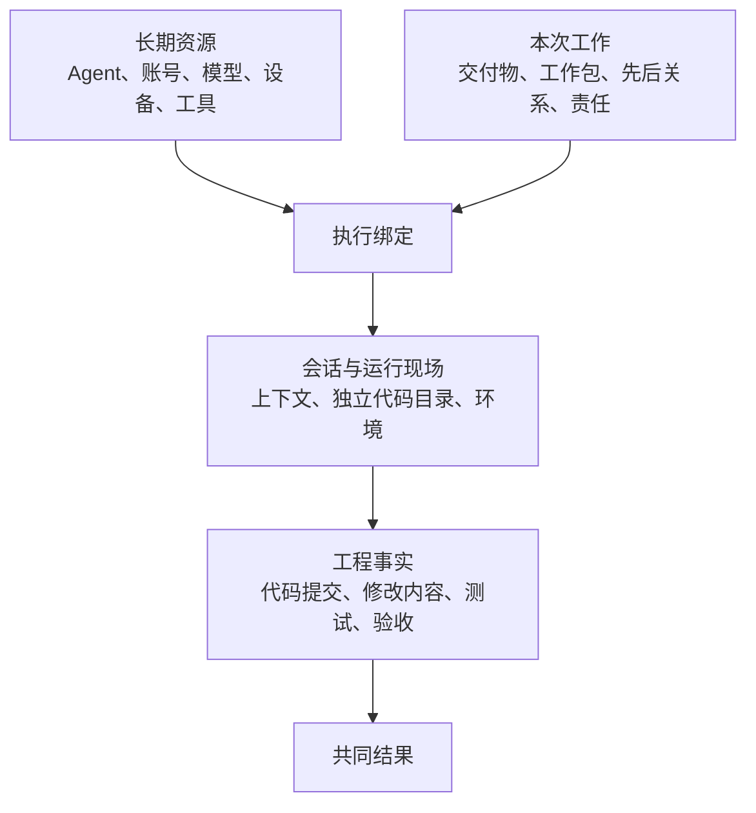
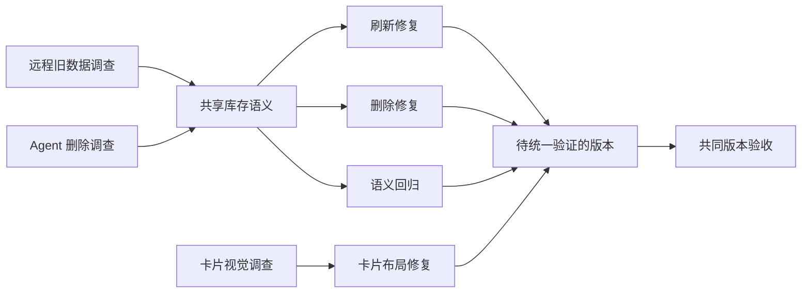
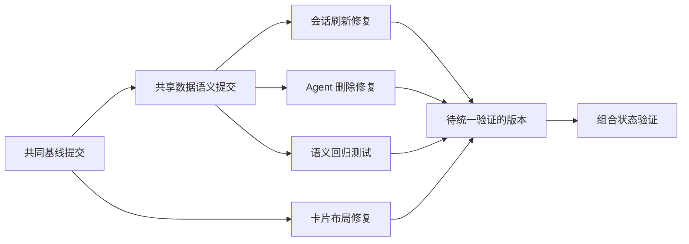
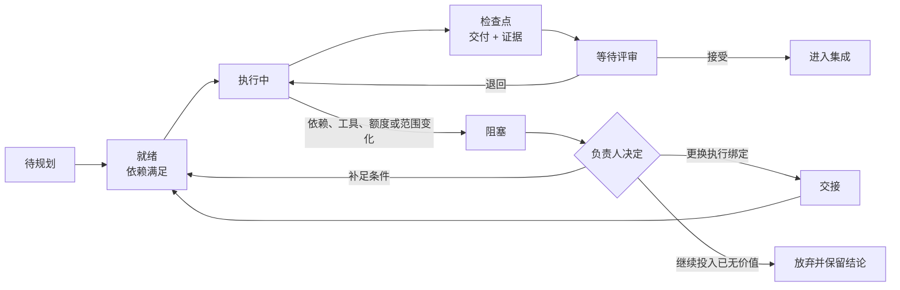
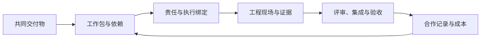

# 把多个 AI 助手组织成一支队伍：从共同结果到可验证的工程记录

> 状态：DRAFT FOR OWNER REVIEW（待所有者审阅）
>
> 版本：0.6
>
> 日期：2026-08-13
>
> 文档性质：多个 AI 助手如何协作的研究性经验文章，不是 AgentDesk 当前功能说明，也不是产品实施授权。

## 引言：多个 AI 助手同时工作时，需要管理什么

本文把使用者长期管理的一个 AI 工作身份称为 Agent。一次实际工作仍要落到这个身份关联的某个账号、模型、设备和客户端：账号负责登录和可用调用量（后文简称额度），模型提供推理和生成能力，设备表示工作在哪台机器执行，客户端则是实际操作模型的桌面应用或命令行程序。设备与客户端合在一起，确定工作在哪台机器、通过哪种程序执行，本文称为运行位置。

一次围绕某项工作持续展开的对话称为会话；会话中已经提供、供模型继续使用的背景信息和已有决定，本文称为上下文。

一个人拥有多个 Agent、多个账号和多台设备以后，最先获得的是更多可同时运行的会话。一个会话调查问题，一个会话修改代码，另一个会话检查界面，这些活动可以同时展开。

当这些结果需要汇合时，协作开始涉及新的问题：它们是否基于同一个代码版本，是否对需求作出了相同理解，是否修改了同一份代码、数据或本地运行条件，某个会话所说的“完成”究竟是一段解释、版本管理系统 Git 中一次可被引用的代码快照（commit，后文称“提交”），还是已经进入最终版本并通过验证？Git 用来保存代码版本并追踪每次变化。

假设现在要同时处理三个问题：远程会话仍显示旧数据，不需要的 Agent 无法彻底删除，界面中代表 Agent 的卡片在不同数量下出现视觉异常。三个 Agent 可以很快分别给出三份回答；这三项工作只有汇入一个把被采纳改动合到一起、可以继续测试的版本，才形成用户最终需要的结果。本文把这类版本称为集成版本：远端设备提供的数据能够刷新，删除结果不会被旧数据恢复，卡片在少量和大量 Agent 下都能稳定显示，相关测试和真实界面检查同时通过。

所有局部工作共同汇入、并能按照同一组条件检查是否达标的最终结果，本文称为共同交付物；这个统一检查过程，后文称为验收。

从“三个回答”到“一个被接受的版本”，中间多出来的工作，才是多 Agent 协作真正需要管理的内容。它包括共同目标、工作拆分、先后关系、共同修改对象、责任边界、实际执行现场、验证证据和最终采纳。Agent 的数量提供资源条件，这些工作关系共同形成协作结构。

本文从这个差别出发，逐步说明多个 Agent 怎样围绕同一个工程结果形成工作关系。

> **阅读边界：**本文只讨论人在外部工具、代码仓库和测试系统中怎样管理多个 Agent 的工作关系。[`PERSONAL_AGENT_MESH_PLAN.md`](./PERSONAL_AGENT_MESH_PLAN.md) 仍是 AgentDesk 个人多设备 Agent 网络（Personal Agent Mesh）的产品模型、安全规则和实施计划权威，[`PRODUCT.md`](./PRODUCT.md) 记录 AgentDesk 当前产品事实和拒绝清单，[`AGENTDESK_MULTI_ACCOUNT_MANAGEMENT_ARTICLE_V4.md`](./AGENTDESK_MULTI_ACCOUNT_MANAGEMENT_ARTICLE_V4.md) 则讨论多账号、多设备和工作连续性。
>
> AgentDesk 当前不管理 Git 独立工作目录（worktree，即让同一代码仓库在另一个文件夹中形成一份可独立修改的工作目录）、任务队列或自动 Agent 流程。本文提到的 Git 和协作方式不改变这一边界；如果以后希望把其中一部分做成产品能力，应另行完成产品立项、交互、安全和实施审阅。

## 一、多个 Agent 带来的是资源，协作还需要另一套结构

同时打开多个会话以后，界面首先呈现的是“谁正在工作”。工程任务的推进还需要继续看到这些工作是否产生了彼此可用的结果。

### 1.1 从并行会话到共同工作

多个会话彼此独立时，通常会出现几种现象：

- 两个 Agent 调查了同一条路径，却以为自己处理的是不同问题；
- 两个实现都从同一个代码仓库——保存项目代码和版本历史的位置——的默认主线（通常名为 `main`）开始，但取得代码的时间不同，实际起点已经变化；
- 每项修改分别通过测试，组合以后却约定了不同的数据格式或调用方式；
- 一个 Agent 只留下结论，接手者无法知道结论对应哪份代码和哪次运行；
- 所有人都在修改，最终却没有人负责决定哪些结果进入共同版本。

这些问题共同指向尚未定义的工作关系。每个 Agent 都可能很好地完成了自己的局部行为，但局部行为尚未被组织成一个共同结果。

为了描述这种关系，本文把能够由一个明确负责人单独承担、交付和验收的一段工作称为工作包；把代码版本、实际修改、测试结果等能被别人复查的记录统称为工程事实。

因此需要先区分三个层次：

| 层次 | 包含什么 | 回答的问题 |
|---|---|---|
| 长期资源 | Agent、账号、模型访问、额度、设备、客户端、工具和权限 | 当前可以使用哪些能力 |
| 本次工作 | 共同交付物、工作包、先后关系、责任和最终决定人 | 这些能力这次要形成什么关系 |
| 工程事实 | 会话上下文、开始时的代码版本、代码提交、修改内容、测试和验收 | 工作实际走到了哪里，留下了什么证据 |

资源决定哪些安排可能发生，本次工作决定应该发生什么关系，工程事实则说明这些关系是否真的产生了结果。三个层次需要分别记录，再通过一次具体执行相互关联。

把一个工作包的临时责任与具体 Agent、账号、运行位置、会话和代码目录对应起来，本文称为执行绑定。

会话、代码目录和本地运行条件共同构成这项工作的实际工程现场。



*图 1：资源经过工作关系、执行现场和工程事实，最终进入共同结果。*

### 1.2 长期身份、临时责任和会话属于不同层次

一个长期管理的 Agent 可以在不同工作中承担调查、实现、独立检查或集成；本文把由另一名执行者检查目标、结果和证据的过程称为评审。同一项责任也可能因为额度、设备或工具变化而更换执行账号。责任只在本次工作中成立。

会话保存当前讨论和上下文，任务则通过目标、与其他工作的先后关系、代码路径和已有证据维持连续。会话可以中断，也可以把较早内容缩短成摘要以腾出可用空间，这个过程通常称为上下文压缩；执行还可以换到新的会话。同一个会话里也可能先后处理多个不同责任，需要按各自交付分别记录。

这个区分决定了后面的基本顺序：先把要交付的工作定义清楚，再决定由哪个 Agent、账号和运行位置执行。

## 二、共同交付物让多个局部工作第一次有了同一个终点

“修复远程会话、删除和卡片问题”说明了主题范围，尚未说明三个局部结果最终必须共同形成什么状态。三个 Agent 可以分别写出分析、代码或截图，共同交付物负责进一步定义它们怎样汇合。

### 2.1 交付物描述可以验收的最终状态

工作描述说明准备做什么，共同交付物说明最后必须拿到什么。后者至少同时包含可观察结果和验收证据。

远程会话中的“库存”指来源设备提供的 Agent、运行位置和会话列表。系统每获得一份新库存，需要能判断它更新到了第几版，这个编号就是库存版本号，代码中常写作 `revision`。某一时刻完整保存的一份库存叫数据快照。删除一个对象后仍保留一条“它已经被删除”的记录，叫删除标记；它能阻止较旧快照把对象重新带回来。修改完成后再次检查原本已经成立的行为，叫回归测试。

以贯穿本文的任务为例：

| 结果范围 | 最终可观察状态 | 验收证据 |
|---|---|---|
| 远程会话 | 连接、重连或用户主动刷新后读取最新库存，不继续展示旧快照 | 库存版本号与内容推进测试、两台真实设备上的完整操作 |
| Agent 删除 | 移除运行位置、账号或整个 Agent 后，关闭应用再打开仍保持删除，旧库存不会使其复活 | 关闭重开、删除标记，以及重新输入旧库存数据后的测试 |
| 卡片视觉 | 少量卡不拉伸，大量卡可滚动，内容不重叠且选中项可见 | 程序自动检查卡片尺寸和位置，再结合真实截图 |
| 共同版本 | 三类变化在同一个代码状态下同时成立 | 同一个集成提交上的回归测试与实际操作流程 |

前三行描述局部结果，最后一行把它们收束成用户真正会拿到的版本。缺少最后一行，三个局部结果分别成功也可能没有共同成果。

### 2.2 先固定终点，才能判断应该拆出哪些工作

共同交付物明确以后，拆分便从“还缺哪些可以独立确认的事实和结果”反向展开。

这个例子一开始并不知道远程旧数据和删除失败是否共享根因，因此更合适的第一轮拆分是：

| 工作包 | 本轮交付 | 何时算完成 | 暂缓确定的事项 |
|---|---|---|---|
| 远程会话调查 | 数据来源、临时保存的数据，以及从请求刷新到界面更新的完整过程 | 证据可以解释旧数据何时产生、何时消失 | 暂不指定必须修改哪个文件 |
| Agent 删除调查 | 从发起删除到数据保存和界面更新的完整过程，以及防止旧数据恢复对象的条件 | 三种删除范围及重新输入旧库存后的结果都有结论 | 暂不认定只是保存结构的限制错误 |
| 卡片视觉调查 | 卡片尺寸、位置、重叠问题和截图 | 少量、大量、选中与滚动状态都已检查 | 暂不认定只是某条界面样式规则 |
| 测试准备 | 能够重复触发失败的测试和验证方式 | 修改前能暴露问题，修改后能够判定 | 暂不把当前实现写成正确答案 |
| 最终集成 | 一个集成提交及共同验证 | 四项共同验收同时成立 | 保留组合后的最终验证 |

这里先拆调查，是因为事实还不足以安全拆实现。如果一开始就把两个数据问题各自交给一个 Agent 修改，它们可能在各自代码路径中重新定义同一套库存含义，随后把真正的冲突推迟到集成阶段。

程序的不同部分要互相传递数据或调用功能，必须事先约定数据长什么样、如何调用；这种约定称为接口。数据和动作还要有准确含义，例如“已删除”究竟表示暂时不显示，还是以后不允许旧数据恢复；本文把这种准确含义称为语义。当多项工作共同依赖同一个接口或同一种含义时，需要把格式、含义和修改规则写成一份明确约定，本文称为共享契约。

调查证明两项问题确实共享库存、刷新和删除语义后，新的工作包才自然出现：先形成共享契约，再分别实现刷新与删除，并补充共同语义的回归测试。这种顺序让拆分跟随已经获得的事实。

### 2.3 一个工作包要能被下一项工作直接使用

工作包不以“有人正在研究”为成立条件，而以“产生了可被引用的交付”为成立条件。一份可执行的任务约定至少说明：

| 内容 | 需要解决的问题 |
|---|---|
| 目标和非目标 | 这项工作改变什么，不改变什么 |
| 输入依据 | 它基于哪个决定、数据或代码版本 |
| 允许修改范围 | 它拥有哪部分状态，哪些共享对象由其他所有者维护 |
| 交付物 | 下一项工作会接到代码、测试、证据还是契约 |
| 验证方式 | 什么结果能够证明该工作包完成 |
| 开始条件和停止条件 | 何时可以开始，遇到什么情况应停止并上报 |

这样定义以后，工作包才是协作单位。Agent 的一段长解释可以成为其中的证据，正式交付仍由交付物、验证和它与其他工作的关系共同构成。

## 三、拆分明确责任，先后关系决定启动顺序

拆分解决的是责任是否清楚，并行解决的是这些责任能否安全地同时推进。两者经常被混为一件事。

当一项工作必须等待另一项工作的结果或共同决定才能开始时，本文称前者依赖后者。多项工作共同读取或修改的代码、数据和测试环境，本文称为共享状态。决策权则表示谁有权确认当前有效约定，以及谁决定某项结果是否被采纳。

两个工作包即使名称不同，也可能等待同一个决定、修改同一份可变状态，或者必须放在一起才能判断正确性。此时把它们交给两个 Agent 同时实现，只是把原本显性的先后关系变成后续的冲突和返工。

### 3.1 先看工作之间通过什么发生联系

工作包之间至少存在四类需要管理的关系：

| 关系 | 典型问题 | 对并行的影响 |
|---|---|---|
| 结果依赖 | B 是否必须先取得 A 的输出才能开始 | 取得 A 的输出后启动 B |
| 共享状态 | 两项工作是否会修改同一接口、保存结构化数据的数据库及其字段结构、记录所用依赖精确版本的锁文件或测试环境 | 需要分区、明确一名临时负责人或先稳定契约 |
| 决策依赖 | 两项实现是否都在等待同一个产品或技术选择 | 先完成共同决定，再启动实现 |
| 验证依赖 | 每项结果能否独立判定，还是只能组合后知道对错 | 可以探索并行，但完成必须在集成状态判断 |

用箭头表示先后关系的任务依赖图，主要表达一项工作何时需要等待另一项工作；共享状态、决策权和组合验证还需要另外记录。多项工作都会触及、因而需要统一决定的对象，也必须明确由谁维护，否则同样会打乱启动顺序。

在本文的例子中，三个调查可以同时开始，因为它们交付的是不同证据；两项数据实现应等待共享语义确认后启动，因为它们共同决定库存和删除的语义。卡片布局相对独立，可以继续推进。



*图 2：调查阶段可以展开；证据汇合后先稳定共享语义，再启动后续实现。并行随依赖满足逐步开放。*

### 3.2 判断能否并行，要同时看独立推进和最终汇合

这里的并发，指同一时间正在推进的工作数量；验证方法则负责直接判断一项交付是否成立。

一个工作包适合进入并行，通常需要回答五个连续问题：

1. 它是否有独立、可引用的交付物？
2. 它所依赖的输入和接口是否已经足够稳定？
3. 它是否拥有明确的修改范围，不会与其他工作争用同一份可变状态？
4. 它是否有独立判定方法，能够知道局部结果是否成立？
5. 即使局部成立，最终集成者是否有能力及时评审、组合和重新验证？

前四项判断一条工作能否独立推进，第五项判断系统能否吸收新增并发。可用账号再多，如果所有结果都在等待同一个接口决定，或者集成者已经无法及时审查，增加 Agent 只会增加等待处理的工作和过期的修改路径。

因此，有效并发取决于当前已经具备独立交付、稳定边界和明确验证方法，并且能够被最终集成吸收的工作数量。

### 3.3 不同依赖形状自然形成不同合作方式

确定依赖以后，合作结构不需要凭经验命名，而会从工作关系中自然出现：

| 工作关系 | 合适的合作方式 | 关键约束 |
|---|---|---|
| 多个独立方向需要扩大覆盖 | 分头调查，再由一人综合 | 统一调查范围、资料范围和综合负责人 |
| 前一步结果稳定后才能开始后续工作 | 前一项交给后一项继续 | 可引用交付物和准确的前一步版本 |
| 对同一个问题保留多个候选假设 | 同时尝试多个方案，再统一比较 | 相同开始版本、预算和共同验证方法 |
| 结果重要，而且实现者容易只验证自己的结论 | 一人产出，另一人独立检查 | 评审独立，并直接检查原始交付物 |

Anthropic 的多 Agent 研究系统利用的是搜索方向可以横向拆开，同时也披露了显著增加的模型用量。Token 是模型处理和生成文本时使用的基本计量单位。其“把 C 语言源代码转换成可执行程序”的编译器实验，用一份任务认领表明确每项工作由谁处理，并让不同 Agent 使用彼此独立的代码目录和测试条件；测试标准明确以后，协作更稳定，而多个 Agent 聚集到同一目标时会出现重复和覆盖。[Multi-agent research](https://www.anthropic.com/engineering/multi-agent-research-system)、[C compiler experiment](https://www.anthropic.com/engineering/building-c-compiler)

这些案例支持一个有限而有用的结论：并行的收益主要来自独立搜索和独立产出；共享状态和判断成本上升以后，协调会抵消这些收益。

### 3.4 共同修改的对象必须有明确决策权

数据库结构、核心接口、负责把旧数据库升级到新结构的程序、依赖版本锁文件和全局设计决定等共享对象，需要有明确负责人维护其当前有效含义。

共享对象负责人维护当前有效契约：接受调查证据，决定是否改变共享约定，形成可引用版本，并通知受影响的后续工作重新验证。具体实现仍可由多个执行者承担。集成负责人则决定哪些结果进入共同版本，以及出现冲突时采用、退回还是放弃。

只要这两类决策权没有明确，多 Agent 协作就容易退化成状态播报：每个人都汇报自己做了什么，却没有人维护这些工作之间的有效关系。

## 四、工作关系确定以后，才有足够信息选择 Agent

选择执行资源需要工作包的交付、依赖和风险作为输入。工作处于调查、决策、实现、评审还是集成阶段，会直接改变适合它的模型、工具和上下文条件。

本文把一次工作实际采用的模型、分析与检查投入、客户端执行方式、工具和上下文组合称为执行配置。先确定工作关系，再选择能够在当前条件下完成它的执行配置。

模型产品通常允许为一次请求设置推理投入档位（reasoning effort，后文简称“推理投入”），用来控制模型在分析和检查上投入多少计算。客户端执行框架（harness）则是围绕模型组织计划、工具调用、反复执行和结果检查的程序层；同一个模型处在不同执行框架中，表现也可能不同。

### 4.1 一次分配工作，实际绑定了多个不同对象

日常所说的“把任务交给某个 Agent”，实际包含几项不同选择：

| 对象 | 它决定什么 | 需要与什么区分 |
|---|---|---|
| Agent（长期身份） | 长期管理的是哪个 Agent，以及它关联的账号和合作记录 | 本次临时责任 |
| 账号 | 能访问哪些模型、还有多少可用调用量、能同时运行多少会话 | 模型能力本身 |
| 模型与推理投入 | 本次推理、生成和工具行为的基础配置 | Agent 的长期身份记录 |
| 运行位置 | 哪台设备、哪个客户端、哪些工具和权限可用 | 任务责任 |
| 会话 | 当前执行掌握的上下文 | 代码状态和正式交付 |
| 临时责任 | 本次负责调查、实现、评审还是集成 | 长期身份 |

同一个长期 Agent 更换模型、推理投入、客户端执行框架、工具权限或上下文保留方式后，实际执行表现可能明显变化。因此合作记录需要从“Agent A 擅长代码”进一步具体到实际执行配置：

```text
具体模型名称与版本
+ 推理投入档位
+ 客户端执行框架
+ 工具与权限
+ 上下文保留与压缩方式
+ 服务提供方与日期
+ 任务类型与验证结果
```

长期身份负责把相关记录组织起来，执行配置才是本次能力判断的直接对象。

### 4.2 用一张资源表呈现分配工作所需的真实条件

把每个 Agent 当前可用的账号、模型、额度、运行位置、工具和占用情况列在一张资源表中，分配工作时便能同时看见真实限制：

| Agent | 账号与模型访问 | 额度状态 | 运行位置 | 工具与权限 | 已有上下文 | 当前占用 |
|---|---|---|---|---|---|---|
| Agent A | 按实际账号填写 | 保留给关键判断和集成 | Mac Studio / 可修改代码的客户端 | 仓库、运行开发命令、测试 | 掌握整体设计 | 可用或繁忙 |
| Agent B | 按实际账号填写 | 可执行长任务 | MacBook / 可修改代码的客户端 | 仓库、运行开发命令 | 熟悉多设备网络代码 | 可用 |
| Agent C | 按实际账号填写 | 可用 | 能同时读取文字和截图的客户端 | 截图、浏览器 | 尚无代码上下文 | 可用 |

某个模型可能能力合适，但所在客户端不能运行开发命令；某个账号可能掌握大量上下文，却已接近额度上限；某个新会话成本较低，却需要重新建立对仓库和决策的理解。资源表把这些约束放到同一张图上，供已经定义好的工作包选择。

### 4.3 工作性质决定需要什么能力组合

一个单一的综合分数很难直接支持工作分配。更有用的是观察执行配置在以下方面的表现：

| 工作性质 | 需要重点观察什么 | 容易出现的误判 |
|---|---|---|
| 问题判断 | 能否区分事实、假设和约束，找到真正瓶颈 | 把表达完整当成判断正确 |
| 执行纪律 | 能否遵守范围、可靠使用工具、避免无关修改 | 把生成速度当成执行稳定 |
| 状态保持 | 长任务中能否维持目标、接口和已有决定 | 把一次能读取的文本长度当成可靠记忆 |
| 失败恢复 | 工具或测试失败后能否产生新证据并调整 | 只统计最终成功，不看恢复代价 |
| 交接质量 | 能否留下开始版本、实际改动、验证和未决问题 | 把长篇解释当成完整交接 |
| 经济性 | 达到可交付结果需要多少时间、Token 和人工返工 | 只比较模型单价 |

问题模糊、一个判断会影响很多后续工作、错误又难以发现时，更需要判断、约束保持和较高推理投入；边界稳定、结果容易验证时，可以优先考虑执行纪律、速度和成本；评审任务则需要独立视角，并主动寻找与实现结论相反的证据。

模型家族指同一厂商或同一系列下的一组相关模型型号。模型家族、厂商定位和公开评测可以提供初始假设，实际岗位仍需由自己的任务结果校正。模型型号、推理投入和账号档位也需要分开记录：型号改变基础规格，推理投入改变本次分析和检查的深度，账号档位主要改变访问、容量和产品功能。三者属于三条独立轴。

公开评测可以作为起点，例如 [Artificial Analysis](https://artificialanalysis.ai/methodology/intelligence-benchmarking)、[METR Time Horizons](https://metr.org/time-horizons/) 和 [Terminal-Bench](https://www.tbench.ai/leaderboard/terminal-bench/2.1) 分别观察综合能力、长任务能力和命令行执行；真正用于工作分配的认识仍应由自己的任务结果校正。

### 4.4 选择完成以后，工作分配才成为一次执行绑定

回到贯穿示例，三个调查已经确认可以并行，此时才有足够信息选择执行资源：远程会话调查需要理解数据从来源到界面显示的完整代码过程，并能使用命令行工具；删除调查需要准确理解数据状态和失败路径；卡片调查需要读取真实界面和截图。共享数据语义在两项调查汇合以后出现，应交给能够维护整体契约并承担后续影响的人；最终集成则需要预留足够的上下文、额度和验证能力。

一次完整绑定至少留下：工作包、临时责任、长期 Agent 身份、账号、模型与推理投入、设备、客户端、会话、开始时的代码版本和预期交付。这样即使中途更换账号，变化的只是执行绑定，工作包及其工程事实不会被重新定义。

## 五、工程现场把“正在做”变成“别人可以接着做”

任务已经拆好、执行者也已经确定，仍不代表协作可以稳定持续。会话中有讨论，工作目录里有未提交修改，本地测试还依赖一套不能随代码提交带走的本机条件；这些状态如果没有清楚分开，换 Agent 或换设备时就会丢失。

### 5.1 会话、Git 和本机运行条件分别保存不同事实

Git 是保存代码版本及其变化历史的系统。代码实际运行时还会依赖网络端口（本机服务用来区分不同连接的编号）、数据库、为加快读取而临时保存的数据（缓存）、测试账号和本机权限；本文把这些本机条件合称为运行环境。Git 与运行环境记录的是不同事实。

| 信息放在哪里 | 适合保存什么 | 还需配合什么 |
|---|---|---|
| 会话 | 探索过程、当前推理、临时上下文 | 当前代码事实和正式决定 |
| 任务或设计文档 | 目标、边界、接口和已确认决定 | 实际发生的文件变化 |
| Git | 开始时的代码版本、实际修改、不同工作路径、交接和集成历史 | 结果是否符合产品目标 |
| 运行环境 | 端口、数据库、依赖、缓存、测试账号和本地权限 | 可跨设备引用的提交历史 |
| 测试与验收 | 可重复的正确性证据 | 为什么选择某个设计 |

协作稳定需要让每种事实有明确归属，并在交接时说明它们之间的对应关系。

### 5.2 一项普通代码工作怎样形成可接续路径

先解释这一节会反复使用的 Git 概念。代码仓库（repository）保存一个项目的完整版本历史。Git 把某次代码状态保存为提交，每个提交都有一串唯一标识，通常称为 SHA；因此别人拿到 SHA，就能准确找到同一次提交。任务开始时共同认可的那次提交，本文称为基线提交。

分支（branch）是一条持续向前增加提交的工作路径。独立工作目录（worktree）则把某条分支取出到单独文件夹，让不同工作拥有各自的文件现场。

一项任务可以按以下顺序建立工程现场：

1. 记录准确的代码仓库和基线提交标识，而不只写“基于主分支”；
2. 以任务含义命名分支，并在需要并行时创建独立工作目录；
3. 把该分支、工作目录、会话和执行配置绑定到工作包；
4. 任务形成连贯、可恢复的中间提交时，将它记为阶段检查点，同时关联验证结果和未决问题；
5. 需要跨设备或交给别人审查时，把任务分支上传到所有参与者都能访问的远端仓库；这个上传动作在 Git 中称为 push；
6. 评审者直接检查目标、基线提交、最新提交、两者之间的修改和验证证据；
7. 被采纳的结果进入当前共同版本，并在组合状态重新验证；
8. 接受、退回或放弃以后，再决定是否清理独立工作目录和临时环境。

准确的基线提交很重要，因为两个 Agent 所说的“主分支”可能来自不同时间。以任务命名分支也比以模型命名更稳定：执行账号可以更换，`fix/remote-session-refresh` 表达的工作含义仍然存在。

### 5.3 文件隔离之外还有语义和环境冲突

独立工作目录可以避免未提交文件、编译或测试临时生成的文件和调试过程直接互相污染。语义、环境和事实冲突还需要其他机制处理：

| 冲突 | 独立工作目录的作用 | 还需要什么 |
|---|---|---|
| 同时修改同一文件 | 推迟到合并时处理 | 修改范围和集成决定 |
| 分别设计出不兼容接口 | 留到集成阶段暴露 | 共享契约与决策权 |
| 共用端口、数据库或测试账号 | 仍会相互影响 | 为每项工作分配独立端口、数据库或账号 |
| 使用不同开始版本或测试数据 | 仍会产生事实偏差 | 明确开始版本和共同测试标准 |

因此，一个完整工作现场不仅是目录，还可能包括独立端口、临时数据库、缓存、测试数据和权限条件。Git 保存变化的历史，分别分配这些运行条件可以避免不同执行过程相互破坏。

### 5.4 提交关系应表达工作依赖

每个 Git 提交都会记录它直接基于哪一个较早提交，这条关系称为提交的父关系。如果删除修复和会话刷新都依赖同一份共享契约，它们就应建立在记录该契约的提交之上。卡片修复没有这项依赖，可以从共同基线独立展开。



*图 3：提交父关系和任务依赖尽量保持一致。分支内通过只说明局部成立，所有路径汇入同一个待验证版本后仍要重新判断组合是否正确。*

已经被后续工作依赖的共享提交历史应保持稳定。契约发生变化时，由共享对象负责人形成新的可引用提交，再让受影响分支更新开始版本并重新验证。

### 5.5 阶段检查点为换账号和跨设备交接提供稳定起点

未提交修改只存在于一个独立工作目录，没有可被其他人准确引用的提交标识。长任务如果直到最后才提交，一旦额度耗尽、设备不可用或会话中断，接手者就要从混杂的未提交修改中重新推断意图。

一个可交接的阶段检查点可以只是中间状态，但需要形成连贯的代码提交，并说明：

```text
代码仓库 / 基线提交 / 任务分支 / 当前最新提交
已经完成的内容
已经运行的验证及其结果
仍有未提交修改的文件和原因
已知缺口、当前无法继续的条件和下一步
依赖的本地环境或数据
```

跨设备交接还需要明确分开三件事：会话定位只帮助接收者找到讨论，共享远端仓库只交换已经提交并上传的代码，本机未提交文件、数据库、依赖和权限不会因此自动迁移。AgentDesk 用会话定位信息（SessionPointer）指向另一台设备上的会话；其中预留的代码版本字段名为 `workspaceRevision`。当前产品只携带这个版本标识，不负责自动同步项目或执行 Git 操作。

### 5.6 独立结果怎样进入同一个共同版本

代码评审请求（Pull Request，简称 PR）把一条任务分支提交给其他人审查；持续集成系统（Continuous Integration，简称 CI）会在代码变化后自动运行约定检查。它们把目标、基线提交、最新提交、实际修改、验证和采纳决定放在同一个审查面。几个分支分别通过检查以后，组合状态仍需要重新验证。

候选修改较多时，需要明确它们进入当前共同版本的顺序，再逐个检查并决定是否采纳。这里按顺序逐个处理，承担着把独立结果汇总成共同产品的工作。

## 六、工作进行中，要依据新事实调整安排

初始拆分建立在当时已经掌握的信息上。工作开始以后，调查可能发现共享根因，契约可能变化，模型可能缺少工具，账号额度可能耗尽，评审也可能推翻实现者的判断。计划需要随证据调整，避免 Agent 继续完成一个已经失去意义的局部任务。

### 6.1 状态变化必须由可检查的事实推动

当一项工作因为缺少前置结果、工具、额度或权限而暂时无法继续时，本文称它处于阻塞状态。

一个工作包可以经历以下状态：



“正在思考”说明会话仍然活动；任务进展则由新的可检查事实推动，例如能够重复触发问题的运行记录、失败测试、契约决定、阶段检查点提交、评审意见或集成结果。

### 6.2 负责人只需要掌握能够作决定的状态

负责人不需要不断读取每个 Agent 的完整对话。一项工作当前是否需要介入，可以由一组有限事实表达：

```text
任务标识 / 当前责任 / 负责 Agent
账号 / 模型 / 推理投入 / 设备 / 客户端 / 会话
依赖 / 共享对象负责人
代码仓库 / 基线提交 / 任务分支 / 独立工作目录 / 当前最新提交 / 未提交修改
最近证据 / 验证结果
阻塞 / 下一项需要作出的决定 / 更新时间
```

这些字段把负责人真正需要判断的关系从聊天中提取出来：工作是否已经具备启动条件，当前事实是否改变了原计划，是否需要更新前置工作、换执行者、进入评审或停止投入。

### 6.3 更换 Agent 或账号时保持任务连续

假设会话刷新已经完成一半，原账号额度接近耗尽。此时先形成阶段检查点，保留原工作包、任务分支、验收和依赖，再更换执行绑定。

变化的是账号、模型、设备或会话；保持不变的是任务本身、任务分支和已经形成的证据。只有原任务的目标或依赖真的发生变化，才需要修改任务约定。

同样，如果执行 Agent 发现必须修改范围外的共享接口，应先阻塞当前局部实现，让共享契约负责人判断共同约定是否改变；如果连续重复相同失败而没有新增证据，应调整方法、工具或模型；如果结果已经形成代码提交和验证，则应进入独立评审，避免在没有新增目标和证据时继续打磨。

### 6.4 并发要随着开始条件逐步满足而展开，也要在集成前主动减少

在贯穿示例中，运行过程可能这样变化：

| 阶段 | 新事实 | 安排变化 | 留下的记录 |
|---|---|---|---|
| 开始 | 共同验收和基线提交已明确 | 三项调查同时开始 | 三份任务约定和共同开始版本 |
| 调查汇合 | 两项数据调查指向同一库存语义 | 暂停各自改接口，增加共享契约工作；卡片继续 | 调查证据和共享对象负责人 |
| 契约形成 | 共享契约已经形成代码提交 | 刷新、删除和语义回归变为就绪 | 三条基于共享契约的工作路径 |
| 执行交接 | 刷新执行账号接近额度上限 | 形成阶段检查点后换账号 | 原任务分支、最新提交、验证和新绑定 |
| 独立评审 | 评审发现删除仍会被旧库存复活 | 只退回删除工作 | 评审证据和其他候选的最新提交 |
| 集成 | 所有候选被接受 | 组合为集成提交并重新验证 | 同一代码状态下的测试和截图 |
| 验收 | 共同验收全部通过 | 接受结果、清理现场、记录对下次安排有用的结论 | 最终提交标识、采纳决定和成本 |

这条时间线展示的是每次安排变化所依据的新事实。并行随着依赖满足逐步打开；当工作进入评审和集成，又要主动减少同时进行的工作，让已有结果真正进入共同版本。

## 七、“完成”需要从陈述逐步变成被接受的证据

“完成”在多 Agent 协作中对应不同的证据状态。实现者完成代码、分支完成测试、评审接受结果和共同版本通过验收，分别代表不同的成熟度。

### 7.1 不同完成状态能够证明的事情不同

| 状态 | 已经具备什么 | 还需要哪类证据 |
|---|---|---|
| Agent 自报完成 | 有一段结果说明 | 实际文件和运行状态已经改变 |
| 已形成代码提交 | 变化可以引用和审查 | 变化能够正确运行 |
| 分支验证通过 | 与该分支的开始版本兼容 | 与其他变化组合后仍然正确 |
| 独立评审接受 | 目标、实际修改和证据经过另一视角检查 | 与其他变化组合后没有新冲突 |
| 集成与产品验收通过 | 共同状态满足既定判定 | 仍只证明已经覆盖的范围；新的真实环境仍需继续检查 |

检查的深度和覆盖范围应与任务风险匹配；“完成”始终需要说明目前已经证明到哪一步。证据不足时可以继续推进，同时保留准确的状态表述。

### 7.2 验证方法必须对应交付物

不同工作需要不同验证方法：资料研究需要原始来源和日期；性能实验需要统一数据、开始版本和统计；代码需要确认能够完成构建，也就是能从源代码生成可运行或可发布的结果，还要符合代码规定的数据类型，确认程序的单个部分行为正确，而且多个部分组合以后仍然正确；界面需要在真实尺寸下检查实际显示和交互；跨设备能力需要物理设备和真实网络，同一台电脑里模拟两个设备只能覆盖其中一部分行为。

在本文示例中，远程刷新和删除分支分别通过测试，说明局部修改已经成立；卡片截图提供了视觉分支的局部证据。数据和界面组合后的稳定性，需要在同一个集成提交上同时检查远端刷新、删除防复活、少量与大量卡片布局和相关回归测试。

共同交付物怎样定义，最终验证就应怎样重新出现。验证由此成为最初目标在工程事实中的对应物。

### 7.3 独立评审应直接面对原始交付

评审者应该获得原始目标、输入依据、基线提交、最新提交、两者之间的修改、测试结果和已知风险。实现者的解释可以帮助理解背景，主要证据仍来自原始交付及其验证结果。

让不同模型家族分别检查同一结果，可能降低部分共同盲点，但“另一个模型没有发现问题”仍不是正确性证明。静态检查指在不实际运行程序的情况下直接分析代码；它和模型评审、运行测试、人的产品判断分别解决不同问题，不能相互冒充。

### 7.4 失败也应形成可复用的工程事实

一个方案被放弃，可能已经证明某条路线为什么行不通、某个指标为什么无法提升，或者某种执行配置在什么条件下容易偏离。只要结论以后可能影响决策，就应保留尝试内容、代码提交或实验版本、失败证据和放弃原因。

独立工作目录和临时环境可以清理，具有判断价值的失败应继续保留，供下一次工作分配直接使用。

## 八、交付结果怎样影响下一次安排

把一次交付中的结果、成本、失败和恢复方式整理成下一次可以使用的判断，本文称为复盘。公开模型资料只能提供初始认识；一个 Agent 真正适合什么工作，需要从已经发生的交付中逐渐形成带有明确适用条件的判断：它在什么任务、什么执行配置和什么验证要求下表现稳定。

### 8.1 记录执行条件，才能解释结果

一次结果至少需要关联：

| 记录 | 它帮助回答什么 |
|---|---|
| 模型的准确名称与版本、推理投入、客户端执行框架、工具和日期 | 这次观察对应哪种实际执行配置 |
| 工作责任、依赖关系和输入依据 | 它承担了什么难度和什么位置的工作 |
| 代码提交、测试、评审与最终采纳 | 它是自报成功，还是进入共同结果 |
| 时间、模型用量、人工提示和管理投入 | 表面并行是否真的降低总成本 |
| 失败类型、返工和恢复路径 | 它怎样犯错，错误是否容易发现和修复 |

只记录“Claude 适合调查”或“GPT 适合集成”会把模型品牌、执行环境和偶然任务混在一起。更有价值的结论是：某个具体模型版本、推理投入和工具配置，在某类依赖和验证条件下，是否稳定形成了被采纳的结果。

重要配置发生变化以后，旧结论的可信程度也应相应下降，并按新的执行条件重新校正。

### 8.2 比较的是可交付结果总成本

模型价格只是成本的一部分。一次看起来便宜的执行，如果需要大量提示、评审和返工，最终可能比高成本模型更贵；高并发如果制造大量等待集成的分支，也可能延长整体周期。

```text
可交付结果总成本
= 模型与工具成本
+ 等待时间
+ 协调和管理时间
+ 验证时间
+ 返工与集成成本
```

复盘更新下一次安排的依据：哪类工作需要更强判断，哪类工作使用较低推理投入已经足够，哪些共享对象适合按顺序处理，哪种评审最容易发现隐蔽错误，以及什么时候增加一个 Agent 会提高总成本。

### 8.3 每次交付都在更新下一次安排

共同交付物决定验收，工作拆分暴露依赖，依赖决定执行关系，工程事实支持评审和集成，最终结果再更新资源记录。下一次工作由此可以带着经过验证的新认识重新判断。



*图 4：每次交付都产生能够改善下一次判断的事实。*

## 结语

多个 Agent 形成一支队伍，始于工作之间的关系被明确：所有局部结果指向同一个共同交付物，工作包有可引用的输出，依赖和共享状态决定并行边界，责任被绑定到具体执行现场，Git 与验证保存可以接续的工程事实，最终由明确的评审和集成决定哪些结果进入共同版本。

模型、账号和设备提供资源；共同交付物与依赖把资源组织成工作；工程事实和验证把工作收束成结果；历史结果再改变下一次安排。这条链把多个独立会话组织成持续协作。

## 附录 A：最小任务约定

下面的字段用于把一个工作包交给执行者，不代表 AgentDesk 当前具有任务管理功能：

```text
任务：
目标：
非目标：
输入依据：代码仓库 / 基线提交 / 已确认决定
依赖：
允许修改范围：
共享对象负责人：
预期交付：
验证方式：
停止并上报条件：
```

## 附录 B：最小交接记录

```text
任务与当前责任：
Agent / 账号 / 模型 / 推理投入 / 设备 / 客户端 / 会话：
代码仓库 / 基线提交 / 任务分支 / 独立工作目录 / 当前最新提交 / 未提交修改：
已完成内容：
验证及结果：
已知失败与未决问题：
本地环境依赖：
下一项需要作出的决定：
```

## 参考资料

### 多 Agent 与工程实践

- Anthropic, [How we built our multi-agent research system](https://www.anthropic.com/engineering/multi-agent-research-system)
- Anthropic, [Building a C compiler with a team of parallel Claudes](https://www.anthropic.com/engineering/building-c-compiler)
- Anthropic, [Effective harnesses for long-running agents](https://www.anthropic.com/engineering/harness-design-long-running-apps)
- OpenAI, [Introducing the Codex app](https://openai.com/index/introducing-the-codex-app/)
- OpenAI, [How OpenAI uses Codex](https://openai.com/business/guides-and-resources/how-openai-uses-codex/)
- OpenAI, [Harness engineering](https://openai.com/index/harness-engineering/)
- Andrej Karpathy, [autoresearch experiment notes](https://x.com/karpathy/status/2030777122223173639)
- Boris Cherny, [personal parallel-session workflow](https://x.com/bcherny/status/2007179832300581177)
- Boris Cherny, [Claude Code team tips on parallel worktrees](https://x.com/bcherny/status/2025007393290272904)

### Git

- Git, [Branches in a Nutshell](https://git-scm.com/book/en/v2/Git-Branching-Branches-in-a-Nutshell)
- Git, [`git-worktree`](https://git-scm.com/docs/git-worktree)
- Git, [`git-merge-base`](https://git-scm.com/docs/git-merge-base)
- Git, [`git-rebase`](https://git-scm.com/docs/git-rebase)
- Git, [`git-cherry-pick`](https://git-scm.com/docs/git-cherry-pick)
- Git, [`git-push`](https://git-scm.com/docs/git-push)

### 模型、档位与行为原则

- OpenAI, [Models](https://developers.openai.com/api/docs/models)
- OpenAI, [Model selection and reasoning](https://developers.openai.com/api/docs/guides/latest-model)
- OpenAI, [Model Spec](https://openai.com/index/our-approach-to-the-model-spec/)
- Anthropic, [Claude models overview](https://platform.claude.com/docs/en/about-claude/models/overview)
- Anthropic, [Effort](https://platform.claude.com/docs/en/build-with-claude/effort)
- Anthropic, [Claude's Constitution](https://www.anthropic.com/constitution)
- Google, [Gemini latest models](https://ai.google.dev/gemini-api/docs/latest-model)
- Google, [Gemini thinking](https://ai.google.dev/gemini-api/docs/thinking)
- xAI, [Grok 4.6](https://docs.x.ai/developers/grok-4-6)
- xAI, [Multi-agent](https://docs.x.ai/developers/model-capabilities/text/multi-agent)
- Moonshot AI, [Kimi K3](https://github.com/MoonshotAI/Kimi-K3)
- DeepSeek, [Pricing and current models](https://api-docs.deepseek.com/quick_start/pricing/)
- DeepSeek, [Thinking mode](https://api-docs.deepseek.com/guides/thinking_mode/)

### 评测方法

- Artificial Analysis, [Intelligence benchmark methodology](https://artificialanalysis.ai/methodology/intelligence-benchmarking)
- METR, [Measuring AI ability to complete long tasks](https://metr.org/time-horizons/)
- Terminal-Bench, [Terminal-Bench 2.1 leaderboard](https://www.tbench.ai/leaderboard/terminal-bench/2.1)
- Stanford CRFM, [HELM Long Context](https://crfm.stanford.edu/helm/long-context/latest/)
- Stanford CRFM, [HELM Safety](https://crfm.stanford.edu/2024/11/08/helm-safety.html)
- Vals AI, [Evaluation methodology](https://www.vals.ai/methodology)
- OpenAI, [Why we no longer evaluate SWE-bench Verified](https://openai.com/index/why-we-no-longer-evaluate-swe-bench-verified/)

## 审阅重点

本轮请重点审阅每一章内部的推进是否自然：

1. 是否先说明读者为什么会遇到这一问题，再引出必要区分；
2. 每个必须保留的术语是否都在第一次出现时用普通语言解释，并且后文用法保持一致；
3. 示例是否帮助读者理解前后关系，而没有取代正文论述；
4. 模型、Git 和状态管理是否都服务于同一条工作主线，没有各自变成独立主题。
