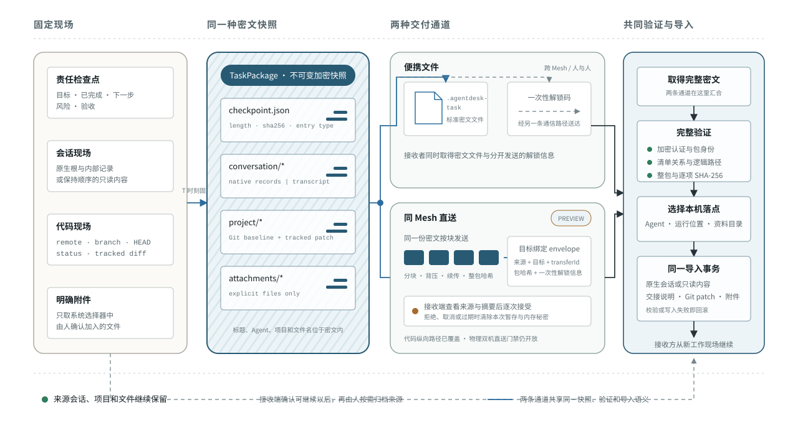

# 多个 Agent 如何逐步负责业务环节

> 状态：FINAL
>
> 版本：0.7
>
> 日期：2026-08-14
>
> 来源：在既有多 Agent 工程协作稿基础上增量重构并收敛形成。
>
> 文档性质：关于多 Agent 工程协作与长期业务责任的认知和方法文章。

今天，多个 Agent 已经开始同时参与一项工作。人们让它们分别调查、编写、分析、制作或评审；每个 Agent 在一个或多个会话中读取资料、调用工具、保留当前上下文，并把形成的结果交还给人或另一个 Agent。

这些 Agent 已经开始形成差异。人们通过固定称呼、工作方向和独立记录持续指认它们；它们积累不同上下文，使用不同工具和方法，也会采用不同模型与运行条件。识别多个 Agent，先看各自连续的身份与工作历史，再看逐步形成的 Skill 和配置；账号、设备与客户端提供模型入口、运行容量和实际工作位置。

未来，多个 Agent 会进入业务的不同环节。每个 Agent 长期维护一段稳定责任，持续接收输入、作出判断、维护状态、向下游交付，并对一段时间内的结果负责。多个负责人按照上下游关系连接，形成持续运转的业务结构；复杂事项出现时，它们再围绕共同结果建立临时协作。

当下人们主要通过会话窗口、工具调用和一次次任务感知 Agent。人负责提出目标、安排分工、衔接不同会话、判断结果，并把有效方法带到下一次工作中。这种使用方式准确反映了当前阶段：Agent 的能力正在建设，跨会话连续性仍由人与现有平台共同维护，长期业务责任刚开始形成。

从今天走向未来，核心积累是 Skill。本文把 Agent 处理一类工作的可复用方法称为 Skill。它保存适用范围、所需输入、处理步骤、判断依据、工具用法、交付格式、验证方式和异常去向。一次工作产生经验，多个会话积累方法，经过整理和反复验证以后，方法成为可以持续复用和更新的 Skill。

本文先分析多个 Agent 怎样在当下的工具和会话中建设 Skill，随后说明稳定能力怎样发展为长期业务责任。接下来的各章依次回答：一次共同工作如何确定终点，如何拆分并安排先后，如何为不同 Agent 选择能力和运行条件，如何保存别人可以接着使用的工作记录，如何把完整现场交给另一个 Agent 或另一个人，以及如何用证据决定哪些结果和方法值得继续采用。

## 一、多个 Agent 从会话工作中积累 Skill

早期 Agent 已经是可以区分的工作主体。它的边界先体现在工作方向、当前上下文、已有 Skill、使用的模型与工具和结果记录中。随着使用持续发生，这些边界会逐渐稳定，形成更清楚的能力范围和责任范围。

跨会话成长还需要一个持续身份。最初可以由人给 Agent 固定称呼并归集工作记录，随后由平台为它保存稳定身份。Skill、配置、会话、产物和证据都关联到这个身份。两名采用相同 Skill 和配置的 Agent 仍然保留各自的身份与历史；同一名 Agent 更换账号、模型、设备或会话以后，新的运行记录继续归入原有身份。

当下参与建设 Agent 的要素各自承担不同作用：

| 当前要素 | 对 Agent 成长的作用 |
|---|---|
| Agent | 承载一个逐渐稳定的工作方向，并积累 Skill、配置、上下文和结果记录 |
| 会话 | 保存一段具体工作的上下文、过程、当前决定和执行记录 |
| 工具 | 提供检索、计算、编辑、运行、发布等实际动作能力 |
| Skill | 固化处理一类工作的范围、方法、工具组合、交付和验证 |
| 模型、账号、设备与客户端 | 提供基础能力、访问容量、运行环境和工作位置 |
| 人 | 定义业务目标，组织早期分工，判断结果，并决定哪些方法值得沉淀 |

Skill 的建设发生在连续工作中：

```text
一类工作反复出现
→ Agent 在会话中判断和处理
→ 工具完成检索、生成、修改或验证
→ 过程留下输入、决定、产物、证据和失败
→ 有效方法整理成 Skill
→ 下一次工作复用并继续修正
→ Skill 版本和 Agent 配置逐渐稳定
```

会话为一次工作保存现场，多个会话共同提供形成 Skill 的样本。工具完成具体动作，结果和证据说明这些动作在什么条件下有效。Skill 把分散经验整理成可以再次执行的方法，Agent 则持续积累自己掌握哪些 Skill、当前使用哪种配置、处理过哪些工作以及结果最终是否被采用。

当前把 Agent 理解为任务处理工具，来自现阶段的真实分工。大部分业务目标、跨会话记忆、能力整理、异常处置和最终责任仍由人承担；产品界面也把会话和工具调用放在最显眼的位置。随着 Skill、配置、持续状态和交付记录逐渐完整，Agent 在使用者眼中的单位会从一次任务执行，逐步发展为持续承担一类工作的主体。

当一类工作持续出现，稳定输入、判断范围、交付方式、衡量指标和异常去向逐渐清楚，它便可以形成一个业务环节。Agent 在反复执行和验证中积累了足够稳定的 Skill，也就具备了长期负责这一环节的条件。

进入业务环节还需要一次明确的上岗决定。人工负责人检查 Skill 的真实交付证据、输入与输出边界、所需权限、质量指标和异常去向，随后确定主责与候补 Agent，授予相应权限，并创建需要持续维护的业务状态。从这一步开始，Agent 承担环节的日常运营责任：处理事项、维护状态、向下游交付和及时升级异常；人承担岗位设计、授权、例外决定和最终业务问责。

业务环节是一段持续存在的责任。它接收一类稳定输入，在明确权限内作出判断，维护一组业务状态，并把结果交给确定的下游。一个可运营的环节至少说明六件事：输入从哪里来、需要判断什么、日常维护什么状态、交付给谁、怎样衡量结果、什么情况需要升级。

Agent 作为这个环节的负责人持续存在。它掌握环节规则、历史决定、当前待办、风险和上下游状态，在授权范围内处理事项，并维护交付连续性。一名 Agent 可以负责几个共享知识和工具的相邻环节；一个重要环节也可以配置主责 Agent、候补 Agent 和人工负责人。

持续责任需要一份持续业务状态。它让 Agent 在两次运行之间保留工作现场：

| 持续状态 | 它支持的日常判断 |
|---|---|
| 当前目标与交付标准 | 什么结果值得继续投入 |
| 待处理事项与优先级 | 下一项应该处理什么 |
| 上下游交付与等待条件 | 当前依赖谁，谁正在等待本环节 |
| 已确认规则与最新知识 | 哪些判断可以直接沿用 |
| 异常、风险与待审批动作 | 何时继续，何时升级给人 |
| 质量、时效和成本指标 | 这个环节是否持续健康 |

本文把进入业务环节、需要判断和处理的一件具体工作称为事项。事项有多种来源：上游可以交付新结果，外部业务事实可以发生变化，固定时间或政策条件可以到达，人可以提出要求，Agent 也可以在维护状态时发现异常或机会。Agent 先判断事项是否属于自己的责任，信息是否足够，能够直接处理还是需要跨环节协作，以及结果应当交给哪个下游。

因此，业务责任和模型运行拥有两条时间线：

```text
Agent 责任：上岗 ───────── 维护业务 ───────── 调整责任 ───────── 离岗
模型运行：        启动 → 结束    启动 → 结束       启动 → 结束
```

模型运行负责完成一次具体判断或动作。Agent 责任负责维持环节目标、状态和结果连续性。运行结束会留下行动与证据记录，Agent 继续负责下一项事项和已经交付结果的后续状态。

多个环节按照上下游关系连接，形成长期业务拓扑。拓扑说明每一段业务由谁负责、交付物怎样流动、共享规则由谁维护、异常最终交给谁。它是 Agent 队伍的长期组织结构。

复杂事项出现后，还会在长期拓扑上形成一张临时工作图。它记录本次共同结果、工作拆分、先后关系、共享对象、评审与集成。临时工作图完成后归档，长期业务拓扑和在岗责任继续运行。

| 长期业务拓扑 | 本次临时工作图 |
|---|---|
| 业务环节与上下游 | 本次共同交付物 |
| 在岗 Agent 与候补关系 | 本次工作包和负责人 |
| 持续业务状态 | 本次依赖、阻塞与进度 |
| 环节政策和默认配置 | 本次使用的模型、工具与运行条件 |
| 长期质量与成本 | 本次产物、证据和采纳结果 |

“数字员工”的含义由这些可检查事实构成：持续身份、明确责任、可用权限、连续业务状态、稳定交付和长期记录。名称、头像和对话风格负责呈现，业务拓扑和工程事实负责证明。

## 二、共同交付物连接一次跨环节工作

无论今天由多个 Agent 在会话中分工，还是未来由业务环节负责人协作，一件复杂事项都可能同时包含调查、决策、实现、评审和发布。每个参与 Agent 可以完成自己负责的部分，整项工作还需要一个所有局部结果共同指向的终点。

这个终点就是共同交付物：所有被采纳的局部结果汇入同一个版本、方案或业务结果，并按照同一组条件接受。它至少包含四部分：最终拿到什么、能够观察到什么、哪些证据足以支持接受，以及本次工作处理到哪里。

| 共同交付物的组成 | 需要写清的内容 |
|---|---|
| 最终结果 | 工作结束后留下的版本、方案、数据或业务状态 |
| 可观察行为 | 使用者、系统和上下游能够看到的变化 |
| 验收证据 | 测试、评审、真实操作、数据指标或批准记录 |
| 本次边界 | 已纳入范围和留给后续的事项 |

共同交付物让不同 Agent 在今天的协作中拥有同一个结束条件，也让未来的不同业务环节遵循同一套接受标准。负责调查的 Agent 知道需要交付哪些事实，负责决策的 Agent 知道需要稳定哪些规则，负责实现的 Agent 知道修改范围，评审 Agent 知道检查依据，集成负责人知道哪些结果可以进入共同版本。

共同终点明确以后，工作再按“还缺哪些可独立确认的事实和结果”拆开。事实不足时先拆调查和验证准备，关键规则形成可引用决定后再拆实现；组合以后才能判断的内容保留统一集成和验收。

拆出的每一部分称为工作包。一个事项可以只有一个工作包，也可以拆成多个彼此依赖的工作包；一个工作包又可以经过多次模型运行，每次运行只完成一个步骤、形成一段产物或增加一层证据。业务环节长期存在，事项持续到结果被接受或终止，工作包组织本次协作，模型运行承担其中一次实际执行。

每个被拆出的工作包都要能由下一项工作直接使用。工作包至少说明：

| 工作包字段 | 它解决的问题 |
|---|---|
| 目标和边界 | 这项工作负责形成哪部分结果 |
| 输入依据 | 基于哪些决定、数据和开始版本 |
| 允许修改范围 | 拥有哪些状态，哪些对象由其他负责人维护 |
| 预期交付 | 下一环节会接到代码、文档、数据、测试还是决定 |
| 验证方式 | 什么事实能够支持这项工作完成 |
| 开始与停止条件 | 何时可以行动，什么情况需要暂停并升级 |

在当前建设阶段，工作包也是形成 Skill 的观察单位。相似工作包反复出现以后，可以比较它们共有的输入、判断步骤、工具动作、交付格式、失败原因和验证方法，再把稳定部分写入 Skill，把仍受具体情况影响的部分保留为本次工作条件。

当 Agent 已经长期负责业务环节，工作包就成为本次临时工作图中的具体责任。调查 Agent 维护事实质量，实现 Agent 维护候选产物，评审 Agent 维护独立检查，集成负责人维护共同版本。一次事项结束后，这些长期责任继续服务下一次工作。

## 三、工作包与依赖形成临时工作图

拆分明确每项责任，依赖决定这些责任何时能够启动。两个工作包名称不同，仍可能等待同一个决定、修改同一份可变状态，或者必须组合后才能判断结果。临时工作图需要同时记录节点和它们之间的联系。

工作包之间至少存在四类关系：

| 关系 | 需要判断什么 | 对执行顺序的影响 |
|---|---|---|
| 结果依赖 | 后一项是否必须取得前一项的交付 | 前一项形成可引用结果后启动 |
| 共享状态 | 多项工作是否修改同一接口、数据结构、依赖版本或环境 | 分区处理、明确负责人或先稳定契约 |
| 决策依赖 | 多项实现是否等待同一业务或技术选择 | 先形成共同决定，再开放实现 |
| 验证依赖 | 局部结果能否独立判断，还是需要组合后确认 | 局部检查完成后仍保留统一集成验收 |

程序中的接口规定不同部分怎样交换数据和调用能力；语义规定数据和动作的准确含义。多项工作共同依赖同一接口、数据规则、评测标准或设计约束时，需要形成共享契约。共享契约包含当前有效格式、含义、修改规则和验证方法，并拥有可被所有后续工作引用的版本。

共享契约形成前，各 Agent 可以并行取得事实、复现问题和准备验证。证据汇合以后，由共享对象负责人形成决定，再开放依赖它的实现。这样可以把高成本冲突提前收敛到一次共同判断。

一个工作包适合并行推进，需要连续满足五个条件：

1. 拥有独立、可引用的交付物；
2. 依赖的输入和接口已经稳定到足以执行；
3. 拥有明确修改范围，可以隔离可变状态；
4. 拥有独立验证方法，可以判断局部结果；
5. 负责人能够及时吸收、评审和集成返回结果。

前四项决定一个节点能否独立推进，第五项决定整个系统能否吸收新增并发。账号和模型数量提供并行资源，已经就绪且能够被集成的工作包数量决定有效并发。

不同关系会形成不同合作方式：

| 工作关系 | 合作方式 | 需要维护的条件 |
|---|---|---|
| 多个独立方向需要扩大覆盖 | 分头调查，由一名负责人综合 | 调查范围、证据格式和综合责任统一 |
| 前一步稳定后才能开始后续 | 顺序交接 | 前一步拥有可引用交付和准确版本 |
| 同一问题保留多个候选假设 | 并行试验，统一比较 | 相同开始条件、预算和验证方法 |
| 结果重要且实现者容易形成盲点 | 一方产出，另一方独立评审 | 评审直接读取原始目标和交付证据 |
| 多项结果共同决定最终行为 | 分支执行，集中集成 | 共同版本和组合后的验证方法 |

共享对象还需要明确决策权。共享对象负责人维护当前有效契约，接收调查证据，决定是否更新共同约定，形成新版本并通知受影响节点。集成负责人维护共同交付物，决定候选结果进入、退回或放弃，并安排组合后的重新验证。

当前阶段可以由人或协调 Agent 为一次工作明确这些负责人。业务责任稳定以后，长期业务拓扑会提供它们的固定位置，临时工作图只记录本次事项中的具体依赖。一个环节的 Agent 可以在本次工作中承担调查或实现，另一个环节的 Agent 可以承担评审；临时工作包结束后，各自继续维护原有业务责任。

临时工作图随着新事实变化。调查可能发现共享根因，契约可能改变，评审可能推翻候选结果。协调者依据可引用证据开放或关闭节点，更新依赖和共享对象版本。启动时的分工提供第一版结构，后续结构由事实持续校正。

## 四、不同 Agent 逐步形成各自的执行配置

多个 Agent 在早期就会采用不同模型、上下文、工具和权限。随着 Skill 逐步稳定，这些选择会从每次临时搭配发展为各自可复用的工作配置。本文把工作规则、Agent 配置和本次运行配置合称为执行配置体系，使长期能力与每次实际执行可以分别调整。

模型产品通常允许设置一次请求在分析和检查上投入多少计算，本文称为推理投入。围绕模型组织计划、工具调用、反复执行和结果检查的程序层称为客户端执行框架。同一个模型处在不同推理投入、执行框架、工具和上下文中，实际表现可能明显变化。

配置分为三层：

| 配置层 | 由什么决定 | 保存什么 |
|---|---|---|
| 工作规则 / 环节政策 | 一类工作的交付要求；成熟后对应业务责任与风险 | 可访问数据、交付标准、必需证据、权限和审批规则 |
| Agent 配置 | 逐步稳定的 Skill 与长期能力 | Skill 及版本、主要和备用模型、默认推理投入、长期知识、专用工具、账号与运行位置偏好 |
| 本次运行配置 | 当前工作包与实际条件 | 具体模型版本、上下文、生成方式与随机性设置、临时工具、预算、账号、设备、客户端和会话 |

不同 Agent 可以拥有不同的长期配置。负责调查的 Agent 需要广泛读取、因果判断和证据组织；负责实现的 Agent 需要代码工具、受控写入和局部验证；负责独立评审的 Agent 需要原始验收依据、稳定检查条件和与实现过程分离的上下文；负责发布的 Agent 需要固定环境、低自由度清单和单独授权。

同一名 Agent 也会根据事项调整本次运行配置。风险上升时可以增加推理投入、收紧写入范围并增加独立检查；边界稳定且结果容易验证时，可以降低成本并提高并发；额度、设备或工具变化时，可以改选实际账号和运行位置。

日常所说的“由某个 Agent 处理”，实际连接了多个对象：

| 对象 | 它在工作中决定什么 |
|---|---|
| Agent 身份 | 谁持续积累这一工作方向；成熟后由谁承担环节责任 |
| 本次责任 | 当前工作包中负责调查、实现、评审还是集成 |
| 账号 | 可以访问哪些模型、剩余额度和并发容量 |
| 模型与推理投入 | 本次判断、生成和检查的基础能力 |
| 设备与客户端 | 实际工作位置、可用工具和系统权限 |
| 会话 | 当前运行已经掌握的上下文 |
| 工程现场 | 代码版本、独立目录和运行环境 |

这些对象在一次执行记录中相互关联。Agent 身份先让 Skill、配置和历史结果拥有连续归属，业务责任成熟后再形成长期岗位；本次责任、账号、模型、运行位置和会话可以随实际条件更换。

执行前还需要看见真实资源。资源清单不替代业务拓扑，它回答当前有哪些执行条件可用：

| 资源字段 | 需要记录的事实 |
|---|---|
| Agent | 当前工作方向或负责环节、已有上下文和占用状态 |
| 账号与模型访问 | 可用模型、额度和并发限制 |
| 设备与客户端 | 可运行的程序、硬件能力和在线状态 |
| 工具与权限 | 仓库、浏览器、数据源、写入和发布能力 |
| 会话与环境 | 已有上下文、代码现场和本地依赖 |

某个模型可能具备足够能力，当前客户端却无法运行开发工具；某个 Agent 的现有会话积累了完整上下文，承载本次运行的账号剩余额度却不足以完成集成；某台设备拥有所需权限，本地代码版本却已经落后。资源清单把这些约束放到同一处。负责工作包的 Agent 据此提出本次运行配置，必要时由共享对象负责人或人工治理者确认权限和高风险选择。

评价一种本次运行配置时，需要观察工作性质和失败方式：

| 工作性质 | 重点观察 | 需要警惕的误判 |
|---|---|---|
| 问题判断 | 能否区分事实、假设和约束，找到关键瓶颈 | 把表达完整当成判断正确 |
| 执行纪律 | 能否遵守范围、可靠使用工具、控制无关修改 | 把生成速度当成执行稳定 |
| 状态保持 | 长任务中能否维持目标、接口和已有决定 | 把一次可读取文本长度当成持续记忆 |
| 失败恢复 | 失败后能否产生新证据并调整方法 | 只记录最终成功，遗漏恢复代价 |
| 交接质量 | 能否留下开始版本、实际改动、验证和未决问题 | 把长篇说明当成完整交接 |
| 经济性 | 达到可交付结果需要多少时间、模型用量和人工返工 | 只比较模型单价 |

模型家族、公开定位和评测结果可以提供初始假设，长期工作记录负责校正。模型型号、推理投入和账号档位属于不同轴：型号改变基础规格，推理投入改变本次分析与检查深度，账号档位改变访问、容量和产品能力。

配置需要版本。模型、工具、权限、成本目标或失败模式发生变化时，形成新的环节政策、Agent 配置或运行模板，并保留旧版本对应的结果。后续比较才能回答：哪种配置在什么工作、依赖、风险和验证条件下稳定形成了被采纳的交付。

## 五、工程现场保证工作可以接续

工作方向、工作包和实际运行条件定义清楚以后，协作还需要保存已经发生的工程事实。会话中有讨论，代码目录里有修改，运行结果依赖本机环境，评审又需要可引用版本。每一种事实需要自己的载体；未来业务责任稳定后，这些事实继续支持长期接续与追责。

| 载体 | 适合保存什么 | 需要与什么对应 |
|---|---|---|
| 会话 | 探索过程、当前推理和临时上下文 | 当前任务、正式决定和代码事实 |
| 任务或设计文档 | 目标、边界、接口和已确认决定 | 实际发生的产物变化 |
| 版本系统 | 开始版本、修改历史、分支、交接和集成版本 | 运行与验收结果 |
| 运行环境 | 端口、数据库、依赖、缓存、测试账号和系统权限 | 对应的代码版本与工作包 |
| 测试与验收 | 可重复的正确性证据 | 被检查的产物和环境 |
| 任务包快照 | 某一时刻的人工检查点、会话、代码基线与明确附件 | 接收方实际取得并验证的交接现场 |

这些载体共同构成工作包的工程现场。会话负责当前上下文，版本系统负责可引用产物，运行环境负责本机条件，证据记录负责已经证明的范围。换 Agent、换设备或换人时，交接需要把它们重新对齐。

工作包（WorkPackage）是持续推进的责任节点，任务包快照（TaskPackage）是它在某个时刻可被别人取得和验证的固定副本。前者会随工作继续变化，后者生成后保持不变。接收方取得任务包快照以后，在自己的工作现场继续同一个责任；来源现场继续保留，双方后来产生的变化各自记录。

### 5.1 建立可接续的代码路径

Git 把一次代码状态保存为提交，每个提交都有唯一标识。任务开始时共同认可的提交称为基线提交。分支是一条持续增加提交的工作路径；独立工作目录让同一个仓库中的不同分支拥有彼此隔离的文件现场。

一项普通代码工作可以按以下顺序建立现场：

1. 记录准确仓库和基线提交；
2. 以工作含义命名分支；
3. 并行工作需要文件隔离时创建独立工作目录；
4. 将工作包、负责 Agent、三层配置、会话和目录关联；
5. 形成连贯中间状态时提交阶段检查点；
6. 需要跨设备或交给别人评审时，把分支上传到共同远端；
7. 评审者检查目标、基线、最新提交、实际修改和验证；
8. 被接受的结果进入共同版本并重新验证。

准确基线比“基于主分支”更可靠。两个 Agent 即使都从主分支开始，取得代码的时间不同，实际起点也可能不同。以工作含义命名分支也能在执行账号、模型或设备变化后继续表达同一责任。

### 5.2 文件隔离还要配合语义和环境隔离

独立工作目录可以隔离未提交文件、构建产物和调试过程。接口语义、数据库、端口、缓存、测试账号和权限仍可能互相影响。

| 冲突 | 独立目录能处理什么 | 仍需增加什么 |
|---|---|---|
| 同时修改同一文件 | 把文件冲突推迟到合并阶段 | 修改范围和集成决定 |
| 分别形成不兼容接口 | 让两个候选独立存在 | 共享契约和决策权 |
| 共用端口、数据库或账号 | 无法隔离外部资源 | 独立端口、临时数据库或专用账号 |
| 使用不同测试数据和环境 | 保留各自现场 | 共同测试标准和环境记录 |
| 使用不同开始版本 | 保存各自提交历史 | 明确基线和依赖关系 |

一个完整工程现场因此可能包括独立目录、端口、数据库、缓存、测试数据、外部服务和权限。版本系统保存代码变化，环境清单保存运行条件，两者共同支持复现。

### 5.3 提交关系表达工作依赖

每个提交都会记录它直接基于哪个较早提交。共享契约形成提交以后，依赖这份契约的实现和测试应建立在它之上；相对独立的工作可以从共同基线单独展开。

```text
共同基线
├─ 共享契约版本
│  ├─ 实现分支一
│  ├─ 实现分支二
│  └─ 共同语义测试
└─ 独立工作分支

所有被接受的分支
└─ 集成版本
   └─ 组合验证
```

提交父关系与任务依赖保持一致时，接手者能够直接判断一项工作已经吸收了哪些前置决定。共享契约发生变化时，由负责人形成新版本，受影响分支更新起点并重新验证。

### 5.4 阶段检查点支持换账号、换设备和换人

未提交修改停留在一个目录中，缺少可被别人准确取得的版本。长任务需要在关键判断、接口稳定、局部验证通过或即将交接时形成阶段检查点。

阶段检查点至少记录：

```text
工作包 / 当前责任 / 负责 Agent
仓库 / 基线提交 / 任务分支 / 当前提交
已经完成的内容
已经运行的验证及结果
未提交修改及原因
已知缺口、阻塞和下一步
依赖的本地环境、数据与权限
```

跨现场交接还要分别处理上下文、产物和环境。会话定位帮助接手者找到讨论，远端仓库交换已经提交的代码，未提交文件和本机环境通过明确传输或重新建立解决。三条路径在交接记录中重新汇合。

接收者可以直接访问原会话、仓库和环境时，阶段检查点加上准确位置已经足够。接收者位于另一个账号、设备、Agent 或组织边界时，需要把这几类事实固定到同一份任务包快照中：

| 快照内容 | 固定的事实 | 接收方怎样使用 |
|---|---|---|
| 人工检查点 | 目标、已完成、下一步、阻塞/风险和验收标准 | 先理解当前责任和停止条件 |
| 会话内容 | 可验证的原生会话，或保持顺序的只读内容 | 取得形成当前决定的上下文 |
| 代码检查点 | 仓库、分支、提交、工作树状态和已跟踪差异 | 建立准确起点并复核实际变化 |
| 明确附件 | 人主动选择的素材、数据或临时输出 | 补齐版本系统之外的必要输入 |



*图：四条事实通道在同一时刻进入任务包快照。接收方先完整验证，再把会话和任务资料放入自己的工作现场；来源会话、项目和文件继续保留。*

任务包快照只携带当时已经确认的事实。系统可以自动读取会话记录和版本状态，目标、进展、下一步、风险与验收仍由交接者亲自填写；附件仍由人明确选择。完整项目通常继续通过正常版本系统取得，本机依赖、登录凭据、环境秘密和未选择的文件不随快照移动。

安全交接采用“复制、验证、导入、按需归档来源”的顺序。接收端先校验包的身份、完整性、格式和每项内容，再选择实际负责的 Agent 和运行位置。导入成功后形成新的工作现场，来源端不自动删除；客户端无法安全恢复原生会话时，接收端保存只读内容并明确这种差异。

这套结构与接收者是另一个 Agent 还是另一个人无关。二者都需要取得同一组责任事实、工程事实和验证边界；人与人之间还要选择双方认可的文件通道，并把加密文件与解锁信息分开发送。任务包快照负责可验证地交付一次现场，不替代成员身份、长期权限和后续协作关系。

### 5.5 独立结果进入共同版本

代码评审请求把任务分支交给其他人检查；持续集成系统在变化后自动运行约定检查。它们集中呈现目标、基线、最新提交、实际修改和验证结果。几个分支分别通过以后，组合状态仍需重新验证。

集成负责人按照工作依赖和风险确定进入顺序，逐项检查候选结果，处理冲突并形成集成版本。共同交付物中的验收条件随后在这个同一版本上再次出现。分支成功证明局部结果，集成与验收决定这些结果能否共同进入业务交付。

## 六、Agent 依据新事实持续调整处理

初始安排只反映当时掌握的事实。调查会发现新的共享根因，契约会改变，工具和额度会失效，评审也会推翻候选结果。在岗 Agent 需要持续维护业务状态，临时工作图也要随证据更新。

这套运行同时存在三类状态：

| 状态层 | 关注什么 | 常见状态 |
|---|---|---|
| 环节状态 | 一段持续业务是否健康 | 正常、积压、等待上游、存在风险、需要人工决定、服务降级 |
| 事项状态 | 一件具体事项进行到哪里 | 已接收、判断中、处理中、等待条件、已交付、被退回、已接受 |
| 运行状态 | 一次模型或工具执行发生了什么 | 准备、运行、暂停、失败、完成、已记录证据 |

当前许多产品界面主要呈现会话和工具的运行状态，事项状态与业务环节状态更多由人维护。这也解释了 Agent 为什么首先以任务处理者的形态进入工作。平台逐步接住事项状态和环节状态以后，Agent 才能在多次运行之间持续维护责任。

一次运行结束，事项可以继续；一件事项结束，业务环节继续；Agent 的责任持续到明确换岗或离岗。三层状态分别更新，可以避免把模型进程是否活跃误写成业务是否有人负责。

临时工作包还需要一条由证据推动的状态链：

```text
待规划
→ 就绪：依赖满足
→ 执行中
→ 阶段检查点：交付 + 证据
→ 等待评审
→ 进入集成
→ 已验收

侧向状态：阻塞 / 交接 / 退回修改 / 放弃并保留结论
```

阻塞表示当前缺少一项明确条件，例如前置决定、工具、额度、权限或外部输入。它要同时写明缺少什么、谁能补足、条件满足后回到哪个节点。“仍在思考”只说明一次运行还在活动，新的运行记录、失败测试、契约决定、提交或评审意见才会推动工作状态。

负责人无需持续读取所有完整会话。当前是否需要介入，可以由有限事实表达：

```text
业务环节 / 事项 / 工作包 / 当前责任 / 负责 Agent
依赖 / 共享对象 / 当前有效契约
本次运行配置 / 账号 / 模型 / 设备 / 客户端 / 会话
仓库 / 基线 / 分支 / 当前提交 / 未提交修改
最近证据 / 验证结果 / 阻塞原因
下一项需要作出的决定 / 更新时间
```

这些字段让主责 Agent、候补 Agent、共享对象负责人和集成负责人看到同一组工程事实。处理动作由当前状态和授权决定：补足条件、更新共享契约、更换运行资源、交给候补、退回修改、进入评审或停止投入。

更换账号、模型、设备或会话时，先形成阶段检查点，再建立新的本次运行配置。事项目标、工作包、依赖、分支和已有证据保持连续。更换负责 Agent 时还要更新责任记录和交接状态，让新负责人取得持续业务上下文。

并发也要动态变化。调查阶段可以同时扩大事实覆盖；共享决定出现后，依赖它的实现逐步就绪；评审发现局部问题时，只退回受影响节点；进入集成后主动收窄新工作，让已有结果完成组合和验收。有效并发始终由就绪工作和吸收能力共同决定。

在岗 Agent 还要维护临时工作图之外的持续状态。它会跟踪已经交付事项是否被下游接受，观察积压和质量指标，识别反复出现的失败，并在权限范围内创建新的调查、改进或升级事项。这部分主动性来自长期业务责任。

## 七、证据决定结果能否进入下游

一个 Agent 报告完成、一个分支通过测试、评审接受候选结果、集成版本通过验收，分别代表不同的证据成熟度。下游是否接受结果，需要依据当前已经证明的范围。

| 证据状态 | 已经具备什么 | 能够支持的判断 |
|---|---|---|
| 结果说明 | 执行者描述产物和结论 | 已有候选结果可供检查 |
| 可引用版本 | 提交、文档版本或数据快照 | 其他人能够取得同一结果 |
| 局部验证 | 定向测试和环境记录 | 局部行为在当前条件下成立 |
| 独立评审 | 原始目标、差异、失败路径和结论 | 另一视角检查了需求与风险 |
| 集成验证 | 共同版本和组合回归 | 多项被采纳结果能够共存 |
| 业务验收 | 真实操作、业务指标或批准记录 | 共同交付达到约定接受条件 |

“完成”因此是一条逐层增加证据的路径。结果说明触发检查，可引用版本支持复现，局部测试支持有限范围判断，独立评审寻找遗漏，集成验证检查组合关系，业务验收确认下游真正需要的结果。

验证方法要对应交付物。资料研究需要原始来源和时间，性能实验需要统一数据和统计，代码需要构建、单元测试和组合测试，界面需要真实尺寸和交互，跨设备能力需要物理设备与真实网络。共同交付物最初怎样定义，最终验证就怎样重新出现。

独立评审者需要直接取得原始目标、输入依据、基线版本、最新产物、实际差异、验证结果和已知风险。实现者的说明帮助定位，评审结论来自原始交付和运行证据。不同模型、静态检查、运行测试和人的业务判断可以互相补充，每种方法都保留自己的覆盖范围。

失败也会形成可复用事实。一条路线被放弃，可能已经证明某个假设错误、某种配置容易偏离、某类输入需要额外检查或某个指标无法在当前约束下达到。具有后续判断价值的尝试版本、失败证据和放弃原因应继续保留。

在今天的 Skill 建设阶段，证据决定一段做法能否从单次会话进入可复用 Skill；在未来的业务运行中，证据继续决定一次结果能否从负责 Agent 进入下游。两种判断使用同一条原则：产物、适用条件和已经验证的范围需要同时保存。

证据还连接业务环节的上下游。上游 Agent 的“已交付”需要下游 Agent确认输入完整、格式可用和责任边界清楚；下游退回时，需要指出缺少的事实或未满足的条件。这样，交付与接受形成两端记录，结果责任能够沿业务拓扑追溯。

## 八、长期记录形成组织能力和平台基础设施

在当前阶段，长期记录首先帮助多个 Agent 建设 Skill。相近输入反复进入，相同判断反复发生，工具组合和交付格式逐渐固定，失败与验证留下足够样本，一套可复用方法便从多个会话中逐渐显现。它被整理为有版本的 Skill，并关联实际使用它的 Agent、工作条件和结果证据。

随着一类 Skill 持续处理真实工作，稳定输入、判断范围、交付方式、权限范围和异常流向逐渐清楚，这类工作便具备形成业务环节的条件。Skill 说明怎样处理，Agent 身份承接这些能力由谁持续积累和使用，业务环节再明确长期接收什么、维护什么状态、交付给谁以及由谁负责。

判断一个环节是否稳定，可以检查五件事：

1. 输入类型能否提前识别；
2. 判断范围是否拥有稳定边界；
3. 交付物和验收是否可以复用；
4. 权限能否预先限定；
5. 失败和例外是否拥有明确去向。

环节形成后，主责 Agent 保持业务上下文和交付连续性，候补 Agent 提供容量与恢复能力，人工负责人处理高风险决定。长期记录会逐步说明每名 Agent 在什么工作、配置、依赖和验证条件下表现稳定。

一次结果至少关联以下事实：

| 记录 | 它帮助回答什么 |
|---|---|
| Skill 版本、模型版本、推理投入、客户端、工具和日期 | 结果对应哪种方法与本次运行配置 |
| 工作类型、业务环节、具体责任、依赖和输入 | Agent 承担了什么难度和位置的工作 |
| 提交、测试、评审、集成和采纳 | 结果最终进入了哪一层交付 |
| 时间、模型用量、等待和人工介入 | 表面并行是否降低总成本 |
| 失败、返工和恢复路径 | 错误怎样发生，发现和恢复花费多少 |

评价最终面向可交付结果总成本：

```text
可交付结果总成本
= 模型与工具成本
+ 等待时间
+ 协调和管理时间
+ 验证时间
+ 返工与集成成本
```

这些记录会更新下一次安排。反复遗漏跨系统影响，可以扩大调查配置的检索范围；实现经常在集成时冲突，可以收紧共享契约和写入边界；评审总在后期发现同类错误，可以把失败样本前移到工作包开始条件；某种配置在稳定边界下表现可靠，可以扩大它的使用范围。

平台会伴随 Agent 的成长扩展管理范围：

| Agent 发展阶段 | 平台首先需要管理什么 | 逐步形成的结果 |
|---|---|---|
| 当下的 Skill 建设 | 多个 Agent、会话、工具、Skill 版本、产物与验证证据 | 分散经验成为可以复用和继续改进的能力 |
| 稳定能力形成 | Agent 配置、工程现场、交接、运行资源、历史结果与评测 | 每个 Agent 拥有可辨认、可接续、可比较的工作能力 |
| 长期业务责任 | 业务环节、上下游、持续状态、权限、指标、异常与治理 | 多个 Agent 成为分布在业务各环节的长期负责人 |

发展到完整形态后，平台需要把这些关系保存为持续存在的基础设施：

| 平台部分 | 长期保存和协调的内容 |
|---|---|
| 业务地图 | 环节、上下游、共享对象、交付和异常去向 |
| 员工目录 | Agent 身份、主责与候补关系、权限和历史 |
| Skill 库 | 适用范围、处理方法、工具要求、版本、证据和例外规则 |
| 持续工作台 | 每个环节的目标、待办、风险、上下游和指标 |
| 配置体系 | 环节政策、Agent 配置和本次运行模板 |
| 临时工作图 | 共同交付物、工作包、依赖、阻塞和集成 |
| 工程现场 | 会话、版本、独立目录、运行环境和检查点 |
| 证据账本 | 产物、测试、评审、验收、失败和成本 |
| 运行资源 | 模型账号、设备、客户端、工具和当前容量 |
| 治理系统 | 权限、审批、审计、预算、例外和升级 |

当前平台先让多个 Agent、会话、工具、Skill 和证据拥有可靠关系，再加入稳定配置、交接、恢复、资源选择和跨运行位置协调。业务责任逐渐清楚以后，业务地图、持续工作台和治理系统随之建立；条件触发、配置解析、受控推进和持续优化则建立在稳定身份、明确责任和完整证据之上。

当下的人负责选择方向、组织多个 Agent、整理 Skill、判断结果并处理例外。随着 Agent 能力与责任成熟，人的工作逐步集中到业务结构和治理：定义环节，维护责任关系，批准权限和配置，校正评价方式，并承担最终业务问责。Agent 在明确环节中持续维护状态、处理事项、形成证据、向下游交付并积累记录。

最终，平台能够回答一条完整责任链：哪项业务进入了哪个环节，当时由谁负责，采用哪版 Skill、环节政策和 Agent 配置，实际在哪个账号、设备和会话中运行，形成了哪些产物和证据，经过谁的评审与授权，结果是否被下游接受，以及这些事实怎样改变下一次工作。

## 结语

今天，多个 Agent 已经通过不同会话和工具共同参与工作。人组织分工、衔接上下文、判断结果，并把反复有效的方法整理成 Skill。每次工作留下的产物、证据和失败，让这些 Skill 与 Agent 配置逐渐稳定。

未来，稳定能力会进入持续业务。业务环节构成长期拓扑，在岗 Agent 维护每个环节的目标、状态、上下游和结果责任。同一事项可以经过多次模型运行，每次运行按当前步骤启动和结束；Agent 的身份、配置、工作现场与历史记录保持连续。

从今天走到未来，共同交付物给出统一终点，工作包和依赖组织多个 Agent 的协作，执行配置把具体工作落实到模型、工具和运行条件，工程现场保存可以接续的事实，评审、集成和验收决定哪些结果被采用。每次结果继续更新 Skill、Agent 配置和业务规则。

平台把今天分散在 Agent、会话、工具和 Skill 中的积累连接起来，再逐步扩展到员工目录、业务地图、持续工作台、运行资源和证据账本。多个 Agent 由此成长为一支能够长期负责业务、持续交付并接受治理的队伍。

## 附录 A：最小 Skill 记录

这份记录用于把多个会话中反复有效的方法整理成可复用、可验证、可继续修正的能力。

```text
Skill 名称与版本：
适用工作与范围边界：
所需输入：
预期交付：
处理步骤与关键判断：
工具、数据与权限要求：
验证方法与接受条件：
已知失败、例外与升级去向：
支持该版本的工作样本和证据：
主要使用和维护它的 Agent：
最近更新时间：
```

## 附录 B：最小业务环节记录

这份记录用于保存一段持续责任。它在具体事项开始前已经存在，并在一次运行结束后继续更新。

```text
业务环节：
业务目标：
稳定输入及来源：
日常判断范围：
持续维护的状态：
下游对象与交付格式：
质量 / 时效 / 成本指标：
权限边界：
需要人工批准的动作：
异常与升级去向：
主责 Agent / 候补 Agent / 人工负责人：
当前环节政策版本 / Agent 配置版本：
```

## 附录 C：最小工作包约定

这份约定用于把一次跨环节工作的一个节点交给执行者。它继承所在业务环节的长期责任，只补充本次事项的具体边界。

```text
共同交付物：
事项：
工作包：
负责 Agent / 本次责任：
目标：
本次不处理的内容：
输入依据：数据 / 已确认决定 / 代码仓库 / 基线提交
依赖与开始条件：
允许修改范围：
共享对象及负责人：
本次运行配置：
预期交付：
验证方式：
停止并升级条件：
```

## 附录 D：最小阶段检查点与交接记录

```text
业务环节 / 事项 / 工作包 / 当前责任：
负责 Agent / 候补 Agent：
环节政策版本 / Agent 配置版本 / 本次运行配置：
账号 / 模型 / 推理投入 / 设备 / 客户端 / 会话：
代码仓库 / 基线提交 / 任务分支 / 独立工作目录：
当前提交 / 未提交修改及原因：
任务包快照编号 / 固定时间 / 内容模式：
包含的会话 / 代码检查点 / 明确附件：
已经完成的内容：
已经运行的验证及结果：
已知失败、风险与未决问题：
依赖的本地环境、数据与权限：
接收方验证与导入结果：
下游是否已经接收：
下一项需要作出的决定：
```

## 方法依据与延伸阅读

### 多 Agent 与长期工程工作

- Anthropic, [How we built our multi-agent research system](https://www.anthropic.com/engineering/multi-agent-research-system)
- Anthropic, [Building a C compiler with a team of parallel Claudes](https://www.anthropic.com/engineering/building-c-compiler)
- Anthropic, [Effective harnesses for long-running agents](https://www.anthropic.com/engineering/harness-design-long-running-apps)
- OpenAI, [How OpenAI uses Codex](https://openai.com/business/guides-and-resources/how-openai-uses-codex/)
- OpenAI, [Harness engineering](https://openai.com/index/harness-engineering/)

### Git 工程现场

- Git, [Branches in a Nutshell](https://git-scm.com/book/en/v2/Git-Branching-Branches-in-a-Nutshell)
- Git, [`git-worktree`](https://git-scm.com/docs/git-worktree)
- Git, [`git-merge-base`](https://git-scm.com/docs/git-merge-base)
- Git, [`git-push`](https://git-scm.com/docs/git-push)

### 模型配置与评测

- OpenAI, [Models](https://developers.openai.com/api/docs/models)
- OpenAI, [Model selection and reasoning](https://developers.openai.com/api/docs/guides/latest-model)
- Anthropic, [Claude models overview](https://platform.claude.com/docs/en/about-claude/models/overview)
- Anthropic, [Effort](https://platform.claude.com/docs/en/build-with-claude/effort)
- METR, [Measuring AI ability to complete long tasks](https://metr.org/time-horizons/)
- Terminal-Bench, [Terminal-Bench 2.1](https://www.tbench.ai/leaderboard/terminal-bench/2.1)
