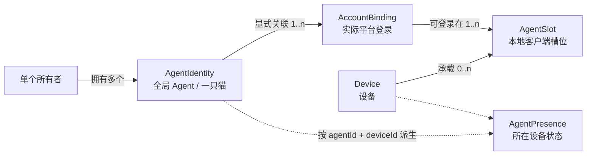
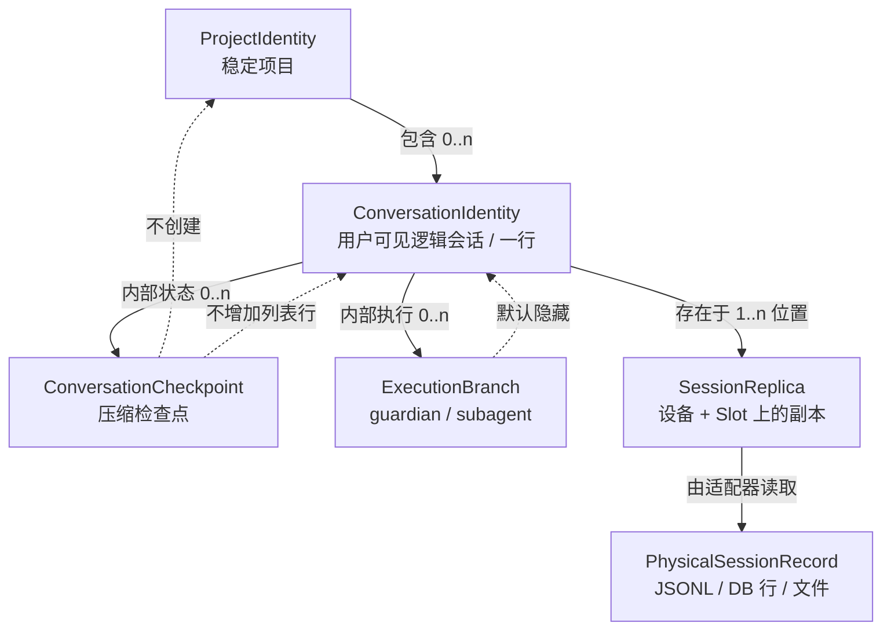
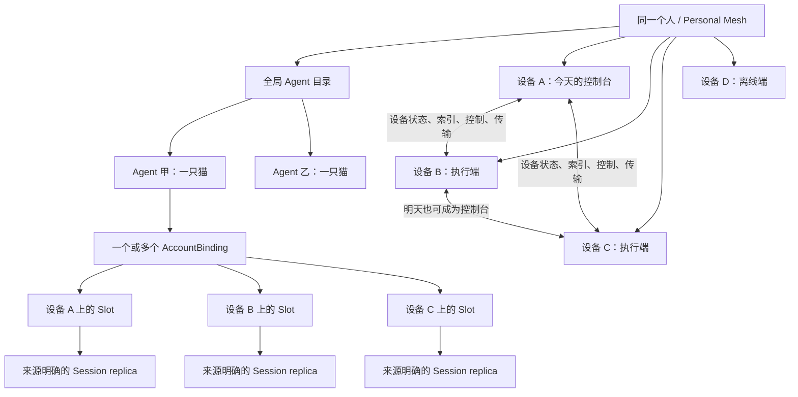
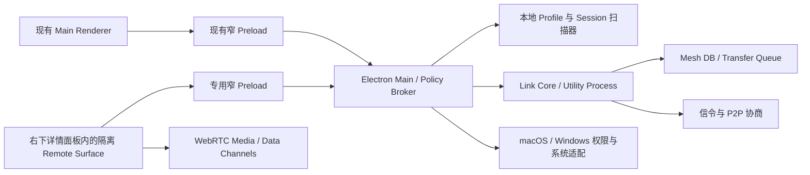

# AgentDesk Personal Agent Mesh 系统规划基准

> 状态：OWNER APPROVED — IMPLEMENTATION AUTHORIZED
>
> 版本：1.19
>
> 日期：2026-08-13
>
> 工作分支：codex/agentdesk-personal-mesh-plan
>
> 当前授权：所有者已于 2026-08-10 明确批准本基准并要求开始开发，并于 2026-08-13 审阅“全局员工库 + 工作环境 + 按需就绪”规划后明确要求直接实施；允许按本文阶段和门禁实施，任何后续方向变化仍须先写回本文件。
>
> 完整产品审阅稿：`docs/PERSONAL_AGENT_MESH_OWNER_REVIEW.html`。UI 层级与排版实施蓝图：`docs/AGENTDESK_UI_HIERARCHY_LAYOUT_PLAN.html`，已于 2026-08-12 获所有者批准。“全局员工库 + 工作环境 + 按需就绪”的实施细化见 `docs/AGENT_LIBRARY_ON_DEMAND_PROVISIONING_PLAN.md`。`docs/PERSONAL_AGENT_MESH_REVIEW.html` 保留为会话身份问题的专项技术图解。本文仍是实施时必须完整重读的单一基准；细化稿不得覆盖本文。

## 0. 强制重读与实施门禁

本文件是 Personal Agent Mesh 后续设计和开发的单一基准。只要任务涉及设备、P2P、远程控制、跨设备会话发现、会话发送、文件传输或多设备资源调动，就必须遵守以下顺序：

1. 确认当前仓库、分支和工作树状态。
2. 从本文件第一行读到最后一行，不允许只读摘要、目录或局部章节。
3. 重新核对“已确认决策”“待所有者审阅决策”和最近变更记录。
4. 确认当前阶段的实施门禁已经由所有者放行。
5. 然后才可以规划代码改动、编辑源码或运行会产生外部副作用的操作。

以下任一情况发生后，必须重新执行完整重读：

- 对话或上下文被压缩；
- 任务由另一段会话、另一位开发者或另一个 Agent 接手；
- 工作中断后恢复；
- 分支发生切换、重放、合并或基线更新；
- 用户补充了会改变产品模型的新场景；
- 实现结果与本文件出现冲突。

对话摘要不能替代完整重读。若本文件标记为 DRAFT FOR OWNER REVIEW，则任何产品代码实现都应停止在规划阶段。当前 0.5 已获所有者批准，但阶段退出条件仍不能跳过。

本文件与现有文档的关系：

- 在本规划获批前，docs/PRODUCT.md、docs/INTERNAL.md 和当前测试仍代表已发布产品事实。
- 本文件描述拟议的新产品边界，不自动覆盖现有行为。
- 规划获批后，先更新产品定义、内部结构、场景和测试契约，再进入分阶段实现。
- 任何批准后的方向变化必须写入本文件的决策记录，不能只留在聊天里。

## 1. 一句话定义

AgentDesk Personal Agent Mesh 是服务于单个使用者的多设备 Agent 控制平面：同一个人用一份全局 Agent 目录管理自己的全部 Agent，再把每个 Agent 在不同平台账号、设备和客户端形态上的登录位置作为可选择的执行端；任意可信设备都可以查看会话、发送简洁会话信息、按需传输文件，并在授权范围内查看或操作其他设备。

它不是团队协作平台，也不是通用远程运维平台。

## 2. 核心场景

用户拥有多台电脑，例如：

- 一台日常使用的笔记本；
- 一台长期在线的 Mac Studio；
- 一台有高性能 GPU 的 Windows 工作站；
- 其他临时或备用设备。

真实关系不是“一个账号属于一台设备”，而是多对多：

- 同一个实际登录账号可以同时出现在 MacBook、Mac Studio 和 Windows 工作站上；
- 同一台设备可以登录多个不同账号；
- 同一个账号在同一设备上还可能同时有 Desktop、CLI 等多个客户端槽位；
- 一个用户定义的 Agent 可以显式关联一个或多个平台账号，但跨平台绝不靠名称自动合并。

因此，设备名不能成为账号身份的一部分，也不能靠给重复账号卡片添加机器标签来完成管理。用户需要先看见去重后的“全部 Agent”，再按设备筛选或为具体动作选择执行位置。

用户在某一时刻只坐在其中一台设备前，但希望：

- 看见所有在线或离线设备；
- 一眼看见自己共有多少个 Agent，而不是把同一 Agent 在三台机器上重复算三次；
- 知道每个 Agent 当前分布在哪些设备、哪些设备在线，以及有哪些客户端形态；
- 也能反向查看某台设备上有哪些 Agent；
- 搜索所有设备上的历史与活跃会话；
- 打开并操作来源设备上的官方 Agent 客户端；
- 把一条或多条会话的定位信息发送到另一台设备；
- 在必要时发送相关文件；
- 同时观察多台设备，但避免键盘鼠标误发；
- 根据设备负载主动选择在哪台设备上继续工作；
- 不必把账号凭据、Cookie 或 Token 集中托管到云端。

设备在这个系统中相当于一个标准化“端口”或执行端。今天设备 A 是控制台，明天设备 B 也可以成为控制台。不存在固定主机、唯一主设备或必须保留的远端设备。

## 3. 已确认决策

以下内容来自所有者已经明确表达的产品意图，后续不得无故偏离：

1. 产品主要服务于单个使用者，不为多人团队协作设计。
2. 一个使用者可以添加多台自己的设备。
3. 任意可信设备都可以成为当前控制台，其他设备只是可连接的执行端。
4. 每台设备可以承载多个平台、多个账号槽位和多个会话。
5. Agent 与平台没有强绑定；设备能力不能围绕某一个供应商设计。
6. 所有远端设备都必须可以撤销和删除，不存在必须保留一个的产品规则。
7. 主窗口保持 1040 × 840、庭院/卡片双视图和既有账号工作流；页面容器采用一个 Header、一个 Footer 与三个固定面板，不再保留七行信息轨。
8. “复制会话信息”仍是会话区最重要的主操作。
9. 复制内容继续收敛为路径和坐标，不增加多种复制类型、交接话术或提示词模板。
10. 本次先形成全面、系统、足够深的规划，经过所有者审阅后才能实施。
11. 每次上下文压缩或任务恢复后必须重新完整阅读本规划。
12. 同一个账号可以在不同设备登录，同一台设备也可以登录多个账号；这是必须直接建模的多对多关系。
13. Agent 是全局、面向人的管理对象，不由设备或平台定义；设备只表示它当前可在哪里运行。
14. 同一 Agent 在多台设备上的出现不能渲染成多只猫，也不能只靠机器标签做事后去重。
15. 上下文压缩只是同一逻辑会话内部的检查点，不创建新项目、不创建新会话，也不增加会话列表行。
16. guardian、subagent 等内部执行记录必须归属于用户根会话，默认不出现在用户会话列表；即使父记录暂时不可见，也不能把内部记录提升成用户会话。
17. 项目与会话是两个独立身份轴。`cwd`、文件路径和窗口位置只是来源位置元数据，不能直接充当 ProjectIdentity 或 ConversationIdentity。
18. Agent 是长期存在的全局“员工”，不再由已有 Slot 反向推导生命周期；移除最后一个运行位置或最后一个平台账号都不能自动删除 Agent，只有显式“删除 Agent”才能使其消失。
19. Device 是员工的工作环境。选择某台设备后仍展示完整员工库，并以“已就绪 / 首次准备 / 需要登录 / 缺少客户端 / 不支持 / 离线”等状态表达该员工在此环境中的可用性，不能用不存在 Slot 作为隐藏员工的理由。
20. 普通首次使用流程统一为“确保 Agent 在目标设备就绪，然后打开”。系统负责创建受管目录、应用白名单配置、恢复允许的技能/工具要求、验证登录身份并提交部署；用户不再手工同步 Slot、选择归属或填写路径。
21. 自动准备不能绕过操作系统安装确认、官方登录、验证码或双重认证；密码、Token、Cookie 和官方浏览器登录数据继续不跨设备。若以后要求免登录凭据迁移，必须单独进行产品与安全评审。
22. 远端打开使用固定语义动作；远端首次准备一期保持有人值守。目录创建和受控配置可自动执行，软件安装、官方登录和系统权限仍由目标设备明确确认。

## 4. 所有者已批准的实施默认值

以下默认值已随 0.5 基准在 2026-08-10 获得所有者整体批准。表内仍明确标注需要在对应 Phase 单独评审的参数，不因整体批准而提前放行。

1. 第一阶段采用“无云账号的个人设备网”：设备身份由密钥和配对关系建立，不先做登录、组织和成员系统。
2. 配对后的设备默认可以同步设备状态、全局 Agent 目录、运行位置和会话索引；屏幕查看、输入控制、文件接收和无人值守分别授权。
3. 原始账号凭据、官方客户端 Cookie、Token 和密码永远不跨设备同步。
4. 第一版优先完成设备发现、全设备会话索引、会话信息发送和项目路径映射，再做远程画面与输入控制。
5. 第一版不做通用远程 Shell、不接受任意命令、不自动安排 Agent 任务。
6. 多设备同时连接时，只允许一个明确的“当前输入目标”；其他设备可以监控或接收语义动作。
7. 原始会话迁移必须由客户端专用适配器声明支持；默认只发送会话引用，不直接写官方数据库。
8. 现有主窗口不改 1040 × 840 尺寸；主区固定为顶部 Agent 面板、左下会话列表和右下统一详情。设备、工具、活动、设置分别使用独立的有界模态弹窗，不改变底层工作台；右下详情只承载会话、额度和隔离远控等当前工作对象，不创建新的永久区域或额外产品主窗口。远控媒体仍由专用沙箱 WebContentsView 承载，普通 Main Renderer 不接触 SDP、媒体轨、采集源或 TURN 凭据。
9. 当前本地 Identity Group 自动迁移为初始 AgentIdentity，Profile 成为本机 AgentSlot，会话保持原来源，无需用户重新配置路径。
10. 无人值守能力单独分期，不与第一版远程查看/控制一起默认开启。
11. 小型 SessionPointer 的离线投递需要在“只存发送端”和“服务端短期保存端到端密文”之间由所有者确认；文件与 transcript 不进入服务端邮箱。
12. 默认一只猫对应一个全局 AgentIdentity；设备和客户端形态通过运行位置选择器进入，不在庭院重复造猫。
13. 设备维度与 Agent 维度正交：顶栏选择“全部设备/某台设备”，会话区继续选择“当前 Agent/全部 Agent”，不把两个维度压成含义混乱的单一三段开关。
14. 有可靠账号标识时使用 Mesh 范围的不可逆关联键自动归并；没有可靠标识时明确区分“已有登录在新设备上的位置 / 已有 Agent 的另一个平台账号 / 全新 Agent”，不按名称、路径、标题或邮箱猜测。
15. 跨平台账号只有在用户显式操作时才能归入同一 Agent；系统不能因为名称相同就自动合并。
16. 同一会话在多台设备存在副本时，只在有强稳定标识或明确来源链时折叠；不按标题和时间模糊去重。
17. 全局员工库与设备库存分离同步：Agent、AccountBinding、员工配置和显式删除属于签名目录事实；设备库存只发布来源设备自己的部署、Slot、活动和会话副本。
18. 新设备配对完成后先取得完整员工库，再扫描本机环境。一个 Agent 即使在任何设备都没有 Slot，也必须继续存在并可见。
19. 首次准备采用可恢复、幂等的事务任务；失败或应用重启不得产生重复 Profile、重复 Slot 或半提交目录关系。

## 5. 产品边界

### 5.1 本规划纳入的能力

- 个人设备网创建、加入、重命名、撤销、删除和重置；
- 设备在线状态、系统信息、能力和轻量硬件负载；
- 个人全局 Agent 目录、账号绑定、运行位置以及合并/拆分/删除；
- 每台设备上的 AgentSlot 目录及反向筛选；
- 跨设备只读会话索引与搜索；
- 显式发送会话信息；
- 跨设备项目路径映射；
- 用户选择的文件传输；
- 固定语义的远端动作，例如打开已知账号、聚焦已知会话；
- 屏幕查看、鼠标键盘控制和多显示器选择；
- 多设备控制台、连接诊断、断线恢复和审计；
- P2P 直连、必要时加密中继；
- macOS 与 Windows 的权限适配。

### 5.2 明确不纳入第一版

- 团队、组织、成员、审批流和多人共享设备；
- 云端保存或检索完整 transcript；
- 云端托管 Agent 账号凭据；
- 自动合并多条会话；
- 自动生成摘要、下一步、优先级、交接清单或提示词；
- 通用远程终端、任意 Shell、任意可执行命令；
- 自动把任务分配给空闲 Agent；
- 自动控制 Agent 对话生命周期；
- 自动同步整个项目目录；
- 自动把一台设备上的官方客户端数据库覆盖到另一台设备；
- 控制 Windows UAC 安全桌面、登录界面或绕过系统权限；
- 第一版支持 Linux、移动端或浏览器端控制台。

### 5.3 可以后续单独立项

- 基于硬件能力的手动或自动任务分发；
- GPU 作业和批处理资源调度；
- 经验证的特定客户端会话迁移适配器；
- 音频转发；
- Linux Wayland / PipeWire 支持；
- 移动端只读监控；
- 端到端加密的项目选择性同步。

这些后续方向不能借“设备连接”之名提前混进第一版。

## 6. 当前产品基线与不可破坏约束

### 6.1 现有核心对象

当前产品已经稳定区分：

- 客户端类型；
- 本地账号槽位 Profile；
- 同一登录的身份组；
- 本地历史会话 Session；
- 工具记录；
- 活动、额度和庭院状态。

现有 Identity Group 只解决“同一台机器上，同一登录的多个客户端形态如何合成一只猫”。它不是跨设备身份，也没有稳定的 Mesh 级对象。

Personal Agent Mesh 必须新增 PersonalMesh、Device、全局 AgentIdentity 和 AccountBinding。现有 Profile 继续表示本地槽位，但降为最末端的运行位置。不能把设备塞进 Profile、Identity Group 或 Session 的标签字段中假装完成，也不能把本地 `identityFingerprint` 直接当成跨设备主键。

### 6.2 现有安全边界

必须保留：

- Renderer 无 Node；
- contextIsolation 开启；
- nodeIntegration 关闭；
- Chromium sandbox 开启；
- Preload 只暴露明确方法；
- Main 对 ID 重新查表；
- Renderer 不能提交任意路径、命令、可执行文件、参数或 URL；
- 会话扫描器默认只读；
- 配置写入保持原子替换和备份。

网络能力不能成为绕过这些原则的第二条通道。远端请求必须比本地 Renderer 请求更严格。

### 6.3 主窗口布局契约

当前主窗口固定为 1040 × 840，页面只有五个结构对象：

1. 一个 Header；
2. 顶部 Agent 面板：庭院或卡片及当前 Agent/运行位置操作；
3. 左下会话列表面板；
4. 右下统一详情面板；
5. 一个 Footer。

主区第三、第四项与顶部 Agent 面板合计恰好三个固定面板。右下详情面板只承载会话详情与动作坞、额度详情，以及进入远控后由隔离 WebContentsView 提供的 Remote Surface。设备、工具、活动、设置属于 Header 发起的四个独立模态弹窗；配对、权限、诊断、传输历史等子流程留在所属弹窗或其受控次级弹窗中，不把全局功能硬塞进右下详情。不得在三个面板之间临时插入信息条、选择条、提醒区、额度区、抽屉或整页工作区。会话动作固定进入右下会话详情底部的单一动作坞；Footer 只承担全局状态、今日账本与提醒开关，不承载会话选择或瞬时会话动作。

本重构不得：

- 恢复旧侧栏；
- 恢复七行信息轨或在三个面板之间插入第四块；
- 把庭院和卡片视图拆成两套业务状态；
- 把设备卡片直接塞进庭院替代账号猫；
- 把远程媒体直接塞进普通 Main Renderer，或让它接触 SDP、媒体轨、采集源和 TURN 凭据；
- 降低“复制会话信息”的视觉权重；
- 把会话表改成任务队列；
- 重新引入已删除的 handoff、artifact 或 runtime 控制台结构。

### 6.4 已证实的历史会话索引缺陷与修复基线

2026-08-08 对本机 Codex 数据做了只读、脱敏核对。这个结果用于确认问题性质，不把本机数量写成长期产品假设：

| 实际对象 | 数量 | 应否成为默认列表行 |
|---|---:|---|
| 用户根会话 | 6 | 是，每个逻辑会话一行 |
| guardian/subagent 内部 rollout | 10 | 否，只能挂在父会话诊断树下 |
| 物理 JSONL 文件总数 | 16 | 不能直接等于列表行数 |

修复前，`src/sessions.js` 的 `scanCodex` 同时扫描 `sessions` 与 `archived_sessions`，再用每个文件自己的 `payload.id` 去重并写入 `address`；`src/session-table.js` 又用 `profileId + address` 作为行键。扫描器当时没有读取或处理 `thread_source`、`source.subagent` 和 `parent_thread_id`，于是每个内部文件都获得独立行。

本机 10 个内部文件全部满足：

- `thread_source = subagent`；
- `source.subagent.other = guardian`；
- `parent_thread_id = session_id = 用户根会话 ID`；
- 自己的 `payload.id` 与父会话 ID 不同。

与此同时，用户根 JSONL 内部可以连续出现多次 `compacted` 与 `context_compacted` 事件，根会话 ID 和文件都不变。当前样本中一个根会话已经发生 5 次压缩，仍然只有一个用户根记录。这证明“压缩创建新项目”不是源数据语义，而是 AgentDesk 把物理执行记录误当成用户会话的索引身份错误。

Claude CLI 扫描器已经有等价先例：遇到 `isSidechain === true` 的子 Agent 文件直接不进入默认列表。当前 Codex 适配器已按同一产品语义分类用户根、压缩检查点与 internal-child，并保留父子谱系供诊断；相应回归证明压缩和 guardian/subagent 不再增加默认会话行。跨设备库存继续消费这份归一化结果，不以物理文件数重新生成身份。

## 7. 领域模型

### 7.0 核心决策：不采用“账号卡片 + 机器标签”的扁平模型

曾考虑的扁平方案是：每台设备继续发布自己的 Profile，主界面把它们全部列出来，再给每张账号卡片加机器名标签。该方案不采用，原因是：

- 同一账号登录三台设备会被计算成三个 Agent；
- 猫外观、名称、分组和备注会出现三份并可能互相冲突；
- 同一订阅额度会被重复展示甚至错误相加；
- 同一个云端会话可能重复三行；
- “打开账号”到底打开哪台机器只能靠临时猜测；
- 删除一张卡无法说明是在移除一个运行位置，还是删除整个 Agent；
- 机器标签越加越多，仍然没有一个稳定的个人 Agent 目录。

因此采用“全局 AgentIdentity 为主轴，Device 为筛选轴，AgentSlot 为动作落点”的分层模型。机器名称仍然重要，但只作为 Presence/Slot 的位置元数据，而不是 Agent 身份。

### 7.1 PersonalMesh

代表一个人的可信设备空间。

建议字段：

- meshId；
- displayName；
- rootPublicKey；
- protocolVersion；
- createdAt；
- recoveryState；
- membershipRevision。

PersonalMesh 不是云账号。云端服务只帮助设备相互发现和连接，不获得代表用户授权设备的能力。

### 7.2 Device

一台加入 PersonalMesh 的电脑。

建议字段：

- deviceId；
- devicePublicKey；
- name；
- platform、arch、osVersion；
- appVersion、protocolVersion；
- status：online、offline、sleeping、connecting、revoked；
- capabilities；
- permissions；
- lastSeenAt；
- pairedAt；
- revokedAt；
- hardwareSummary；
- inventoryRevision。

Device 不包含 Agent 账号凭据。

### 7.3 AgentIdentity

AgentIdentity 是用户真正管理、庭院真正展示的全局 Agent。它既不属于某台设备，也不由 Claude、Codex、Kimi 等平台定义。

建议字段：

- agentId：Mesh 内稳定 UUID；
- displayName；
- catAppearance；
- group、note；
- createdAt、updatedAt；
- lifecycleState：active、paused、deleting、deleted；
- catalogRevision。

规则：

- 默认一个被识别出的实际账号生成一个 AgentIdentity；
- 用户可以把多个平台账号显式归入同一 AgentIdentity，表达“它们是同一个工作 Agent”；
- 跨平台绝不自动合并；
- 一个 AgentIdentity 可以分布在零到多台设备，也可以暂时没有 AccountBinding；这表示员工尚未配置平台登录，不等于员工已被删除；
- 不按平台预建 Claude、Kimi 等默认 Agent，但用户显式创建或迁移得到的 Agent 只在明确“删除 Agent”后消失；
- 移除最后一个运行位置只使所有设备部署回到未准备，移除最后一个 AccountBinding 只使 Agent 进入待配置；两者都不能触发隐式删除；
- 所有 Agent 都可以删除，目录可以为空。

### 7.4 AccountBinding

AccountBinding 表示一个实际的平台登录身份，例如某个 Codex 账号或某个 Claude 账号。它回答“这是哪个登录”，不回答“在哪台机器”。

建议字段：

- accountBindingId；
- agentId；正常状态必填，首次发现待归属时可为空；
- providerNamespace；
- displayAlias；
- meshScopedAccountKey；
- linkMethod：automatic、manual、imported；
- verificationState；
- createdAt、lastVerifiedAt。

关系规则：

- 一个 AgentIdentity 可以有一个或多个 AccountBinding；
- linked 状态的 AccountBinding 必须且只能属于一个 AgentIdentity；待归属时可以暂时不属于任何 Agent；
- 同一个 AccountBinding 可以在多台设备上有 AgentSlot；
- AccountBinding 不保存邮箱、密码、Cookie、Token 或平台原始账号 ID；
- AccountBinding 可以在零个设备上存在，表示这张员工工作证已经登记但尚未在当前设备登录；
- 合并和拆分 AccountBinding 只改变 AgentDesk 的目录关系，不改官方账号或本地会话文件。

### 7.5 AgentPresence

AgentPresence 是 `(agentId, deviceId)` 的派生聚合，表示某个全局 Agent 在某台设备上的就绪情况。它不是新的登录账号，也不是独立事实源；即使该设备尚无 Slot，也必须能从 AgentDeployment 或员工配置派生“首次准备”等状态。

建议字段：

- agentId；
- deviceId；
- slotIds；
- bindingIds；
- status：ready、preparing、needs-login、missing-client、unsupported、offline、error；
- activitySummary；
- launchableForms；
- sessionCount；
- lastSeenAt；
- dataFreshness。

同一个 Agent 在同一设备上有 Desktop 和 CLI 两个槽位时，只形成一个 Presence；在三台设备上出现时形成三个 Presence，但庭院仍只展示一个 Agent。

### 7.6 AgentSlot

AgentSlot 是最末端、可执行的本地客户端槽位，对应当前 Profile。打开账号、诊断、路径、重扫和本地删除等动作最终都必须落到一个明确的 AgentSlot：

- deviceId；
- profileId；
- agentId：linked 状态必填，pending/suppressed 时可为空；
- accountBindingId：识别出实际登录时填写，未知时可为空；
- appId、clientForm；
- localLabel：兼容当前 Profile 名称，只作为该运行位置的本地说明；
- assignmentState：linked、pending、identity-changed、suppressed；
- launchable；
- profilePathMode、sessionRootMode；
- sessionCount；
- activityState；
- quotaSnapshotRef；
- observedAccountKeyVersion；
- lastUpdatedAt。

同一 profileId 只在所属设备内唯一，槽位稳定键是 `deviceId + profileId`。`agentId` 用于全局归组，`accountBindingId` 用于确认是不是同一个实际登录，三者不能互相替代。

### 7.6.1 AgentBlueprint

AgentBlueprint 是全局员工配置，描述“这名员工需要什么工作条件”，不保存任何登录秘密。用户界面只称“员工配置”。

建议字段：

- blueprintId、agentId、revision；
- preferredProvider、preferredClientForm；
- desiredBindings：需要使用的 AccountBinding 与优先顺序；
- portableSettings：只允许客户端适配器声明的非敏感配置；
- skillRequirements：技能 ID、版本和可信来源，不直接等于任意本地目录；
- toolRequirements：固定工具目录中的 toolId 与版本约束；
- projectRequirements：ProjectIdentity 引用，不包含来源设备绝对路径；
- createdAt、updatedAt、updatedByDeviceId。

规则：

- Blueprint 属于签名全局目录事实，新设备配对后即取得；
- 不复制整个用户目录、`~/.codex`、官方客户端数据库、项目目录或任意 dotfiles；
- 适配器没有声明的字段不能写入目标设备；
- 技能内容只能来自可信固定来源或用户显式发送的受控包；
- Blueprint 缺失时 Agent 仍存在，但打开动作进入“待配置”。

### 7.6.2 AgentDeployment

AgentDeployment 表示一名员工在一台设备上的准备结果，是 `(agentId, deviceId)` 的设备事实。它把“员工存在”和“这台电脑已经可工作”分开。

建议字段：

- deploymentId、agentId、deviceId；
- blueprintRevision；
- state：absent、planning、preparing、waiting-install、waiting-login、verifying、ready、error、unsupported、retired；
- preferredSlotKey、slotKeys；
- adapterId、adapterVersion；
- lastVerifiedAt、lastOpenedAt；
- lastErrorCode、resumeJobId；
- revision、updatedAt。

目标设备只写自己的 Deployment。其他设备只缓存签名摘要，不能远端伪造“已就绪”。删除 Deployment 不删除 Agent、AccountBinding、官方客户端数据或项目文件。

### 7.6.3 ProvisioningJob

ProvisioningJob 是一次“确保员工在目标设备就绪”的可恢复事务，用户界面称“首次准备”。

建议字段：

- jobId、agentId、deviceId、requestedClientForm；
- blueprintRevision；
- state、currentStep、completedSteps；
- stagingProfileId、resultSlotKey；
- waitingReason、lastErrorCode、retryCount；
- createdAt、updatedAt、completedAt、cancelledAt。

硬规则：

- `(agentId, deviceId, clientForm)` 同时最多一个活动 Job；重复点击复用现有任务；
- 每一步幂等，应用退出后从持久状态恢复；
- Profile 与 Slot 在身份验证通过前保持 staging，不进入普通运行位置和会话统计；
- 成功时原子提交 Deployment、Profile 与 Slot 关系；失败只清理 AgentDesk 创建的暂存记录，不删除官方客户端或用户文件；
- 需要软件安装、官方登录、验证码、双重认证或系统权限时进入明确等待状态，不能伪装成自动完成；
- 登录身份与预期 AccountBinding 不一致时停止提交并要求用户纠正，不能静默改绑员工。

### 7.7 多对多关系与不变量



必须始终成立：

1. 设备 A 和设备 B 上相同 AccountBinding 的槽位，归到同一个 AgentIdentity。
2. 设备 A 上两个不同账号，即使 appId 相同，也必须是两个 AccountBinding；除非用户显式归组，否则也是两个 AgentIdentity。
3. 同一 Agent 在一台设备有多个客户端形态，只增加 Slot，不增加猫。
4. 同一 Agent 在多台设备出现，只增加 Presence，不增加猫。
5. AgentIdentity 是展示和管理主轴；Device 是工作环境轴；AgentDeployment 表示该员工在环境中的就绪状态；AgentSlot 是已就绪后的具体动作落点。
6. 任何副作用动作都必须解析到一个确切 `deviceId + profileId`，不能只拿 agentId 猜执行位置。

示例：

    工作 Agent（一只猫）
      ├─ Codex 工作账号（AccountBinding A）
      │    ├─ MacBook / Codex Desktop（Slot）
      │    └─ Mac Studio / Codex CLI（Slot）
      └─ Claude 工作账号（AccountBinding B，用户显式关联）
           └─ Windows 工作站 / Claude Desktop（Slot）

    个人 Agent（一只猫）
      └─ Codex 个人账号（AccountBinding C）
           └─ MacBook / Codex CLI（Slot）

在“全部设备”视角只显示两只猫；筛到 MacBook 时仍是这两个 Agent；筛到 Mac Studio 时只显示“工作 Agent”。设备标签没有参与定义 Agent，只参与筛选和选择 Slot。

### 7.8 跨设备身份识别与纠错

自动归并只允许使用客户端适配器取得的稳定账号 ID，并在来源设备本地计算：

    meshScopedAccountKey = HMAC-SHA-256(
      meshIdentityLinkKey,
      canonicalEncode({ providerNamespace, canonicalAccountId })
    )

适配器必须固定 providerNamespace 和 canonicalAccountId 的规范化规则，不能用字符串直接拼接。属于同一实际登录体系的 Desktop/CLI 适配器必须共享 providerNamespace 和账号 ID 规范；客户端形态不能混进账号键。只同步完整 HMAC 结果，不同步原始账号 ID、邮箱或凭据。`meshIdentityLinkKey` 只属于当前 Personal Mesh，并带 key version；新设备在已认证配对通道中取得当前版本，已撤销设备不能取得后续轮换。因此同一账号在两个互不相关的 Mesh 中不会产生可被服务端关联的公共指纹。

新设备 Slot 自动命中已有 AccountBinding 时，只增加运行位置；它的本地 Profile 名称保留为 localLabel，但不能覆盖 AgentIdentity 的全局名称、猫外观、分组或备注。全局元数据只能通过明确的目录编辑事件修改。

没有可靠稳定账号 ID 时：

1. 新槽位默认保持“待归属”；
2. “这是已有登录在新设备上的位置”：选择现有 AccountBinding，只新增 Slot；
3. “这是已有 Agent 的另一个平台账号”：选择 AgentIdentity，新建 AccountBinding 和 Slot；
4. “这是全新的 Agent”：同时新建 AgentIdentity、AccountBinding 和 Slot；
5. 可展示设备、平台、客户端形态和本地备注辅助用户判断；
6. 不按显示名、目录名、会话标题、邮箱文本或创建时间自动合并。

已有错误关系必须可以纠正：

- 合并 Agent：用户显式选择两个 Agent，预览账号绑定、设备位置和会话数量后合并；
- 拆分 Agent：把选定 AccountBinding 或 AgentSlot 移到新的 AgentIdentity；
- 两种操作都记录审计、可在短期内撤销；
- 纠错不移动、不复制、不删除官方客户端数据；
- 跨平台 AccountBinding 的合并永远要求用户显式确认。

同一个本地 Profile 以后退出账号并登录成另一个账号时，meshScopedAccountKey 会变化。此时不能把 Slot 连同全部历史静默搬到新 Agent：

1. Slot 进入 identity-changed 状态并暂停向旧 AccountBinding 发布新的账号级聚合；
2. UI 要求用户确认“关联已有登录 / 已有 Agent 的另一账号 / 全新 Agent”；
3. 适配器能为单条会话提供账号身份时按记录精确归属；
4. 无法精确判断的旧会话保留原归属或标记 ambiguous，不按最新登录批量改名；
5. 保存 SlotBindingHistory 的起止时间、关联方式和用户确认，允许审计与纠错。

### 7.9 项目、会话、压缩与物理记录的正交身份模型

会话列表必须展示用户理解的“对话”，不能展示扫描器碰到的“文件”。正确模型从上到下是：



六层对象回答六个不同问题：

| 对象 | 回答的问题 | 用户默认可见性 | 是否因压缩新建 |
|---|---|---|---|
| ProjectIdentity | 这项工作属于哪个稳定项目 | 作为项目字段/筛选 | 否 |
| ConversationIdentity | 用户在继续哪一条对话 | 是，一条会话列表行 | 否 |
| ConversationCheckpoint | 模型上下文在哪次被压缩 | 否；只供恢复与诊断 | 是，但只在会话内部 |
| ExecutionBranch | guardian/subagent 在后台做了哪段工作 | 否；可在诊断谱系展开 | 否；按内部执行需要创建 |
| SessionReplica | 这条逻辑会话具体存在于哪台设备、哪个 Slot | 仅在位置选择与详情中 | 否 |
| PhysicalSessionRecord | 适配器实际读取了哪个文件或数据库记录 | 否 | 不确定，不能决定上层身份 |

#### 7.9.1 ProjectIdentity 与 ProjectBinding

ProjectIdentity 是稳定工作区或仓库，不是某个会话的 `cwd` 字符串。一个项目可以有很多会话；一条会话被压缩、归档、恢复或在另一台设备出现，都不会因此创建新项目。

ProjectIdentity 的建立依据按可信度排序：

1. 用户显式创建或确认的稳定 projectId；
2. 已确认属于同一仓库的规范化 Git remote 与仓库根指纹；
3. 适配器提供的稳定 workspace ID；
4. 用户确认的跨设备别名。

`cwd`、目录名和绝对路径只能生成 ProjectBinding 候选，不能自动生成新的 ProjectIdentity。ProjectBinding 至少包含 `projectId`、`deviceId`、`localRoot`、`source`、`verifiedAt` 与 `lastResolvedAt`。若会话过程中 cwd 改变，只更新访问位置或 `visitedProjectIds`；除非用户明确重新归属，否则不拆分会话、不创建项目。

#### 7.9.2 ConversationIdentity

ConversationIdentity 是会话表唯一直接渲染的身份，代表用户可继续、可复制信息、可发送的一条逻辑对话。建议字段：

- conversationId：AgentDesk/Mesh 稳定 ID；
- adapterNamespace 与 adapterConversationKey；
- agentId、accountBindingId；
- primaryProjectId，可为空；
- title、createdAt、updatedAt、lifecycleState；
- replicaIds；
- checkpointCount 与 internalBranchCount，只作诊断摘要；
- originConversationId，用于明确的用户迁移或显式 fork 来源。

同一用户根会话无论压缩多少次，`conversationId` 都不变。只有用户显式新建对话、客户端明确暴露一个新的用户根线程，或用户显式 fork，才创建新的 ConversationIdentity；新会话可以继续属于同一个 ProjectIdentity。

#### 7.9.3 ConversationCheckpoint

ConversationCheckpoint 表示一次上下文压缩、摘要替换或恢复边界。它属于 ConversationIdentity 或其中一条 ExecutionBranch，保存发生时间、适配器事件坐标、前后版本和恢复所需摘要引用。

硬规则：

- `compacted` 和 `context_compacted` 永远只增加 checkpointCount；
- checkpoint 不参与会话列表 key、项目推断、标题索引和活跃/归档状态；
- checkpoint 前后的消息继续按同一个 ConversationIdentity 展示与复制；
- 物理格式即使未来改为“每次压缩新文件”，也只能增加 PhysicalSessionRecord，不能自动增加会话行。

#### 7.9.4 ExecutionBranch

ExecutionBranch 表示 guardian、subagent、sidechain 等内部执行谱系。建议字段包括 `branchId`、`conversationId`、`parentBranchId`、`kind`、`physicalRecordIds`、`createdAt`、`updatedAt` 与 `diagnosticState`。

内部分支遵守以下显示规则：

- 默认会话列表永远不显示；
- 默认搜索结果、项目计数、Agent 会话数和活跃会话数都不计入；
- 标题不得借父会话索引后伪装成一条同名用户会话；
- 父根会话已归档时，活跃目录中的内部分支不能把父会话伪装成“可用”；
- 父记录暂时缺失时标记为 `diagnostic-orphan`，等待重扫或修复，绝不提升为用户会话；
- 如以后提供开发者诊断入口，只能在父会话下展开谱系，并明确标注“内部执行”。

#### 7.9.5 SessionReplica 与 PhysicalSessionRecord

SessionReplica 是一条逻辑会话在确切 `deviceId + profileId` 上的可操作副本。它保留 `replicaId`、conversationId、deviceId、profileId、appId、sourceRevision、projectPathHint、relativePath、sourceFileHint、coordinate、status、portability 与 staleAt。来源设备是副本事实的唯一写入者，其他设备只缓存。

PhysicalSessionRecord 是扫描适配器观察到的原始载体。它保留 `physicalRecordId`、filePath/database locator、adapter metadata、recordKind 与 parent locator，只用于解析、增量更新和诊断。文件路径变化或新增内部文件不会直接改变 ConversationIdentity。

同一逻辑会话跨设备折叠仍坚持强标识原则：只有客户端稳定 thread ID 或明确 `originDeviceId + originConversationId` 来源链才能合并；标题、项目名、cwd 和时间相近只作提示。任何打开、定位、复制和发送动作最终仍要解析到明确的 SessionReplica。

#### 7.9.6 稳定键与 Codex 适配器分类契约

归一化后不再让一个含糊的 `sessionId` 同时代表物理文件、逻辑会话和跨设备副本：

| 键 | 建议组成 | 用途 |
|---|---|---|
| physicalRecordKey | deviceId + profileId + payload.id；无 ID 才退回文件定位 | 追踪原始载体 |
| adapterConversationKey | 适配器命名空间内的用户根 thread ID | 本设备/Slot 内归组 |
| conversationId | 强 provider thread ID 的 Mesh 命名空间键，或明确 origin 链；否则设备作用域 ID | 用户逻辑会话 |
| replicaId | deviceId + profileId + adapterConversationKey | 精确动作目标 |
| checkpointId | conversationId + 适配器事件坐标/稳定序号 | 内部恢复点 |
| branchId | physicalRecordKey 或适配器稳定 branch ID | 内部执行谱系 |
| projectId | 独立 ProjectIdentity 解析结果 | 项目归属与跨设备映射 |

Codex 记录按以下顺序分类：

1. 读取 `session_meta`，保留 `payload.id` 作为物理记录 ID。
2. 若存在 `parent_thread_id`，或 `thread_source === "subagent"`，或 `source.subagent`，分类为 internal-child。
3. internal-child 使用 `parent_thread_id || session_id` 找父 ConversationIdentity；只进入内部谱系。
4. 用户根记录使用 `session_id || id` 作为 adapterConversationKey；同一键在 active/archive 中只产生一个逻辑会话。
5. 根记录内的 `compacted`/`context_compacted` 解析为 checkpoint，不产生行。
6. title 从用户根和根 `session_id` 的索引解析；内部记录不能单独借这个标题成为一行。
7. lifecycleState 只由用户根记录决定；父根同时出现在 active/archive 时按根记录 revision 归一并报告冲突，子记录不参与判定。
8. 最后独立解析 ProjectIdentity；`payload.cwd` 只进入 projectPathHint/ProjectBinding 候选。

当前 Codex 样本的正确结果是：16 个 PhysicalSessionRecord 被分类为 6 个用户根与 10 个内部分支，默认列表最终渲染 6 个 ConversationIdentity。未来物理文件数量变化时，这个结果仍由身份与分类规则决定，而不是由文件数决定。

### 7.11 ConnectionSession

代表两台设备之间一次连接：

- connectionId；
- sourceDeviceId；
- targetDeviceId；
- role；
- state；
- negotiatedCapabilities；
- consentState；
- networkPath：lan、direct、relay；
- connectedAt；
- lastHeartbeatAt；
- reconnectGeneration；
- qualityStats。

### 7.12 TransferJob

代表显式发送行为：

- transferId；
- type：session-pointer、file、supported-session-bundle；
- sourceDeviceId；
- targetDeviceId；
- state；
- manifest；
- bytesTotal、bytesTransferred；
- checksum；
- createdAt、expiresAt、completedAt；
- retryCount；
- errorCode。

### 7.13 DeviceResourceSnapshot

设备资源只用于帮助用户手动判断把工作放在哪里，不代表自动调度授权。

建议字段：

- deviceId；
- sampledAt；
- cpuLoad；
- memoryUsed、memoryTotal；
- gpuSummary、vramUsed、vramTotal；
- diskAvailable；
- batteryState；
- thermalState；
- activeAgentSlots；
- activeSessions；
- collectionStatus。

约束：

- 只发送聚合指标，不同步进程列表和命令行；
- 使用低频采样，默认 5–15 秒，不追求监控系统级精度；
- 设备离线后停止刷新并显示采样时间；
- 指标缺失不能被解释为资源空闲；
- 第一版只提供排序、筛选和人工选择，不自动启动任务。

## 8. 拓扑与角色



拓扑原则：

- 没有永久中心设备；
- 全局 Agent 目录是逻辑管理主轴，但不是一台中心主机；目录事件在可信设备间同步；
- 设备与 Agent 是多对多关系，通过 AgentSlot 连接，不能互相包含或替代；
- “Mesh”是逻辑信任关系，不代表所有设备永久维持两两物理连接；
- 每台设备只维持轻量在线租约，只有库存刷新、传输或控制时才按需建立点对点连接，避免设备数量增长后形成 N² 常驻连接；
- 任意未撤销且具备控制能力的设备都能成为控制台；
- Agent 的名称、归组和猫外观属于 Mesh 目录；每台设备只对自己的 Slot、会话副本和本地路径拥有事实写权限；
- 控制台缓存其他设备的索引，但不取代来源设备；
- 设备离线时仍可显示最后一次索引，但必须明确标记过期；
- 真正的屏幕、输入和文件流量优先 P2P；
- 信令和中继服务不能成为设备授权者。

## 9. 能力与权限模型

能力必须拆分，不能只有一个“完全信任”开关：

| 能力 | 含义 | 建议默认 |
|---|---|---|
| inventory.read | 查看设备、账号和会话元数据 | 配对后开启 |
| catalog.manage | 重命名、归组、合并、拆分或删除全局 Agent 目录对象 | 可信个人 admin 设备开启 |
| profile.manage | 修改目标设备上的本地 AgentSlot 登记或路径 | 关闭；第一版不远端开放 |
| agent.prepare | 请求目标设备按已签名员工配置进行首次准备；安装、登录和系统权限仍需目标端确认 | 关闭，用户开启 |
| session.pointer.receive | 接收其他可信设备发送的会话信息 | 配对后开启 |
| file.receive | 接收显式文件 | 关闭，用户开启 |
| profile.launch | 打开来源设备上已登记的账号槽位 | 关闭，用户开启 |
| screen.view | 查看屏幕 | 关闭，用户开启 |
| input.control | 鼠标键盘控制 | 关闭，用户开启 |
| clipboard.receive | 接收显式发送的剪贴板内容 | 关闭，用户开启 |
| unattended | 无本机确认建立查看/控制连接 | 单独关闭 |
| device.admin | 配对新设备、撤销设备 | 默认可信个人设备开启，待审阅 |

`catalog.manage` 只改 Mesh 目录和缓存，不允许借此删除官方客户端目录、凭据或项目文件。`profile.manage` 属于目标设备事实写权限，不能与目录管理混为一谈。`agent.prepare` 只传 `agentId + deviceId + 受限客户端枚举`；目标设备必须重新读取本地适配器和员工配置，不能接受远端传来的安装命令、路径、argv、环境变量或配置正文。

不设计 generic.exec、shell.run、path.open 任意版本。语义动作只接受稳定 ID 和受限枚举，由目标设备本地重新解析。

### 9.1 身份、授权链与撤销

“任意设备都能成为控制台”和“任意设备都能管理成员”是两种不同权限：

- controller：可以在授权范围内查看和操作其他设备；
- device.admin：可以签发新设备成员证书和发布撤销事件。

建议的信任结构：

1. 创建 Personal Mesh 时生成 Mesh Root 密钥和恢复材料。
2. Root 公钥成为信任锚；Root 私钥不上传服务器。
3. 每台设备生成自己的不可导出设备密钥。
4. 已获 device.admin 委托的设备可以为新设备签发有范围、可撤销的成员证书。
5. 新设备只获得证书声明的 controller/admin/能力范围，不复制其他设备私钥。
6. 撤销事件由有效 admin 设备签名，并进入有序成员事件日志。
7. 设备连接前交换最新 membershipRevision 和 revocationRevision。
8. 若撤销状态长期无法同步，危险能力应失败关闭，不以旧缓存继续控制。

服务端可以为签名成员事件分配单调序号并分发，但不能伪造事件。设备之间也要能直接补齐事件日志，以降低服务端故意隐瞒撤销的风险。

恢复材料用于所有可信设备丢失后的 Mesh 恢复，不应在普通设备间作为明文同步文件。

## 10. 核心用户流程

### 10.1 创建个人设备网

1. 用户在本机打开“设备”。
2. 选择创建个人设备网。
3. 本机生成设备密钥和恢复信息。
4. 本机自动成为第一台设备。
5. 当前 Profile 逐个映射为本机 AgentSlot，不移动文件。
6. 现有本地 Identity Group 迁移为初始 AgentIdentity；无法确认的槽位保持独立，宁可多一个也不误合并。
7. 当前 Session 继续属于原 Slot，同时进入全局 Agent 读取视图。

### 10.2 添加设备

1. 已加入的设备生成一次性二维码和短码。
2. 新设备输入短码或扫描二维码。
3. 两端通过信令交换临时连接信息。
4. 双方展示设备名称、系统和安全指纹。
5. 用户确认。
6. 新设备获得有范围的成员证书和默认权限。
7. 设备目录同步。
8. 新设备为本地槽位计算 Mesh 范围的账号关联键。
9. 能可靠命中的槽位加入已有 AccountBinding；无法命中的槽位进入一次性三选确认清单：“已有登录的新位置 / 已有 Agent 的另一账号 / 全新 Agent”。
10. 完成后庭院只增加真正的新 Agent，不因增加设备复制已有的猫。

短码只是会合手段，不是唯一认证秘密。邀请码必须高熵、短时有效、单次使用并限速。

### 10.3 管理个人全部 Agent

1. 顶栏设备视角默认为“全部设备”。
2. 庭院或经典名册按 AgentIdentity 去重，一只猫/一张卡只代表一个全局 Agent。
3. 每个 Agent 只显示紧凑位置摘要，例如“3 个位置 · 2 在线”，不在主名牌堆三枚机器标签。
4. 选中 Agent 后，账号控制条列出它的运行位置，按设备分组到具体客户端槽位。
5. 活动状态聚合全部可见 Presence；任一位置正在工作时 Agent 可显示工作中，并展示并行位置数。
6. 打开、诊断、路径、位置等动作始终作用于控制条中明确选定的 AgentSlot。

### 10.4 按设备查看 Agent

1. 用户在顶栏设备视角选择某台设备。
2. 庭院或卡片始终展示完整全局员工库；没有本地 Slot 的 Agent 显示“首次准备”，不能从名册消失。
3. 同一 Agent 在该设备有 Desktop/CLI 等多个形态时仍只显示一只猫，控制条负责切换已就绪 Slot；没有 Slot 时控制条展示员工配置中的首选客户端。
4. 顶栏明确显示工作环境名称、在线状态和数据新鲜度；Agent 卡只显示该环境下的单一就绪状态，不堆设备标签。
5. 选择“全部设备”回到聚合总览；打开动作默认落到本机，也可在既有运行位置选择器中选择其他环境，不产生另一套页面状态。

当用户进入一个明确的远端 Device Lens，或从设备中心点击该设备的“查看会话”时，界面先展示本机已落库的该设备快照及新鲜度，再只对这一个 `deviceId` 按需调用固定 `remoteInventory:refresh` 请求新快照；同一设备的 Lens 导航、设备中心导航和显式“重扫”共用单飞请求。应用启动、本机 Lens 和“全部设备”只读本地索引，不遍历远端建立连接。若目标没有现存认证连接、临时 LAN 路由或已配置且可达的 signaling 路由，刷新必须明确失败并保留离线快照，不清空表格、不冒充已同步。

### 10.5 搜索个人全部会话

1. 设备视角选择“全部设备”，会话范围选择“全部 Agent”。
2. 控制台在本地缓存索引中搜索，不为每个按键发网络请求。
3. 表格显示来源位置；同一逻辑会话只有在强标识成立时折叠为一行。
4. 压缩检查点与 guardian/subagent 内部分支在父 ConversationIdentity 内归档，既不新增行，也不改变项目字段。
5. 折叠行保留全部 replica，详情明确显示当前来源设备、客户端形态和数据新鲜度。
6. 设备 Lens 已收敛到单个副本时可直接使用该副本；全部设备视角存在多个副本时，只把“上次明确选择、本机、在线、最新离线”作为展示建议，不替用户确认动作来源。没有本会话的明确选择记忆时，复制、发送、打开或定位前必须选定副本，不随机猜测。
7. 打开、定位、复制、发送或控制始终指向一个确切的 session replica。

### 10.6 发送会话信息

1. 用户单选或多选会话。
2. “复制会话信息”继续使用当前唯一格式。
3. 若需要跨设备，点击独立的次级“发送到设备”动作。
4. 选择一个目标设备。
5. 系统发送内部 SessionPointer，不生成自然语言模板。
6. 目标设备收到可操作通知，可复制路径坐标或匹配本地项目。

“发送到设备”不是第二种复制格式，也不能变成任务派发或交接模板。

### 10.7 操作多台设备

1. 用户从设备中心选择一台或多台设备进入远控控制台。
2. 远控控制台可以显示多设备缩略图或标签页。
3. 只有一个设备拥有清晰的“当前输入目标”状态。
4. 切换输入目标时，先向上一台设备发送全部按键释放。
5. 后台设备默认只保留状态和低频画面，避免多路高清占满带宽。
6. 每台设备都可独立暂停、断开或降为仅查看。

### 10.8 删除或撤销设备

1. 用户从设备管理中选择设备。
2. 显示将删除的缓存、未完成传输和权限影响。
3. 确认后发布签名撤销事件。
4. 立即关闭活动连接。
5. 删除该设备的缓存索引和密钥关系；本地审计是否保留由用户选择。
6. 被撤销设备再次上线也不能重新加入，必须重新配对。

可以撤销最后一台远端设备。若用户重置本机 Personal Mesh，则回到纯本地 AgentDesk。

当前正在使用的本机也可以选择“离开 Personal Mesh”：先发布本机成员撤销、终止连接并删除远端缓存，然后继续作为纯本地 AgentDesk 使用。即使它是最后一台在线 admin，也不能靠“必须保留一台”的产品规则阻止，只能明确提示需要恢复材料才能重建原 Mesh。

### 10.9 移除运行位置、登录账号或 Agent

三个作用范围必须分开表达：

- “移除此运行位置”只移除一个明确的 `deviceId + profileId` 槽位登记；
- “移除此登录账号”移除一个 AccountBinding 及其在各设备上的 Slot 目录关系；
- “删除 Agent”删除全局 AgentIdentity 及其目录关系；
- 三者默认都不注销第三方账号、不删除官方客户端数据目录、不清除云端账号内容。

规则：

1. Agent 有多个运行位置时，移除一个位置不影响其他设备上的位置。
2. 移除 AccountBinding 时，确认页列出它在几台设备有几个位置；Agent 的其他 AccountBinding 不受影响。
3. 移除最后一个运行位置时 Agent 回到“尚未准备”；移除最后一个 AccountBinding 时 Agent 进入“待配置”。两者都不能让 Agent 消失。
4. 删除 Agent 时展示涉及的账号绑定、设备和会话索引数量；确认后发布目录 tombstone。
5. 离线设备下次上线后应用 tombstone，移除 Mesh 目录关系和缓存；目标设备的本地 Profile 保持 suppressed/unassigned，第一版不借目录事件远端改写 profiles.json，也不删除官方客户端数据。
6. 删除最后一个 Agent 后显示真实空状态和“新增 Agent”，不按平台自动补回 Claude/Kimi 默认项。
7. 撤销设备只移除该设备上的 Presence；同一 Agent 在其他设备仍有 Slot 时继续存在。
8. 用户在 Slot 所属设备上仍可直接移除本地 Profile 登记，沿用现有“可删到零”规则；是否以后开放受限的远端登记删除，单独由 `profile.manage` 能力评审。

### 10.10 首次准备并打开 Agent

1. 用户选择 Agent 和工作环境，点击“首次准备并打开”。
2. Main 根据 AgentBlueprint、目标 Device 能力和客户端适配器生成有界准备计划；Renderer 不提交路径或命令。
3. 已安装客户端时创建受管 staging 目录并应用白名单配置；缺少客户端时进入等待安装，安全可自动安装的 CLI 仍需明确确认，桌面 App 使用官方安装入口并在完成后自动续跑。
4. 需要登录时打开官方客户端或固定官方登录流程，AgentDesk 只观察安全身份指纹，不读取或传输密码、Token、Cookie。
5. 身份验证成功后原子提交 Profile、AgentSlot 和 AgentDeployment；随后执行正常打开。
6. 应用退出、设备重启或网络中断后 Job 从最后完成步骤继续；重复点击不重复造 Slot。
7. 目标为远端设备时使用 `agent.prepare` 固定语义请求；目录和受控配置可自动执行，安装、登录与系统权限在目标设备确认。无人值守准备另行评审。

## 11. 前端信息架构

### 11.1 固定三面板主窗口

2026-08-12 所有者在真实 1040 × 840 HTML 审阅稿中批准替换旧七行骨架。主窗口只允许以下结构：

| 固定区域 | 职责 | 不允许出现的替代结构 |
|---|---|---|
| Header | 品牌、Device Lens、设备/工具/活动/设置入口、后台远控安全提示 | “更多”杂物菜单、来源不明的状态圆点、重复上下文长句 |
| 顶部 Agent 面板 | 庭院/卡片切换、去重 Agent 选择、当前运行位置、Agent/Slot 动作和紧凑额度 | 独立 Presenter 行、独立账号控制行、独立排行行 |
| 左下会话面板 | Agent 范围、搜索、显示设置、会话表和明确勾选 | 临时选择操作条插入表格上方、任务队列 |
| 右下详情面板 | 会话详情与其单一底部动作坞、额度详情，以及进入远控后的隔离 Remote Surface | 设备/工具/活动/设置内容、第四个永久面板、详情外的会话动作条 |
| Footer | 全局状态、今日完成数、陪伴分钟与提醒总开关 | 会话选择、复制/发送动作、瞬时会话提示、独立提醒行 |

Header 的设备、工具、活动、设置入口各自打开独立的有界模态弹窗。弹窗属于临时交互层，不是主窗口新增的永久区域；打开和关闭不得改写底层会话详情、focused/checked 会话、Device Lens、Agent scope 或运行位置。

该变化只替换页面容器与导航层级，不改变 AgentIdentity、Device Lens、AgentSlot、ConversationIdentity、SessionReplica、SessionPointer 或 IPC 语义。进一步冻结：

1. 顶部 Agent 面板默认采用紧凑卡片；庭院继续保留为用户主动切换的完整模式，并与卡片共用同一选择和业务状态。
2. 顶部 Agent 面板右侧固定承载当前 Agent、确切运行位置、打开、管理、重扫和额度，不再把这组控制拆成页面行。
3. Header 直接提供设备、工具、活动与设置入口；点击分别打开四个独立弹窗，不替换右下详情。更新、帮助、语言、主题属于设置弹窗；排行属于顶部 Agent 信息，不再塞进“更多”。
4. 会话工具栏常驻 Agent 范围、搜索和“显示”；单击行只聚焦详情，勾选才建立批量集合。右下会话详情底部只有一个动作坞：聚焦单条会话时同时提供“复制会话信息/发送到设备”和该条会话的“打开当前位置/导出”；显式勾选后，同一动作坞切换为批量选择摘要、取消、“复制会话信息”和“发送到设备”，并隐藏只作用于 focused 会话的打开/导出，避免两个动作范围混淆。整个过程不新增页面行；“复制会话信息”仍是唯一填充主按钮。
5. 会话详情优先展示 Agent、运行位置、项目和最后活跃时间；来源、创建时间与稳定坐标收进默认折叠的“技术信息”。“打开当前位置”保持可见。
6. 设备中心弹窗内先选设备再看目标；“查看全部会话”关闭弹窗并原子更新底层会话面板；“查看屏幕”关闭弹窗后进入右下隔离 Remote Surface；“发送文件”使用受控发送弹窗。
7. 工具清单、活动/需要处理、应用设置各自使用自己的独立弹窗；传输历史从活动弹窗进入受控次级弹窗。四者不共享右下详情状态，也不新增永久工作区。
8. Remote Surface 仍是专用沙箱 WebContentsView，但其可见边界由右下详情面板提供；必要时只允许详情面板自身进入展开态，不创建第四块或新顶级窗口。返回先释放输入并保留 Header 安全提示，断开才结束连接。

### 11.2 Header 细节

- Header 左侧只显示品牌；中部是“全部设备/某台设备”Device Lens；右侧直接显示设备、工具、活动、设置和必要的后台远控安全提示。
- 设备 Lens 在用户界面称“工作环境”。选择设备只改变 Agent 的环境就绪状态、打开目标和会话位置范围，不会创建另一套账号状态，也不会改变 Agent 身份；完整员工库始终可见。
- 设备在线数量用小徽章表达，不常驻展示 CPU/GPU 细节；徽章必须是在线数，不是设备总数。
- Header 不再重复显示所选 Agent、庭院/卡片模式或在线长句；这些信息分别属于顶部 Agent 面板和 Device Lens。
- 不存在“更多”杂物菜单。更新、帮助、语言和主题进入设置弹窗；排行成为顶部 Agent 面板内的轻量排序信息；传输进入活动弹窗；提醒作为影响整个庭院的全局开关固定在 Footer，不在庭院内占行。
- 庭院/卡片切换属于顶部 Agent 面板，不与设备等全局入口平铺。

### 11.3 Agent 控制条与运行位置

选中的是全局 AgentIdentity。已就绪时实际动作落到 AgentSlot；尚未准备时同一位置展示 AgentBlueprint 的首选客户端并把主动作落到 ProvisioningJob。现有“客户端形态”选择器扩展为“运行位置 / 首选客户端”选择器，仍占用原来的控制条位置，不新增一行：

- 选项按设备分组；
- 每个选项是确切 Slot，例如“Mac Studio / Codex Desktop”“MacBook / Codex CLI”；
- 同一设备多个客户端形态分别列出；
- 即使只有一个 Slot，也始终显示当前运行位置；单选 Select 可以保持只读感，但不能让用户失去动作落点信息；
- 多个 Slot 时记住“当前控制设备 + agentId”最近选择；没有历史时优先本机在线 Slot，其次在线远端 Slot，最后才是最新离线 Slot；
- 当前运行位置始终在控制条或 tooltip 中可见，副作用动作不得静默改投另一台设备。
- 当前工作环境没有 Slot 时显示“尚未准备 · 首选客户端”，主按钮为“首次准备并打开”；普通流程不要求用户先进入“新增运行位置”。

主名牌只显示 Agent 名称和必要状态。设备名称属于运行位置，不作为 Agent 名称后缀，也不在每只猫上堆机器标签。猫/卡片只使用“3 个位置 · 2 在线”之类的紧凑摘要；设备全名在运行位置选择器、详情和 tooltip 中出现。

Renderer 状态也必须拆开，不能继续让一个 `selectedProfileId` 同时代表 Agent、设备和动作目标：

- selectedAgentId：当前全局 Agent；
- selectedDeviceLensId：`all` 或某台设备；
- selectedSlotKey：当前动作运行位置，即 `deviceId + profileId`；
- selectedSessionReplicaKey：当前会话副本。

四者可相互派生默认值，但不能互相覆盖。切换设备视角只改变筛选和可选 Slot，不得偷偷把用户选中的 Agent 变成另一个本地 Profile。

选择具体设备时，员工库仍显示全部 Agent；运行位置选择器只列该设备已有 Slot，没有 Slot 时显示 Blueprint 的首选客户端。每个设备 Lens 继续记住自己的 Agent 选择，但不存在 Slot 不再使 Agent 失效或被清除。切回“全部设备”时恢复全局视角最近选择。“当前 Agent”会话范围在没有选中 Agent 时禁用并给出直接说明。

主布局和按钮位置保持不变，但目标是远端设备时，动作必须按风险降级：

| 现有动作 | 本机 | 远端设备 |
|---|---|---|
| 打开账号 | 保持现有行为 | 仅在 profile.launch 获准时执行固定语义动作 |
| 首次准备 | 本机按 Blueprint 自动创建和验证 Deployment/Slot | 仅在 agent.prepare 获准时发起有人值守准备；安装、登录和系统权限在目标端确认 |
| 新增 | 只保留为高级管理与修复入口，不是普通首次使用前置步骤 | 禁用任意远端 Profile 写入 |
| 路径 | 可编辑 | 只读展示脱敏路径和映射状态 |
| 诊断 | 可用 | 只读获取脱敏诊断 |
| 重扫 | 可用 | 请求来源设备刷新库存，不直接传路径 |
| 编辑 | Agent 名称/猫外观与本地 Slot 设置分区编辑 | 允许目录元数据；本地 Slot 路径设置禁用 |
| 移除 | 打开“运行位置/登录账号/整个 Agent”三个明确范围，均可删到零 | 可删除全局目录关系；远端 Slot 的本地登记第一版不直接改写 |
| 位置 | 打开本机目录 | 远端不打开控制端目录；可在远控画面内请求来源端定位 |
| 额度 | 本机实时/缓存 | 来源端签名快照，并显示采样时间 |

远端设备离线时：

- 选择该设备视角时可以展示最后一次 Presence 快照；
- 在“全部设备”视角下，Agent 只要另一个 Presence 在线就不能被整体标成离线；
- 设备离线是 Presence 的独立状态，不能把全局 Agent 的所有猫伪造成 hibernate；
- 活动和额度保留各自最后采样时间，不伪装实时；
- 所有副作用动作禁用；
- 复制会话信息仍可使用缓存记录。

### 11.4 会话工具栏

会话过滤使用两个正交维度，不把账号和设备混成三个互斥选项：

1. 顶栏设备视角：“全部设备 / 某台设备”；
2. 会话区 Agent 范围：“当前 Agent / 全部 Agent”。

这样正好形成四种清楚状态：

| 设备视角 | Agent 范围 | 结果 |
|---|---|---|
| 全部设备 | 当前 Agent | 这个 Agent 在所有设备上的会话 |
| 某台设备 | 当前 Agent | 这个 Agent 在该设备上的会话 |
| 全部设备 | 全部 Agent | 个人全部 Agent 的全部会话 |
| 某台设备 | 全部 Agent | 该设备上的全部 Agent 会话 |

现有两个范围按钮不需要增加第三个；文案从“本账号/全部账号”统一为“当前 Agent/全部 Agent”或保持原文但采用上述全局语义。

保持：

- 精简/详细切换；
- 搜索；
- “复制会话信息”作为唯一填充主按钮；
- 现有最小复制格式。

精简/详细进入一个“显示”菜单，不再作为两个常驻分段按钮平铺。未聚焦或勾选会话时，右下动作坞不占空间；只聚焦一条会话时，同一动作坞同时承载该条会话的复制、发送、打开和导出；显式勾选一条或多条后，动作坞原位切换为选择摘要、取消选择、“复制会话信息”和“发送到设备”，不再显示 focused 专用动作。“复制会话信息”为唯一填充主按钮，“发送到设备”为紧邻的次级动作；不得在会话表上方、三个面板之间或 Footer 中另起选择条。

### 11.5 全部设备视角的会话表

- 精简模式增加一列“位置”，只在“全部设备”视角出现；单副本显示设备名，多副本显示“2 个位置”并可展开；
- Agent 列显示全局 AgentIdentity，不用设备名或本地 Profile 名替代；
- 离线缓存记录降低视觉权重并标记“离线快照”；
- 逻辑行稳定键来自 ConversationIdentity；副本稳定键始终是 deviceId + profileId + adapterConversationKey；
- 压缩只更新同一行的时间与内部 checkpointCount；guardian/subagent/sidechain 不进入默认表格、搜索结果和数量统计；
- 同一会话没有强标识时宁可显示两行，也不按标题和时间误合并；
- 选中折叠行时，详情明确显示当前 replica；复制会话信息使用该 replica 的路径和坐标，文本中仍不加入设备名；
- 当前 replica 有多个等价候选且无法确定时，先让用户选择位置，不允许复制或打开时随机取一个；
- 多选允许跨设备，但发送时必须明确目标设备；
- 来源设备就是目标设备时仍允许复制，不重复发送。

### 11.6 Agent 管理详情

全局 Agent 的管理入口继续放在现有账号控制条和“管理”菜单，不增加永久侧栏。需要展开时使用轻量弹层：

四层领域模型是内部准确性，不要求用户日常操作四套对象。普通界面只暴露两层：“Agent”和“运行位置”；AccountBinding 只在首次关联、合并/拆分和诊断冲突时出现，AgentSlot 以“Mac Studio / Codex Desktop”这种人话展示。

- 顶部是 Agent 名称、猫外观、分组和备注；
- “账号绑定”列出它关联的实际平台登录，只显示安全别名和验证状态；
- “运行位置”按设备列出 Slot、客户端形态、在线状态和最近活动；
- 提供“添加已有登录的位置”“添加另一平台账号”“新建 Agent”“合并 Agent”“拆分绑定”“移除这个位置”“移除此登录账号”“删除 Agent”；
- 合并、拆分和删除都必须预览影响，不直接触碰官方客户端数据；
- 没有任何 Agent 时只显示一个真实空状态，不按平台渲染空卡片。

### 11.7 设备中心

设备管理使用独立的有界模态弹窗，不替换顶部 Agent 面板、左下会话列表或右下会话详情。Header 的“设备”按钮打开该弹窗；关闭后底层 focused/checked 会话、筛选、Device Lens、Agent 与运行位置状态原样保留。

设备中心采用左侧紧凑设备列表与右侧所选设备详情。列表项显示：

- 名称、系统、在线状态；
- 去重 Agent 数和必要的连接摘要；
- 本机/远端标识和最近状态；
- 当前选择状态。

所选设备详情显示：

- 去重 Agent 数、Slot 数、活跃会话数；
- CPU/GPU/内存轻量摘要（有可靠快照时）；
- 直连能力、权限状态和最近在线；
- 主操作：查看/控制或连接；
- 次操作：在主界面查看、传输；
- 更多：权限、诊断、重命名、连接自检、撤销删除等低频或危险动作。

空状态应直接提供“添加设备”，不自动制造默认远端设备。

设备卡片允许按“可用资源”“活跃 Agent”“最近使用”排序，但不出现“自动分配任务”按钮。

点击某台设备后在同一设备弹窗内查看“此设备上的 Agent”，但这些条目仍链接回全局 AgentIdentity，不在设备中心再展示一份重复的全局 Agent 目录，也不创建可独立重命名的账号对象。

### 11.8 远控控制台

远控必须显示在右下统一详情面板的边界内，不创建新的顶级窗口。媒体面使用专用沙箱 WebContentsView 覆盖详情面板中的 Remote Surface 占位区域，继续使用专用窄 Preload，与普通 Main Renderer 隔离。

建议结构：

- 紧凑工具条：设备标签、直连/中继、延迟、流预算、布局与返回动作；不重复 AgentDesk 品牌抬头；
- 左侧或顶部标签：已连接设备；
- 中央：当前高质量画面；
- 可选网格：其他设备低频缩略图；
- 操作：显示器、缩放、仅查看/控制、暂停、发送文件、断开；
- 明显的当前输入目标边框；
- 被控端常驻“正在被设备 X 查看/控制”的提示与停止按钮。

远控只替换右下详情内容；Header、顶部 Agent 面板、左下会话列表和 Footer 保持原位。返回工作台先释放输入并恢复此前详情，最后一路断开后清除 Header 的后台查看提示；不复制整套 AgentDesk 主界面，也不打开第二个顶级窗口。

### 11.9 交互状态与错误文案

统一状态机：

    offline
      -> discovering
      -> connecting
      -> authenticating
      -> waiting-consent
      -> connected-view
      -> connected-control
      -> paused
      -> reconnecting
      -> disconnected

错误必须区分：

- 目标离线；
- 配对已撤销；
- 版本不兼容；
- 屏幕权限缺失；
- 输入权限缺失；
- 对方拒绝；
- 正被另一控制台独占控制；
- 直连失败但中继可用；
- 直连与中继都失败；
- 会话记录已过期；
- 项目路径尚未映射；
- 磁盘空间不足；
- 文件校验失败。

不要统一显示“连接失败”。

### 11.10 无障碍与误操作防护

- 全部设备状态不能只靠颜色；
- 当前输入目标必须同时有文字、图标和边框；
- 连接、暂停、断开支持键盘操作；
- 危险操作需要清晰确认；
- 本机保留全局紧急停止快捷键；
- 切换设备时清理按键状态；
- IME 组合输入与普通按键事件分开处理；
- 本机鼠标主动移动可以选择暂停远端输入；
- 设备名称、账号名称和会话标题都必须安全转义。
- 新增文案必须同时进入中文、英文、日文词表，三语 key 集合保持一致；
- 设备中心和远控控制台复用现有主题 token，支持明暗主题；
- 设备状态动画遵守 reduced-motion，不能依赖持续闪烁表达关键状态。

### 11.11 UI 上下文与原子交互契约

2026-08-11 所有者在初版 UI 实现后进一步确认：问题不只是按钮密度和视觉风格，而是旧 Profile 状态被继续用来代替 Agent、设备、运行位置和会话副本，导致入口含义漂移、选择相互覆盖以及动作目标被静默猜测。后续 UI 重构必须先替换交互状态模型，再调整呈现；不能用隐藏按钮或增加菜单替代状态重构。

Main Renderer 的日常上下文至少拆为以下独立状态：

- detailMode：session、quota、remote；它只决定右下详情内容，不替换三面板骨架；
- utilityDialog：devices、tools、activity、settings 或 null；它只描述当前顶层模态弹窗，不得写入 workspaceMode，也不得改变底层详情和会话动作集合；
- selectedDeviceLensId：全部设备或一台确切设备；
- agentScope：current 或 all；
- selectedAgentIdByDeviceLens：每个设备 Lens 自己记忆的全局 Agent，可为空；
- selectedSlotKeyByAgentAndLens：每个 Agent 与 Lens 下明确的动作运行位置；
- focusedConversationId：检查器正在查看的逻辑会话；
- checkedConversationIds：用户显式加入批量动作的会话集合；
- selectedReplicaKeyByConversation：每条多副本会话明确选择的动作来源；
- selectedDeviceDetailId：设备中心右侧详情对象，不等于顶栏 Device Lens；
- activeRemoteSessionId：远控工作区的当前画面与输入目标；
- transferDraft：一次 SessionPointer 或文件传输的独立草稿。

这些状态只能通过明确的用户事件按下列契约成组更新：

1. 切换 Device Lens 只改变设备筛选和可选运行位置；恢复该 Lens 的 Agent 记忆，没有记忆时保持“未选择 Agent”，不得选择列表第一项，也不得静默把 `agentScope` 改成 all。进入明确远端 Lens 时先用已落库快照完成首次渲染，再只对该设备按需刷新；启动、本机和 all Lens 不扩散连接。
2. 选择 Agent 只改变当前 Lens 的 Agent；搜索词、会话范围和仍然有效的 focused/checked 会话保留。选择运行位置只改变副作用动作落点，不重新加载会话、不清空搜索和会话选择。
3. 会话加载、刷新、搜索或渲染不得自动选择第一条。行点击只更新 focusedConversationId；单会话动作集合由 focusedConversationId 派生，显式勾选后才使用 checkedConversationIds 作为批量集合。
4. 多副本逻辑会话在具体设备 Lens 下只剩一个副本时来源明确；在全部设备视角存在多个候选时，必须由检查器选择来源或恢复该会话上次的明确选择。来源未解决前，“复制会话信息”“发送到设备”“打开当前位置”和远端定位都禁用并给出同一修复入口。
5. 设备中心的“查看全部会话”是一个原子导航：`workspace=sessions + Lens=目标设备 + agentScope=all + 清空旧动作选择`；“查看这个 Agent 的会话”则额外设置该 Lens 的 selectedAgentId 并使用 `agentScope=current`。两者都保留搜索词，不读取进入设备中心前的隐式 Profile；目标为远端时，原子导航先展示缓存，再与 Lens 和“重扫”共用同一个单目标刷新。
6. 设备中心左侧选择只改变 selectedDeviceDetailId。右侧必须以用户目标组织为“查看全部会话 / 查看屏幕 / 发送文件”，连接只作为按需建立、重试或诊断状态，不能与这些目标并列成含义重复的主任务。
7. Agent 管理必须明确对象范围：全局 Agent 负责名称、猫外观、分组和账号绑定；当前运行位置负责启动、路径、重扫、诊断和移除此位置；新增流程先让用户选择“新 Agent / 新账号绑定 / 本机新运行位置”，不能继续以一个“新增账号”混合三种对象。
8. SessionPointer 从会话动作条创建，只读取当前动作集合及其明确副本；文件发送从设备详情创建独立 transferDraft，不读取会话选择。收件箱与历史属于传输中心，不混进本次发送草稿。
9. 远控的“返回工作台”和“断开”是两个动作。返回必须先释放全部输入并降为仅查看，可保持画面连接并在顶栏显示活动提示；断开才结束当前设备的媒体与控制连接。隐藏 Remote Surface 绝不能让输入控制在不可见状态继续存在。
10. render、filter 和 reconcile 函数不得产生用户选择副作用。不存在通用的“修复选择”函数去挑选第一项；只有被删除、失效或超出当前范围的对象可以在统一有效性检查中被清除。

UI 验收不再以 DOM 中是否出现按钮或 CSS 选择器为主要证据，必须覆盖以下任务结果：

- 从设备详情进入“该设备全部 Agent 会话”后四元范围准确；
- 从设备 Agent 条目进入会话后 Device Lens、Agent 与 scope 一次到位；
- Agent/Slot 切换不会意外清空搜索和有效会话选择；
- 初次加载没有自动会话选择；多副本未解决前不能复制或发送；
- 设备详情对象与顶栏 Device Lens 可以不同但界面不会混称；
- 远控返回释放输入但保持查看提示，断开后提示消失；
- SessionPointer 与文件发送草稿互不污染。

### 11.12 UI 层级、几何与临时层实施基线

2026-08-12，所有者批准 `docs/AGENTDESK_UI_HIERARCHY_LAYOUT_PLAN.html` 中的全部待拍板项。以下规则从推荐方案转为实施基线；它们只重构表现层和交互承载，不改变 Agent、Mesh、会话、SessionPointer 或远控安全语义。

固定几何预算以 1040 × 840 主窗口、约 1040 × 812 Renderer 内容区为基准：

- Header 高 58px，内部全局控件使用统一 32px 点击高度；
- Footer 高 38px；
- 工作区横向 padding 12px、纵向 padding 10px，面板 gap 10px；
- 顶部 Agent 面板高 244px；
- 右下详情面板宽 316px，左下会话面板约 690px；
- Compact 会话表 `min-width: 0`，必须在左面板单屏完整显示；只有详细模式可以显式提供水平滚动；
- Panel Header 统一为 38–48px，只容纳标题、数量与本面板视图控制。

信息层级固定为五级：应用外壳、面板标题、主要工作对象、上下文动作、临时浮层。每个面板只能有一个主要任务和一个填充主按钮：顶部 Agent 面板为“打开账号”，右下会话详情为“复制会话信息”。在线、稳定、并行等状态使用轻量信息标签，不伪装成按钮。

顶部 Agent 面板按以下顺序组织：

1. Panel Header 左侧显示 Agent 与数量，右侧显示轻量排行和“庭院 / 卡片”当前模式分段；不再用“切换到经典”等下一动作式文案表达模式。
2. 左侧庭院/卡片只负责选择 Agent，两种 Presenter 共享同一数据与选择状态；像素皮肤只属于 Agent 呈现，不改写应用按钮、表格、Footer 或弹窗。
3. 庭院时间与天气收敛为一个“场景 · 当前时间 / 天气”按钮，通过 Top Layer Popover 展开跟随、白天、黄昏、夜晚与天气选项，不常驻四组按钮。
4. 右侧当前 Agent 控制区严格按“对象 → 状态 → 运行位置 → 动作 → 额度”排列；“打开账号”是唯一填充主按钮，“新增运行位置”为明确次级动作，“管理 Agent”打开对象 Dialog。
5. 原路径、诊断、重扫、位置、编辑、Agent 关系与移除七项菜单取消。路径、诊断、重扫、位置进入管理 Dialog 的“当前运行位置”分区；编辑、关系与移除进入“全局 Agent”分区；危险动作置底并先预览影响。
6. 顶部只保留一条紧凑额度摘要；当前绑定或全院额度的展开内容进入右下额度详情。

会话、详情与 Footer 的层级固定如下：

- 会话工具栏只保留标题/数量、Agent 范围、搜索与单一“显示”Popover，控件高度统一为 30–32px；
- Compact 表按选择、标题、活跃、项目、来源和按需位置列预算，标题与路径省略并提供 tooltip，不允许靠硬最小宽制造横向滚动；
- 单击行只聚焦详情，复选框才建立批量集合，两种状态使用不同视觉语义；
- 详情空状态明确说明“单击查看、勾选批量”；已聚焦详情先显示 Agent、运行位置、项目与活跃时间，技术信息默认折叠；
- 详情动作坞固定在面板底部，单条与批量动作原位切换，不在会话表上方或 Footer 增加选择条；
- Footer 左侧只显示 Mesh/本机同步、设备在线摘要或全局错误，右侧只显示今日账本、陪伴分钟和提醒总开关；提醒使用安静的全局状态样式，不再使用主按钮视觉。

临时层按职责分为四类：Select 用于单值选择，Popover 只用于最多五项且无表单、无危险确认的短命令，对象 Dialog 用于 Agent/运行位置管理，全局 Dialog 用于设备、工具、活动、设置。所有 Popover 必须进入浏览器 Top Layer 或根级 Overlay Portal；禁止把绝对定位菜单放在 `overflow: hidden` 面板内并依赖 z-index 逃逸。四个全局入口继续各自打开独立有界 Dialog，不进入右下详情，也不合并为“更多”。

CSS 实施必须先治理层级，再打磨视觉：按 reset/tokens、shell、components、features、themes 建立明确层，移除 v2/v3/临时尾部覆盖的代际叠加；庭院选择器只作用于场景和 Agent Presenter。应用 UI 默认使用 1px 边框，2–3px 深色像素边只保留给品牌符号和像素画框。每一阶段都必须通过 Compact 无横滚、浮层无裁切、三语、双主题、庭院/卡片共享状态和原有安全测试。

实施状态（2026-08-13）：上述表现层基线已经进入真实产品代码。`workspace.css` 成为 canonical 分层样式，旧样式降入 `legacy`；58/244/316/38 几何、Compact 无横滚、庭院/卡片共享选择、场景 Top Layer Popover、Agent 对象 Dialog、四个全局 Dialog、详情空状态/动作坞和纯全局 Footer 已通过临时 userData 下真实 1040 × 840 Electron 的任务路径。卡片 Presenter 额外显式重置通用按钮的 `inline-flex`、32px 高度与不换行几何；卡宽固定为 164px，少量 Agent 左对齐并保留右侧空间，5 个以上由名册自身横向滚动，选中卡片自动露出。卡片内部可在状态下方显示非交互的“最近活跃 / 可信额度”紧凑信息带：最近活跃在缺失、不可解析或只有未同步活动的远端位置时显示未知，历史但有效的时间照常展示；混合本机/远端且仅有本机证据时明确标为“本机活跃”，除非本机正在工作，否则不把本机休息状态伪装为整个 Agent 状态。额度只接受本机、成功、新鲜、未过重置点、provider/source 匹配且同一 AccountBinding 来源一致的快照；其他情况显示未知，已检测冲突明确显示“来源不一致”，不得伪装为 0 或全局实时值。验收覆盖少量卡不拉伸、7 个以上横滚、内容不越界/不重叠、右侧控制区分隔、选中可见以及三语/明暗主题；上述数据分支由定向行为测试覆盖，不把几何验收扩写为全部语义分支的 Electron 证据。庭院只承载 Agent Presenter 与短暂直接反馈，路径/额度等持久待处理事项统一由 Header 的“活动”弹窗承载。该本机证据不替代物理双机、真实 NAT/coturn 或跨平台权限矩阵。

### 11.13 全局弹窗 Shell、滚动归属与父子层级

2026-08-12，所有者在 1.13 真实窗口实现上继续批准统一设备、工具、活动、设置四个全局弹窗的结构和交互规则。弹窗仍是 Header 发起的临时层，不改变一个 Header、一个 Footer、三个面板的主窗口骨架；本节只冻结弹窗内部层级和父子导航，不改变 Mesh、Agent、Conversation、SessionPointer 或远控安全语义。

四个全局弹窗统一采用以下 Shell：

1. 固定 Header：左侧只承载标题、短说明，右侧始终提供中性“关闭”；关闭不是主操作，不使用强调色。
2. 可选固定 Command Bar：只承载作用于整个弹窗的状态和命令，例如设备网状态/网络入口、工具全量检查与更新、活动的传输记录入口；它不随内容滚动。
3. 单一 Content：普通弹窗只有该命名区域可以纵向滚动。设备中心允许左右分栏中的设备列表和 Agent 列表各自成为明确的命名滚动区，但外层 Shell 不滚动，也不形成嵌套纵向滚动链。
4. 可选固定 Footer：只为有未提交草稿或事务的流程保留取消、保存、确认或危险动作；只读和即时生效弹窗不再用底部橙色“完成”冒充主操作。

具体归属冻结如下：

- 设备：Header 固定关闭；Command Bar 固定就绪/错误状态、Mesh 状态与网络等全局命令；Content 内保留设备列表 + 所选设备详情，“添加设备”固定在设备列表窗格标题。权限和网络设置是带固定 Footer 的事务子弹窗，诊断与传输记录是只读子弹窗。
- 工具：Header 固定关闭；Command Bar 固定汇总、上次检查时间、检查全部与一键更新；Content 只滚动桌面 App/CLI 清单；安全边界说明固定在 Footer，但 Footer 不重复关闭按钮。异步检查或更新在弹窗关闭后继续，重开时显示最新状态。
- 活动：Header 固定关闭；Command Bar 固定传输记录入口；Content 只滚动待处理事项；不保留底部“完成”。传输记录关闭后回到活动弹窗的原滚动与焦点位置。
- 设置：Header 固定关闭；Content 滚动即时生效的更新、帮助、语言与外观设置；不保留底部“完成”。帮助关闭后回到设置弹窗的原滚动与焦点位置。

父子弹窗必须遵守栈语义：打开次级流程时保留底层父弹窗及其选择、草稿、滚动和焦点来源；Esc 或关闭只移除当前最上层，关闭子层后焦点回到触发控件，关闭根层后焦点回到 Header 入口。只有“查看全部会话”“查看屏幕”等明确导航到底层工作台的动作，才可以原子关闭完整相关弹窗栈并执行既有上下文迁移。

所有全局和受控子弹窗必须使用 `aria-labelledby` 与需要时的 `aria-describedby`；键盘焦点指示只在键盘导航时可见，但不得删除浏览器无障碍轮廓。弹窗高度使用 `height: min(期望高度, calc(100dvh - 安全边距))`，不得用大于视口的 `min-height` 与 `max-height` 互相冲突。

验收必须在真实 Electron 窗口中把 Content 滚到末端，证明 Header、关闭、Command Bar 和固定 Footer 的矩形位置不变；同时覆盖单一滚动所有者、父子返回、Esc 分层、根层焦点回归、三语、明暗主题和小视口。底层 Device Lens、Agent、运行位置、focused/checked 会话和详情模式在普通开关弹窗过程中保持不变。

实施状态（2026-08-12）：已完成产品实现与真实窗口验收。四个根弹窗和受控子弹窗已经统一采用固定 Header / 可选 Command Bar / 单一 Content 滚动区 / 事务 Footer；真实 Electron 已通过 17 条任务路径，覆盖固定区矩形、单一滚动所有者、父子返回、Esc 分层、焦点与 disclosure 恢复、三语、明暗主题和 760 × 560 小视口。该本机证据不替代物理双机、真实 NAT/coturn 或跨平台权限矩阵。

## 12. 会话信息与传输语义

### 12.1 四层能力

会话相关能力分四层，不能混为一个“同步”开关：

1. Inventory：同步只读会话索引。
2. SessionPointer：显式发送一条或多条会话的定位引用。
3. SelectedFiles：显式发送用户选择的相关文件。
4. SupportedSessionBundle：客户端适配器明确支持时迁移会话包。

### 12.2 复制契约不变

面向人的剪贴板格式继续只包含：

    路径: <projectPath；没有时使用 filePath>
    坐标: <filePath>#<稳定会话 ID>

多选只增加顺序编号。不得加入：

- 设备、账号、标题、模型和状态；
- 摘要、进度和下一步；
- “请继续”“请接手”；
- 交接模板、角色话术或 prompt。

跨设备所需的 agentId、accountBindingId、deviceId、profileId、replicaId、projectId 等只存在内部传输信封，不改变剪贴板文本。

若列表中的一个逻辑会话包含多个设备副本，“复制会话信息”读取详情中当前明确选中的 replica。设备切换只改变内部来源，不得在剪贴板里追加机器说明；没有明确 replica 时先让用户选择，不能静默猜一个。

压缩前后始终复制同一个 ConversationIdentity 当前所选 replica 的路径和稳定坐标。checkpoint 与 internal branch 没有独立复制入口，也不能出现在多选集合中。

### 12.3 SessionPointer

建议内部结构：

```json
{
  "schemaVersion": 1,
  "transferId": "uuid",
  "source": {
    "agentId": "agent-id",
    "accountBindingId": "account-binding-id",
    "deviceId": "device-id",
    "profileId": "profile-id",
    "sessionId": "session-id",
    "replicaId": "device-profile-session-key",
    "stableProviderThreadId": "adapter-stable-id-or-null"
  },
  "location": {
    "projectId": "project-id-or-null",
    "sourceProjectPath": "/source/path",
    "relativePath": "src/main.js",
    "workspaceRevision": "git-commit-or-null",
    "sourceFilePath": "/source/session/file",
    "coordinate": "stable-coordinate"
  },
  "createdAt": "iso-time",
  "expiresAt": "iso-time"
}
```

标题等展示元数据可以随会话索引读取，不必重复写入 SessionPointer。

### 12.4 原始会话迁移

原始会话迁移必须满足：

- 客户端有独立适配器；
- 格式、附件、索引和版本经过验证；
- 不携带登录凭据；
- 不覆盖目标端现有会话；
- 不直接写未知 SQLite/JSON 数据库；
- 能验证导入结果；
- 失败可完全回滚；
- 新会话记录保留 originDeviceId 和 originSessionId；
- 不尝试自动合并来源与目标的后续分叉。

默认 portability 为 pointer-only。任何客户端支持升级到 bundle-import 都需要单独审阅。

## 13. 跨设备项目路径映射

绝对路径不可跨设备直接使用。例如：

    macOS:   /Users/me/Documents/AgentDesk
    Windows: D:\Projects\AgentDesk

这里的路径是 ProjectBinding，不是 ProjectIdentity。扫描到新的 `cwd`、归档目录或 guardian 文件时，只能更新路径观察或诊断信息，不能因为字符串不同或文件变多就创建项目。

因此必须：

1. 为逻辑项目建立 projectId；
2. 每台设备保存自己的 localRoot；
3. 会话内部传相对路径和稳定坐标；
4. 目标设备本地解析真实绝对路径；
5. 没有映射时只请求用户选择一次项目根；
6. 目标设备不能执行来源设备传来的任意绝对路径。

自动匹配只能作为建议：

- 相同规范化 Git remote；
- 相同仓库根标识；
- 相同 package、workspace 或项目指纹；
- 用户过去确认过的映射。

以下情况必须请求用户确认：

- 多个候选仓库；
- Git remote 不同但目录同名；
- 非 Git 项目；
- 目标文件不存在；
- 项目版本差异可能导致坐标失效。

若能取得 Git commit、工作树 dirty 状态或其他 workspaceRevision，应随 SessionPointer 发送。目标设备版本不同不应阻止复制，但在执行定位或继续工作前必须提示“项目版本不同，坐标可能偏移”。

## 14. 本地进程架构



### 14.1 Main Renderer

- 继续负责现有账号、会话、工具、庭院和设备中心 UI；
- 不直接接触密钥、Socket、原始网络消息和系统输入注入；
- 只接收归一化设备状态与用户可见结果。

### 14.2 Electron Main

- 是本机授权和副作用策略代理；
- 对 renderer、Link Core 和远端请求都重新验证；
- 只接受 ID、枚举和有界参数；
- 负责把专用沙箱 WebContentsView 限定在右下详情面板的 Remote Surface 边界内，并在返回详情、断开和退出时隐藏或销毁；
- 负责协调系统权限；
- 不承担高频媒体编解码和大量传输循环。

### 14.3 Link Core

建议隔离到 utility process 或后续原生 helper：

- 设备身份和成员证书；
- 信令长连接；
- 协议解析与版本协商；
- 设备目录和索引缓存；
- 传输队列、重试和校验；
- 连接状态机；
- 网络质量统计；
- 将通过验证的语义请求交给 Main。

Electron utility process 本身没有浏览器 DOM WebRTC API。Phase 1 技术验证必须在以下方案中做明确 ADR：

1. MVP：右下详情面板内的独立沙箱 Remote Surface Renderer 持有 RTCPeerConnection，Link Core 持有长期身份和策略；
2. Production：使用经过签名的原生 helper 持有网络、采集和输入；
3. 不采用未经维护、与 Electron ABI 不稳定的原生模块作为默认路径。

第一版设备“在线”的含义是：用户已登录桌面会话，并且 AgentDesk 正在运行或由用户明确允许在登录后启动。AgentDesk 完全退出、系统停在登录界面或设备关机时，普通交互端不应宣称在线。真正脱离用户桌面会话运行的 endpoint 属于 Phase 9 无人值守设计。

目标设备接到远控邀请时，由 Main 创建专用的 host media context；现有 Main Renderer 不承担屏幕采集或远端输入通道。

### 14.4 OS Adapter

按平台分别实现：

- 屏幕与窗口枚举；
- 屏幕采集；
- 多显示器和缩放；
- 鼠标键盘注入；
- 权限查询和设置引导；
- 本机活动与锁屏状态；
- 紧急停止；
- 固定语义动作。

不能在 renderer 中散落 platform 分支。

## 15. 后端服务架构

P2P 不等于零服务。跨公网可靠连接需要最小后端，但业务内容应留在设备之间。

### 15.1 Signaling Gateway

职责：

- 设备在线租约；
- 一次性配对邀请；
- 连接邀请；
- SDP/ICE 候选交换；
- 重连会合；
- 签名撤销事件分发；
- 短期 TURN 凭据签发。

不负责：

- 解密设备能力请求；
- 保存屏幕；
- 保存键盘鼠标；
- 保存 transcript；
- 保存文件；
- 替用户批准设备。

### 15.2 STUN/TURN

- STUN 用于发现公网候选；
- ICE 优先选择 LAN 或公网直连；
- TURN 仅在直连失败时中继；
- TURN 使用短期凭据、并发限制和带宽配额；
- UI 明确显示“直连”或“中继”；
- 中继服务只转发端到端加密包。

### 15.3 最小服务端状态

建议只保存：

- device public identifier；
- 在线租约和过期时间；
- 临时邀请摘要；
- 最小签名成员/撤销事件；
- 连接错误和容量指标；
- TURN 使用量。

不保存会话标题、项目路径、账号名称、文件名和屏幕内容。若所有者批准 15.4 的小型离线邮箱，服务端只额外保存不可解密的 SessionPointer 密文及其投递元数据。

### 15.4 小型离线邮箱的取舍

SessionPointer 很小，用户可能希望发送后关闭当前设备，目标设备稍后上线仍能收到。存在两种可选模式：

| 模式 | 优点 | 代价 |
|---|---|---|
| 只存发送端本地队列 | 服务端完全没有业务 payload | 发送端必须再次在线才能交付 |
| 服务端短期密文邮箱 | 目标设备可异步收到，体验更完整 | 服务端保存目标 ID、大小、过期时间和不可解密密文 |

默认建议：

- Phase 4 先实现本地队列；
- 技术和隐私评审后，可只为 SessionPointer 增加端到端加密邮箱；
- 密文只用目标设备公钥解密；
- 单条和单设备有严格大小/数量限制；
- 默认 TTL 不超过 7 天；
- 文件、原始会话包、剪贴板和 transcript 不进入服务端邮箱；
- UI 必须明确“等待发送端上线”或“已存加密邮箱”。

此选择列入所有者审阅问题。

### 15.5 部署建议

- MVP 可单区域部署；
- Signaling 可无状态扩展，短期状态放带 TTL 的存储；
- TURN 单独计量和扩容；
- 后续按中继比例和地域延迟增加区域；
- 信令服务失效不应破坏已建立的 P2P 会话；
- 局域网发现可作为补充，但仍要求设备认证。
- TURN 是主要可变运营成本，容量按“中继连接时长 × 平均码率”预算，并通过自适应画质、并发上限和异常流量告警控制。

## 16. 连接与协议设计

### 16.0 传输基线选择

默认建议以 WebRTC 为首个实现基线：

- Chromium/Electron 已有成熟的媒体能力；
- ICE/STUN/TURN 直接覆盖公网 NAT 穿透与中继回退；
- SRTP 适合屏幕媒体；
- DataChannel 同时支持可靠、有序和部分可靠的低延迟数据；
- 一条设备连接可以承载库存、控制、输入和传输等多类通道。

已考虑但不作为第一基线：

| 方案 | 不先采用的原因 |
|---|---|
| 纯 WebSocket 中心转发 | 所有画面和文件都经过中心，成本、延迟和隐私更差 |
| 自建 QUIC 协议 | 控制和文件可行，但还需单独解决媒体、NAT、TURN 等完整栈 |
| libp2p 全栈 | 设备发现和数据传输有价值，但屏幕媒体与 Electron/系统权限仍需另一套实现 |
| VPN/虚拟局域网 | 需要额外安装和更高系统权限，并扩大到网络层访问，不符合最小能力原则 |
| 操作系统 RDP/VNC 封装 | 跨平台行为不一致，难以与账号/会话索引和细粒度权限形成统一协议 |

Phase 1 ADR 可以推翻 WebRTC 选择，但必须用真机证据说明替代方案如何同时解决媒体、数据、NAT、权限、打包和维护成本。

### 16.1 连接建立

1. 控制台从签名设备目录选中目标。
2. 通过信令发送连接邀请。
3. 双方交换 ICE 候选。
4. 建立 WebRTC/DTLS 传输。
5. 双方验证设备证书、随机数、连接 transcript 签名。
6. 协商协议版本和能力。
7. 目标设备生成本次 consent token。
8. 只开放本次获准的通道。

WebRTC 传输加密不能替代设备身份认证。信令服务器即使被攻破，也不能冒充已配对设备。

### 16.2 消息信封

每条控制消息至少包含：

- protocolVersion；
- messageType；
- messageId；
- connectionId；
- sourceDeviceId；
- targetDeviceId；
- sequence；
- sentAt；
- expiresAt；
- capability；
- payload；
- signature 或已认证通道绑定。

接收端必须检查：

- 版本；
- 类型白名单；
- 大小上限；
- schema；
- connectionId；
- 设备身份；
- capability；
- sequence 与重放；
- 过期时间；
- 当前授权状态。

### 16.3 通道划分

| 通道 | 传输特性 | 内容 |
|---|---|---|
| control.reliable | 可靠、有序 | 状态、授权、语义动作、确认 |
| input.keys | 可靠、有序 | 按键按下/释放、按钮事件 |
| input.motion | 非有序、限制重传 | 鼠标移动、滚轮等可丢弃事件 |
| inventory | 可靠、有序 | 设备自有的 Slot、活动、额度来源与会话副本快照/增量 |
| catalog | 可靠、有序 | 签名 Agent 目录事件、绑定关系和 tombstone |
| transfer | 可靠、分块、背压 | 文件与受支持会话包 |
| clipboard | 可靠、显式触发 | 文本和允许的内容类型 |
| telemetry | 低频 | 心跳、质量、负载 |
| media | SRTP | 屏幕与可选音频 |

大文件消息不能与键盘控制共用无界队列，避免头阻塞。

### 16.4 版本和能力协商

- 协议使用 major/minor；
- major 不兼容时拒绝危险能力，只允许展示升级提示；
- minor 通过 capability negotiation 降级；
- 每项能力单独声明版本；
- 服务端不能强迫客户端启用能力；
- 安全漏洞可配置最低安全版本，但必须通过签名发布元数据。

### 16.5 重连

- 网络切换后重新进行 ICE；
- ConnectionSession 使用 reconnectGeneration 防止旧消息复活；
- 输入连接中断时目标端立即释放所有远端按键；
- 文件传输按块哈希续传；
- 库存按 revision 补增量，缺口过大时重新取快照；
- 屏幕控制重连不能自动提升为更高权限；
- 被撤销设备禁止重连。

## 17. 数据同步语义

### 17.1 事实所有权与目录事件

复杂 CRDT 不是第一选择。必须区分两类事实：

设备事实由所属设备单写入：

- 设备 A 写设备 A 的 AgentSlot、活动、额度来源和会话副本索引；
- 设备 B 只缓存；
- 会话迁移到 B 后，在 B 形成新的记录，并引用 A 的 origin；
- 不自动把两个分叉合并。

Mesh 目录事实由拥有 `catalog.manage` 的设备提交签名目录事件：

- AgentIdentity 的创建、重命名、猫外观、合并、拆分和删除；
- AccountBinding 与 AgentIdentity 的关联；
- AgentBlueprint 的创建、更新和版本；
- Slot 归属确认和目录 tombstone。

目录事件至少携带 eventId、sourceDeviceId、Lamport clock、causalParents 和受影响对象的 base revision。可信设备按因果关系交换签名事件，不依赖一台永久主机；信令服务不需要保存或解密 Agent 目录 payload。

冲突规则必须固定：

- 不同字段的并发普通编辑可以合并；
- 同一字段并发编辑按逻辑时钟和 deviceId 确定稳定结果，同时在审计中保留冲突；
- 合并、拆分和删除属于多对象事务，base revision 过期时拒绝自动套用并要求重新确认；
- 删除 tombstone 优先于基于更旧 revision 的重命名或重新关联；
- 离线设备在重新取得缺失事件前不能执行会破坏目录关系的危险操作。

这样既避免不同设备改写同一官方会话数据库，也不需要指定一台永久主机来保存全局 Agent 目录。

目录同步不能依附来源设备库存。新连接在交换 inventory 前后都要通过独立 `catalog` 通道补齐签名目录事件；新设备加入时从配对设备取得一个有界完整目录快照和其 causal head。没有任何 Slot 的 Agent、没有设备部署的 AccountBinding 和 Blueprint 仍必须传播。inventory 只携带来源设备自己的 Deployment、Slot、活动和 SessionReplica；不得再用“本设备没有 Slot”推导删除全局员工。

当前恢复基线（2026-08-13）：认证连接现在先通过设备签名信封交换独立、最大 384 KiB 的 `catalog.snapshot`，完整携带 Agent、AccountBinding、Blueprint 与 tombstone，双方完成目录落库后才把首份来源设备 inventory 作为连接完成条件。目录快照不携带 Slot、Deployment 或 ProvisioningJob；目录变更会向现存认证连接单独广播，离线设备重连时再取全量快照。对象按稳定 ID、更新时间/版本与确定性平局规则合并，tombstone 持续压过旧对象，本地 Slot 只转为 suppressed，不删除第三方数据。该机制关闭了零 Slot 员工依附 inventory 而无法传播的问题；它仍是全量快照恢复基线，不冒充 causal event 增量、缺口补齐与并发多对象事务冲突 UI 已完成。

### 17.2 快照与增量

每个设备维护 inventoryRevision：

- 首次连接发送有界快照；
- 后续发送新增、修改、删除 tombstone；
- 每个 Slot 同时携带 agentId、accountBindingId 和 meshScopedAccountKey 关联结果；
- 接收端记录最后连续 revision；
- revision 缺口触发重新同步；
- 离线缓存带 generatedAt 和 staleAt；
- UI 对过期状态可见。

当前恢复基线（2026-08-13）：新连接必须等待首份完整库存事务落库后才能向调用方报告连接完成；已认证连接再次连接时主动请求新库存，远端运行位置的“重扫”只通过固定 `remoteInventory:refresh(deviceId)` 触发同一流程，并等待匹配 requestId 的完成响应。用户进入一个明确远端 Device Lens 或该设备的“查看会话”时，先渲染已落库缓存，再只对该目标按需走这个固定刷新；同一设备并发意图合并为一份请求。应用启动、本机 Lens 与“全部设备”不 fan-out 建立连接；目标没有已认证、临时 LAN 或已配置可达的 signaling 路由时，只保留并明确标记离线快照，不声称已取得新库存。

远端 inventory 事务在落库前，必须先用接收端合并后的 canonical Slot 投影每个 SessionReplica：只保留 `assignmentState=linked` 且 AgentIdentity/AccountBinding 完整的该来源设备 Slot，并把会话的 `agentId` 与 `accountBindingId` 改写为本地 canonical 目录 ID。强会话标识必须使用 canonical AccountBinding 重算 `conversationId`，以便与本地或其他设备的同一逻辑会话折叠；弱会话仍使用来源 `deviceId + profileId + adapterConversationKey` 作用域，其 `conversationId` 和 `replicaId` 保持稳定。若 tombstone、suppressed/unassigned Slot 或无效绑定已使 canonical linked Slot 不存在，对应会话必须在持久化前丢弃，不得靠旧 inventory 残留。该投影不改变来源拥有的 revision、generatedAt/staleAt 或 replica 定位身份。

连接存续期间每 4 分钟发布一次有界全量快照，早于当前 5 分钟 `staleAt` 窗口，用于修复长期连接只同步一次的问题。库存收发每次重新核对当前 `inventory.read`，撤权后同步关闭既有连接；刷新请求按连接单飞、10 秒最小间隔并最多允许 4 个等待者，关闭连接会取消排队扫描、ACK 与刷新等待。该机制是增量协议完全落地前的恢复基线，不能写成 revision delta、缺口补齐或物理双机长连接门禁已经完成。本轮自动化没有配置或验证长期可达的公网 signaling endpoint，也不替代两台物理电脑的持续可达性、断网恢复或 NAT/TURN 矩阵。

### 17.3 离线发送队列

- 发送动作可在本机排队；
- payload 使用目标设备公钥加密；
- 默认只保存在发送端本地 spool；
- 服务端不存 payload；
- 队列有大小、时间和重试上限；
- 目标设备确认后删除本地 spool；
- 用户可取消或清空；
- 源文件发生变化时重新确认，不静默发送不同内容。

若启用 15.4 的小型密文邮箱，TransferJob 必须额外记录 deliveryMode、mailboxReceipt 和 serverExpiresAt；收到目标设备签名确认后才可认为交付完成。

### 17.4 活动与额度聚合

活动和额度采用不同规则：

- Activity 是运行位置事实：先按 `(agentId, deviceId)` 聚合为 Presence，再按当前设备视角聚合到 Agent；多个位置同时工作可以相加，并显示并行位置数。
- Quota 通常属于 AccountBinding，而不是设备或 Slot。同一个实际账号从三台设备取到的额度不能相加，也不能在“全院”出现三行。
- 同一 AccountBinding 有多个快照时，优先最新、成功且适配器版本可信的结果；时间接近但数值冲突时标记“来源不一致”，不随意取最大值。
- 一个 Agent 显式关联多个 AccountBinding 时，详情逐绑定展示；Agent 级能量摘要使用最紧张的有效绑定并标明来源，不把不同平台额度相加。
- 所有远端快照显示来源设备和采样时间，离线快照不伪装实时。

### 17.5 删除与防复活

- 删除 Agent 产生 AgentIdentity tombstone、AccountBinding 解绑事件和受影响 Slot 的目录抑制记录；
- 离线设备旧 inventory 不能覆盖 tombstone；
- 目标设备的本地 Profile 和官方账号数据目录默认保留，但该 Slot 标记为 suppressed/unassigned，不再自动进入 Agent 目录；
- 用户以后主动重新添加时，必须明确选择已有 AccountBinding、已有 Agent 下的新 AccountBinding，或全新 Agent；
- tombstone 在所有已配对设备确认前不能过早清理。

## 18. 本地存储

### 18.1 继续保留的存储

- profiles.json：本机账号槽位；
- settings.json：本机 UI 设置；
- 现有备份和原子写入；
- 会话源文件保持原位置。

### 18.2 新 Mesh 存储

建议使用独立 mesh.db，而不是把设备、传输和连接状态塞进 profiles.json：

- agents；
- account_bindings；
- agent_slot_links；
- agent_blueprints；
- agent_deployments；
- provisioning_jobs；
- slot_binding_history；
- catalog_events；
- catalog_tombstones；
- identity_link_audit；
- devices；
- device_permissions；
- membership_events；
- remote_inventory；
- conversation_identities；
- conversation_checkpoints；
- execution_branches；
- session_replicas；
- physical_session_records；
- project_identities；
- project_bindings；
- transfer_jobs；
- transfer_chunks；
- connection_history；
- audit_events；
- protocol_migrations。

理由：

- 远端索引数量更大；
- 需要分页、事务和增量 revision；
- 传输队列存在并发状态变化；
- 避免 profile/settings 的简单 JSON 语义被污染。

SQLite 具体实现必须在技术验证阶段确认 Electron 打包、签名、崩溃恢复和 Windows portable 兼容性。

当前实现说明（2026-08-13）：`mesh.db` 已升级到 schema v5。v4 继续以可空 `agent_slots.agent_id/account_binding_id` 准确持久化 suppressed Slot；v5 新增 `agent_blueprints`、`agent_deployments`、`provisioning_jobs` 与 `catalog_events`。现有数据库升级前会生成一次完整的 `pre-v5` 可恢复备份，再在事务中迁移；旧 Agent/Binding 不再因最后一个本机 Profile 消失而被清理，既有目录可以幂等推导初始 Blueprint 与本机 Deployment。显式删除 Agent 仍通过外键级联清理其运行模型；移除 Slot 或 Binding 只改变工作位置或账号关系，不删除员工。本机首次准备执行器、完整员工库工作环境 UI、独立签名 catalog 全量快照同步已落地；causal event 增量和远端固定语义动作仍按 Phase 2A 后续批次实施。

### 18.3 密钥存储

- macOS：Keychain；
- Windows：DPAPI 或系统凭据保护；
- 私钥不进入 JSON、日志、剪贴板和 renderer；
- meshIdentityLinkKey 与设备私钥同等级保护，不进入 inventory payload 或普通数据库；
- 本地数据库只保存公钥标识和密钥引用；
- 恢复信息必须由用户主动保存；
- 重置 Mesh 时明确说明旧设备将失去信任。

### 18.4 保留策略

建议默认：

- 在线状态：短期；
- 远端会话索引：保留最后成功快照，用户可清空；
- 已完成传输文件：立即从 spool 删除；
- 审计：本机滚动保存 30 天，用户可清空；
- 服务端技术日志：只保留错误码和容量指标，不保留业务字段。

保留天数需要所有者审阅确认。

## 19. IPC 与本机语义 API

建议新增的 Renderer 白名单方法：

    agentCatalog:list
    agentCatalog:get
    agentCatalog:rename
    agentCatalog:merge
    agentCatalog:split
    agentCatalog:delete

    agentBlueprint:get
    agentBlueprint:update

    agentDeployments:list
    agentDeployments:ensureReady
    agentDeployments:cancelPreparation
    agentDeployments:retryPreparation

    agentSlots:list
    agentSlots:addLocal
    agentSlots:removeLocal

    devices:list
    devices:createInvite
    devices:acceptInvite
    devices:rename
    devices:updatePermissions
    devices:revoke
    devices:resetMesh
    devices:getDiagnostics

    remoteInventory:listAgentSlots
    remoteInventory:listSessions
    remoteInventory:refresh

    transfers:createSessionPointer
    transfers:createFiles
    transfers:list
    transfers:cancel
    transfers:retry

    remoteControl:connect
    remoteControl:setMode
    remoteControl:selectDisplay
    remoteControl:pause
    remoteControl:disconnect

状态事件需要每类独立订阅和解除订阅，不暴露通用 on(channel) 或 invoke(channel, payload)。

远端语义动作建议只允许：

    profile.focus
    profile.launch
    agent.prepare
    agent.prepare.status
    session.reveal
    session.pointer.receive
    file.receive
    screen.view
    input.control

目标设备必须：

1. 用 deviceId 和 connectionId 找到当前连接；
2. 校验能力；
3. 用 profileId/sessionId 在本机重新查表；
4. 本地解析路径和可执行目标；
5. 检查副作用是否需要本机确认；
6. 返回结构化结果。

不得接受 remoteCommand、argv、shell、url、absoluteTargetPath 等通用字段。

## 20. 安全模型与威胁

| 威胁 | 主要防护 |
|---|---|
| 信令服务冒充设备 | 设备证书、连接 transcript 签名、指纹确认 |
| 邀请码被猜中 | 高熵 token、短 TTL、单次使用、IP/设备限速 |
| 重放旧控制消息 | sequence、nonce、expiresAt、reconnectGeneration |
| 已配对设备被盗 | OS 密钥保护、设备撤销、短会话、可选本机解锁要求 |
| Renderer 被注入 | sandbox、context isolation、窄 IPC、Main 重新授权 |
| 远端输入洪泛 | 速率限制、唯一输入目标、队列上限、紧急停止 |
| 文件路径穿越 | 规范化相对路径、目标目录约束、拒绝越界和危险链接 |
| 剪贴板泄漏 | 仅显式发送、能力开关、类型和大小白名单、不持续双向同步 |
| 恶意大包耗尽内存 | 消息大小上限、流式分块、背压、磁盘配额 |
| 版本降级 | 签名版本协商、最低安全版本、拒绝未知 major |
| 更新供应链攻击 | 签名、公证、哈希校验、固定发布源、回滚 |
| 服务端收集业务元数据 | 端到端加密 inventory，服务端不记录账号/路径/标题 |
| 撤销设备离线后重现 | 签名撤销日志、连接前同步 revocation revision |
| 相同名称导致账号误合并 | 只用 Mesh 范围 HMAC 强标识；否则用户显式关联 |
| 恶意设备污染全局 Agent 目录 | catalog.manage、签名目录事件、base revision 和审计 |
| 离线库存让已删除 Agent 复活 | 目录 tombstone 优先于旧 inventory，确认后才清理 |

### 20.1 本机可见性

- 被查看时常驻提示；
- 被控制时使用更高等级提示；
- 展示控制设备名称；
- 一键暂停和断开；
- 全局紧急停止快捷键；
- 应用退出时立即终止连接；
- 屏幕锁定后按策略降为断开或仅查看；
- 无人值守模式必须单独显示并可随时关闭。

### 20.2 高风险操作

以下第一版不得从远端直接执行：

- 删除账号槽位；
- 修改账号路径；
- 更新第三方工具；
- 安装软件；
- 修改系统权限；
- 打开任意 URL；
- 执行任意命令；
- 覆盖项目文件；
- 清空本机数据。

`agent.prepare` 不构成上述规则的旁路：远端只可请求目标设备按本地固定适配器准备；创建 AgentDesk 私有 staging 目录和应用已批准的非敏感 Blueprint 可自动执行，软件安装、官方登录、系统权限和任何管理员权限仍必须在目标设备确认。如后续确需无人值守安装或凭据迁移，应引入独立产品与安全评审以及 OS 级重新认证。

## 21. 平台适配

### 21.1 macOS

- ScreenCaptureKit 负责高性能屏幕采集；
- Screen Recording 权限用于查看；
- Accessibility 权限用于输入控制；
- 权限无法静默授予；
- 权限状态、跳转设置和重启要求必须清楚提示；
- 多显示器使用稳定 display identity，不依赖临时列表索引；
- Helper、主应用和权限责任归属必须与签名、公证设计一致；
- 屏幕锁定、快速用户切换和睡眠必须终止或暂停控制。

### 21.2 Windows

- Windows Graphics Capture 或 Desktop Duplication 用于屏幕采集；
- SendInput 等输入注入受 UIPI 完整性级别约束；
- 普通应用不能默认控制更高权限窗口；
- UAC 安全桌面和登录界面不属于第一版；
- 当前 portable 包可以支持有人值守交互；
- 无人值守、开机运行和高权限控制需要独立安装版和签名服务设计；
- 多显示器、DPI、旋转和不同缩放比例必须建立真实坐标映射；
- 断开时必须释放所有虚拟按键。

### 21.3 键盘与输入法

- 同时传 physical code、logical key、modifiers 和 repeat；
- 普通快捷键与文本输入分开；
- IME composition 使用专门消息；
- 控制端和目标端键盘布局不同要有降级策略；
- 不注入系统安全序列；
- 禁止后台设备收到未聚焦键盘事件。

## 22. 性能与容量目标

以下是第一版设计目标，需通过技术验证校准：

- 最多 20 台已配对设备；
- 最多 8 台同时在线；
- 最多 4 台同时保持远控连接；
- 同时只默认一台高质量交互流；
- 其他设备使用状态或低频缩略图；
- 局域网交互目标低于 30 ms；
- 普通公网交互目标低于 100 ms；
- 冷连接目标 8 秒内给出成功或明确失败；
- 网络切换后目标 5 秒内恢复或明确终止；
- 设备上线后 5 秒内更新基本状态；
- 会话索引同步支持分页，不能一次把全部记录塞进 Renderer；
- 默认高质量画面以 1080p/30fps 为基线，自适应降级；
- 后台缩略图建议 1–2fps；
- 文件传输必须受带宽和磁盘配额限制；
- 活跃输入消息优先级高于库存同步和文件传输。

这些数字是工程预算，不是市场承诺。

## 23. 故障与恢复

| 故障 | 期望行为 |
|---|---|
| 目标设备离线 | 显示最后快照；控制禁用；发送可进入本地等待队列 |
| 信令不可用 | 已建立连接继续；新连接给出服务状态 |
| TURN 不可用 | 继续尝试直连；明确说明没有回退路径 |
| 网络切换 | 重新 ICE；输入立即冻结；成功后恢复原权限 |
| 控制端崩溃 | 目标端心跳超时后释放按键并断开 |
| 目标端崩溃 | 控制端标记断开，不伪造成功 |
| 设备睡眠 | 状态变为 sleeping；连接暂停或结束 |
| 权限被撤销 | 当前能力立即停止并提示重新授权 |
| 协议不兼容 | 降级只读或要求升级，不发送未知动作 |
| 会话源消失 | 缓存标记 stale/deleted，不打开旧路径 |
| 新设备账号无法自动归属 | 保持 pending，要求三选确认，不按名称猜测 |
| 本地 Profile 换号登录 | 标记 identity-changed，暂停旧账号聚合，等待确认 |
| Agent 目录发生并发冲突 | 普通字段稳定合并并留审计；合并/拆分/删除要求重新确认 |
| 已删除 Agent 被旧库存引用 | tombstone 胜出，Slot 保持 suppressed/unassigned，不自动复活 |
| 项目映射失效 | 要求重新选择，不猜测执行路径 |
| 文件校验失败 | 删除临时文件，保留可重试任务 |
| 磁盘空间不足 | 传输前检查，过程中安全停止 |
| 同一设备被两处控制 | 默认只允许一个 input.control owner；其他为仅查看 |
| 设备被撤销 | 立即断开、清缓存、拒绝重连 |

## 24. 可观测性、诊断与隐私

### 24.1 本地诊断

设备诊断应显示：

- 设备身份和协议版本；
- 信令状态；
- STUN/TURN 可达性；
- 当前路径：LAN、直连、中继；
- 往返时延、丢包、码率、帧率；
- 屏幕与输入权限；
- 当前能力和授权；
- 最近同步 revision；
- catalog revision、待归属 Slot 和目录冲突；
- AccountBinding 关联方式、key version 和 identity-changed 状态，但不显示原始账号 ID；
- 传输队列和失败原因；
- 版本兼容性；
- 本地数据库状态。

### 24.2 脱敏导出

诊断复制或导出默认脱敏：

- 设备 ID 截断；
- 公钥只显示指纹；
- IP 地址按用户选择隐藏；
- 项目路径替换用户主目录；
- 不输出会话标题和文件正文；
- 不输出 token、密钥、邀请码和 TURN 凭据。

### 24.3 服务端指标

只采集运行所需指标：

- 在线连接数；
- 配对/连接成功率；
- 直连和中继比例；
- 中继带宽；
- 错误码；
- 区域延迟；
- 服务容量。

不采集屏幕、按键、剪贴板、账号名称、会话标题和项目路径。

### 24.4 数据分类

| 等级 | 示例 | 处理规则 |
|---|---|---|
| Public technical | 协议版本、支持能力 | 可用于兼容协商 |
| Mesh metadata | Agent 目录、设备名、账号绑定关系、会话标题、项目映射 | 端到端加密，只在可信设备缓存 |
| User content | 文件、SessionPointer、剪贴板、transcript | 仅显式发送，严格 TTL/配额 |
| Secret | 私钥、meshIdentityLinkKey、Token、Cookie、邀请码、TURN 凭据 | 不进 renderer、业务日志或普通数据库 |
| Control input | 键鼠和控制事件 | 短时、不可持久化、不可用于分析 |

## 25. 测试策略

### 25.1 现有回归契约

必须保持现有测试证明：

- 主窗口只有一个 Header、一个 Footer 与顶部 Agent / 左下会话 / 右下详情三个固定面板；
- 设备、工具、活动、设置各自打开独立模态弹窗且不改变底层工作台；额度和远控才切换右下详情，不插入第四块或整页工作区；
- 会话默认动作与选中动作只在右下会话详情的同一个底部动作坞中原位切换，Footer 不出现会话选择、复制或发送动作；
- Footer 只显示全局状态、今日完成数、陪伴分钟和提醒总开关，庭院内部没有小账本或提醒行；
- 不恢复侧栏；
- 庭院和经典共用数据；
- 所有账号仍可删除到零；
- “复制会话信息”按钮仍明显；
- 复制格式仍只有路径和坐标；
- 不恢复 handoff、artifact、runtime 旧模块；
- Renderer 保持 sandbox 和窄 IPC；
- 工具维护仍不接受任意命令。

### 25.2 新单元测试

- Device、Capability、ConversationIdentity、SessionReplica 与 PhysicalSessionRecord 归一化；
- AgentIdentity、AccountBinding、AgentPresence、AgentSlot 关系不变量；
- 同一 AccountBinding 跨三台设备只形成一个 Agent；
- 同一设备多个 AccountBinding 不误合并；
- 同一 Agent 的多设备、多客户端 Slot 路由；
- Mesh 范围 HMAC：同 Mesh 稳定、不同 Mesh 不可关联、原始账号 ID 不外泄；
- 无强标识时不按名称、路径、邮箱或时间自动归并；
- 同一 Profile 换号登录时进入 identity-changed，不把旧会话静默改归新账号；
- Agent 合并、拆分、删除与 tombstone；
- quota 按 AccountBinding 去重，不按设备相加；
- ConversationIdentity 强标识折叠与弱标识不折叠；
- Codex 用户根、compacted/context_compacted、guardian/subagent 与显式 fork 的分类；
- 一条根会话发生多次压缩后 conversationId、projectId 和列表行键不变；
- internal-child 使用 parent_thread_id 归入父谱系且默认不可见；父记录缺失时保持 diagnostic-orphan，不提升为用户会话；
- active/archive 状态只由用户根决定，活跃子记录不能复活已归档父会话；
- `cwd` 只形成 ProjectBinding 候选，不能直接创建 ProjectIdentity；
- 设备作用域稳定键；
- inventory revision 与 tombstone；
- schema v3 → v5 迁移先保留可恢复备份，保留 Slot 数据与外键并建立 Blueprint/Deployment/Job/目录事件表；三种目录删除写入 nullable suppressed Slot，关闭重开后仍可删到零；
- 员工在零 Binding、零 Slot 时仍可独立创建与重开；重复运行运行模型协调不改 revision、时间或重复写审计；
- 新连接必须等待首份完整库存事务落库；已认证重连与固定 `remoteInventory:refresh` 必须等待匹配 requestId 的完成响应；
- 明确远端 Device Lens/“查看会话”必须先展示缓存再只刷新单个目标；启动、本机和 all Lens 不 fan-out，无路由或刷新失败时缓存不被清空；
- 远端会话落库前按 canonical Slot 改写 Agent/AccountBinding；强会话重算 canonical `conversationId`，弱会话与 `replicaId` 稳定，tombstone/suppressed 不留残存会话；
- 库存权限撤销立即作用于既有连接；刷新洪泛被单飞、节流、等待上限与断连取消约束；
- SessionPointer schema；
- project mapping；
- transfer state machine；
- protocol envelope；
- sequence、过期和重放；
- capability policy；
- 撤销日志；
- 输入状态释放；
- 文件清单和路径越界；
- 脱敏诊断。

### 25.3 集成测试

- 两个虚拟 endpoint 配对；
- 同一账号在两个 endpoint 上自动归入同一 AgentIdentity；
- 一个 endpoint 上三个账号保持三个 AgentIdentity；
- 无法自动识别的 Slot 完成“已有登录的新位置/已有 Agent 的另一账号/全新 Agent”人工归属；
- 全部设备/单设备与当前 Agent/全部 Agent 四种组合结果正确；
- 同一逻辑会话的多副本折叠后仍能路由到确切来源；
- 以当前 Codex 结构构造“1 个用户根 + 多个压缩事件 + 多个 guardian 文件”时，默认列表始终只有 1 行；
- 同一父会话横跨 active/archive 与内部子记录时只生成一个 ConversationIdentity，状态取自根记录；
- 删除 Agent 后离线设备旧库存不能使其复活；
- 无服务器 LAN 会合；
- 通过信令建立直连；
- 强制 TURN 回退；
- 网络切换和重连；
- 离线队列；
- 分页库存同步；
- 多设备同时在线；
- 同一目标只允许一个输入 owner；
- 版本降级；
- 设备撤销；
- 大文件、磁盘不足和校验失败。

### 25.4 网络矩阵

- 同一局域网；
- 不同家庭 NAT；
- 对称 NAT；
- CGNAT；
- IPv4/IPv6 双栈；
- UDP 被禁；
- 只能 TCP/TLS 中继；
- 高延迟；
- 丢包和乱序；
- Wi-Fi/有线切换；
- 睡眠与唤醒。

### 25.5 真机矩阵

- macOS -> macOS；
- macOS -> Windows；
- Windows -> macOS；
- Windows -> Windows；
- 多显示器；
- Retina/非 Retina；
- Windows 混合 DPI；
- 中英文和不同键盘布局；
- 权限首次授予、拒绝、撤销；
- portable 与安装版差异。

### 25.6 安全测试

- 协议 fuzz；
- 非法 schema；
- 超大消息；
- 邀请暴力尝试；
- 重放；
- 中间人信令；
- 恶意已配对设备；
- 路径穿越；
- 符号链接逃逸；
- 剪贴板超限；
- 输入洪泛；
- 撤销竞态；
- 更新降级。

普通开发优先运行与改动直接相关的测试、npm test、npm run check 和真实用户路径验收。除非所有者在当前对话明确要求，不运行 verify_all 或等价命令。

## 26. 迁移与兼容

### 26.1 启用前

- Personal Mesh 功能默认未初始化；
- AgentDesk 行为与当前版本一致；
- profiles.json 和 settings.json 不迁移；
- 不增加远端后台连接。

### 26.2 首次启用

- 创建 localDeviceId；
- 当前每个本地 Identity Group 创建一个初始 AgentIdentity；未归组 Profile 各自创建 AgentIdentity；
- 为每个 Profile 创建本机 AgentSlot link，不修改 profiles.json 中的路径和登录状态；
- 能从当前适配器取得强账号标识时创建 AccountBinding 关联键；不能取得时保留人工确认状态，不按名称继续合并；
- 不改 Profile 的磁盘目录；
- 初始远端设备列表为空；
- 现有会话选择、复制和导出行为不变；
- 新 Mesh 数据写入独立存储。

### 26.2.1 v4 到永久员工库模型的迁移

- `mesh.db` 升级到 schema v5 前先保留可恢复备份；`profiles.json` 和官方客户端目录不移动；
- 每个现有 AgentIdentity 原样成为长期员工，并从现有 Slot 推断初始 AgentBlueprint；
- 每个现有 `(agentId, deviceId)` 生成 AgentDeployment，能正常启动且身份关系完整的标为 ready，其他状态按诊断结果降级；
- 停止使用“最后一个 Slot/Binding 消失即 prune Agent”的隐式删除规则；只有显式 Agent tombstone 删除员工；
- 旧 suppressed Slot 保持 suppressed，不自动复活；旧 Agent tombstone 仍然权威；
- 协议未声明 `agent-directory-v2` 的旧客户端只能读取兼容投影，不能提交会使无 Slot 员工消失的目录写入；
- 回滚到旧版本时本地 Profile 仍可使用，但旧版本看不到零 Slot 员工，不得据此反向发布删除事件。

### 26.3 回滚

- 禁用 Mesh 后仍可使用全部本机功能；
- 删除 mesh.db 不影响 profiles.json、settings.json 和会话源；
- 不因远端缓存损坏阻塞本地启动；
- 协议升级失败可回退只读设备列表；
- 功能标志允许在严重问题时关闭远控入口；
- 回滚不能删除用户项目或官方客户端数据。

### 26.4 文档迁移

规划获批后按顺序更新：

1. docs/PRODUCT.md；
2. docs/SCENARIOS.md；
3. docs/INTERNAL.md；
4. docs/FUNCTION_AUDIT.md；
5. docs/ROADMAP.md；
6. README；
7. Windows、发布与安全说明；
8. 测试中的边界契约。

旧的“完全不包含远程连接”描述需要改为：只允许受限、设备认证的 Personal Mesh 能力，仍不允许通用命令、凭据托管和自动 Agent 编排。

## 27. 建议代码结构

以下目录基准已部分落地；设备身份、目录、会话身份、认证库存、SessionPointer、文件与隔离远控的本机纵向代码链路已经存在，尚未落地或尚未关闭的物理双机、公网 NAT/TURN、跨平台权限与增量协议门禁仍须按第 28 节各阶段补齐：

    src/
      mesh/
        domain/
          device.js
          capabilities.js
          agent.js
          account-binding.js
          agent-presence.js
          agent-slot.js
          agent-deployment.js
          identity-link.js
          conversation.js
          conversation-checkpoint.js
          execution-branch.js
          session-replica.js
          physical-session-record.js
          project.js
          project-binding.js
          transfer.js
        protocol/
          envelope.js
          handshake.js
          inventory.js
          control.js
          input.js
          transfer.js
        main/
          mesh-service.js
          catalog-service.js
          policy.js
          device-actions.js
          remote-window.js
        storage/
          mesh-store.js
          migrations.js
          secure-keys.js
        network/
          signaling.js
          peer-session.js
          reconnect.js
        platform/
          macos.js
          windows.js
      remote/
        index.html
        preload.js
        renderer.js
        styles.css

    services/
      signaling/
      turn-config/

    test/
      mesh-*.test.js
      protocol-*.test.js
      transfer-*.test.js
      remote-ui.test.js

分层原则：

- 领域纯函数可在 Node 测试；
- 网络协议与 UI 分离；
- 平台副作用集中；
- 现有 apps.js 仍是本地客户端目录；
- 远端不复制一套客户端目录；
- main.js 不继续无限膨胀，新增 IPC 按模块注册；
- renderer.js 不直接解析网络协议。

## 28. 分阶段路线与门禁

### 28.1 粗略工作量与依赖

以下以一名熟悉 Electron、网络和桌面权限的开发者为假设，只用于排序风险：

| 范围 | 相对规模 | 主要依赖 |
|---|---|---|
| 技术验证与 ADR | 1–2 周 | 两台真机、可用 STUN/TURN、签名测试环境 |
| 全局 Agent 身份、设备模型和设备中心 | 4–6 周 | 密钥存储、Mesh DB、身份适配器、UI 契约 |
| 跨设备索引、发送和路径映射 | 4–7 周 | 协议、分页、项目识别、离线策略 |
| 文件传输 | 2–4 周 | 流式 IO、磁盘和安全测试 |
| 仅查看与跨平台采集 | 4–7 周 | macOS/Windows 权限、编解码 |
| 输入控制与多设备控制台 | 4–8 周 | IME、多显示器、安全终止 |
| 发布加固 | 4–8 周 | 真机矩阵、签名、公证、网络和安全测试 |

安全可用的公开 Beta 对单人开发大致是数月级项目，不应以一个 UI 迭代估算。并行开发可以缩短日历时间，但协议、安全和跨平台真机验证仍是串行门禁。

### Gate 0：所有者审阅规划

状态：**已通过（2026-08-10）**。所有者在要求先推送现状后明确指示开始开发，0.4 的五个因果决策门由此冻结为 0.5 实施基准。

交付：

- 本文件；
- `docs/PERSONAL_AGENT_MESH_OWNER_REVIEW.html` 完整产品审阅稿；
- `docs/PERSONAL_AGENT_MESH_REVIEW.html` 会话身份专项技术图解；
- 项目级强制重读规则；
- 明确待决问题。

门禁：

- 所有者明确批准或提出修改；
- 未批准前不实现。

### Phase 1：技术验证与 ADR

当前状态：**进行中**。已实现并单测 Ed25519 Mesh Root/设备成员证书、可委托的 admin 证书链、一次性握手证明、Mesh 范围账号关联键、系统密钥保护封装和 Electron 内置 SQLite 独立存储；Electron 43.3.0 本地打包与 `node:sqlite` 运行时已经验证。沙箱 Renderer 内真实 WebRTC `control.reliable` DataChannel 自检已通过，并形成 `ADR_PERSONAL_MESH_WEBRTC_PLACEMENT.md`。两个隔离数据目录先通过临时局域网 HTTP 端点完成一次性加密配对；现又增加最小可自托管 Signaling Gateway、签名在线租约、信令配对、签名 WebRTC offer/answer 转发、短期 TURN REST 凭据、STUN/TURN 配置和脱敏连接诊断，形成 `ADR_PERSONAL_MESH_SIGNALING_AND_RELAY.md`。真实 Electron 自检已通过本机信令服务完成配对、双方设备证明、WebRTC DataChannel、库存、SessionPointer、文件与合成屏幕媒体整条链路。该结果仍是单机双端点与本机信令验证，不是两台物理电脑、真实公网 NAT 或真实 TURN 强制回退证明；Phase 1 不得标记完成。

只做隔离验证，不改主产品流程：

- WebRTC 在 Electron 中的承载位置；
- 两设备认证握手；
- STUN/TURN；
- macOS/Windows 屏幕与输入权限；
- Mesh 存储方案；
- 打包和签名风险。

退出条件：

- 形成 ADR；
- 能在两台真机上建立认证数据通道；
- 已知失败路径有结论。

### Phase 2：全局 Agent 目录、设备模型与设备中心

当前状态：**本机与加密配对纵向基础已实现，Phase 2 继续进行**。顶栏已有“设备”入口和本机设备中心；用户可显式建立本机设备身份，把现有 Identity Group 迁移为 AgentIdentity/AccountBinding/AgentSlot，查看目录统计、重命名本机、离开并重置 Mesh。设备中心已经可以生成一次性配对码、加入已有 Mesh、逐项调整远端权限以及撤销删除设备；局域网端口只在用户创建邀请后临时开启。同一强账号标识在两个隔离端点的自动归并已通过测试。schema v4 已修复 suppressed Slot 无法写入 SQLite 的约束冲突，三种删除范围均覆盖关闭重开的持久化回归。签名目录事件补齐和物理双机验证仍在后续阶段，不绕过 Phase 1 的真机退出条件。

- 本机 Device；
- AgentIdentity、AccountBinding、AgentPresence、AgentSlot；
- 当前本地 Identity Group 的无损迁移；
- Mesh 范围账号关联键与人工归属；
- 合并、拆分、删除和目录 tombstone；
- 模拟/真实设备目录；
- 添加、重命名、权限、撤销删除；
- 主窗口顶栏设备入口；
- 设备中心只进入独立模态弹窗，不改变固定三面板骨架或底层会话详情。

退出条件：

- 所有远端设备都可删除；
- 同一账号跨设备只出现一个 Agent；同一设备多个账号不误合并；
- 所有 Agent 可删除到零，离线旧库存不会复活已删 Agent；
- 本地功能在 Mesh 未启用时完全不变；
- UI 回归测试通过。

### Phase 2A：永久员工库与按需就绪

当前状态：**所有者已于 2026-08-13 批准并要求实施；永久员工生命周期、schema v5、初始 Blueprint/Deployment 推导、迁移备份、本机首次准备、完整员工库工作环境 UI 与独立签名 catalog 全量快照已落地**。causal event 增量与远端固定语义接线继续进行。

- AgentIdentity 生命周期与 Slot/Binding 解耦，可在零账号、零部署状态存在；
- AgentBlueprint、AgentDeployment、ProvisioningJob 与 schema v5；
- 独立签名 catalog 快照/事件同步，不再依附本机 inventory；
- 新设备配对后立即取得完整员工库；
- 本机“确保就绪并打开”，包含受管目录、白名单配置、固定工具/技能要求、官方登录等待、身份验证、原子提交和重启恢复；
- 工作环境 Lens 始终展示完整员工库，以环境就绪状态替代隐藏未部署 Agent；
- 已就绪远端通过 `profile.launch` 固定语义打开；未就绪远端通过 `agent.prepare` 发起有人值守准备；
- 普通首次使用不再要求手工“新增运行位置 / 选择归属 / 填写路径”。

退出条件：

- 新设备没有本地 Profile 时仍完整显示全局员工库；
- 删除最后 Slot 或 AccountBinding 不删除 Agent；
- 首次准备重复点击、崩溃恢复和失败重试都不制造重复 Profile/Slot；
- 登录错误账号时不提交 Deployment，不污染旧会话归属；
- 后续打开直接启动；远端动作只接受稳定 ID 和受限枚举；
- 密码、Token、Cookie、原始账号 ID、远端路径与安装命令不进入目录、Renderer 或协议；
- 固定 Header/Footer/三面板、四个全局弹窗和复制会话信息契约保持不变。

### Phase 3：跨设备库存与会话身份修正

当前状态：**代码纵向链路已实现，真机验收待完成**。本地适配器已按 ConversationIdentity 修正压缩与 internal-child 分类；设备库存具备来源约束、16 MiB 总上限、分块校验、revision、离线快照和 tombstone 防复活；主窗口已有设备 Lens 与全局 Agent 去重视图。进入明确远端 Lens 或设备“查看会话”现在先展示缓存，再仅对该目标走固定 `remoteInventory:refresh`；启动、本机与 all Lens 不 fan-out，刷新失败保留离线快照。新连接增加首库存落库屏障，远端 SessionReplica 在持久化前按 canonical Slot 重写 Agent/Binding，强会话重算 canonical ConversationIdentity，弱会话与 replica 保持设备作用域稳定，tombstone/suppressed 不留残存。已认证重连和固定刷新会请求新快照，连接存续时以 4 分钟有界全量快照作为当前恢复基线。双端沙箱 WebRTC 自动验证已覆盖刷新后 revision 与会话标题推进，Node 定向回归覆盖缓存优先/单目标触发与持久化前 canonical 改写，并证明同一强标识会话只渲染一行、保留两个精确 replica。revision 增量/缺口补齐、两台物理电脑的长连接/断网恢复/大库存，以及未配置也未验证的长期公网 signaling 可达性，仍待完成后再关闭本 Phase。

- Device、AgentIdentity、AccountBinding、AgentPresence、AgentSlot；
- ProjectIdentity、ConversationIdentity、ConversationCheckpoint、ExecutionBranch、SessionReplica 与 PhysicalSessionRecord；
- 先修正本地 Codex/Claude 适配器的用户根、内部子记录与压缩分类，再把归一化结果进入远端库存；
- 快照、增量、离线缓存；
- 顶栏“全部设备/某台设备”与会话区“当前 Agent/全部 Agent”两个正交维度；
- ConversationIdentity 与强标识副本折叠；
- 全设备搜索；
- stale 展示。

退出条件：

- 多设备会话不会因相同 adapterConversationKey 冲突；
- 任意次数上下文压缩不新增项目或会话行，internal-child 不进入默认列表；
- 物理文件数、逻辑会话数和项目数可以分别核对，三者不再隐式相等；
- 全部设备视角不会按设备重复渲染同一 Agent；
- 同一 AccountBinding 的额度不会按设备重复相加；
- 每个会话动作都能回到确切 replica 和 Slot；
- 来源设备是唯一写入者；
- 离线缓存不会伪装实时。
- Agent 卡宽稳定为 164px，少量卡不均分拉伸；5 个以上由一个明确横向滚动容器承载，通用按钮样式不会压扁卡片，选中卡片完整可见且不侵入右侧控制区；卡内历史有效的最近活跃时间正常展示，未同步远端活动不冒充全局休息，额度只展示本机新鲜且来源一致的可信值，其他情况诚实显示未知或来源冲突。

### Phase 4：会话信息发送与项目映射

当前状态：**代码纵向链路已实现，物理双机验收待完成**。主界面在“复制会话信息”之后提供明确的次级“发送到设备”按钮；Renderer 只提交 `conversationId + replicaId + targetDeviceId`，Main 重新解析确切副本并生成加密 SessionPointer。在线目标通过认证 WebRTC 通道收取并确认，离线目标进入发送端本机密文队列，重新认证上线后自动重试。收到的信息继续使用同一套路径与坐标复制格式；项目根只能由目标端 Main 打开系统目录选择器确认，来源绝对路径不会在目标端执行。设计边界记录在 `ADR_PERSONAL_MESH_SESSION_POINTER_QUEUE.md`。当前密文使用 Mesh 关联密钥派生，只允许本机队列和认证直连；服务端离线邮箱必须先增加目标设备专用公钥信封。

- SessionPointer；
- “发送到设备”；
- ProjectIdentity/Binding；
- 离线等待队列；
- 复制格式保持不变。

退出条件：

- macOS/Windows 不同根路径可正确映射；
- 无映射时不猜测执行；
- 无交接模板和自动摘要回归。

### Phase 5：文件传输

当前状态：**代码纵向链路已实现，物理双机与大文件矩阵待完成**。设备卡和“发送到设备”弹层均可进入文件传输；来源与保存路径只由 Main 的系统选择器产生。发送端固定用户选定文件并计算全文件哈希，目标端明确确认保存目录后，以 96 KiB 加密块逐块写盘和确认；断线后按目标 `.part` 的实际字节偏移恢复。目录、符号链接、路径穿越和同名覆盖均被拒绝或安全改名，成功后清理受控暂存副本，已完成用户文件不会被取消或迟到消息删除。详细边界见 `ADR_PERSONAL_MESH_FILE_TRANSFER.md`。

- 用户选定文件；
- manifest、哈希、分块、背压、续传；
- 保存位置和磁盘检查；
- 取消与清理；
- 路径穿越防护。

### Phase 6：远程仅查看

当前状态：**代码纵向链路与隔离 Remote Surface 已实现，1.13 可见边界已迁入右下详情面板；物理双机与系统权限矩阵待完成**。目标端仍在独立沙箱 Host 窗口中选择显示器并逐次同意，连接后该窗口缩为 always-on-top 常驻停止条。媒体使用第二条 WebRTC DTLS/SRTP 连接，SDP 只经已有设备认证通道交换；两端持久 `screen.view` 权限和本次目标端同意缺一不可。支持最多四个查看会话、显示器切换、暂停与三档画质，普通 Main Renderer 不获得 SDP、采集 source、画面或 TURN 凭据。详细边界见 `ADR_PERSONAL_MESH_REMOTE_VIEW.md` 与 `ADR_PERSONAL_MESH_SINGLE_WINDOW_SURFACE.md`。双端沙箱自检已用真实 WebRTC 视频轨完成 `viewing`，本机真实窗口已验证 Surface 进入/返回不改变 Header、Agent 面板、会话面板或此前详情状态；这些证据仍不替代两台物理电脑的 macOS/Windows 屏幕权限、显示器和公网测试。

- 右下详情面板内嵌隔离远控工作区；
- 屏幕权限；
- 多显示器；
- 自适应画质；
- 直连/中继状态；
- 被控端常驻提示。

### Phase 7：远程输入控制

当前状态：**代码纵向链路已实现，物理双机、系统权限与输入矩阵待完成**。Remote Console 在同一媒体 PeerConnection 上创建可靠有序的 `input.keys` 与不重传的 `input.motion` 两条固定 DataChannel；目标端必须在持久 `input.control` 权限之外再次同意本次控制。Host Renderer 与 Main 双重规范化和限速后，Main 只通过固定 stdin 协议驱动 macOS `CGEvent` / Windows `SendInput` helper，不接受命令、路径、参数或 URL。等待同意与已控制会话共同遵守唯一输入目标，切换、撤销、断线、失焦、紧急停止和 helper 心跳超时都会释放全部按键。详细边界见 `ADR_PERSONAL_MESH_REMOTE_INPUT.md`。macOS 通用 helper 已实际编译并完成空载协议验证；Windows helper 源码、构建与打包规则已完成，但仍需 Windows 真机编译及四向权限、DPI、键盘和 IME 验收。

- 鼠标、键盘、IME；
- 唯一输入目标；
- 按键释放；
- 暂停、紧急停止；
- UIPI/UAC 和 macOS Accessibility 限制。

### Phase 8：多设备控制台

当前状态：**代码纵向链路、单窗口 Remote Surface 与 1.13 右下详情边界的本机窗口验收已完成；四台物理设备与公网带宽矩阵待完成**。控制台支持单屏和最多四路 2×2 网格；当前设备使用自己的活动画质偏好，所有后台画面自动收敛为 360p/2fps 低频缩略图。设备标签与画面标题均可快速切换，上一设备的待同意或已授权输入会先释放；控制按钮只有在两条输入 DataChannel 就绪后可请求。控制台每两秒读取 WebRTC 聚合统计，显示媒体直连/中继、延迟、接收码率、帧率和丢包，不保留候选地址、端口、SDP 或凭据。真实 1040 × 840 Electron 验收已经证明 Remote Surface 只替换右下详情内容、始终只有一个顶级窗口，返回后顶部 Agent、左下会话和此前详情状态恢复。详细边界见 `ADR_PERSONAL_MESH_MULTI_DEVICE_CONSOLE.md` 与 `ADR_PERSONAL_MESH_SINGLE_WINDOW_SURFACE.md`。

- 多设备标签或网格；
- 一个高质量活动流；
- 后台低频缩略图；
- 连接与带宽预算；
- 快速切换输入目标。

### Phase 9：无人值守评审

单独审阅：

- 系统服务与开机启动；
- 本机锁屏策略；
- 安装版；
- 恢复和撤销；
- 更高安全标准。

未通过单独评审，不进入实现。

## 29. 产品验收标准

只有满足以下条件，Personal Agent Mesh 才算达到首个完整公开版本：

1. 用户可以创建个人设备网并添加多台设备。
2. 任意可信设备都可以成为控制台。
3. 所有远端设备都可撤销和删除。
4. 同一个实际账号登录在多台设备时，全局目录只出现一个 Agent、一只猫；没有任何设备 Slot 的 Agent 也继续存在。
5. 同一台设备上的多个实际账号保持独立，不因平台或名称相同误合并。
6. 同一 Agent 的设备、账号绑定和客户端形态可以展开查看，任何动作都落到明确 Slot。
7. 顶栏设备视角与会话区 Agent 范围组合后能覆盖个人全局、单设备、单 Agent 和局部交叉查看。
8. 所有 Agent 都可显式删除到零，删除后不会被离线旧库存复活，也不会自动补平台默认项；移除最后 Slot 或 AccountBinding 不能隐式删除 Agent。
9. 同一账号的额度不会因多设备重复计算；同一会话只在强标识成立时折叠。
10. 控制台能搜索所有设备的会话索引，并回到确切来源副本。
11. 离线设备显示明确的最后快照和时间。
12. 复制会话信息仍只有路径和坐标。
13. 用户可以把 SessionPointer 发送到目标设备。
14. 不同设备项目路径可安全映射。
15. 不能把来源绝对路径当成目标端可执行路径。
16. 支持 macOS 与 Windows 之间双向查看和控制。
17. 直连失败时可安全回退中继。
18. 同时连接多台设备时不会误发键盘鼠标。
19. 被控端始终知道谁在查看或控制，并能立即停止。
20. 信令和中继服务无法解密业务内容或伪造设备授权。
21. 不同步密码、Token、Cookie 或原始平台账号 ID。
22. 不提供通用命令和远程 Shell。
23. 主窗口稳定保持 Header、Footer 与三个固定面板；庭院/卡片共享状态；设备、工具、活动、设置只使用独立临时弹窗，远控只使用右下隔离 Surface，均不产生额外永久区域。
24. 本地纯 AgentDesk 功能可在 Mesh 禁用时独立工作。
25. 更新、迁移、断线和撤销都有可验证的失败恢复。
26. 同一用户会话发生任意次数上下文压缩后仍保持一个 ConversationIdentity、一条列表行和原 ProjectIdentity。
27. guardian、subagent、sidechain 等内部记录默认不可见；父记录缺失时也不会伪装成新会话或新项目。
28. `cwd`、绝对路径、物理文件名和标题都不能单独创建或合并 ProjectIdentity。
29. 新设备加入后先取得完整员工库；选择任一工作环境都不隐藏尚未部署的 Agent，并准确显示首次准备、需登录、缺客户端、不支持或离线。
30. 用户第一次在本机打开 Agent 时无需手工创建 Slot、选择目录归属或填写路径；准备任务可恢复、幂等，身份验证通过后才原子提交。
31. 已就绪远端可通过固定 `profile.launch` 打开；未就绪远端只在 `agent.prepare` 授权和目标端必要确认后准备，不接受任意路径、命令或安装参数。
32. 自动准备不复制密码、Token、Cookie、官方客户端数据库、整个用户目录或项目目录；官方登录和系统权限不能被绕过。

## 30. 主要风险

### 30.1 产品风险

- 把设备网做成 AnyDesk，忽略会话索引与发送主轴；
- 把“发送会话信息”做成新的交接模板系统；
- 把硬件调动误解成第一版自动 Agent 编排；
- 继续以 Device/Profile 为主轴，让同一 Agent 在多台设备重复出现；
- 用机器标签掩盖重复卡片，而没有建立真正的全局 AgentIdentity；
- 把设备筛选和 Agent 范围塞进一个三段开关，导致“本账号/本设备”含义漂移；
- 为设备加入破坏现有账号和庭院布局；
- 为追求功能数量重新引入已删除的 runtime/agent 管理层。

### 30.2 技术风险

- Electron WebRTC 与后台 helper 的进程边界不清；
- macOS TCC 权限与签名责任不一致；
- Windows portable 无法支持期望的无人值守能力；
- TURN 带宽成本；
- 多显示器坐标和 IME；
- 原始会话格式不稳定；
- 把物理 rollout/数据库行直接当作用户会话，使压缩或内部执行制造重复列表行；
- 把 `cwd` 或来源目录直接当作项目身份，使同一会话被误拆成多个项目；
- 平台缺少稳定账号 ID，导致自动归属不可用或误归属；
- 同一云端会话在不同设备的稳定 ID 语义不一致；
- 目录事件与设备 inventory 竞态使已删除 Agent 复活；
- 同一 AccountBinding 的额度快照在设备间冲突；
- 远端索引规模使当前 Renderer 阻塞；
- 本地数据库和原有 JSON 状态产生双写。

### 30.3 安全风险

- 已配对设备被盗；
- 邀请码被截获；
- 信令服务被攻破；
- 远端输入或文件接口扩大攻击面；
- 更新链成为远控后门；
- 诊断泄露项目路径；
- meshIdentityLinkKey 泄露后扩大账号关联面；
- 恶意已配对设备伪造账号绑定或目录事件；
- 撤销事件在离线设备之间不同步。

所有 Phase 都必须先处理相应风险，不以“单人自用”为理由降低基本安全边界。

## 31. 审阅问题

五个因果决策门已于 2026-08-10 整体通过，现作为实施约束继续保留。后续任何一门发生变化，都必须先修改模型和本基准，再调整代码。

| 决策门 | 建议结论 | 直接决定什么 | 若不同意会怎样 |
|---|---|---|---|
| A. 产品主轴 | 定义为单人 Personal Agent Mesh；Agent 是长期员工，设备是工作环境轴，Deployment 表示就绪，Slot 是已就绪动作落点 | 一只猫是否能稳定代表一个 Agent；新设备能否先看到员工再按需准备 | 必须重做领域模型、目录同步与主界面过滤，不应继续堆同步按钮 |
| B. 会话身份 | 一行只代表 ConversationIdentity；压缩是 checkpoint；guardian/subagent 是隐藏分支；项目独立解析 | 当前“压缩后多出项目/会话”能否从根上消失 | 若仍以物理文件为行，后续跨设备会把重复问题成倍放大 |
| C. 第一版范围 | 先完成设备、全局 Agent 目录、正确会话索引、复制/发送与项目映射，再做查看和控制 | 交付顺序、风险隔离、何时可用 | 若先做远控，会得到一个会远程桌面但不会管理 Agent 工作流的产品 |
| D. 权限与数据 | 不同步凭据；目录/索引默认同步；屏幕、输入、文件、无人值守分别授权；远端不执行任意命令 | P2P 协议、后端可见数据与安全边界 | 若要求通用命令或凭据托管，需要另立高风险产品与安全评审 |
| E. 交互契约 | 一个 Header、一个 Footer、三个固定面板；设备/工具/活动/设置各自为独立弹窗；工作环境 Lens 与 Agent 范围正交且不隐藏未部署员工；“复制会话信息”仍是会话主按钮且只含路径/坐标 | 主窗口改动范围、首次打开路径和日常工作效率 | 若增加永久区域或改变复制格式，必须先单独审阅 UI，不与 Mesh 实现捆绑 |

五门通过后，实施前只剩四项可调参数，不影响核心模型：

| 参数 | 当前建议 | 可在何时调整 |
|---|---|---|
| SessionPointer 离线交付 | Phase 4 先用发送端本地队列；之后再审服务端短期端到端密文邮箱 | Phase 4 ADR |
| 审计保留 | 本机滚动 30 天，可手动清空 | 存储设计评审 |
| 容量预算 | 20 台配对、8 台在线、4 台远控连接、1 台高质量输入目标 | Phase 1 真机验证后 |
| 无人值守 | 默认不做，Phase 9 独立批准 | 有安装版、服务和恢复方案后 |

## 32. 参考标准与现有资料

现有项目资料：

- docs/PRODUCT.md
- docs/INTERNAL.md
- docs/FUNCTION_AUDIT.md
- docs/SCENARIOS.md
- docs/YARD.md
- docs/WINDOWS.md
- test/sessions.test.js
- test/ui.test.js
- test/persistence-contract.test.js

外部技术参考：

- WebRTC 1.0：https://www.w3.org/TR/webrtc/
- ICE RFC 8445：https://www.rfc-editor.org/rfc/rfc8445.html
- TURN RFC 8656：https://www.rfc-editor.org/rfc/rfc8656.html
- WebRTC Data Channels RFC 8831：https://www.rfc-editor.org/rfc/rfc8831.html
- WebRTC Security Architecture RFC 8827：https://www.rfc-editor.org/rfc/rfc8827.html
- Electron utilityProcess：https://www.electronjs.org/docs/latest/api/utility-process
- Electron Context Isolation：https://www.electronjs.org/docs/latest/tutorial/context-isolation
- Apple ScreenCaptureKit：https://developer.apple.com/documentation/screencapturekit
- Windows Desktop Duplication：https://learn.microsoft.com/windows/win32/direct3ddxgi/desktop-dup-api
- Windows SendInput：https://learn.microsoft.com/windows/win32/api/winuser/nf-winuser-sendinput

## 33. 变更记录

### 1.19 — 2026-08-13

- 全局 Agent 目录不再依附设备 inventory：认证连接先交换独立、受设备签名信封保护的有界 `catalog.snapshot`，再同步来源设备 Slot 与会话库存；零 Slot Agent、零部署 AccountBinding、Blueprint 和 tombstone 均可传播；
- 目录快照明确排除 Slot、Deployment 与 ProvisioningJob，目录变更与设备库存分别广播，离线设备重连取得完整目录；接收端以稳定 ID、对象时间/版本和确定性平局规则合并，tombstone 防复活，本机运行位置仅 suppressed；
- 新增目录协议与 MeshService 持久化回归，覆盖零 Slot 员工、Blueprint、设备事实隔离、远端删除不触碰本地第三方数据；当前仍诚实标为全量快照恢复基线，不宣称 causal event 增量和并发多对象事务冲突处理已完成。

### 1.18 — 2026-08-13

- 所有者审阅并批准“Agent 是全局员工库、Device 是工作环境、首次打开按需就绪”的模型，明确要求直接实施并按阶段提交推送；
- AgentIdentity 生命周期与 Slot/AccountBinding 解耦：移除最后运行位置或平台账号不再隐式删除员工，只有显式“删除 Agent”产生员工 tombstone；
- 新增 AgentBlueprint、AgentDeployment 与 ProvisioningJob，冻结首次准备的幂等、重启恢复、登录身份验证、原子提交和安全回滚规则；
- Device Lens 的产品语义由“只筛已有 Presence”改为“工作环境”：完整员工库始终可见，当前环境以已就绪、首次准备、需登录、缺客户端、不支持、离线或错误表达可用性；
- 冻结全局 catalog 与来源设备 inventory 分离同步，新设备先取得零 Slot 员工和员工配置，再发布自己的部署、Slot 与会话事实；
- 冻结本机“确保就绪并打开”、远端 `profile.launch` 和有人值守 `agent.prepare`，继续禁止远端任意路径、命令、安装参数以及密码、Token、Cookie、官方登录数据同步；
- 该变化保持 58/244/316/38 固定主窗口、四个全局弹窗、右下详情动作坞、纯全局 Footer 和“复制会话信息”路径/坐标契约。
- 第一批实现已将目录生命周期与本机 Slot 解耦，增加 schema v5、迁移前完整备份、Blueprint/Deployment 幂等协调及相应持久化回归；完整 Node 套件为 382 项（381 通过、1 项仅 Windows 跳过、0 失败）。

### 1.17 — 2026-08-13

- 修复远端库存虽有固定刷新 IPC，但进入 Device Lens 和设备“查看会话”未与真实用户路径完整接线的问题：现在先展示已落库缓存，再只对该远端目标按需调用 `remoteInventory:refresh(deviceId)`，同一设备并发意图单飞，失败保留离线快照；启动、本机和“全部设备”不 fan-out。
- 修复远端目录已按强账号键归并到 canonical Slot，会话却仍带来源 Agent/Binding 而在“当前 Agent”下消失或错误分行的问题：落库前统一改写 Agent/Binding，强会话使用 canonical Binding 重算 `conversationId`，弱会话与 `replicaId` 保持稳定，tombstone/suppressed 已排除的 Slot 不留会话残存。
- 定向 Node 回归覆盖两条修复路径；这些证据不替代两台物理电脑、长期可达/断网恢复、真实公网 NAT/TURN 或跨平台权限矩阵；本轮自动化未配置也未验证公网 signaling endpoint，无路由时不得声称可以取得新库存。

### 1.16 — 2026-08-13

- 所有者明确要求 Agent 卡片不再均分拉宽铺满名册；卡宽冻结为 164px，少量卡左对齐留白，5 个以上继续使用名册唯一横向滚动容器；
- 卡片状态下方增加非交互的最近活跃与额度摘要，只复用既有缓存，不增加网络、目录扫描或自动调度；远端未同步活跃、过期额度和未支持 provider 显示未知，额度来源冲突明确显示“来源不一致”；
- 真实 Electron 验收必须同时证明 1–2 张卡不拉伸、7+ 卡仍横向滚动、底部信息带不越界/不重叠、选中右侧卡完整可见，并覆盖三语与明暗主题。

### 1.15 — 2026-08-13

- 修复三种 Agent 目录删除在领域层成功、SQLite 写入却因 `agent_slots.agent_id/account_binding_id NOT NULL` 失败的问题：schema v4 允许 suppressed Slot 的两项目录关系为空，v3 → v4 事务迁移保留原数据、主键与非空外键约束；
- 增加运行位置、AccountBinding、Agent 三种删除范围的 MeshService → SQLite → 关闭重开回归，覆盖删到零、tombstone 与外键检查；官方客户端目录、`profiles.json` 和第三方账号数据仍不删除；
- 修复远端库存只在首次认证发送一次、重复连接直接暴露旧缓存的问题：新连接等待首份完整库存落库，已认证重连与远端“重扫”通过固定 `remoteInventory:refresh` 请求并等待匹配完成响应，未知消息仍拒绝为通用命令；库存权限实时复核、撤权立即断链，刷新请求单飞/节流/限制等待且断连取消排队工作；
- 在 revision 增量协议完全落地前，以连接存续期间每 4 分钟发布一次有界全量快照作为恢复基线，确保早于 5 分钟 stale 窗口；本次不宣称 delta/缺口补齐、物理双机长连接或公网 NAT/coturn 门禁完成；
- 修复 Agent 卡片继承通用按钮 `inline-flex`、32px 高度和不换行后内容被压扁重叠的问题；卡片改回独立网格，名册成为唯一横向滚动所有者，选中右侧卡片会自动进入可见区；
- 真实 1040 × 840 Electron 的 17 条任务路径增加 7+ Agent 几何断言，逐卡验证边框内包含、行序、无重叠、右侧控制区分隔和选中可见性；单机双隔离端点增加显式刷新后 revision/标题推进验证。上述本机证据不替代两台物理电脑、真实公网或跨平台权限矩阵。

### 1.14 — 2026-08-12

- 所有者批准统一设备、工具、活动、设置四个全局弹窗的 Shell：固定 Header、可选固定 Command Bar、单一 Content 滚动区与仅供真实事务使用的固定 Footer；
- 四个根弹窗全部提供顶部中性关闭，移除工具、活动、设置等只读/即时生效流程底部的橙色“完成”，关闭不再伪装成主操作；
- 冻结设备分栏的命名滚动区例外，禁止外层表单与内部内容形成嵌套纵向滚动链；
- 冻结帮助、传输记录、权限、网络和诊断等次级流程的父子栈语义：关闭或 Esc 只移除最上层并恢复父层原状态与焦点；
- 新增固定区矩形、滚动所有者、父子返回、Esc 分层、焦点回归、三语、双主题与小视口的真实 Electron 验收要求。
- 1.14 已按批准基线完成产品实现，通过真实 Electron 的 17 条任务路径与 350 项完整 Node 测试（349 通过、1 项仅 Windows 跳过、0 失败），并完成 macOS 可安装构建、签名完整性校验与运行验证。

### 1.13 — 2026-08-12

- 所有者批准 `AGENTDESK_UI_HIERARCHY_LAYOUT_PLAN.html` 的全部待拍板项，授权按该稿完成 UI 层级、排版、控件与临时层重构；
- 冻结 1040 × 840 窗口下的 58px Header、244px 顶部 Agent 面板、316px 右下详情、约 690px 左下会话和 38px Footer 几何预算，Compact 会话表禁止横向滚动；
- 冻结五级信息层级、每面板一个主任务、顶部 Agent 的对象到额度顺序、详情底部单一动作坞与纯全局 Footer；
- 时间/天气收敛为庭院场景 Popover，七项管理菜单改为含“全局 Agent / 当前运行位置”分区的对象 Dialog；设备、工具、活动、设置继续四个独立有界 Dialog；
- 明确运行位置始终可见，即使当前 Agent 只有一个 Slot；路径/额度等持久待处理事项只进入活动弹窗，不在庭院形成常驻气泡；
- 冻结像素皮肤只作用于 Agent 呈现、应用控件使用统一系统，以及先治理 CSS 分层、浮层承载和状态矩阵再做视觉细节的实施顺序；
- 1.13 已按批准稿完成产品实现，并通过真实 1040 × 840 Electron 的 15 条任务路径；该证据不改变物理双机、真实 NAT/coturn 和跨平台权限阶段门禁。

### 1.12 — 2026-08-12

- 所有者否决把设备、工具、活动、设置继续作为右下详情的互斥状态，明确四个 Header 入口分别使用独立弹窗；
- 右下详情收回为当前工作对象区域，只保留会话详情/动作坞、额度详情与隔离 Remote Surface；四个全局弹窗打开和关闭不得改变底层会话、筛选、Agent、运行位置或 Device Lens；
- 设备弹窗内“查看会话”关闭弹窗并原子更新底层工作台，“查看屏幕”关闭弹窗后进入右下隔离 Remote Surface；工具、活动、设置互不共享容器；
- 四个弹窗仍受主窗口尺寸、主题、多语言、焦点圈定与 Esc/关闭语义约束，不构成第四个永久面板，也不改变 Mesh、SessionPointer 或远控安全边界。

### 1.11 — 2026-08-12

- 所有者批准把会话选择摘要、“复制会话信息”和“发送到设备”从 Footer 移入右下会话详情底部，明确会话动作必须与当前会话详情处于同一职责区域；
- 右下会话详情只保留一个底部动作坞：聚焦单条时集中显示复制、发送、打开和导出；显式勾选后在原位切换为批量摘要、取消、复制和发送，并隐藏 focused 专用动作，不新增选择行或第四块区域；
- Footer 改为纯全局状态区，固定承载状态、今日完成数、陪伴分钟与提醒总开关，不再承载会话动作或瞬时会话提示；
- 删除庭院内部的“今日小账本/提醒”整行，让庭院画面完整占用顶部 Agent 面板；提醒开关的存储和全局语义不变；
- “复制会话信息”的主操作权重、路径/坐标文本契约、SessionPointer 与远端安全边界均保持不变。

### 1.10 — 2026-08-12

- 所有者否决七行信息轨、整行模式切换和把低频功能集中塞入“更多”的页面组织，批准真实 1040 × 840 HTML 稿作为新的主窗口容器基准；
- 冻结一个 Header、一个 Footer 与顶部 Agent、左下会话、右下详情三个固定面板，禁止再插入提醒、额度、选择条、抽屉、整页设备工作区或第四个永久区域；
- Header 直接保留 Device Lens、设备、工具、活动和设置；庭院/卡片切换与 Agent/Slot 操作归顶部 Agent 面板，会话筛选归左下，会话批量动作归 Footer；
- 设备、工具、活动、设置、额度、配对、传输草稿和远控统一成为右下详情的互斥内容；Remote Surface 继续保持专用沙箱 WebContentsView 和窄 Preload，不因可见边界变化进入普通 Renderer；
- “复制会话信息”继续是 Footer 中唯一填充主按钮，文本契约仍严格只有路径和坐标；本次只改变页面容器与导航层级，不改变 Mesh 领域对象、动作落点或安全边界。

### 1.9 — 2026-08-11

- 所有者否决仅靠隐藏按钮、合并菜单和降低视觉密度解决 UI 的实现方向，确认根因是 Profile 中心的旧选择状态继续覆盖 Agent、Device Lens、AgentSlot、ConversationIdentity 与 SessionReplica；
- 冻结独立 UI 上下文：工作区、Device Lens、每 Lens Agent 记忆、Agent scope、运行位置、focused/checked 会话、多副本来源、设备详情、远控会话和传输草稿不得互相代替；
- 冻结设备中心到会话工作台的两个原子入口：“此设备全部会话”和“此设备的这个 Agent”，不再依赖进入前遗留的 scope/Profile；
- 冻结无自动首选、多副本显式来源、Agent/运行位置对象分层、SessionPointer/文件草稿分离，以及远控“返回释放输入但可保持查看 / 断开结束连接”的交互语义；
- 要求 render/filter/reconcile 不再产生用户选择副作用，并把 UI 测试从 DOM/CSS 存在性升级为任务结果与状态迁移验证。

### 1.8 — 2026-08-11

- 所有者审阅并批准主工作台 UI 重组稿：紧凑 Agent 名册成为默认呈现，庭院保留为用户主动切换模式；七行骨架和两种 Presenter 的共享业务状态不变；
- 顶栏收敛为设备 Lens、设备入口与“更多”，账号控制条和会话工具栏按主操作、上下文操作、低频操作重新分层；“复制会话信息”继续是选中会话后的唯一填充主按钮，格式仍只有路径与坐标；
- 精简/详细并入“显示”菜单，会话详情只常驻 Agent、运行位置、项目和活跃时间，来源、创建时间、稳定坐标折叠为技术信息；
- 设备中心从多操作卡片墙改为设备列表与所选设备详情，不再重复全局 Agent 目录，只展示所选设备上的全局 Agent 引用；
- 内嵌 Remote Surface 去除重复品牌抬头与独立导航层，保留紧凑设备/网络工具条、画面和控制区；媒体与输入的沙箱、授权和 IPC 边界不变。

### 1.7 — 2026-08-11

- 所有者审阅真实原窗口结构后明确取消“设备中心整窗模态层 + Remote Console 新顶级窗口”的日常交互基线；设备管理与远控统一改为只切换固定主窗口第 6 行，其他六行、庭院/经典状态和账号控制条保持原位；
- 设备仍是筛选轴，Agent 仍是展示主轴，运行位置仍是动作落点；顶栏设备 Lens、会话区 Agent 范围和“复制会话信息”契约不变；
- 远控媒体不进入普通 Main Renderer，而由带专用窄 Preload 的沙箱 WebContentsView 覆盖第 6 行占位区域；返回会话或最后一路断开后隐藏该 Surface，避免为了单窗口体验牺牲现有进程与权限边界；
- 设备管理主入口由覆盖整窗的模态界面改为第 6 行内嵌工作区；配对、权限、诊断和网络设置继续使用有界的原窗口子流程，不创建新的产品顶级窗口。
- 真实 1040 × 840 Electron 窗口已验证设备工作区是非模态的第 6 行 1040 × 347 区域，切换前后顶级窗口数均为 1，返回后会话表和详情原样恢复；WebContentsView 双端自检继续完成认证、库存、SessionPointer、文件与合成屏幕媒体链路。

### 1.6 — 2026-08-10

- 将 PRODUCT、SCENARIOS、INTERNAL、FUNCTION_AUDIT、ROADMAP、README、Windows、发布说明、分享文章和所有者 HTML 从“仅本机基础/仍在规划”统一到实际开发状态；明确 Phase 2–8 已贯通代码纵向链路，但 Phase 1 的物理双机、真实 NAT/coturn 与跨平台权限门禁仍未关闭；
- macOS 最终 DMG 验证新增原生输入 helper 的存在性、可执行位、arm64/x86_64 双架构、Developer ID 签名与 TeamIdentifier 一致性检查；桌面包继续只允许两个固定 helper 文件名；
- 全量自动化当前覆盖 315 项（314 通过、1 项仅 Windows 跳过、0 失败）；信令模式的真实 Electron 双端点再次完成认证、库存、SessionPointer、184,333 字节文件和合成屏幕媒体。该证据仍不替代物理设备矩阵。

### 1.5 — 2026-08-10

- 新增无第三方依赖的最小 Signaling Gateway：签名设备租约、长轮询、固定 WebRTC offer/answer 消息、一次性配对转发和短期 TURN REST 凭据；服务端不接受通用业务邮箱、命令或文件；
- 所有租约、轮询、信令发送和 TURN 请求均由设备 Ed25519 密钥签名，带短 TTL、nonce、requestId、重放防护、请求上限、队列上限和 IP 限速；offer/answer 只允许在同一服务持有有效租约的设备交换，回复固定走收到消息的共同服务而不采纳任意回复 URL；服务端只绑定设备路由，最终成员身份与能力仍由端到端设备证书和签名信封验证；
- 一次性邀请码可携带签名信令地址；新设备用自身设备密钥签名外层配对请求，内部仍使用邀请 secret proof、X25519、HKDF 与 AES-256-GCM，局域网不可达时可通过信令完成配对；
- 设备在线期间自动维护公网租约；连接顺序固定为局域网优先、信令回退，WebRTC ICE 再按 LAN / 公网直连 / TURN 中继选择路径；已建立连接不依赖信令继续存在；
- 设备中心新增网络设置，只保存 HTTPS 信令地址与 STUN 地址；TURN 长期 secret 留在服务端，桌面只在内存保存短期凭据，也继续支持部署环境注入的静态 STUN/TURN；
- 设备卡和连接诊断显示信令状态、STUN/TURN 是否配置、会合路径、LAN/直连/中继、候选类型、协议与系统权限，不显示 IP、端口、SDP、密钥和 TURN 凭据；
- 两个隔离 Mesh 已通过信令完成端到端加密配对；真实 Electron WebRTC 自检以 `signalingPath=signaling` 完成库存、SessionPointer、184,333 字节文件和合成屏幕媒体；真实公网与强制 TURN 回退仍保留为物理验收门禁。

### 1.4 — 2026-08-10

- Remote Console 增加单屏/2×2 网格切换，最多四台设备同时可见，设备标签与画面标题均可快速选择当前目标；
- 固定一条活动媒体预算：当前设备恢复自己的 high/balanced/thumbnail 偏好，其他设备自动降为 360p/2fps 低频缩略图；
- 画质命令按会话收敛到最新目标，暂停时切换画质或显示器不会错误恢复视频轨；
- 增加当前输入目标文字、活动边框和控制警示边框；切换目标会取消等待许可或释放已有输入，输入通道失效后立即回到仅查看；
- 每两秒聚合 WebRTC 接收码率、延迟、帧率、丢包和直连/中继路径，丢弃地址、端口、SDP 与 ICE 原文；
- 新增四路媒体预算和统计脱敏测试；双端真实 WebRTC 自检通过，四设备 1180×760 与 780×520 实际窗口预览完成。

### 1.3 — 2026-08-10

- 新增可靠有序 `input.keys` 与无序不重传 `input.motion`，高频输入与控制授权信封分离，消息固定为有界键鼠、滚轮、文本和全部释放；
- `input.control` 两端持久权限、目标端本次第二次同意和目标 OS 输入权限缺一不可，没有无人值守或自动同意控制旁路；
- 增加等待同意与已授权阶段的唯一输入目标锁，拒绝过期响应、并发控制和未授权会话对全局按键释放的干扰；
- 控制端按真实视频留黑边计算归一化坐标、合并鼠标移动、区分 IME 文本；切换目标、失焦、指针取消、断线与紧急停止均释放输入；
- Main 双重校验、限速并通过固定 stdin 协议驱动原生 helper；macOS 使用 CGEvent，Windows 使用 SendInput，均含 3.5 秒心跳看门狗；
- 增加 macOS arm64/x86_64 通用 helper 构建和 Windows MSVC 构建规则，安装包只包含固定名称产物，不向 helper 传远端路径、命令或参数；
- macOS helper 实际编译和协议空载验证通过，真实双端 WebRTC 视频在新增 DataChannel 后仍到达 viewing；物理双机和 Windows 输入矩阵继续保留为阶段门禁。

### 1.2 — 2026-08-10

- 新增独立 Remote Console 和目标端 Host Consent/Indicator，两者均为无 Node 沙箱 Renderer，不改变主窗口七行骨架；
- 媒体使用独立 WebRTC 视频连接，SDP 只通过已认证设备通道交换，`screen.view` 两端持久权限与目标端逐次同意缺一不可；
- 目标端 Main 枚举显示器，采集 source ID 只进入目标端专用媒体 Renderer；控制端只取得安全显示名称、ID、尺寸与缩放；
- 支持显示器切换、暂停/恢复、high/balanced/thumbnail 三档画质和最多四路会话预算；
- 被控端连接后常驻 always-on-top 停止条，设备断开、撤销、应用退出或 `CommandOrControl+Shift+Escape` 紧急停止会关闭媒体；
- 普通主 Renderer 状态不含 SDP、采集 source、画面或 TURN 凭据，远端命令限定为显示器与画质枚举；
- 双端 Electron 自检通过第二条真实 WebRTC 视频轨到 `viewing`；自动化使用合成画面，不读取真实桌面，也不冒充物理双机权限测试。

### 1.1 — 2026-08-10

- 新增用户选定文件传输：来源和目标目录均由 Main 打开系统选择器，Renderer 只提交设备 ID 或传输 ID；
- 发送前复制到私有暂存区并固定 SHA-256，拒绝目录、符号链接、重复来源、单文件超过 4 GiB、单任务超过 8 GiB；
- manifest、文件名、本机保存路径和文件内容只进入加密 payload/状态，普通数据库与 peer Renderer 不出现明文；
- 采用 96 KiB 加密分块、逐块落盘确认、全文件校验和偏移续传，文件流不会与控制消息形成无界队列；
- 目标端先确认保存目录并检查磁盘，同名文件安全追加序号，来源绝对路径和远端文件名不能逃出用户选定目录；
- 成功后清理 AgentDesk 暂存副本，取消或迟到消息不能删除已完成文件；接收中取消保留隔离 partial，避免不可逆误删；
- 领域测试模拟首块后断线并从 96 KiB 恢复；真实沙箱 WebRTC DataChannel 完成 184,333 字节文件传输和内容比对。

### 1.0 — 2026-08-10

- 新增 SessionPointer 领域模型，绑定确切 Agent、账号、设备、Slot、ConversationIdentity、SessionReplica、项目位置、稳定坐标和最长七天有效期；
- 主窗口在“复制会话信息”之后增加权重更低的“发送到设备”，复制按钮与唯一的路径/坐标格式保持不变；
- Renderer 只提交会话与副本稳定 ID，Main 重新查统一库存；路径、密钥和原始网络消息不进入 Renderer 请求；
- payload 使用绑定 Mesh、传输、来源和目标的 AES-256-GCM 密文，在线经认证 WebRTC 发送，离线保存在发送端本机队列并在目标上线后自动重试；
- 目标端项目根只能通过 Main 的系统目录选择器确认；拒绝绝对相对路径、盘符与路径穿越，映射后复制本机路径；
- 增加发送、接收、确认、取消、重试、过期、幂等和未知语义消息拒绝，两个沙箱 Renderer 已完成真实加密指针送达与确认；
- 明确当前本机队列密文不是目标设备独占的公钥信封，服务端离线邮箱必须另加目标专用加密密钥后才能启用。

### 0.9 — 2026-08-10

- 新增来源设备单写的库存快照、16 MiB 总限制、192 KiB 分块、逐块确认、SHA-256 校验和远端事务落库；
- 同一强账号键跨设备归入同一 Agent/AccountBinding，同一强会话键折叠为一个 ConversationIdentity 并保留全部 SessionReplica；弱标识继续保持设备作用域；
- 顶栏增加正交设备 Lens，庭院/名册继续按全局 Agent 去重；会话列表在全部设备视角显示确切来源与离线快照；
- 新增双方成员证书、challenge DeviceProof、签名信封、sequence/TTL/能力校验后的真实 WebRTC `control.reliable` 通道；
- 局域网端点继续默认关闭：邀请十分钟、加入两分钟、用户显式接收连接三十分钟，均自动关闭；
- 修复 PEM 公钥被普通字符串归一化折叠换行的问题，并自动从已验证成员证书修复旧记录；
- 两个隔离 Mesh、两套设备密钥和两个隐藏沙箱 Renderer 完成真实双向库存同步；283 项测试中 282 通过、1 项仅 Windows 跳过、0 失败。

### 0.8 — 2026-08-10

- 实现 `AD1` 一次性设备邀请码、邀请签名、十分钟 TTL、单次消费和取消关闭；
- 设备加入使用 X25519 + HKDF 派生一次性密钥，配对响应以 AES-256-GCM 加密；
- 新设备只获得自身设备私钥、成员证书链和 Mesh 范围关联密钥，不复制 Root 私钥；
- 增加 device.admin 委托证书链、有序签名成员事件、细粒度权限更新和撤销防复活；
- `mesh.db` 升级到 schema v2，新增 membership revision、revocation revision、远端库存与连接历史基础表；
- 配对 HTTP 端点改为用户点击“添加设备”后临时开启，应用启动时不常驻监听；
- 设备中心增加创建/复制邀请码、加入已有 Mesh、权限弹层和撤销删除；中文、英文、日文同步；
- 两个隔离数据目录完成真实回环 HTTP 配对、同账号跨设备去重、授权与撤销自动测试；尚不能替代物理双机与公网验证。

### 0.7 — 2026-08-10

- 冻结 MVP WebRTC 承载位置：RTCPeerConnection 位于独立沙箱 Renderer，Main 保留设备身份、策略和 OS 副作用仲裁；
- 新增隐藏的本机连接自检，完成真实 SDP/ICE、SCTP DataChannel 和随机 nonce 回声；
- macOS arm64 / Electron 43.3.0 实测 `control.reliable` 有序通道成功，耗时 202 ms，host/UDP，selected pair succeeded；
- Probe 使用严格 CSP、一次性固定 IPC、来源 `webContents.id` 与 token 校验，公开结果不含 IP、SDP 或 ICE 原文；
- 设备卡新增“连接自检”，文案明确本机通过不等于两台设备已经连通；
- 新增 `ADR_PERSONAL_MESH_WEBRTC_PLACEMENT.md`，记录已验证证据、未验证门禁和后续进程边界。

### 0.6 — 2026-08-10

- 第二批实际开发落地本机 Personal Mesh 纵向基础，不再只停留在规划和会话身份修正；
- 新增 Device、AgentIdentity/AccountBinding/AgentSlot 目录归一、Mesh 范围 HMAC 关联键、换号 `identity-changed` 与删除 tombstone；
- 新增 Ed25519 Mesh Root/设备成员证书和一次性握手证明，签名绑定 Mesh、设备、连接、目标、挑战与有效期；
- 新增独立 `mesh.db`、事务迁移、审计表和系统密钥保护的 `mesh-keys.json`；私钥不进入 Renderer 或普通数据库；
- 顶栏在“工具”之前新增“设备”，设备中心可建立本机身份、显示本机与全局 Agent 目录、重命名以及完整退出重置；原七行骨架、账号槽位和会话源保持不变；
- 新增四个固定语义设备 IPC，没有通用 channel、路径、命令或凭据入口；中文、英文、日文词表同步；
- 本地 Electron 43.3.0 打包、`node:sqlite`、完整测试和安装运行已通过；Phase 1 的两台真机数据通道、STUN/TURN 与跨平台权限仍未完成，不能宣称 P2P 已交付。

### 0.5 — 2026-08-10

- 所有者完成 HTML 全流程审阅后，明确要求先推送当前规划现状，再开始开发；Gate 0 正式通过；
- 将 0.4 的五个因果决策门冻结为实施基准，允许按 Phase 1 起逐阶段开发，但不允许跳过各 Phase 的退出条件；
- 保留每次上下文压缩、接手、恢复或基线变化后完整重读本文的硬门禁；
- 第一批开发以可本机验证的会话身份修正和纯领域模型为基础，同时为 Phase 1 真机技术验证保留独立 ADR，不把单机测试伪装成 P2P 验证完成；
- 所有实现变化必须同步回填产品文档、场景、内部结构和测试契约。

### 0.4 — 2026-08-08

- 根据所有者“上下文压缩后会话列表出现新项目/新条目”的反馈，对当前 Codex 扫描器和本机脱敏数据完成只读核查；
- 证实当前 16 个物理 rollout 中只有 6 个用户根会话，另 10 个全部是带父会话关系的 guardian/subagent 内部记录；
- 明确根因是 `scanCodex` 以 `payload.id` 直接生成列表身份，却没有分类 `parent_thread_id`、`thread_source` 与 `source.subagent`；
- 建立 ProjectIdentity、ConversationIdentity、ConversationCheckpoint、ExecutionBranch、SessionReplica、PhysicalSessionRecord 六层正交模型；
- 冻结“压缩只增加内部 checkpoint，不创建项目、不创建会话行”的硬规则；父记录缺失的内部子记录只能进入诊断孤儿区；
- 明确项目不由 `cwd`、标题、文件路径或物理记录数量直接定义，项目解析与会话解析必须分开；
- 补充 Codex 适配器分类顺序、稳定键、active/archive 状态归属、测试矩阵、阶段门禁和验收标准；
- 将二十四个并列审阅问题收敛为五个因果决策门与四个后续可调参数；
- 新增独立 HTML 图解审阅稿，作为所有者审阅入口；本文继续作为实施时完整重读的单一基准。

### 0.3 — 2026-08-08

- 根据所有者“同一账号可登录多台设备、同一设备可登录多个账号”的反馈，废弃以设备上的 AgentSlot 为展示主轴的草案；
- 建立 AgentIdentity、AccountBinding、AgentPresence、AgentSlot 四层模型，明确 Agent 是全局管理对象、设备只是筛选轴、Slot 是动作落点；
- 明确一只猫只代表一个全局 Agent，同一 Agent 的机器位置用紧凑摘要和运行位置选择器表达，不靠重复卡片加机器标签；
- 把前端过滤改为顶栏设备视角与会话区 Agent 范围两个正交维度，删除“本账号/本设备/所有设备”混合三段方案；
- 补充 Mesh 范围 HMAC 自动关联、无强标识人工归属、跨平台显式合并，以及可审计的合并/拆分纠错；
- 增加 SessionIdentity/replica 强标识去重、精确动作路由和复制信息来源规则；
- 增加额度按 AccountBinding 去重、活动按 Presence 聚合，以及多来源冲突展示；
- 区分“移除运行位置 / 移除实际登录账号 / 删除 Agent”三个作用范围，加入目录 tombstone，防止离线库存复活已删除 Agent；
- 更新存储、IPC、安全、测试、迁移、阶段门禁和验收标准。

### 0.2 — 2026-08-08

- 补充 Mesh Root、设备证书、admin 委托和撤销同步模型；
- 区分 controller 与 device.admin；
- 明确远端账号控制条的可用、只读和禁用行为；
- 补充设备资源快照，限定为人工选择而非自动调度；
- 补充 SessionPointer 离线密文邮箱取舍；
- 明确逻辑 Mesh 不建立 N² 常驻连接，并补充 WebRTC 与替代方案的传输决策；
- 明确交互端在线生命周期、当前设备离开 Mesh 和无最后设备限制；
- 增加多语言、主题、reduced-motion、工作区版本和数据分类约束；
- 增加单人开发的粗略工作量与串行门禁。

### 0.1 — 2026-08-08

- 根据所有者对单人、多设备、多 Agent 账号工作状态的澄清，重新定义产品；
- 将设备建模为可互换控制台/执行端；
- 明确会话索引和简洁会话信息发送是主轴，远控是能力之一；
- 冻结现有主窗口七行骨架；
- 建立产品、前端、后端、协议、安全、存储、测试、迁移和分期基准；
- 加入上下文压缩后必须完整重读的门禁；
- 标记为 DRAFT FOR OWNER REVIEW，禁止未审先做。
